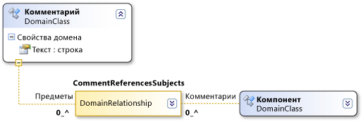

# Синтаксис пути домена
В определениях доменного языка для поиска определенных элементов в модели используется синтаксис типа XPath.  
  
 Обычно работать с синтаксисом напрямую не нужно. Там, где он появляется в окне "Сведения" или "Свойства" доменного языка, можно щелкнуть стрелку вниз и использовать редактор пути. При этом путь появляется в поле формы только после того, как вы воспользуетесь редактором.  
  
 Путь домена имеет следующий вид:  
  
 *RelationshipName.PropertyName/! Роли*  
  
   
  
 Синтаксис перебирает дерево модели. Например, доменной связи **CommentReferencesSubjects** в приведенном выше рисунке имеет **субъектов** роли. Сегмент пути **/! Subjectt** указывает, что путь завершается для элементов, доступных через **субъектов** роли.  
  
 Каждый сегмент начинается с имени доменной связи. Если обход, из элемента с отношением сегмента пути отображается как *Relationship.PropertyName*. В случае перехода по ссылке на элемент, сегмент пути отображается как *связь /! RoleName*.  
  
 Синтаксис пути разделяется косыми чертами. Каждый сегмент пути является переходом от элемента к связи (экземпляра отношения) или от связи к элементу. Сегменты пути часто отображаются в парах. Один сегмент пути представляет собой переход от элемента к связи, а следующий — от связи к элементу на другом конце. (Любая связь также может быть источником или целью самого отношения.)  
  
 Имя, используемое для перехода от элемента к связи, является значением роли `Property Name`. Имя, используемое для перехода от связи к элементу, является именем целевой роли.  
  
## См. также  
 [Сведения о моделях, классах и отношениях](../modeling/understanding-models-classes-and-relationships.md)