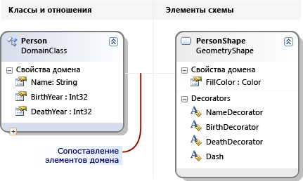
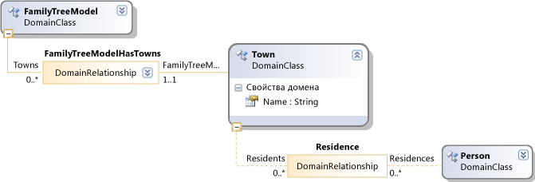
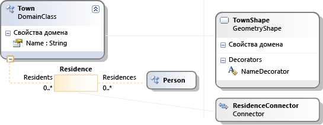

# <a name="get-started-with-domain-specific-languages"></a>Начало работы с предметно-ориентированными языками

В этом разделе объясняются основные понятия, связанные с определением и использованием доменного языка (DSL), созданного с помощью пакета SDK для моделирования для Visual Studio.

> [!NOTE]
> Пакет SDK для преобразования текстовых шаблонов и пакет SDK для моделирования Visual Studio устанавливаются автоматически при установке отдельных компонентов Visual Studio. Дополнительные сведения см. в [этой записи блога](https://devblogs.microsoft.com/devops/the-visual-studio-modeling-sdk-is-now-available-with-visual-studio-2017/).

Если вы не знакомы с доменным DSL, мы рекомендуем вам работать с **лабораториями средств DSL**, которые можно найти на этом сайте: [SDK визуализации и моделирования](https://code.msdn.microsoft.com/Visualization-and-Modeling-313535db) .

## <a name="what-can-you-do-with-a-domain-specific-language"></a>Что можно сделать с помощью Domain-Specific языка?

Доменный язык — это нотация, обычно графическая, предназначенная для использования в конкретной цели. Напротив, такие языки, как UML, предназначены для общего назначения. В DSL можно определить типы элементов модели и их связи, а также их представления на экране.

При разработке DSL его можно распространить как часть пакета расширения интеграции Visual Studio (VSIX). Пользователи работают с DSL в Visual Studio:


Нотация является частью DSL. Вместе с нотацией пакет VSIX включает средства, которые пользователи могут применять, чтобы помочь им редактировать и формировать материалы из их моделей.

Одним из основных приложений доменного языка является создание программного кода, файлов конфигурации и других артефактов. В частности, в больших проектах и линиях продуктов, где будет создано несколько вариантов продукта, создание многих из переменных аспектов DSL может обеспечить значительное увеличение надежности и очень быстрое реагирование на изменения требований.

Остальная часть этого обзора представляет собой пошаговое руководство, в котором представлены основные операции по созданию и использованию доменного языка в Visual Studio.

## <a name="prerequisites"></a>Предварительные требования

Для определения доменного языка необходимо установить следующие компоненты.

| Компонент | Ссылка |
|-|-|
| Visual Studio | [http://go.microsoft.com/fwlink/?LinkId=185579](https://visualstudio.microsoft.com/) |
| [!INCLUDE[vssdk_current_short](../modeling/includes/vssdk_current_short_md.md)] | [http://go.microsoft.com/fwlink/?LinkId=185580](/azure/devops/integrate/index) |
| Пакет SDK моделирования для Visual Studio | |

[!INCLUDE[modeling_sdk_info](includes/modeling_sdk_info.md)]

## <a name="create-a-dsl-solution"></a>Создание решения DSL

Чтобы создать новый доменный язык, создайте новое решение Visual Studio с помощью шаблона проекта Domain-Specific язык.

1. В меню **Файл** укажите **Создать**, затем нажмите **Проект**.

2. В разделе **типы проектов** разверните узел **другие типы проектов** и щелкните **расширяемость**.

3. Щелкните **конструктор предметно-ориентированных языков**.

     

4. В поле **имя** введите **FamilyTree**. Нажмите кнопку **OK**.

     Откроется **Мастер доменного языка** , и отобразится список решений DSL для шаблонов.

     Щелкните каждый шаблон, чтобы просмотреть его описание.

     Шаблоны являются полезными отправными точками. Каждый из них предоставляет полноценный рабочий домен, который можно изменить в соответствии с вашими потребностями. Обычно нужно выбрать шаблон, ближайший к создаваемому.

5. В этом пошаговом руководстве выберите шаблон **минимального языка** .

6. Введите расширение имени файла для DSL на соответствующей странице мастера. Это расширение будут использовать файлы, содержащие экземпляры DSL.

    - Выберите расширение, не связанное ни с одним приложением на компьютере, или на любом компьютере, где требуется установить DSL. Например, **docx** и **htm** будут неприемлемыми расширениями имен файлов.

    - Мастер предупредит, если расширение уже используется в качестве DSL. В этом случае выберите другое расширение имени файла. Можно также сбросить экземпляр экспериментального пакета SDK для Visual Studio, чтобы удалить старые экспериментальные конструкторы. Нажмите кнопку **Пуск**, выберите пункт **все программы**, **Microsoft Visual Studio пакет SDK 2010**, **средства**, а затем выполните **Сброс экспериментального экземпляра Microsoft Visual Studio 2010**.

7. Проверьте другие страницы и нажмите кнопку **Готово**.

     Создается решение, содержащее два проекта. Они называются DSL и DslPackage. Откроется файл схемы с именем DslDefinition. DSL.

    > [!NOTE]
    > Большая часть кода, который можно увидеть в папках двух проектов, создается из DslDefinition. DSL. По этой причине большинство изменений в вашем DSL выполняется в этом файле.

После этого пользовательский интерфейс примет следующий вид:


Данное решение определяет доменный язык. Дополнительные сведения см. [в разделе Обзор пользовательского интерфейса средств языка Domain-Specific](../modeling/overview-of-the-domain-specific-language-tools-user-interface.md).

## <a name="the-important-parts-of-the-dsl-solution"></a>Важные части решения DSL

Обратите внимание на следующие аспекты нового решения:

- **Дсл\дслдефинитион.ДСЛ** Это файл, который отображается при создании решения DSL. Практически весь код в решении создается из этого файла, и большинство изменений, внесенных в определение DSL, вносятся здесь. Дополнительные сведения см. в разделе Работа с [схемой определения DSL](../modeling/working-with-the-dsl-definition-diagram.md).

- **Проект DSL** Этот проект содержит код, определяющий доменный язык.

- **Проект DslPackage** Этот проект содержит код, позволяющий открывать и редактировать экземпляры DSL в Visual Studio.

## <a name="running-the-dsl"></a><a name="Debugging"></a> Запуск DSL

Вы можете запустить решение DSL, как только оно будет создано. Позже определение DSL можно изменить постепенно, повторно выполнив решение после каждого изменения.

### <a name="to-experiment-with-the-dsl"></a>Эксперименты с DSL

1. Щелкните **преобразовать все шаблоны** на панели инструментов **Обозреватель решений** . Это повторно создает большую часть исходного кода из DslDefinition. DSL.

    > [!NOTE]
    > При каждом изменении *DslDefinition. DSL* необходимо нажать кнопку **преобразовать все шаблоны** перед перестроением решения. Этот шаг можно автоматизировать. Дополнительные сведения см. [в разделе Автоматизация преобразования всех шаблонов](/previous-versions/visualstudio/visual-studio-2012/ff521399\(v\=vs.110\)).

2. Нажмите клавишу **F5** или выберите в меню **Отладка** пункт **Начать отладку**.

     DSL строится и устанавливается в экспериментальном экземпляре Visual Studio.

     Запускается экспериментальный экземпляр Visual Studio. Экспериментальный экземпляр принимает свои параметры из отдельного поддерева реестра, где расширения Visual Studio регистрируются в целях отладки. Обычные экземпляры Visual Studio не имеют доступа к зарегистрированным там модулям.

3. В экспериментальном экземпляре Visual Studio откройте файл модели **Test** из **Обозреватель решений**.

     \- или -

     Щелкните правой кнопкой мыши проект отладки, наведите указатель на пункт **Добавить** и выберите пункт **элемент**. В диалоговом окне **Добавление элемента** выберите тип файла DSL.

     Файл модели открывается в виде пустой диаграммы.

     Откроется панель элементов, в которой отобразятся инструменты, соответствующие типу диаграммы.

4. Используйте инструменты для создания фигур и соединителей на схеме.

    1. Чтобы создать фигуры, перетащите их из примера инструмент "Фигура" на схему.

    2. Чтобы подключить две фигуры, щелкните инструмент соединителя, щелкните первую фигуру, а затем щелкните вторую фигуру.

5. Щелкните метки фигур, чтобы изменить их.

Экспериментальная версия Visual Studio будет выглядеть следующим образом:


### <a name="the-content-of-a-model"></a>Содержимое модели

Содержимое файла, который является экземпляром DSL, называется *моделью*. Модель содержит элементы *модели* <em></em> и *связи* между элементами. Определение DSL определяет, какие типы элементов модели и связей могут существовать в модели. Например, в DSL, созданном на основе шаблона минимального языка, существует один тип элемента модели и один тип ссылки.

Определение DSL может указывать, как модель отображается на схеме. Можно выбрать различные стили фигур и соединителей. Можно указать, что некоторые фигуры отображаются внутри других фигур.

Модель можно просмотреть в виде дерева в представлении **обозревателя** при редактировании модели. При добавлении фигур на диаграмму элементы модели также отображаются в обозревателе. Обозреватель можно использовать, даже если схема отсутствует.

Если обозреватель не отображается в экземпляре отладки Visual Studio, в меню **вид** выберите **другие окна**, а затем щелкните *\<Your Language>* **проводник**.

### <a name="the-api-of-your-dsl"></a>API DSL

DSL создает API, который позволяет считывать и обновлять модели, являющиеся экземплярами DSL. Одним из приложений API является создание текстовых файлов из модели. Дополнительные сведения см. в статье [Создание кода во время разработки с помощью текстовых шаблонов T4](../modeling/design-time-code-generation-by-using-t4-text-templates.md).

В решении отладки откройте файлы шаблонов с расширением. tt. В этих примерах показано, как можно создать текст из моделей и протестировать API DSL. Один из примеров написан на [!INCLUDE[vbprvb](../code-quality/includes/vbprvb_md.md)] , а другой — в [!INCLUDE[csprcs](../data-tools/includes/csprcs_md.md)] .

В каждом файле шаблона создается файл, который он создает. Разверните файл шаблона в обозреватель решений и откройте созданный файл.

Файл шаблона содержит короткий сегмент кода, в котором перечислены все элементы модели.

Созданный файл содержит результат.

При изменении файла модели после повторного создания файлов будут отображаться соответствующие изменения в созданных файлах.

#### <a name="to-regenerate-text-files-after-you-change-the-model-file"></a>Повторное создание текстовых файлов после изменения файла модели

1. В экспериментальном экземпляре Visual Studio сохраните файл модели.

2. Убедитесь, что параметр имени файла в каждом файле. TT относится к файлу модели, используемому для экспериментов. Сохраните tt файл.

3. Щелкните **преобразовать все шаблоны** на панели инструментов **Обозреватель решений**.

     \- или -

     Щелкните правой кнопкой мыши Шаблоны, которые необходимо создать повторно, и выберите пункт **Запустить пользовательский инструмент**.

В проект можно добавить любое количество файлов текстовых шаблонов. Каждый шаблон создает один файл результатов.

> [!NOTE]
> При изменении определения DSL код шаблона образца текста не будет работать, если не обновить его.

Дополнительные сведения см. в статьях [Создание кода на основе Domain-Specific языка](../modeling/generating-code-from-a-domain-specific-language.md) и [написание кода для настройки языка Domain-Specific](../modeling/writing-code-to-customise-a-domain-specific-language.md).

## <a name="customizing-the-dsl"></a>Настройка DSL

Если необходимо изменить определение DSL, закройте экспериментальный экземпляр и обновите определение в основном экземпляре Visual Studio.

> [!NOTE]
> После изменения определения DSL вы можете потерять сведения в тестовых моделях, созданных с помощью более ранних версий.  Например, решение для отладки содержит файл с именем Sample, который содержит некоторые фигуры и соединители. После начала разработки определения DSL они не будут видны и будут потеряны при сохранении файла.

Вы можете создать разнообразные расширения для DSL. В следующих примерах вы получите впечатление от возможностей.

После каждого изменения сохраните определение DSL, щелкните **преобразовать все шаблоны** в **Обозреватель решений**, а затем нажмите клавишу **F5** , чтобы поэкспериментировать с измененным DSL.

### <a name="rename-the-types-and-tools"></a>Переименование типов и средств

Переименуйте существующие классы и отношения домена. Например, начиная с определения DSL, созданного на основе шаблона с минимальным языком, можно выполнить следующие операции переименования, чтобы DSL представляя деревья семейства.

#### <a name="to-rename-domain-classes-relationships-and-tools"></a>Переименование доменных классов, отношений и средств

1. На схеме DslDefinition переименуйте **пространстве ExampleModel** в **фамилитримодел**, **ексамплилемент** в **Person**, цели на **родительские** **объекты** и **источники** на **дочерние элементы**. Можно щелкнуть каждую метку, чтобы изменить ее.

     

2. Переименуйте элемент и инструменты соединителя.

    1. Откройте окно обозревателя DSL, щелкнув вкладку в разделе обозреватель решений. Если вы не видите его, в меню **вид** выберите **другие окна** , а затем — **Обозреватель DSL**. Обозреватель DSL отображается только в том случае, если схема определения DSL является активным окном.

    2. Откройте окно свойств и поместите его таким образом, чтобы в то же время можно было видеть обозреватель и свойства DSL.

    3. В обозревателе DSL разверните узел **Редактор**, **вкладки панели элементов**, *\<your DSL>* а затем **инструменты**.

    4. Щелкните **ексамплилемент**. Это элемент панели элементов, который используется для создания элементов.

    5. В окно свойств измените свойство **Name** на **Person**.

         Обратите внимание, что свойство **Caption** также изменяется.

    6. Аналогичным образом измените имя средства **ексамплеконнектор** на **парентлинк**. Измените свойство **Caption** таким образом, чтобы оно не было копией свойства Name. Например, введите **родительскую ссылку**.

3. Перестройте DSL.

    1. Сохраните файл определения DSL.

    2. Нажмите кнопку **преобразовать все шаблоны** на панели инструментов Обозреватель решений

    3. Нажмите клавишу F5. Дождитесь появления экспериментального экземпляра Visual Studio.

4. В решении для отладки в экспериментальном экземпляре Visual Studio откройте файл модели тестирования. Перетащите элементы на него из панели элементов. Обратите внимание, что названия инструментов и имена типов в обозревателе DSL изменились.

5. Сохраните файл модели.

6. Откройте tt-файл и замените вхождения старого типа и имен свойств новыми именами.

7. Убедитесь, что имя файла, указанное в TT-файле, указывает на модель тестирования.

8. Сохраните tt файл. Откройте созданный файл, чтобы увидеть результат выполнения кода в файле. tt. Проверьте правильность.

### <a name="add-domain-properties-to-classes"></a>Добавление свойств домена в классы
 Добавьте свойства в доменный класс, например для представления лет рождения и смерти человека.

 Чтобы сделать новые свойства видимыми на диаграмме, необходимо добавить *декораторы* в фигуру, которая отображает элемент модели. Необходимо также соотнести свойства с декораторами.

##### <a name="to-add-properties-and-display-them"></a>Добавление свойств и их отображение

1. Добавьте свойства.

   1. На схеме определения DSL щелкните правой кнопкой мыши класс домен **Person** , наведите указатель на пункт **Добавить** и выберите пункт **свойство домена**.

   2. Введите список новых имен свойств, например " **рождение** " и " **смерти**". Нажмите клавишу **Ввод** после каждого из них.

2. Добавьте декораторы, которые будут отображать свойства в фигуре.

   1. Используйте серую линию, которая распространяется от класса Person, на другую сторону диаграммы. Это схема элементов схемы. Он связывает доменный класс с классом Shape.

   2. Щелкните правой кнопкой мыши этот класс Shape, наведите указатель на пункт **Добавить** и выберите **текстовый декоратор**.

   3. Добавьте два декоратора с именами, такими как **бирсдекоратор** и **деасдекоратор**.

   4. Выберите каждый новый декоратор, а затем в окно свойств задайте поле " **Расположение** ". Определяет, где будет отображаться значение свойства домена на фигуре. Например, задайте **InnerBottomLeft** и **InnerBottomRight**.

        

3. Сопоставьте декораторы со свойствами.

   1. Откройте окно Подробные сведения о DSL. Обычно он находится на вкладке рядом с окном вывод. Если вы не видите его, в меню **вид** выберите **другие окна**, а затем щелкните **сведения о DSL**.

   2. На схеме определения DSL щелкните строку, соединяющую класс домена **Person** с классом Shape.

   3. В области **сведения о DSL** на вкладке **декораторы** установите флажок для несопоставленного декоратора. В поле **отображаемое свойство** выберите свойство домена, которому нужно сопоставить. Например, сопоставьте **бирсдекоратор** с **рождением**.

4. Сохраните DSL, нажмите кнопку преобразовать все шаблоны и нажмите клавишу F5.

5. В образце схемы модели убедитесь, что теперь можно щелкнуть выбранные позиции и ввести в них значения. Кроме того, при выборе фигуры **Person** окно свойств отображает новые свойства «рождение» и «смерти».

6. В TT-файле можно добавить код, который получает свойства каждого пользователя.

   

### <a name="define-new-classes"></a>Определение новых классов
 В модель можно добавить доменные классы и отношения. Например, можно создать новый класс, который будет представлять городам, и новую связь, представляющую пользователя, надолго в городе.

 Для того чтобы различные типы отличались на схеме модели, можно сопоставлять доменные классы с различными видами форм или фигуры с разными геометрией и цветами.

##### <a name="to-add-and-display-a-new-domain-class"></a>Добавление и отображение нового доменного класса

1. Добавьте доменный класс и сделайте его дочерним элементом корневого элемента модели.

    1. На схеме определения DSL щелкните инструмент **отношение внедрения** , щелкните корневой класс **фамилитримодел**, а затем щелкните пустую часть диаграммы.

         Появится новый доменный класс, подключенный к Фамилитримодел с отношением внедрения.

         Задайте его имя, например « **город**».

        > [!NOTE]
        > Каждый доменный класс, за исключением корня модели, должен быть целевым объектом по крайней мере одной связи внедрения или должен наследовать от класса, являющегося целью внедрения. По этой причине часто бывает удобно создать доменный класс с помощью средства связи внедрения.

    2. Добавьте в новый класс свойство Domain, например **имя**.

2. Добавление ссылочной связи между лицом и населенным пользователем.

    1. Щелкните инструмент **ссылочная связь** , щелкните Person, а затем щелкните город.

         

        > [!NOTE]
        > Ссылочные отношения представляют перекрестные ссылки из одной части дерева модели в другую.

3. Добавьте фигуру для представления городам на схемах модели.

    1. Перетащите **фигуру Geometry** с панели элементов на диаграмму и переименуйте ее, например **товншапе**.

    2. В окно свойств задайте поля внешнего вида новой фигуры, такие как цвет заливки и геометрия.

    3. Добавьте декоратор, чтобы отобразить название города, и переименуйте его в Намедекоратор. Задайте свойство "расположение".

4. Сопоставьте класс домена населенного Товншапе.

    1. Щелкните инструмент " **схема элементов схемы** ", затем щелкните класс домена город, а затем класс Shape товншапе.

    2. На вкладке **декораторы** в окне **сведения о DSL** с выбранным соединителем карты установите флажок Намедекоратор и задайте для **свойства отображаемое** значение имя.

5. Создайте соединитель для вывода связи между лицом и городам.

    1. Перетащите соединитель из области элементов на диаграмму. Переименуйте его и задайте свойства внешнего вида.

    2. С помощью инструмента "схема **элементов схемы** " свяжите новый соединитель с отношением между лицом и населенным пользователем.

         

6. Создайте инструмент элемента для создания нового города.

    1. В **обозревателе DSL** разверните узел **Редактор** , а затем **вкладки панели элементов**.

    2. Щелкните правой кнопкой мыши *\<your DSL>* и выберите пункт **Добавить новый элемент инструмент**.

    3. Задайте свойство **Name** нового средства и задайте для его свойства **Class** значение город.

    4. Задайте свойство **значок панели элементов** . Щелкните **[...]** и в поле **имя файла** выберите файл значка.

7. Создайте инструмент соединителя для создания связи между городам и людьми.

    1. Щелкните правой кнопкой мыши *\<your DSL>* и выберите команду **Добавить новый соединитель**.

    2. Задайте свойство Name нового инструмента.

    3. В свойстве **ConnectionBuilder** выберите Построитель, содержащий имя связи Person-Town.

    4. Задайте **значок панели элементов**.

8. Сохраните определение DSL, нажмите кнопку **преобразовать все шаблоны**, а затем нажмите клавишу **F5**.

9. В экспериментальном экземпляре Visual Studio откройте файл модели тестирования. Используйте новые средства для создания городам и ссылок между городам и persons. Обратите внимание, что можно создавать только ссылки между правильными типами элементов.

10. Создайте код, содержащий город, в котором находится каждый пользователь. Текстовые шаблоны — это одно из мест, где можно выполнять такой код. Например, можно изменить существующий файл Sample.tt в решении отладки таким образом, чтобы он содержал следующий код:

    ```
    <#@ template inherits="Microsoft.VisualStudio.TextTemplating.VSHost.ModelingTextTransformation" debug="true" #>
    <#@ output extension=".txt" #>
    <#@ FamilyTree processor="FamilyTreeDirectiveProcessor" requires="fileName='Sample.ftree'" #>

    <#
      foreach (Person person in this.FamilyTreeModel.People)
      {
    #>
        <#= person.Name #><#if (person.Town != null) {#> of <#= person.Town.Name #> <#}#>

    <#
          foreach (Person child in person.Children)
      {
    #>
                <#= child.Name #>
    <#
      }
      }
    #>

    ```

     При сохранении файла *. TT создается файл подразделений, содержащий список людей и их дом. Дополнительные сведения см. в разделе [Создание кода на основе языка Domain-Specific](../modeling/generating-code-from-a-domain-specific-language.md).

## <a name="validation-and-commands"></a>Проверка и команды
 Вы можете дополнительно разработать этот DSL, добавив ограничения проверки. Эти ограничения — это методы, которые можно определить, чтобы убедиться, что модель находится в правильном состоянии. Например, можно определить ограничение, чтобы гарантировать, что Дата рождения дочернего элемента будет позднее, чем у родительских элементов. Функция проверки отображает предупреждение, если пользователь DSL пытается сохранить модель, которая нарушает любые ограничения. Дополнительные сведения см. [в разделе Проверка на Domain-Specific языке](../modeling/validation-in-a-domain-specific-language.md).

 Можно также определить команды меню, которые может вызывать пользователь. Команды могут изменять модель. Они также могут взаимодействовать с другими моделями в Visual Studio и с внешними ресурсами. Дополнительные сведения см. [в разделе инструкции. Изменение стандартной команды меню](../modeling/how-to-modify-a-standard-menu-command-in-a-domain-specific-language.md).

## <a name="deploying-the-dsl"></a>Развертывание DSL
 Чтобы разрешить другим пользователям использовать доменный язык, вы распространяете файл расширения Visual Studio (VSIX). Он создается при построении решения DSL.

 Откройте VSIX файл в папке bin вашего решения. Скопируйте его на компьютер, на котором требуется установить его. На этом компьютере дважды щелкните VSIX-файл. DSL можно использовать во всех экземплярах Visual Studio на этом компьютере.

 Эту же процедуру можно использовать для установки DSL на собственном компьютере, чтобы не использовать экспериментальный экземпляр Visual Studio.

 Дополнительные сведения см. в разделе [Развертывание решения на предметно-ориентированном языке](msi-and-vsix-deployment-of-a-dsl.md).

## <a name="removing-old-experimental-dsls"></a><a name="Reset"></a> Удаление старого экспериментального DSL
 Если вы создали экспериментальный домен, который больше не нужен, его можно удалить с компьютера, переустановив экспериментальный экземпляр Visual Studio.

 Это приведет к удалению с компьютера всех экспериментальных и других экспериментальных расширений Visual Studio. Это расширения, которые были выполнены в режиме отладки.

 Эта процедура не удаляет расширения DSL или другие модули Visual Studio, которые были полностью установлены, выполняя VSIX файл.

#### <a name="to-reset-the-visual-studio-experimental-instance"></a>Сброс экспериментального экземпляра Visual Studio

1. Нажмите кнопку **Пуск**, выберите пункт **все программы**, **Microsoft Visual Studio пакет SDK 2010**, **средства**, а затем выполните **Сброс экспериментального экземпляра Microsoft Visual Studio 2010**.

2. Перестройте все экспериментальные или другие экспериментальные расширения Visual Studio, которые вы по-прежнему хотите использовать.

## <a name="see-also"></a>См. также раздел

- [Сведения о моделях, классах и отношениях](../modeling/understanding-models-classes-and-relationships.md)
- [Определение доменного языка](../modeling/how-to-define-a-domain-specific-language.md)
