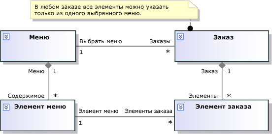

# Моделирование требований пользователей

Visual Studio помогает понимать и обсуждать потребности пользователей, а также информировать о них других. Для этого можно составлять схемы о деятельности пользователей и о том, как система помогает им в достижении целей. Модель требований — это набор этих схем, каждая из которых иллюстрирует отдельный аспект потребностей пользователей. Демонстрационные видеоматериалы см. в разделе: [Моделирование бизнес-](https://channel9.msdn.com/blogs/clinted/uml-with-vs-2010-part-3-modeling-the-business-domain).

Чтобы узнать, какие версии Visual Studio поддерживают каждый тип модели, см. раздел [Version support for architecture and modeling tools](../modeling/what-s-new-for-design-in-visual-studio.md#VersionSupport).

Модель требований помогает:

- сосредоточиться на внешнем поведении системы независимо от ее внутреннего строения;

- описать потребности пользователей и заинтересованных лиц более однозначно, чем с помощью естественного языка;

- составить согласованный глоссарий терминов для пользователей, разработчиков и тест-инженеров;

- уменьшить число пропусков и несоответствий в требованиях;

- упростить реагирование на изменения требований;

- планировать последовательность разработки функций;

- использовать модели в качестве основы для системных тестов, устанавливая четкое отношение между тестами и требованиями. При изменении требований это отношение помогает правильно обновлять тесты. Это позволяет обеспечить соответствие системы новым требованиям.

Модель требований наиболее полезна при выборе тем для обсуждения с пользователями или их представителями. Кроме того, необходимо пересматривать модель в начале каждой итерации. Необязательно оформлять модель в подробностях до создания кода. Частично работающее приложение, даже если оно сильно упрощено, как правило, может стать хорошей основой для плодотворного обсуждения требований с пользователями. Такая модель позволяет эффективно свести воедино результаты обсуждений. Дополнительные сведения см. в разделе [использование моделей в процессе разработки](../modeling/use-models-in-your-development-process.md).

> [!NOTE]
> В этих разделах под термином "система" подразумевается система или приложение в разработке. Это может быть крупная коллекция компонентов программного и аппаратного обеспечения, одно приложение или программный компонент внутри более крупной системы. Во любом случае модель требований описывает поведение, видимое вне системы (через пользовательский интерфейс или API).

## Типичные задачи

Вы можете создать несколько разных представлений требований пользователей.  Каждое представление предоставляет определенный тип сведений.  При создании этих представлений рекомендуется часто перемещаться от одного представления к другому. Начать можно с любого представления.

|Схема или документ|Предмет описания в модели требований|Раздел|
|-|-|-|
|Концептуальная схема классов|Глоссарий типов, используемых для описания требований; типы, которые видны в интерфейсе системы.||
|Дополнительные документы или рабочие элементы|Критерии производительности, безопасности, полезности и надежности.|[Описание требований к качеству обслуживания](#QoSRequirements)|
|Дополнительные документы или рабочие элементы|Ограничения и правила, не относящиеся к конкретному варианту использования.|[Отображение бизнес-правил](#BusinessRules)|

Обратите внимание, что большинство типов схем можно использовать и для других целей. Общие сведения о типах схем см. в разделе [Создание моделей для приложения](../modeling/create-models-for-your-app.md).

##   Showing Business Rules

Бизнес-правило — это требование, не связанное с определенным вариантом использования, которое необходимо соблюдать во всех частях системы.

Многие бизнес-правила представляют собой ограничения отношений между концептуальными классами. Можно написать эти *статических бизнес-правил* как комментарии, связанные с соответствующими классами на концептуальной схеме классов. Пример:

*Динамические бизнес-правила* ограничивают допустимые последовательности событий. Например, схему последовательностей или схему деятельности можно использовать, чтобы показать, что прежде чем совершать другие операции в системе, пользователь должен выполнить вход.

Однако многие динамические правила можно сформулировать более эффективно и в более общем виде, заменив их статическими правилами. Например, в класс в концептуальной модели классов можно добавить логический атрибут "Вход выполнен". Тогда атрибут "Вход выполнен" будет добавляться в качестве постусловия варианта использования "вход в систему" и предусловия большинства других вариантов использования. Благодаря этому подходу можно не определять все возможные комбинации последовательностей событий. Кроме того, этот подход является более гибким при необходимости добавить в модель новые варианты использования.

Обратите внимание, что в данном случае речь идет о выборе способа определения требований, который не зависит от способа реализации требований в программном коде.

Дополнительные сведения можно найти в указанных ниже разделах.

|Сведения|Чтение|
|-|-|
|Разработка кода в соответствии с бизнес-правилами|[Моделирование архитектуры приложения](../modeling/model-your-app-s-architecture.md)|

##   Describing Quality of Service Requirements

Существует несколько категорий требований к качеству обслуживания. В их число входят следующие.

-   Производительность

-   Безопасность

-   Удобство использования

-   Надежность

-   Устойчивость

Некоторые из этих требований можно включить в описания конкретных вариантов использования. Другие требования не относятся к вариантам использования, поэтому рекомендуется записать их в отдельный документ. По возможности рекомендуется придерживаться словаря, определенного в модели требований. Обратите внимание на то, что главные слова, используемые в требованиях, являются названиями субъектов, вариантов применения и классов из предыдущих иллюстраций.

Если ресторан удалит пункт меню, пока клиент заказывает еду, любые пункты заказа, связанные с этим пунктом меню, будут выделены красным.

См. в разделе [Моделирование архитектуры приложения](../modeling/model-your-app-s-architecture.md) вы научитесь разрабатывать код, который соответствует требования к качеству обслуживания.

## См. также

- [Использование моделей в процессе разработки](../modeling/use-models-in-your-development-process.md)
- [Моделирование архитектуры приложения](../modeling/model-your-app-s-architecture.md)
