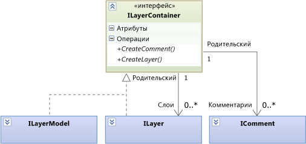
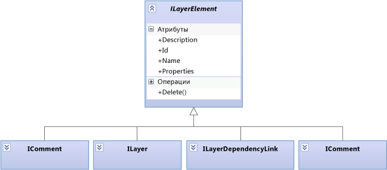

# <a name="navigate-and-update-layer-models-in-program-code"></a>Перемещение по моделям слоев в коде программы и их обновление

Этой статье описываются элементы и связи в модели слоев, которые могут перемещаться и обновить с помощью программного кода. Дополнительные сведения о схемах зависимостей с точки зрения пользователя см. в разделе [схемы зависимостей: ссылка](../modeling/layer-diagrams-reference.md) и [схемы зависимостей: рекомендации по](../modeling/layer-diagrams-guidelines.md).

<xref:Microsoft.VisualStudio.ArchitectureTools.Extensibility.Layer> Модели, описанные в этом разделе является интерфейсом более общей <xref:Microsoft.VisualStudio.GraphModel> модели. При создании [расширения команды меню или жеста](../modeling/add-commands-and-gestures-to-layer-diagrams.md), используйте `Layer` модели. При создании [расширение проверки слоя](../modeling/add-custom-architecture-validation-to-layer-diagrams.md), проще использовать `GraphModel`.

## <a name="transactions"></a>Транзакции

При обновлении модели рекомендуется заключить изменения в `ILinkedUndoTransaction`, который позволяет сгруппировать изменения в одну транзакцию. Если в случае сбоя любых изменений откат всей транзакции. Если пользователь отменяет изменение, все изменения будут отменены друг с другом.

```
using (ILinkedUndoTransaction t =
        LinkedUndoContext.BeginTransaction("a name"))
{
    // Make changes here ....
    t.Commit(); // Don't forget this!
}
```

## <a name="containment"></a>Вложение



Слои (<xref:Microsoft.VisualStudio.ArchitectureTools.Extensibility.Layer.ILayer>) и модель слоев (<xref:Microsoft.VisualStudio.ArchitectureTools.Extensibility.Layer.ILayerModel>) могут содержать комментарии и слои.

Слой (`ILayer`) может содержаться в модели слоев (`ILayerModel`) или быть вложенным в другой `ILayer`.

Для создания комментария или слоя используйте методы создания в соответствующем контейнере.

## <a name="dependency-links"></a>Связи зависимостей

Связь зависимости представлена объектом. Навигация для нее возможна в любом направлении:


Чтобы создать связь зависимости, вызовите метод `source.CreateDependencyLink(target)`.

## <a name="comments"></a>Комментарии

Комментарии могут содержаться внутри слоев или модели слоев, кроме того, они могут быть связаны с другим элементом слоя:


Комментарий может быть связан с любым числом элементов (включая нуль).

Чтобы получить комментарии, прикрепленные к элементу слоя, используйте код:

```csharp
ILayerModel model = diagram.GetLayerModel();
IEnumerable<ILayerComment> comments =
   model.Comments.Where(comment =>
      comment.Links.Any(link => link.Target == layerElement));
```

> [!CAUTION]
> Свойство `Comments` слоя `ILayer` получает комментарии, вложенные в `ILayer`. Оно не получает комментарии, связанные с ним.

Создайте комментарий, вызвав `CreateComment()` в соответствующем контейнере.

Создайте связь, используя `CreateLink()` в комментарии.

## <a name="layer-elements"></a>Элементы слоя

Все типы элементов, которые могут содержаться в модели, являются элементами слоя:



## <a name="properties"></a>Свойства

Каждый `ILayerElement` включает словарь строк с именем `Properties`. Этот словарь можно использовать для присоединения произвольных сведений к любому элементу слоя.

## <a name="artifact-references"></a>Ссылки на артефакты

Ссылка на артефакт (<xref:Microsoft.VisualStudio.ArchitectureTools.Extensibility.Layer.ILayerArtifactReference>) представляет связь между слоем и элементом проекта, таким как файл, класс или папка. Пользователь создает артефакты для создания слоя или добавить в него путем перетаскивания элементов из обозревателя решений, представления классов или обозревателя объектов в диаграмме зависимостей. К слою может быть привязано любое число ссылок на артефакты.

В каждой строке обозревателя слоев отображается ссылка на артефакт. Дополнительные сведения см. в разделе [создавать диаграммы зависимостей в коде](../modeling/create-layer-diagrams-from-your-code.md).

Основные типы и методы, затрагиваемые ссылками на артефакты, следующие:

<xref:Microsoft.VisualStudio.ArchitectureTools.Extensibility.Layer.ILayerArtifactReference>. Свойство Categories указывает, на какой тип артефакта имеется ссылка (например, класс, исполняемый файл или сборка). Свойство Categories определяет, каким образом идентификатор идентифицирует целевой артефакт.

<xref:Microsoft.VisualStudio.ArchitectureTools.Extensibility.Layer.ArtifactReferenceExtensions.CreateArtifactReferenceAsync%2A> создает ссылку артефакта на основе <xref:EnvDTE.Project> или <xref:EnvDTE.ProjectItem>. Это асинхронная операция. Таким образом обычно требуется предоставить обратный вызов, который вызывается после завершения создания.

Ссылки на артефакты слоя отличаются артефактами в схемах вариантов использования.

## <a name="shapes-and-diagrams"></a>Фигуры и схемы

Для представления каждого элемента в модели слоев используются два объекта: <xref:Microsoft.VisualStudio.ArchitectureTools.Extensibility.Layer.ILayerElement> и <xref:Microsoft.VisualStudio.ArchitectureTools.Extensibility.Presentation.IShape>. `IShape` представляет положение и размер фигуры на схеме. В модели слоев каждый `ILayerElement` имеет один `IShape`и каждый `IShape` на зависимость схема имеет один `ILayerElement`. `IShape` также используется для моделей UML. Поэтому не каждому объекту `IShape` назначается элемент слоя.

Аналогично, <xref:Microsoft.VisualStudio.ArchitectureTools.Extensibility.Layer.ILayerModel> отображается на одной схеме <xref:Microsoft.VisualStudio.ArchitectureTools.Extensibility.Presentation.IDiagram>.

В коде пользовательского обработчика команды или жеста можно получить текущую схему и текущий набор фигур, используя импорт `DiagramContext`:

```
public class ... {
[Import]
    public IDiagramContext DiagramContext { get; set; }
...
public void ... (...)
{ IDiagram diagram = this.DiagramContext.CurrentDiagram;
  ILayerModel model = diagram.GetLayerModel();
  if (model != null)
  { foreach (ILayer layer in model.Layers) { ... }}
  foreach (IShape selected in diagram.SelectedShapes)
  { ILayerElement element = selected.GetLayerElement();
    if (element != null) ... }}
```


<xref:Microsoft.VisualStudio.ArchitectureTools.Extensibility.Presentation.IShape> и <xref:Microsoft.VisualStudio.ArchitectureTools.Extensibility.Presentation.IDiagram> также используются для отображения моделей UML.

## <a name="see-also"></a>См. также

- [Добавление команд и жестов в схемы зависимостей](../modeling/add-commands-and-gestures-to-layer-diagrams.md)
- [Добавление пользовательской проверки архитектуры в схемы зависимостей](../modeling/add-custom-architecture-validation-to-layer-diagrams.md)
- [Добавление пользовательских свойств в схемы зависимостей](../modeling/add-custom-properties-to-layer-diagrams.md)
- [Схемы зависимостей: справочные материалы](../modeling/layer-diagrams-reference.md)
- [Схемы зависимостей: рекомендации](../modeling/layer-diagrams-guidelines.md)
