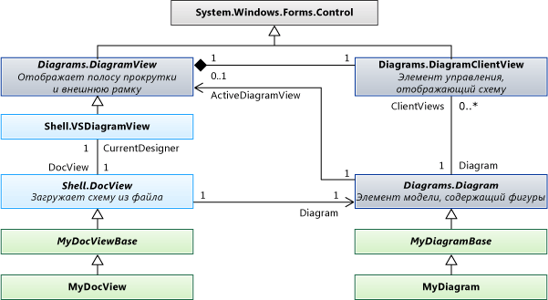

# <a name="navigate-and-update-a-model-in-program-code"></a>Работа с моделями и изменение их в коде программы

Можно написать код для создания и удаления элементов модели, установки их свойств, а также для создания и удаления связей между элементами. Все изменения должны быть внесены в транзакцию. Если элементы отображаются на диаграмме, то в конце транзакции будет автоматически Исправлена диаграмма.

## <a name="an-example-dsl-definition"></a><a name="example"></a> Пример определения DSL
 Это основная часть DslDefinition. DSL для примеров в этом разделе:

 

 Эта модель является экземпляром этого DSL:

 

### <a name="references-and-namespaces"></a>Ссылки и пространства имен
 Чтобы выполнить код в этом разделе, необходимо обратиться по ссылке:

 `Microsoft.VisualStudio.Modeling.Sdk.11.0.dll`

 Код будет использовать это пространство имен:

 `using Microsoft.VisualStudio.Modeling;`

 Кроме того, при написании кода в другом проекте из того, в котором определен DSL, следует импортировать сборку, созданную проектом DSL.

## <a name="navigating-the-model"></a><a name="navigation"></a> Навигация по модели

### <a name="properties"></a>Свойства
 Свойства домена, определяемые в определении DSL, становятся свойствами, к которым можно получить доступ в программном коде:

 `Person henry = ...;`

 `if (henry.BirthDate < 1500) ...`

 `if (henry.Name.EndsWith("VIII")) ...`

 Если вы хотите задать свойство, это необходимо сделать внутри [транзакции](#transaction):

 `henry.Name = "Henry VIII";`

 Если в определении DSL **вычисляется** **тип** свойства, его нельзя задать. Дополнительные сведения см. в разделе [вычисляемые и настраиваемые свойства хранилища](../modeling/calculated-and-custom-storage-properties.md).

### <a name="relationships"></a>Отношения
 Доменные отношения, определяемые в определении DSL, становятся парами свойств, по одному в классе на каждом конце связи. Имена свойств отображаются в диаграмме DslDefinition как метки для ролей на каждой стороне связи. В зависимости от кратности роли тип свойства является либо классом на другом конце связи, либо коллекцией этого класса.

 `foreach (Person child in henry.Children) { ... }`

 `FamilyTreeModel ftree = henry.FamilyTreeModel;`

 Свойства в противоположных концах связи всегда являются обратными. При создании или удалении ссылки обновляются свойства роли в обоих элементах. Следующее выражение (использующее расширения `System.Linq` ) всегда имеет значение true для связи парентшавечилдрен в примере:

 `(Person p) => p.Children.All(child => child.Parents.Contains(p))`

 `&& p.Parents.All(parent => parent.Children.Contains(p));`

 **Елементлинкс**. Связь также представлена элементом модели с именем *Link*, который является экземпляром типа отношения домен. Ссылка всегда имеет один исходный элемент и один целевой элемент. Исходный элемент и целевой элемент могут быть одинаковыми.

 Можно получить доступ к ссылке и ее свойствам:

 `ParentsHaveChildren link = ParentsHaveChildren.GetLink(henry, edward);`

 `// This is now true:`

 `link == null || link.Parent == henry && link.Child == edward`

 По умолчанию ни один экземпляр связи не может связать любую пару элементов модели. Но если в определении DSL `Allow Duplicates` флаг имеет значение true для связи, то может существовать несколько ссылок, и необходимо использовать `GetLinks` :

 `foreach (ParentsHaveChildren link in ParentsHaveChildren.GetLinks(henry, edward)) { ... }`

 Существуют также другие методы доступа к ссылкам. Пример:

 `foreach (ParentsHaveChildren link in     ParentsHaveChildren.GetLinksToChildren(henry)) { ... }`

 **Скрытые роли.** Если в определении DSL **свойство имеет** **значение false** для конкретной роли, то свойство, соответствующее этой роли, не создается. Тем не менее вы по-прежнему можете обращаться к ссылкам и просматривать ссылки с помощью методов связи:

 `foreach (Person p in ParentsHaveChildren.GetChildren(henry)) { ... }`

 Наиболее часто используемый пример — это <xref:Microsoft.VisualStudio.Modeling.Diagrams.PresentationViewsSubject> связь, которая связывает элемент модели с фигурой, отображающей ее на диаграмме:

 `PresentationViewsSubject.GetPresentation(henry)[0] as PersonShape`

### <a name="the-element-directory"></a>Каталог элементов
 Доступ ко всем элементам в хранилище можно получить с помощью каталога Element:

 `store.ElementDirectory.AllElements`

 Существуют также методы для поиска элементов, например следующие:

 `store.ElementDirectory.FindElements(Person.DomainClassId);`

 `store.ElementDirectory.GetElement(elementId);`

## <a name="accessing-class-information"></a><a name="metadata"></a> Доступ к сведениям о классе
 Вы можете получить сведения о классах, связях и других аспектах определения DSL. Пример:

 `DomainClassInfo personClass = henry.GetDomainClass();`

 `DomainPropertyInfo birthProperty =`

 `personClass.FindDomainProperty("BirthDate")`

 `DomainRelationshipInfo relationship =`

 `link.GetDomainRelationship();`

 `DomainRoleInfo sourceRole = relationship.DomainRole[0];`

 Ниже приведены классы предков элементов модели.

- ModelElement — все элементы и отношения являются Моделелементс

- ElementLink — все отношения — Елементлинкс

## <a name="perform-changes-inside-a-transaction"></a><a name="transaction"></a> Выполнение изменений внутри транзакции
 Каждый раз, когда код программы изменяется в хранилище, он должен сделать это внутри транзакции. Это относится ко всем элементам модели, связям, фигурам, схемам и их свойствам. Для получения дополнительной информации см. <xref:Microsoft.VisualStudio.Modeling.Transaction>.

 Наиболее удобный способ управления транзакцией заключается в использовании оператора, `using` заключенного в `try...catch` инструкцию:

```
Store store; ...
try
{
  using (Transaction transaction =
    store.TransactionManager.BeginTransaction("update model"))
    // Outermost transaction must always have a name.
  {
    // Make several changes in Store:
    Person p = new Person(store);
    p.FamilyTreeModel = familyTree;
    p.Name = "Edward VI";
    // end of changes to Store

    transaction.Commit(); // Don't forget this!
  } // transaction disposed here
}
catch (Exception ex)
{
  // If an exception occurs, the Store will be
  // rolled back to its previous state.
}
```

 В одну транзакцию можно внести любое количество изменений. Можно открыть новые транзакции внутри активной транзакции.

 Чтобы изменения были постоянными, необходимо выполнить `Commit` транзакцию до ее удаления. Если возникает исключение, которое не перехватывается внутри транзакции, хранилище будет сброшено до состояния до внесения изменений.

## <a name="creating-model-elements"></a><a name="elements"></a> Создание элементов модели
 В этом примере элемент добавляется в существующую модель:

```csharp
FamilyTreeModel familyTree = ...; // The root of the model.
using (Transaction t =
    familyTree.Store.TransactionManager
    .BeginTransaction("update model"))
{
  // Create a new model element
  // in the same partition as the model root:
  Person edward = new Person(familyTree.Partition);
  // Set its embedding relationship:
  edward.FamilyTreeModel = familyTree;
          // same as: familyTree.People.Add(edward);
  // Set its properties:
  edward.Name = "Edward VII";
  t.Commit(); // Don't forget this!
}
```

 В этом примере показаны основные моменты создания элемента.

- Создание нового элемента в определенной секции хранилища. Для элементов модели и связей, но не для фигур, обычно это Секция по умолчанию.

- Сделайте его целью отношения внедрения. В DslDefinition этого примера каждый пользователь должен быть целевым объектом связи внедрения Фамилитрихаспеопле. Чтобы добиться этого, можно либо задать свойство роли Фамилитримодел объекта Person, либо добавить пользователя в свойство роли People объекта Фамилитримодел.

- Задайте свойства нового элемента, в частности свойство, для которого `IsName` задано значение true в DslDefinition. Этот флаг отмечает свойство, которое служит для идентификации элемента, уникального в пределах его владельца. В этом случае свойство Name имеет этот флаг.

- Определение DSL этого DSL должно быть загружено в хранилище. Если вы пишете расширение, такое как команда меню, обычно это уже верно. В других случаях можно явно загрузить модель в хранилище или использовать [ModelBus](/previous-versions/ee904639(v=vs.140)) для ее загрузки. Дополнительные сведения см. в разделе [инструкции. Открытие модели из файла в программном коде](../modeling/how-to-open-a-model-from-file-in-program-code.md).

  При создании элемента таким образом фигура создается автоматически (если у DSL есть схема). Он отображается в автоматически назначенном расположении с фигурой по умолчанию, цветом и другими функциями. Если вы хотите контролировать, где и как отображается связанная фигура, см. раздел [Создание элемента и его формы](#merge).

## <a name="creating-relationship-links"></a><a name="links"></a> Создание связей связей
 В примере определения DSL определены две связи. Каждая связь определяет *свойство Role* для класса на каждом конце связи.

 Существует три способа, с помощью которых можно создать экземпляр связи. Каждый из этих трех методов имеет одинаковый результат:

- Задайте свойство исходного исполнителя роли. Пример:

  - `familyTree.People.Add(edward);`

  - `edward.Parents.Add(henry);`

- Задайте свойство целевого исполнителя роли. Пример:

  - `edward.familyTreeModel = familyTree;`

       Кратность этой роли — `1..1` , поэтому мы присваиваем значение.

  - `henry.Children.Add(edward);`

       Кратность этой роли — `0..*` , поэтому мы добавляем в коллекцию.

- Явным образом создайте экземпляр связи. Пример:

  - `FamilyTreeHasPeople edwardLink = new FamilyTreeHasPeople(familyTreeModel, edward);`

  - `ParentsHaveChildren edwardHenryLink = new ParentsHaveChildren(henry, edward);`

  Последний метод полезен, если необходимо задать свойства для самой связи.

  При создании элемента таким образом соединитель на диаграмме создается автоматически, но имеет форму по умолчанию, цвет и другие функции. Чтобы управлять способом создания связанного соединителя, см. раздел [Создание элемента и его фигуры](#merge).

## <a name="deleting-elements"></a><a name="deleteelements"></a> Удаление элементов

Удалите элемент, вызвав `Delete()` :

`henry.Delete();`

Эта операция также удалит:

- Связи связей с элементом и из него. Например, `edward.Parents` больше не будет содержать `henry` .

- Элементы в ролях, для которых `PropagatesDelete` флаг имеет значение true. Например, фигура, которая отображает элемент, будет удалена.

По умолчанию каждое отношение внедрения имеет `PropagatesDelete` значение true в целевой роли. Удаление не `henry` приводит к удалению `familyTree` , но `familyTree.Delete()` приведет к удалению всех `Persons` .

По умолчанию `PropagatesDelete` не имеет значения true для ролей ссылочных отношений.

При удалении объекта правила удаления могут опускать определенные распространения. Это полезно при подстановке одного элемента для другого. Укажите идентификатор GUID для одной или нескольких ролей, для которых удаление не должно распространяться. Идентификатор GUID можно получить из класса отношений:

`henry.Delete(ParentsHaveChildren.SourceDomainRoleId);`

(В этом конкретном примере это не повлияет, поскольку `PropagatesDelete` `false` для ролей `ParentsHaveChildren` связи.)

В некоторых случаях удаление предотвращается наличием блокировки либо для элемента, либо для элемента, который будет удален путем распространения. Можно использовать `element.CanDelete()` для проверки возможности удаления элемента.

## <a name="deleting-relationship-links"></a><a name="deletelinks"></a> Удаление связей связей
 Связь связи можно удалить, удалив элемент из свойства роли:

 `henry.Children.Remove(edward); // or:`

 `edward.Parents.Remove(henry);  // or:`

 Также можно явно удалить ссылку:

 `edwardHenryLink.Delete();`

 Все эти три метода имеют одинаковый результат. Необходимо использовать только один из них.

 Если роль имеет 0.. 1 или 1.. 1 Кратность, можно задать для нее `null` или другое значение:

 `edward.FamilyTreeModel = null;` ни

 `edward.FamilyTreeModel = anotherFamilyTree;`

## <a name="re-ordering-the-links-of-a-relationship"></a><a name="reorder"></a> Повторное упорядочение ссылок связи
 Ссылки на определенные связи, которые являются источниками или нацеленными на определенный элемент модели, имеют определенную последовательность. Они отображаются в том порядке, в котором они были добавлены. Например, эта инструкция всегда будет давать дочерние элементы в том же порядке:

 `foreach (Person child in henry.Children) ...`

 Порядок ссылок можно изменить.

 `ParentsHaveChildren link = GetLink(henry,edward);`

 `ParentsHaveChildren nextLink = GetLink(henry, elizabeth);`

 `DomainRoleInfo role =`

 `link.GetDomainRelationship().DomainRoles[0];`

 `link.MoveBefore(role, nextLink);`

## <a name="locks"></a><a name="locks"></a> Намерен
 Изменения могут быть предотвращены блокировкой. Блокировки могут быть заданы для отдельных элементов, в секциях и в хранилище. Если какой-либо из этих уровней имеет блокировку, которая не позволяет изменить тип изменения, при попытке выполнения может возникнуть исключение. Можно определить, установлены ли блокировки с помощью элемента. NOLOCK () — это метод расширения, определенный в пространстве имен <xref:Microsoft.VisualStudio.Modeling.Immutability> .

 Дополнительные сведения см. [в разделе Определение политики блокировки для создания сегментов Read-Only](../modeling/defining-a-locking-policy-to-create-read-only-segments.md).

## <a name="copy-and-paste"></a><a name="copy"></a> Копирование и вставка
 Элементы или группы элементов можно скопировать в <xref:System.Windows.Forms.IDataObject> :

```csharp
Person person = personShape.ModelElement as Person;
Person adopter = adopterShape.ModelElement as Person;
IDataObject data = new DataObject();
personShape.Diagram.ElementOperations
      .Copy(data, person.Children.ToList<ModelElement>());
```

 Элементы хранятся в виде сериализованной группы элементов.

 Вы можете объединить элементы из IDataObject в модель:

```csharp
using (Transaction t = targetDiagram.Store.
        TransactionManager.BeginTransaction("paste"))
{
  adopterShape.Diagram.ElementOperations.Merge(adopter, data);
}
```

 `Merge ()` может принимать значение `PresentationElement` или `ModelElement` . Если вы присвоить ему значение `PresentationElement` , можно также указать расположение на целевой диаграмме в качестве третьего параметра.

## <a name="navigating-and-updating-diagrams"></a><a name="diagrams"></a> Навигация и обновление диаграмм
 В DSL элемент модели предметной области, представляющий понятие, например Person или Song, отделен от элемента Shape, который представляет то, что отображается на диаграмме. Элемент модели предметной области хранит важные свойства и отношения концепций. Элемент Shape сохраняет размер, положение и цвет представления объекта на диаграмме и структуру его частей компонента.

### <a name="presentation-elements"></a>Элементы представления
 

 В определении DSL каждый заданный элемент создает класс, производный от одного из следующих стандартных классов.

|Тип элемента|Базовый класс|
|-|-|
|Доменный класс|<xref:Microsoft.VisualStudio.Modeling.ModelElement>|
|Доменная связь|<xref:Microsoft.VisualStudio.Modeling.ElementLink>|
|Фигура|<xref:Microsoft.VisualStudio.Modeling.Diagrams.NodeShape>|
|Соединитель|<xref:Microsoft.VisualStudio.Modeling.Diagrams.BinaryLinkShape>|
|Схема|<xref:Microsoft.VisualStudio.Modeling.Diagrams.Diagram>|

 Элемент на схеме обычно представляет элемент модели. Обычно (но не всегда) <xref:Microsoft.VisualStudio.Modeling.Diagrams.NodeShape> представляет экземпляр класса домена, а <xref:Microsoft.VisualStudio.Modeling.Diagrams.BinaryLinkShape> представляет экземпляр доменной связи. <xref:Microsoft.VisualStudio.Modeling.Diagrams.PresentationViewsSubject>Связь связывает узел или форму ссылки с элементом модели, который она представляет.

 Каждая фигура узла или ссылки относится к одной схеме. Фигура с двоичной ссылкой соединяет две фигуры узла.

 Фигуры могут иметь дочерние фигуры в двух наборах. Фигура в `NestedChildShapes` наборе ограничена ограничивающим прямоугольником его родителя. Фигура в `RelativeChildShapes` списке может отображаться снаружи или частично за пределами границ родительского элемента, например метки или порта. У схемы нет `RelativeChildShapes` и нет `Parent` .

### <a name="navigating-between-shapes-and-elements"></a><a name="views"></a> Переход между фигурами и элементами
 Элементы модели предметной области и элементы фигур связаны <xref:Microsoft.VisualStudio.Modeling.Diagrams.PresentationViewsSubject> связью.

```csharp
// using Microsoft.VisualStudio.Modeling;
// using Microsoft.VisualStudio.Modeling.Diagrams;
// using System.Linq;
Person henry = ...;
PersonShape henryShape =
  PresentationViewsSubject.GetPresentation(henry)
    .FirstOrDefault() as PersonShape;
```

 Связи между связями и соединителями на схеме:

```
Descendants link = Descendants.GetLink(henry, edward);
DescendantConnector dc =
   PresentationViewsSubject.GetPresentation(link)
     .FirstOrDefault() as DescendantConnector;
// dc.FromShape == henryShape && dc.ToShape == edwardShape
```

 Эта связь также связывает корень модели со схемой:

```
FamilyTreeDiagram diagram =
   PresentationViewsSubject.GetPresentation(familyTree)
      .FirstOrDefault() as FamilyTreeDiagram;
```

 Чтобы получить элемент модели, представленный фигурой, используйте:

 `henryShape.ModelElement as Person`

 `diagram.ModelElement as FamilyTreeModel`

### <a name="navigating-around-the-diagram"></a>Навигация по схеме
 Как правило, не рекомендуется перемещаться между фигурами и соединителями на схеме. Лучше перемещаться по связям в модели, перемещая между фигурами и соединителями только при необходимости работы с внешним видом диаграммы. Эти методы связывают соединители с фигурами на каждом конце:

 `personShape.FromRoleLinkShapes, personShape.ToRoleLinkShapes`

 `connector.FromShape, connector.ToShape`

 Многие фигуры являются составными. Они состоят из родительской фигуры и одного или нескольких уровней дочерних элементов. Фигуры, расположенные относительно другой фигуры, называются ее *дочерними элементами*. При перемещении родительской фигуры ее дочерние элементы перемещаются.

 *Относительные дочерние элементы* могут находиться за пределами ограничивающего прямоугольника родительской фигуры. *Вложенные* дочерние элементы отображаются строго внутри границ родителя.

 Чтобы получить верхний набор фигур на диаграмме, используйте:

 `Diagram.NestedChildShapes`

 Классы предков фигур и соединителей:

 <xref:Microsoft.VisualStudio.Modeling.ModelElement>

 -- <xref:Microsoft.VisualStudio.Modeling.Diagrams.PresentationElement>

 -- <xref:Microsoft.VisualStudio.Modeling.Diagrams.ShapeElement>

 ----- <xref:Microsoft.VisualStudio.Modeling.Diagrams.NodeShape>

 ------- <xref:Microsoft.VisualStudio.Modeling.Diagrams.Diagram>

 ------- *йоуршапе*

 ----- <xref:Microsoft.VisualStudio.Modeling.Diagrams.LinkShape>

 ------- <xref:Microsoft.VisualStudio.Modeling.Diagrams.BinaryLinkShape>

 --------- *йоурконнектор*

### <a name="properties-of-shapes-and-connectors"></a><a name="shapeProperties"></a> Свойства фигур и соединителей
 В большинстве случаев нет необходимости вносить явные изменения в фигуры. После изменения элементов модели, правила исправления обновляют фигуры и соединители. Дополнительные сведения см. [в разделе реагирование на изменения и их распространение](../modeling/responding-to-and-propagating-changes.md).

 Однако целесообразно внести некоторые явные изменения в фигуры в свойствах, которые не зависят от элементов модели. Например, можно изменить следующие свойства:

- <xref:Microsoft.VisualStudio.Modeling.Diagrams.NodeShape.Size%2A> — Определяет высоту и ширину фигуры.

- <xref:Microsoft.VisualStudio.Modeling.Diagrams.NodeShape.Location%2A> — расположение относительно родительской фигуры или схемы

- <xref:Microsoft.VisualStudio.Modeling.Diagrams.ShapeElement.StyleSet%2A> — набор перьев и кистей, используемых для рисования фигуры или соединителя;

- <xref:Microsoft.VisualStudio.Modeling.Diagrams.ShapeElement.Hide%2A> — делает фигуру невидимой

- <xref:Microsoft.VisualStudio.Modeling.Diagrams.ShapeElement.Show%2A> — делает фигуру видимой после элемента `Hide()`

### <a name="creating-an-element-and-its-shape"></a><a name="merge"></a> Создание элемента и его фигуры

При создании элемента и связывании его с деревом связей встраивания фигура создается автоматически и связывается с ней. Это выполняется правилами "исправления", которые выполняются в конце транзакции. Однако фигура будет отображаться в автоматически назначенном расположении, а ее форма, цвет и другие функции будут иметь значения по умолчанию. Для управления созданием фигуры можно использовать функцию MERGE. Сначала необходимо добавить элементы, которые нужно добавить в ElementGroup, а затем объединить группу в диаграмму.

Этот метод выполняет следующее:

- Задает имя, если в качестве имени элемента назначено свойство.

- Следит за всеми директивами слияния элементов, указанными в определении DSL.

В этом примере создается фигура в позиции мыши, когда пользователь дважды щелкает диаграмму. В определении DSL для этого образца `FillColor` `ExampleShape` было предоставлено свойство объекта.

```csharp
using Microsoft.VisualStudio.Modeling;
using Microsoft.VisualStudio.Modeling.Diagrams;
partial class MyDiagram
{
  public override void OnDoubleClick(DiagramPointEventArgs e)
  {
    base.OnDoubleClick(e);

    using (Transaction t = this.Store.TransactionManager
        .BeginTransaction("double click"))
    {
      ExampleElement element = new ExampleElement(this.Store);
      ElementGroup group = new ElementGroup(element);

      { // To use a shape of a default size and color, omit this block.
        ExampleShape shape = new ExampleShape(this.Partition);
        shape.ModelElement = element;
        shape.AbsoluteBounds = new RectangleD(0, 0, 1.5, 1.0);
        shape.FillColor = System.Drawing.Color.Azure;
        group.Add(shape);
      }

      this.ElementOperations.MergeElementGroupPrototype(
        this,
        group.CreatePrototype(),
        PointD.ToPointF(e.MousePosition));
      t.Commit();
    }
  }
}
```

 Если вы предоставляете более одной фигуры, задайте их относительное положение с помощью `AbsoluteBounds` .

 С помощью этого метода можно также задать цвет и другие предоставляемые свойства соединителей.

### <a name="use-transactions"></a>Использование транзакций
 Фигуры, соединители и схемы являются подтипами <xref:Microsoft.VisualStudio.Modeling.ModelElement> и находятся в хранилище. Поэтому необходимо вносить изменения в них только внутри транзакции. Дополнительные сведения см. в разделе [инструкции. Использование транзакций для обновления модели](../modeling/how-to-use-transactions-to-update-the-model.md).

## <a name="document-view-and-document-data"></a><a name="docdata"></a> Представление документа и данные документа
 

## <a name="store-partitions"></a>Хранение секций
 При загрузке модели соответствующая схема загружается в то же время. Как правило, модель загружается в Store. Дефаултпартитион, а содержимое схемы загружается в другую секцию. Как правило, содержимое каждой секции загружается и сохраняется в отдельный файл.

## <a name="see-also"></a>См. также раздел

- <xref:Microsoft.VisualStudio.Modeling.ModelElement>
- [Проверка в доменных языках](../modeling/validation-in-a-domain-specific-language.md)
- [Создание кода из доменного языка](../modeling/generating-code-from-a-domain-specific-language.md)
- [Практическое руководство. Обновление модели с помощью транзакций](../modeling/how-to-use-transactions-to-update-the-model.md)
- [Интеграция моделей с помощью Visual Studio Modelbus](../modeling/integrating-models-by-using-visual-studio-modelbus.md)
- [Реагирование на изменения и их распространение](../modeling/responding-to-and-propagating-changes.md)
