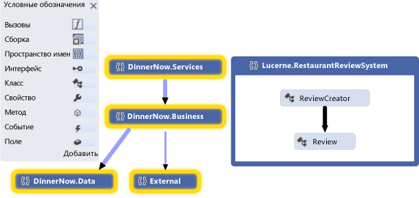
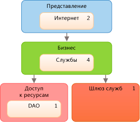
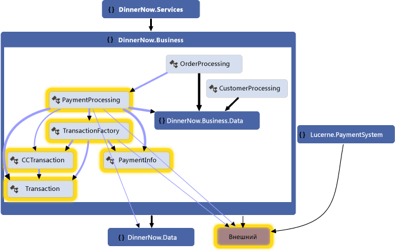
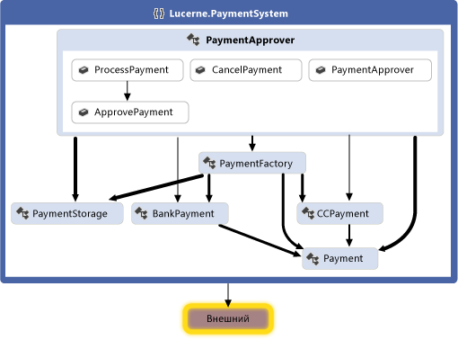
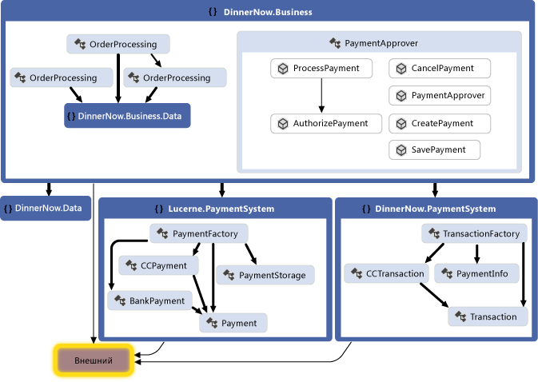
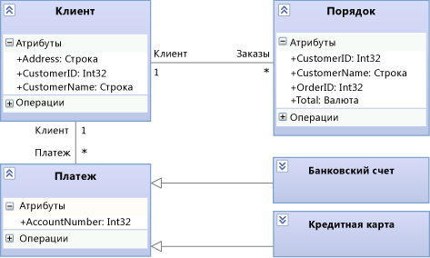
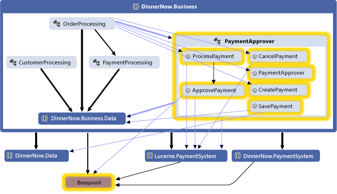
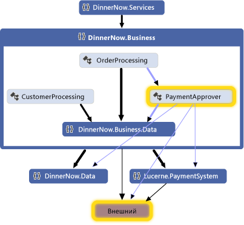

# Сценарий: изменение проекта с помощью визуализации и моделирования

Инструменты визуализации и моделирования в Visual Studio позволяют контролировать соответствие системы требованиям пользователей.
Используйте такие инструменты, как кодовые карты, диаграммы зависимостей и диаграммы классов, чтобы:

Чтобы узнать, какие версии Visual Studio поддерживают каждую функцию, см. раздел [Version support for architecture and modeling tools](../modeling/what-s-new-for-design-in-visual-studio.md#VersionSupport).

- Уточнение требований пользователей и бизнес-процессов.

- Визуализация и просмотр существующего кода.

- Описание изменений в существующей системе.

- Проверка соответствия системы требованиям.

- Поддержание соответствия кода и структуры.

Данное пошаговое руководство:

- описывает, какую пользу эти инструменты могут принести проекту программного обеспечения;

- показывает, как использовать эти инструменты независимо от подхода к разработке, и содержит пример сценария.

Дополнительные сведения об этих инструментах и поддерживаемых ими сценариях см. в следующих разделах.

- [Анализ и моделирование архитектуры](../modeling/analyze-and-model-your-architecture.md)

- [Визуализация кода](../modeling/visualize-code.md)

## Обзор сценария

В этом сценарии описываются эпизоды из жизненных циклов разработки программного обеспечения для двух вымышленных компаний: Dinner Now и Lucerne Publishing. Dinner Now предоставляет услуги доставки еды по Сиэтлу с заказом через Интернет. Клиенты могут заказать питание и оплатить их на сайте Dinner Now. после чего заказы направляются в соответствующий местный ресторан для выполнения доставки. Нью-йоркская компания Lucerne Publishing работает в нескольких областях с использованием и без использования Интернета. Например, они заходят на веб-сайт, где клиенты могут размещать отзывы о ресторанах.

Недавно компания Lucerne приобрела компанию Dinner Now и хочет произвести указанные ниже изменения.

- Интегрируйте свои веб-сайты, добавляя возможности обзора ресторана в Dinner Now.

- Заменить платежную систему компании Dinner Now системой компании Lucerne.

- Расширить сферу предоставления услуг компании Dinner Now на весь регион.

В компании Dinner Now используются методологии SCRUM и экстремального программирования (XP). У них очень высокий объем протестированного кода и очень мало неподдерживаемого кода. Компания минимизирует риски, создавая небольшие, но работающие версии системы и постепенно добавляя функциональные возможности. Разработка кода выполняется путем коротких и частых итераций. Это позволяет уверенно вносить изменения, часто выполнять рефакторинг кода и избегать подхода с большими затратами на предварительное планирование структуры (BDUF).

Компания Lucerne использует набор намного более масштабных и комплексных систем, некоторым из которых более 40 лет. Компания с большой осторожностью подходит к внесению изменений из-за сложности и большого объема кода прежних версий. Она придерживается более строгого процесса разработки, предпочитая создавать подробные решения и документировать структуру и изменения, вносимые в процессе разработки.

Обе команды прибегают к схемам моделирования в Visual Studio, которые помогают им разрабатывать системы, соответствующие потребностям пользователей. Для планирования и организации, а также для управления своей работой они используют Team Foundation Server и другие инструменты.

Дополнительные сведения о работе с Team Foundation Server см. в указанных ниже разделах.

- [Планирование и отслеживание хода выполнения работы](#plan-and-track-work)

- [Тестирование, проверка и возврат в обновленного кода](#TestValidateCheckInCode)

##  Роли архитектуры и схем моделирования в разработке программного обеспечения

В следующей таблице описываются роли, которые эти инструменты могут играть на различных стадиях жизненного цикла разработки программного обеспечения.

||**Моделирование требований пользователей**|**Моделирование бизнес-процессов**|**Архитектура и дизайн системы**|**Визуализация и просмотр кода**|**Проверка**|
|------|-|-|-|-|-|
|Схема доменного языка (DSL)|Да|Да|Да|||
|Диаграмма зависимости, проверка слоя|||Да|Да|Да|
|Карта кода|||Да|Да|Да|
|Конструктор классов (на основе кода)||||Да||

Чтобы нарисовать диаграммы зависимостей, необходимо создать проект моделирования как часть существующего решения или нового. Эти схемы должны создаваться в проекте моделирования.
Элементы на диаграммах зависимостей расположены в проекте моделирования, но они не хранятся в общей модели. Карты кода и схемы классов .NET, созданные на основе кода, обычно в проекте моделирования не размещаются.

См.

- [Создание схем зависимостей на основе кода](../modeling/create-layer-diagrams-from-your-code.md)

- [Сопоставление зависимостей в разных решениях](../modeling/map-dependencies-across-your-solutions.md)

- [Практическое руководство. Добавление схем классов в проекты (конструктор классов)](../ide/class-designer/how-to-add-class-diagrams-to-projects.md)

- [SDK моделирования для Visual Studio — доменные языки](../modeling/modeling-sdk-for-visual-studio-domain-specific-languages.md)

[!INCLUDE[modeling_sdk_info](includes/modeling_sdk_info.md)]

Обе группы также используют проверку зависимостей, чтобы убедиться, что разрабатываемый код соответствует дизайну. См.

- [Соблюдение кода в соответствии с дизайном](#ValidatingCode)

- [Опишите логическую архитектуру: Диаграммы зависимостей](#DescribeLayers)

- [Проверка кода по схемам зависимостей](../modeling/validate-code-with-layer-diagrams.md)

> [!NOTE]
> Некоторые версии Visual Studio поддерживают проверку зависимости и только для чтения версии кодовых карт для визуализации и моделирования. Чтобы узнать, какие издания Visual Studio [Edition support for architecture and modeling tools](../modeling/what-s-new-for-design-in-visual-studio.md#VersionSupport)поддерживают эту функцию, см.

## Понимание и информирование информации о системе

Схемы моделирования в Visual Studio можно использовать по мере необходимости или в соответствии с выбранным подходом к разработке, поскольку конкретный порядок их применения не установлен. Обычно за время работы над проектом команды обращаются к своим моделям итерационно и многократно. Каждая схема обеспечивает определенные средства, помогающие понять, описать и передать различные аспекты разрабатываемой системы.

Dinner Now и Lucerne общаются друг с другом и с заинтересованными сторонами проекта, используя диаграммы в качестве общего языка. Например, в компании Dinner Now схемы используются для выполнения следующих задач.

- Визуализация существующего кода.

- Обмен данными с компанией Lucerne о новых или обновленных пользовательских историях.

- Выявление изменений, необходимых для поддержки новых или обновленных пользовательских историй.

В компании Lucerne схемы используются для выполнения следующих задач:

- ознакомление с бизнес-процессом компании Dinner Now;

- понимание дизайна системы;

- обмен данными о новых или обновленных пользовательских требованиях с компанией Dinner Now;

- документирование обновлений системы.

Схемы интегрируются в Team Foundation Server, что дает командам возможность легко планировать, выполнять и отслеживать свою работу. Например, с помощью моделей команды устанавливают тестовые случаи и оценивают свою работу. Чтобы контролировать прогресс и обеспечивать соответствие системы требованиям пользователей, компания Lucerne связывает рабочие элементы Team Foundation Server с элементами модели. Например, сопоставление вариантов использования с рабочими элементами тестовых случаев позволяет проследить за тем, чтобы варианты использования выполнялись после прохождения всех тестов.

Перед тем, как команды проверяют свои изменения, они проверяют код на тесты и дизайн, запуская сборки, которые включают проверку зависимостей и автоматизированные тесты. Это помогает предотвратить противоречия между обновленным кодом и дизайном, а также нарушение работавших прежде функциональных возможностей.

### Определить изменения в существующей системе

Компания Dinner Now должна оценить свои расходы на выполнение нового требования. Частично они зависят от того, как повлияет это изменение на другие части системы. Для этой цели один из разработчиков компании Dinner Now создает следующие карты кода и схемы из существующего кода.

|**Карта кода или схема**|**Показывает**|
|-|-|
|*Карта кода*   См.   - [Карта зависимостей через ваши решения](../modeling/map-dependencies-across-your-solutions.md) - [Просмотр и переустройство кодов](../modeling/browse-and-rearrange-code-maps.md) - [Настройка кодовые карты путем редактирования файлов DGML](../modeling/customize-code-maps-by-editing-the-dgml-files.md)|Зависимости и другие отношения в коде.   Например, для начала компания Dinner Now может изучить карты кода сборок и собрать общие сведения о сборках и их зависимостях, а также проанализировать карты и рассмотреть пространства имен и классы в этих сборках.   Кроме того, компания Dinner Now может создать карты для изучения конкретных областей и других видов отношений в коде. Для поиска и отбора соответствующих областей и отношений используется обозреватель решений.|
|*Схема классов на основе кода*   См. раздел [Практическое руководство. Добавление схем классов в проекты (конструктор классов)](../ide/class-designer/how-to-add-class-diagrams-to-projects.md).|Существующие классы в коде|

 Предположим, разработчик создает карту кода и акцентирует внимание на тех областях, которые будут затронуты новым сценарием. Эти области выбираются и выделяются на карте.

 

 **Карта кода пространства имен**

 Разработчик разворачивает выбранные пространства имен, чтобы отобразить их классы, методы и отношения.

 

 **Развернутая карта кода пространства имен с показанными связями между группами**

 Разработчик изучает код и определяет, какие классы и методы будут затронуты. Чтобы увидеть последствия каждого изменения, сразу после него создайте карты кодов заново. Посмотреть [визуализировать код](../modeling/visualize-code.md).

 Чтобы описать изменения в других частях системы, таких как компоненты или взаимодействия, команда может нарисовать эти элементы на доске. Указанные ниже схемы в Visual Studio также позволят обеим командам фиксировать и изучать детали и управлять полученной информацией.

|**Схемы**|**Что описывает**|
|-|-|
|*Схема классов на основе кода*   См. раздел [Практическое руководство. Добавление схем классов в проекты (конструктор классов)](../ide/class-designer/how-to-add-class-diagrams-to-projects.md).|Существующие классы в коде.|

### Поддерживайте соответствие кода дизайну
 Компания Dinner Now должна удостовериться, что обновленный код соответствует дизайну. Они создают диаграммы зависимостей, описывающие слои функциональности в системе, определяют разрешенные зависимости между ними и ассоциируют артефакты решения с этими слоями.

|**Схема**|**Что описывает**|
|-|-|
|*Диаграмма зависимости*   См.   - [Создание диаграмм зависимости из кода](../modeling/create-layer-diagrams-from-your-code.md) - [Диаграммы зависимости: Справка](../modeling/layer-diagrams-reference.md) - [Диаграммы зависимостей: Руководящие принципы](../modeling/layer-diagrams-guidelines.md) - [Проверка кода с диаграммами зависимостей](../modeling/validate-code-with-layer-diagrams.md)|Логическая архитектура кода.   Диаграмма зависимости организует и отображает артефакты в решении Visual Studio с абстрактными группами, называемыми *слоями.* Эти слои описывают роли, задачи или функции, выполняемые этими артефактами в системе.   Диаграммы зависимостей полезны для описания предполагаемого проектирования системы и проверки эволюционирующего кода в соответствии с этой конструкцией.   Чтобы создать слои, перетащите элементы из обозревателя решений, карт кода, представления классов и обозревателя объектов. Чтобы нарисовать новые слои, используйте панель элементов или щелкните поверхность схемы правой кнопкой мыши.   Чтобы просмотреть существующие зависимости, щелкните поверхность диаграммы зависимости, а затем нажмите **«Создать зависимости».** Чтобы указать целевые зависимости, нарисуйте новые зависимости.|

Например, следующая диаграмма зависимости описывает зависимости между слоями и количество артефактов, связанных с каждым слоем:

 **Диаграмма зависимости**

Чтобы убедиться, что конфликты с проектом не возникают во время разработки кода, группы используют проверку зависимости на сборках, которые работают на Azure DevOps. Они также создают пользовательскую задачу MSBuild, требуя проверки зависимости в своих операциях регистрации. Для сбора ошибок проверки используются отчеты о сборках.

См.

- [Использование визуального дизайнера](/azure/devops/pipelines/get-started-designer)

- [Закрытой регистрации TFVC](/azure/devops/pipelines/build/triggers)

- [Задачи создания и выпуска](/azure/devops/pipelines/tasks/index)

### Общие рекомендации по созданию и использованию моделей

- Большинство схем состоит из узлов, соединенных линиями. Для каждого типа схемы области элементов предусмотрены различные виды узлов и линий.

   Чтобы открыть панель элементов, в меню **Вид** выберите пункт **Панель элементов**.

- Чтобы создать узел, перетащите его с панели элементов на схему. Узлы некоторых видов необходимо перетаскивать на существующие узлы. Например, на схеме компонентов новый порт должен добавляться к существующему компоненту.

- Чтобы создать строку или соединение, щелкните соответствующий элемент на панели элементов и выберите сначала исходный, а затем целевой узел. Некоторые линии можно создавать только между узлами определенных видов. Указатель мыши, наведенный на потенциальный исходный или целевой узел, показывает, можно ли создать соединение.

### Планирование и отслеживание хода выполнения работы

Схемы моделирования в Visual Studio интегрированы с Team Foundation Server, что упрощает планирование, управление и отслеживание работы. Обе команды используют модели для определения тестовых случаев и задач разработки, а также для оценки своей работы. Компания Lucerne создает и связывает рабочие элементы Team Foundation Server с элементами модели, такими как варианты использования или компоненты. Это позволяет контролировать процесс и выполнять трассировку работы вплоть до требований пользователей. Такой подход помогает следить за тем, чтобы изменения продолжали удовлетворять этим требованиям.

В ходе работы команды обновляют свои рабочие элементы, указывая, какое время они затратили на выполнение своих задач. Кроме того, они контролируют состояние своей работы и сообщают о нем с помощью следующих функций Team Foundation Server.

- Ежедневно *сжигают отчеты,* которые показывают, завершат ли они запланированные работы в ожидаемое время. Для контроля за ходом устранения ошибок они создают в Team Foundation Server и другие отчеты подобного рода.

- *Лист итераций* , в котором для контроля и распределения рабочей нагрузки между членами команды используется Microsoft Excel. Этот лист связан с Team Foundation Server и служит основой для обсуждений во время регулярных совещаний по ходу выполнения работы.

- *Панель мониторинга разработки* , в которой для предоставления команде важной информации о проекте используется Office Project.

См.

- [О гибких инструментах и управлении проектами Agile](/azure/devops/boards/backlogs/backlogs-overview?view=vsts)

- [Диаграммы, панели мониторинга и виджеты (службы Azure DevOps)](/azure/devops/report/dashboards/overview?view=vsts)

- [Создание невыполненной работы и задач с помощью Project](/azure/devops/boards/backlogs/office/create-your-backlog-tasks-using-project)

### Проверка, проверка и проверка кода

По мере выполнения каждой задачей команды проверяют свой код в исходном управлении и получают напоминания от Team Foundation Server, если они забывают. Перед тем, как Team Foundation Server принимает свои регистрации, группы завершают модульные тесты и проверку зависимостей для проверки кода на их тестовых случаях и дизайне. Они используют Team Foundation Server для выполнения сборок, автоматизированных модульных тестов и регулярной проверки зависимостей. Это позволяет им контролировать соответствие кода перечисленным ниже критериям.

- Он работает.

- Он не нарушает работу ранее работавшего кода.

- Он не противоречит дизайну.

Компания Dinner Now располагает большим набором автоматических тестов, которые могут использоваться компанией Lucerne, так как почти все эти тесты по-прежнему применимы. Кроме того, компания Lucerne может переработать эти тесты и добавить новые тесты для проверки добавленных функциональных возможностей. Обе компании используют также Visual Studio для выполнения ручных тестов.

Чтобы убедиться, что код соответствует дизайну, команды настраивают свои сборки в Azure DevOps, чтобы включить проверку зависимости. Если возникают какие-либо конфликты, создается отчет с подробными сведениями.

См.

- [Тестирование приложения](/azure/devops/test/overview?view=vsts)

- [Проверка системы в ходе разработки](../modeling/validate-your-system-during-development.md)

- [Использование управления версиями](/azure/devops/repos/tfvc/overview?view=azure-devops)

- [Azure Pipelines](/azure/devops/pipelines/index?view=vsts)

## Обновление системы с помощью визуализации и моделирования

Компаниям Lucerne и Dinner Now необходимо объединить свои платежные системы. В следующих разделах показано, как схемы моделирования в Visual Studio помогают им выполнить эту задачу.

- [Визуализация существующего кода: карты кода](#VisualizeCode)

- [Определение глоссария типов: схемы классов](#DefineClasses)

- [Опишите логическую архитектуру: Диаграммы зависимостей](#DescribeLayers)

См.

- [Визуализация кода](../modeling/visualize-code.md)

- [Использование моделей в процессе разработки](../modeling/use-models-in-your-development-process.md)

- [Моделирование архитектуры приложения](../modeling/model-your-app-s-architecture.md)

### Визуализация существующего кода: Код-карты

Карты кода показывают текущую организацию и отношения в коде. Элементы отображаются на карте в виде *узлов* , а отношения — в виде *связей*. Карты кода помогают выполнять следующие виды задач:

- изучение незнакомого кода;

- понимание области и способа влияния предложенного изменения на имеющийся код;

- Найдите области сложности, естественные зависимости или закономерности или другие области, которые могут извлечь выгоду из улучшения.

Например, компания Dinner Now должна оценить затраты на обновление компонента PaymentProcessing. Частично они зависят от того, как повлияет это изменение на другие части системы. Чтобы разобраться в этом вопросе, один из разработчиков компании Dinner Now создает карты кода и выделяет те области, которые могут быть затронуты данным изменением.

На следующей карте кода показаны зависимости между классом PaymentProcessing и выделенными частями системы компании Dinner Now.

**Карта кода для платежной системы компании Dinner Now**

Разработчик изучает карту, развернув класс PaymentProcessing и выбрав его члены для просмотра потенциально затрагиваемых областей.

**Методы внутри класса PaymentProcessing и их зависимости**

Для изучения классов, методов и зависимостей платежной системы компании Lucerne создается карта кода, представленная ниже. Команда выясняет, что для взаимодействия с другими частями компании Dinner Now система компании Lucerne может потребовать доработки.

**Карта кода для платежной системы компании Lucerne**

Команды совместно определяют, какие изменения необходимы для интеграции двух систем. Они решают произвести рефакторинг части кода, чтобы упростить его обновление. Класс PaymentApprover будет перемещен в пространство имен DinnerNow.Business и потребует несколько новых методов. Классы Dinner Now, обрабатывающие транзакции, будут иметь собственное пространство имен. Команды создают и используют рабочие элементы для планирования, упорядочивания и отслеживания своей работы. Там, где это полезно, они связывают рабочие элементы с элементами модели.

После реорганизации кода команды создают новую карту кода для просмотра обновленной структуры и отношений.

**Карта кода после реорганизации**

Карта кода показывает, что класс PaymentApprover теперь перемещен в пространство имен DinnerNow.Business и имеет несколько новых методов. Классы транзакций компании Dinner Now теперь имеют собственное пространство имен PaymentSystem, что упрощает последующую работу с кодом.

#### Создание карты кода

- Для быстрого обзора исходного кода создайте карту кода, выполнив следующие действия.

     В меню **Архитектура** выберите пункт **Сформировать карту кода для решения**.

     Для быстрого обзора скомпилированного кода создайте пустую карту кода и перетащите на нее файлы сборок или двоичные файлы.

- Чтобы изучить определенный код или элементы решения, выберите элементы и отношения, которые нужно визуализировать, в обозревателе решений. После этого можно добавить выбранные элементы в существующую карту кода или создать новую. См. раздел [Map dependencies across your solutions](../modeling/map-dependencies-across-your-solutions.md).

- Чтобы было удобнее работать с картой кода, измените ее макет в соответствии с видами задач, которые нужно выполнить.

     Например, для визуализации слоев в коде выберите древовидную структуру. Смотрите [просмотр и переставить кодовые карты](../modeling/browse-and-rearrange-code-maps.md).

#### Сводка. Преимущества карт кода
 Карты кода помогают в выполнении следующих задач:

- изучение организации и отношений в имеющемся коде;

- выявление областей, на которые может повлиять предложенное изменение;

- поиск проблемных областей, шаблонов, слоев или других областей, которые можно улучшить, сделав код удобнее для обслуживания, изменения и повторного использования.

#### Отношение к другим схемам

|**Схема**|**Что описывает**|
|-|-|
|Диаграмма зависимости|Логическая архитектура системы. Используйте проверку зависимостей, чтобы убедиться, что код соответствует дизайну.   Чтобы помочь определить существующие зависимости или предполагаемые зависимости, создайте кодовую карту и связанные с группой элементы. Для создания диаграммы зависимости см.:   - [Создание диаграмм зависимости из кода](../modeling/create-layer-diagrams-from-your-code.md) - [Диаграммы зависимостей: Руководящие принципы](../modeling/layer-diagrams-guidelines.md)|
|Схема классов на основе кода|Существующие в коде классы для конкретного проекта.   Для визуализации и изменения существующего в коде класса используйте конструктор классов.   См. раздел [Практическое руководство. Добавление схем классов в проекты (конструктор классов)](../ide/class-designer/how-to-add-class-diagrams-to-projects.md).|

### Определите глоссарий типов: Диаграммы классов
 Схемы классов определяют участвующие в системе сущности, условия или концепции, а также их отношения друг с другом. Например, в процессе разработки эти схемы позволяют описать атрибуты и операции для каждого класса, независимо от языка или стиля его реализации.

 Чтобы помочь компании Lucerne описать и обсудить сущности, участвующие в варианте использования «Обработка платежа», была создана следующая схема классов.

 

 **Сущности обработки платежа на схеме классов**

 Эта схема показывает, что у клиента может быть много заказов и много способов оплаты. BankAccount и CreditCard наследуют от класса Payment.

 В процессе разработки компания Lucerne использует следующую схему классов для описания и обсуждения деталей каждого класса.

 

 **Подробности обработки платежа на схеме классов**

#### Создание схемы классов

Схема классов имеет следующие основные составляющие:

- типы, такие как классы, интерфейсы и перечисления.

  - *Класс* — это определение объектов, совместно обладающих определенными характеристиками структуры и поведения.

  - *Интерфейс* — это определение части видимого внешне поведения объекта.

  - *Перечисление* — это классификатор, содержащий список литеральных значений.

- *Атрибуты* — это значения определенного типа, которые описывают каждый экземпляр *классификатора*. Классификатор — это общее имя для типов, компонентов, вариантов использования и даже субъектов.

- *Операции* — это методы или функции, которые могут выполняться экземплярами классификатора.

- *Ассоциация* — это обозначение отношения между двумя классификаторами.

  - *Агрегат* — это ассоциация, указывающая на общее владение между классификаторами.

  - *Композиция* — это ассоциация, указывающая на отношение целого и части между классификаторами.

    Чтобы показать агрегаты или композиции, задайте для ассоциации свойство **Агрегат** . **Общий** указывает на агрегаты, а **Составной** — на композиции.

- *Зависимость* указывает, что изменение определения одного классификатора может привести к изменению определения другого классификатора.

- *Обобщение* указывает, что определенный классификатор наследует часть своего определения от общего классификатора. *Реализация* указывает, что класс реализует операции и атрибуты, предоставляемые интерфейсом.

     Для создания таких отношений используется инструмент **Наследование** . Реализация может быть также представлена как *интерфейс без описания операций*.

- *Пакеты* — это группы классификаторов, ассоциаций, линий жизни, компонентов и других пакетов. Отношения типа*Импорт* указывают, что один пакет включает все определения другого пакета.

В качестве отправной точки для изучения и обсуждения существующих классов можно в конструкторе классов создать схему классов на основе кода.

- [Практическое руководство. Добавление схем классов в проекты (конструктор классов)](../ide/class-designer/how-to-add-class-diagrams-to-projects.md)

#### Сводка. Преимущества схем классов
 Схемы классов помогают определить следующее:

- общий глоссарий терминов, используемых при обсуждении потребностей пользователей и сущностей, участвующих в системе; Просматривайте [требования пользователей модели.](../modeling/model-user-requirements.md)

- типы, используемые частями системы (например, компонентами), независимо от их реализации; Смотрите [модель архитектуры вашего приложения.](../modeling/model-your-app-s-architecture.md)

- отношения между типами (такие как зависимости). Например, можно показать, что один тип может быть связан с несколькими экземплярами другого типа.

#### Отношение к другим схемам

|**Схема**|**Описание**|
|-|-|
|Диаграмма зависимости|Определение логической архитектуры системы относительно классов.   Используйте проверку зависимостей, чтобы убедиться, что код соответствует дизайну.   См.   - [Создание диаграмм зависимости из кода](../modeling/create-layer-diagrams-from-your-code.md) - [Диаграммы зависимости: Справка](../modeling/layer-diagrams-reference.md) - [Диаграммы зависимостей: Руководящие принципы](../modeling/layer-diagrams-guidelines.md) - [Проверка кода с диаграммами зависимостей](../modeling/validate-code-with-layer-diagrams.md)|
|Карта кода|Визуализация организации и отношений в имеющемся коде.   Для идентификации классов, их отношений и методов создайте карту кода, показывающую эти элементы.   См.   - [Карта зависимостей через ваши решения](../modeling/map-dependencies-across-your-solutions.md)|

### Опишите логическую архитектуру: диаграммы зависимости
 Диаграммы зависимостей описывают логическую архитектуру системы, организуя артефакты в вашем решении в абстрактные группы или *слои.* Артефактами могут быть различные сущности, такие как пространства имен, проекты, методы и т. п. Слои представляют и описывают роли или задачи, выполняемые артефактами в системе. Включив проверку слоев в операции построения и возврата, можно обеспечить соответствие кода его дизайну.

 Чтобы сохранить код в соответствии с дизайном, Dinner Now и Lucerne используют следующую диаграмму зависимости для проверки своего кода по мере его развития:

 

 **Диаграмма зависимости для ужина теперь интегрирована с Люцерном**

 Слои на этой схеме связаны с соответствующими артефактами решений компаний Dinner Now и Lucerne. Например, слой «Бизнес» связан с пространством имен DinnerNow.Business и его членами, в число которых теперь входит класс PaymentApprover. Слой «Доступ к ресурсам» связан с пространством имен DinnerNow.Data. Стрелки, или *зависимости*, указывают, что функциональность слоя «Доступ к ресурсам» может использоваться только слоем «Бизнес». По мере того как команды обновляют свой код, регулярно выполняется проверка слоев для выявления возникающих конфликтов и их быстрого устранения командами.

 Команды совместно осуществляют пошаговую интеграцию и тестирование двух систем. Прежде чем начинать работать с PaymentProcessing, команды убеждаются, что класс PaymentApprover и остальная часть системы Dinner Now успешно работают друг с другом.

 На следующей карте кода показаны новые вызовы между системой компании Dinner Now и классом PaymentApprover.

 

 **Карта кода с обновленными вызовами методов**

 Убедившись в правильности работы системы, команда Dinner Now исключает код PaymentProcessing, переводя его в комментарии. Отчеты о проверке слоев не содержат ошибок, полученная карта кода показывает, что зависимостей от PaymentProcessing больше нет.

 

 **Карта кода без класса PaymentProcessing**

#### Рисование диаграммы зависимости

Диаграмма зависимости имеет следующие основные особенности:

- *Слои* описывают логические группы артефактов.

- *Связь* — это ассоциация между слоем и артефактом.

     Чтобы создать слои из артефактов, перетащите элементы из обозревателя решений, карт кода, представления классов или обозревателя объектов. Чтобы создать новые слои, а затем связать их с артефактами, воспользуйтесь панелью элементов или щелкните поверхность системы правой кнопкой мыши, чтобы создать слои, и перетащите элементы на эти слои.

     Число на слое обозначает количество связанных с этим слоем артефактов. Артефактами могут быть пространства имен, проекты, классы, методы и т. п. Число артефактов в слое следует интерпретировать с учетом следующих факторов.

  - Если слой связан с артефактом, содержащим другие артефакты, но слой не связан с другими артефактами напрямую, то число включает только связанный артефакт. Однако для анализа в ходе проверки слоя включаются другие артефакты.

       Например, если слой связан с одним пространством имен, то число связанных артефактов равно 1, даже если пространство имен содержит классы. Если слой также связан с каждым классом в пространстве имен, то число будет включать эти связанные классы.

  - Если слой содержит другие слои, связанные с артефактами, то слой-контейнер также связан с этими артефактами, даже если число в слое-контейнере не включает эти артефакты.

    Чтобы увидеть артефакты, связанные со слоем, нажмите на зависимость справа, а затем нажмите **«View Links»,** чтобы открыть **Layer Explorer.**

- *Зависимость* указывает, что один слой может использовать функции другого слоя, но не наоборот. *Двунаправленная зависимость* указывает, что один слой может использовать функции другого слоя и наоборот.

     Чтобы отобразить существующие зависимости на диаграмме зависимости, нажмите правой щелкните поверхность диаграммы, а затем нажмите **«Генеративные зависимости».** Чтобы описать требуемые зависимости, создайте новые зависимости.

См.

- [Создание схем зависимостей на основе кода](../modeling/create-layer-diagrams-from-your-code.md)

- [Схемы зависимостей: справочные материалы](../modeling/layer-diagrams-reference.md)

- [Схемы зависимостей: рекомендации](../modeling/layer-diagrams-guidelines.md)

- [Проверка кода по схемам зависимостей](../modeling/validate-code-with-layer-diagrams.md)

#### Резюме: Сильные стороны диаграмм зависимости

Диаграммы зависимости помогут вам:

- Описание логической архитектуры системы в соответствии с функциональными возможностями ее артефактов.

- Обеспечение соответствия разрабатываемого кода указанному дизайну.

#### Отношение к другим схемам

|**Схема**|**Описание**|
|-|-|
|Карта кода|Визуализация организации и отношений в имеющемся коде.   Чтобы создать слои, сформируйте карту кода, а затем сгруппируйте элементы на карте как потенциальные слои. Перетащите группы с карты на диаграмму зависимости.   См.   - [Карта зависимостей через ваши решения](../modeling/map-dependencies-across-your-solutions.md) - [Просмотр и переустройство кодов](../modeling/browse-and-rearrange-code-maps.md)|

## Внешние ресурсы

|**Категория**|**Ссылки**|
|-|-|
|**Форумы**|- [Средства моделирования и визуализации Visual Studio](https://social.msdn.microsoft.com/Forums/en-US/home?forum=vsarch) - [Пакет SDK для моделирования и визуализации в Visual Studio (инструменты DSL)](https://social.msdn.microsoft.com/Forums/home?forum=dslvsarchx)|

## См. также раздел

- [Визуализация кода](../modeling/visualize-code.md)
- [Использование моделей в процессе разработки](../modeling/use-models-in-your-development-process.md)
- [Использование моделей в гибкой разработке](https://msdn.microsoft.com/592ac27c-3d3e-454a-9c38-b76658ed137f)
- [Проверка системы в ходе разработки](../modeling/validate-your-system-during-development.md)
