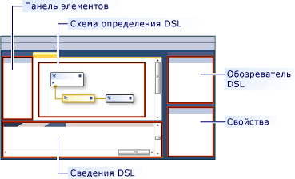
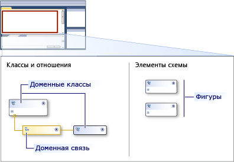
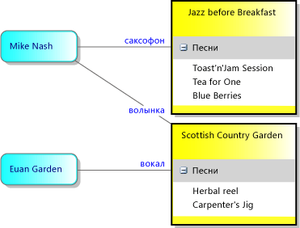
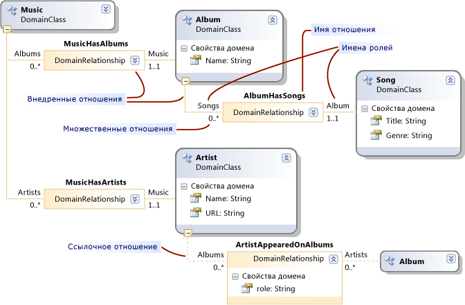

# Сведения о моделях, классах и отношениях
Доменный язык (DSL) определяется файлом определения DSL, а также любым пользовательским программным кодом, который можно написать. Большая часть программного кода в решении DSL создается из этого файла.

 В этом разделе объясняются основные возможности определения DSL.

## Определение DSL
 При открытии `Dsl\DslDefinition.dsl` окно Visual Studio будет выглядеть примерно так, как показано на следующем рисунке.

 

 Наиболее важные сведения в определении DSL отображаются на схеме определения DSL. Дополнительные сведения, которые также являются частью DslDefinition. DSL, отображаются в обозревателе DSL, который обычно отображается на стороне схемы. Вы работаете с диаграммой для наиболее частых задач, а также с помощью обозревателя DSL для более сложных настроек.

 На схеме определения DSL показаны классы доменов, определяющие элементы модели, а также связи, определяющие связи между элементами модели. В нем также показаны фигуры и соединители, используемые для отображения элементов модели пользователю.

 

 При выборе элемента в определении DSL либо на схеме, либо в обозревателе DSL сведения о нем отображаются в окно свойств. Дополнительные сведения могут отображаться в окне "сведения о DSL".

### Модели являются экземплярами DSL
 *Модель* — это экземпляр DSL, созданный пользователем. Модель содержит элементы модели, которые являются экземплярами определяемых вами доменных классов, и ссылки между элементами, которые являются экземплярами определяемых доменных отношений. Модель также может иметь фигуры и соединители, которые отображают элементы модели и ссылки на диаграмме. Определение DSL включает классы фигур, классы соединителей и класс для схемы.

 Определение DSL также называется *моделью предметной области*. Определение DSL или модель предметной области — это представление доменного языка во время разработки, в то время как модель является экземпляром среды выполнения для конкретного доменного языка.

## Классы предметной области определяют элементы модели
 Классы предметной области используются для создания различных элементов в домене, а отношения между элементами — связями домена. Они представляют собой представление элементов и ссылок во время разработки, которые будут создаваться пользователями конкретного языка при создании их моделей.

 На этом рисунке показана модель, созданная пользователем в библиотеке музыкальных файлов DSL. Музыкальные альбомы представляются полями, содержащими списки песен. Исполнители представлены в виде прямоугольников с закругленными углами и подключены к альбомам, к которым они относятся.

 

 Определение DSL разделяет два аспекта. Внешний вид элементов модели на схеме модели определяется с помощью классов фигур и классов соединителей. Сведения, переданные в модель, определяются с помощью доменных классов и доменных отношений.

 На следующем рисунке показаны классы домена и связи в определении DSL музыкальной библиотеки.

 

 На рисунке показаны четыре доменных класса: музыка, альбом, исполнитель и песня. Доменные классы определяют свойства домена, такие как имя, заголовок и т. д. В модели экземпляра значения некоторых из этих свойств отображаются на диаграмме.

 Между этими классами существуют доменные отношения: Мусичасалбумс, Мусичасартистс, Албумбхассонгс и Артистаппеаредоналбумс. Отношения имеют кратность 1.. 1, 0.. *. Например, каждая песня должна быть связана только с одним альбомом через связь Албумхассонгс. Каждый альбом может иметь любое количество песен.

### Перерасположение схемы определения DSL
 Обратите внимание, что доменный класс может отображаться на схеме определения DSL несколько раз, так как альбом работает на этом рисунке. Всегда существует одно главное представление, и могут существовать некоторые *Справочные* представления.

 Чтобы изменить расположение схемы определения DSL, можно выполнить следующие действия.

- Переключить основные и ссылочные представления с помощью команд **переместить дерево** и **разделить дерево** . Щелкните правой кнопкой мыши один доменный класс, чтобы просмотреть эти команды.

- Измените порядок доменных классов и классов фигур, нажав клавиши CTRL + стрелка вверх и удерживая клавишу CTRL.

- Сверните или разверните классы, используя значок в правом верхнем углу каждой фигуры.

- Сверните части дерева, щелкнув знак "минус" (-) в нижней части доменного класса.

## Наследование
 Классы предметной области можно определять с помощью наследования. Чтобы создать производное наследование, щелкните инструмент наследование, выберите производный класс, а затем щелкните базовый класс. Элемент модели имеет все свойства, определенные для собственного доменного класса, а также все свойства, унаследованные от базового класса. Он также наследует свои роли в отношениях.

 Наследование также можно использовать между связями, фигурами и соединителями. Наследование должно находиться в одной группе. Фигура не может наследовать от класса домена.

## Доменные отношения
 Элементы модели могут быть связаны связями. Ссылки всегда являются двоичными; они связывают ровно два элемента. Однако любой элемент может иметь много ссылок на другие объекты, и может даже быть несколько ссылок между одной и той же парой элементов.

 Точно так же, как можно определить различные классы элементов, можно определить различные классы ссылок. Класс ссылки называется *доменной связью*. Доменная связь определяет, к каким классам элемента могут подключаться его экземпляры. Каждый конец связи называется *ролью*, и Доменная связь определяет имена для двух ролей, а также для самой связи.

 Существует два типа доменных отношений: встраивание связей и ссылочных отношений. На схеме определения DSL связи встраивания имеют сплошные линии на каждой роли, а Ссылочные связи имеют пунктирные линии.

### Отношения внедрения
 Каждый элемент модели, за исключением корневого, является целевым объектом для одной ссылки внедрения. Таким образом, вся модель образует одно дерево ссылок внедрения. Отношение внедрения представляет собой вложение или владение. Два элемента модели, которые связаны таким образом, также называются родительскими и дочерними. Дочерний элемент называется внедрен в родительский элемент.

 Внедренные ссылки обычно не отображаются явно как соединители на схеме. Вместо этого они обычно представляются с помощью включения. Корень модели представлен схемой, а элементы, внедренные в нее, отображаются в виде фигур на диаграмме.

 В этом примере класс Music "Музыка" имеет отношение внедрения Мусичасалбумс к альбому, которое имеет внедренный Албумхассонгс в песню. Песни отображаются в виде элементов в списке внутри каждого альбома. Музыка также имеет внедренный Мусичасартистс к классу исполнителя, экземпляры которого также отображаются в виде фигур на схеме.

 По умолчанию внедренные элементы автоматически удаляются при удалении их родителей.

 При сохранении модели в файл в формате XML внедренные элементы вкладываются внутрь своих родителей, если сериализация не была настроена.

> [!NOTE]
> Внедрение не является наследованием. Дочерние элементы в связи внедрения не наследуют свойства родителя. Внедрение — это тип связи между элементами модели. Наследование — это связь между классами и не создает связи между элементами модели.

### Правила внедрения
 Каждый элемент в модели экземпляра должен быть целевым объектом только одной ссылки внедрения, за исключением корня модели.

 Таким образом, каждый неабстрактный доменный класс, за исключением корневого класса, должен быть целевым объектом по крайней мере одной связи внедрения или должен наследовать внедрение от базового класса. Класс может быть целевым объектом двух или более внедрений, но его элементы модели экземпляра могут иметь только один родительский элемент за раз. Кратность от целевого объекта к источнику должна быть равна 0.. 1 или 1.. 1.

### В обозревателе отображается дерево внедрения
 Определение DSL также создает обозреватель, который пользователи видят вместе со схемой модели.

 

 Обозреватель отображает все элементы модели, даже те, для которых не определены фигуры. В нем отображаются элементы и связи внедрения, но не ссылочные связи.

 Чтобы просмотреть значения свойств домена элемента, пользователь выбирает элемент либо на схеме модели, либо в обозревателе моделей, и открывает окно свойств. В нем отображаются все свойства домена, включая те, которые не отображаются на диаграмме. В этом примере каждая песня имеет как заголовок, так и жанр, но на диаграмме отображается только значение заголовка.

## Ссылочные отношения
 Ссылочная связь представляет любой тип связи, которая не внедряется.

 Ссылочные отношения обычно отображаются на диаграмме как соединители между фигурами.

 В XML-представлении модели ссылочная ссылка между двумя элементами представлена с помощью *моникеров.* То есть моникеры — это имена, однозначно идентифицирующие каждый элемент в модели. Узел XML для каждого элемента модели содержит узел, указывающий имя связи и моникер другого элемента.

## Роли
 Каждая Доменная связь имеет две роли — исходную роль и целевую роль.

 На следующем рисунке в качестве исходной роли используется линия между доменным классом **издателя** и отношением домена **публишеркаталог** . Конечной ролью является линия между доменной связью и классом домена **альбома** .

 

 Имена, связанные с отношением, особенно важны при написании программного кода, который проходит по модели. Например, при построении решения DSL создаваемый издатель класса имеет каталог свойств, который представляет собой коллекцию альбомов. В альбоме класса имеется издатель свойства, который является единственным экземпляром издателя класса.

 При создании связи в определении DSL имена свойств и связей задаются значениями по умолчанию. Однако их можно изменить.

## Кратности
 Кратность укажите, сколько элементов может иметь одну и ту же роль в доменной связи. В этом примере параметр кратности "нуль-ко-многим" (0.. \* ) для роли **каталога** указывает, что любой экземпляр класса домена **издателя** может иметь столько **публишеркаталог** связей отношений, сколько необходимо предоставить.

 Настройте кратность роли либо путем ввода на диаграмму, либо путем изменения `Multiplicity` свойства в окне **свойства** . В следующей таблице описаны параметры этого свойства.

|Тип кратности|Описание|
|-|-|
|0.. * (от нуля до многих)|Каждый экземпляр класса домена может иметь несколько экземпляров связи или нет экземпляров связи.|
|0.. 1 (от нуля до одного)|Каждый экземпляр класса предметной области может иметь не более одного экземпляра связи или нет экземпляров связи.|
|1.. 1 (один)|Каждый экземпляр класса домена может иметь один экземпляр связи. Нельзя создать более одного экземпляра этой связи из любого экземпляра класса Role. Если проверка включена, то при отсутствии экземпляра связи у какого-либо экземпляра класса роли возникает ошибка проверки.|
|1.. * (один ко многим)|Каждый экземпляр класса в роли, имеющей эту кратность, может иметь несколько экземпляров связи, и каждый экземпляр должен иметь по крайней мере один экземпляр связи. Если проверка включена, то при отсутствии экземпляра связи у какого-либо экземпляра класса роли возникает ошибка проверки.|

## Доменные отношения как классы
 Ссылка представлена в хранилище в качестве экземпляра Линкелемент, который является производным классом ModelElement. Эти свойства можно определить в схеме модели предметной области в доменных отношениях.

 Можно также установить связь с источником или целевым объектом других связей. На диаграмме модели предметной области щелкните правой кнопкой мыши доменную связь и выберите пункт **Показывать как класс**. Появится дополнительный класс Box. После этого можно связать с ним связи.

 Связь можно определить частично по наследованию, точно так же, как и к доменным классам. Выберите производную связь и установите **базовую связь** в окно свойств.

 Производная связь специализирует базовую связь. Классы домена, на которые он ссылается, должны быть производными классов или совпадать с классами, связанными с базовой связью. Если в модели создается ссылка на производную связь, то она является экземпляром производных и базовых связей. В программном коде можно переходить к противоположному концу ссылки с помощью свойств, созданных либо базовым, либо производным классом.

## См. также раздел

- [Глоссарий средств предметно-ориентированных языков](/previous-versions/bb126564(v=vs.100))