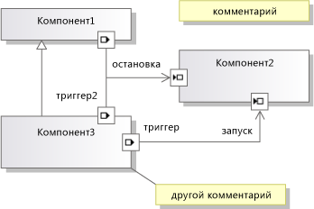

# <a name="understanding-the-dsl-code"></a>Общие сведения о коде доменных языков
Решение предметно-ориентированного языка (DSL) создает API, который можно использовать для чтения и обновления экземпляров DSL в Visual Studio. Этот API определяется в коде, созданном из определения DSL. В этом разделе описывается созданный API.

## <a name="the-example-solution-component-diagrams"></a>Пример решения: Схемы компонентов
 Чтобы создать решение, которое является источником большинства примеров в этом разделе, создайте DSL из **модели компонентов** шаблона решения. Это один из стандартных шаблонов, которые появляются при создании нового решения DSL.

> [!NOTE]
>  Шаблон DSL компонентов схемы не связаны с UML-схемы компонентов, которые можно создать с помощью меню "Архитектура" в Visual Studio. В **новый проект** диалогового окна разверните узел **другие проекта Types\Extensibility** и нажмите кнопку **конструктора доменного языка**.

 Нажмите клавишу F5 и поэкспериментируйте с этим шаблоном решения, если вы с ним еще не знакомы. В частности, обратите внимание на то, что порты создаются перетаскиванием инструмента порта на компонент, и порты можно подключать.

 

## <a name="the-structure-of-the-dsl-solution"></a>Структура решения DSL
 **Dsl** проекта определяет API для вашего DSL. **DslPackage** проекта определяет, как он интегрируется с Visual Studio. Вы можете также добавить собственные проекты, которые могут содержать код, созданный из модели.

### <a name="the-code-directories"></a>Каталоги кода
 Большая часть кода в каждом из этих проектов создается на основе **Dsl\DslDefinition.dsl**. Созданный код находится в **созданный код** папки. Чтобы просмотреть созданный файл, щелкните **[+]** рядом с созданным **.tt** файл.

 Чтобы лучше понять технологию DSL, рекомендуем проверить созданный код. Чтобы посмотреть созданные файлы, разверните файлы *.TT в окне "Обозреватель решений".

 \*Tt-файлов содержат очень мало создания кода. Вместо него они используют директивы `<#include>`, которые включают общие файлы шаблонов. Совместно используемые файлы можно найти в **\Program Files\Microsoft Visual Studio 10.0\Common7\IDE\Extensions\Microsoft\DSL SDK\DSL Designer\11.0\TextTemplates**

 Добавляя собственный программный код в решение DSL, вставляйте его в отдельный файл и не сохраняйте его в папку с созданным кодом. Может потребоваться создать **пользовательский код** папки. (При добавлении нового файла кода в пользовательскую папку не забудьте исправить пространство имен в структуре исходного кода.)

 Настоятельно рекомендуем не изменять созданный код напрямую, потому что при перестроении решения эти изменения будут утеряны. Вместо этого используйте настройку DSL.

-   Настройте многочисленные параметры в определении DSL.

-   Напишите частичные классы в отдельных файлах кода, чтобы переопределить методы, определенные в созданных классах или унаследованные из них. В некоторых случаях необходимо установить **создает двойную производную** параметр класса в определении DSL, чтобы иметь возможность переопределения созданного метода.

-   Параметры задаются в определении DSL, благодаря которым созданный код сможет расставить «ловушки» для кода.

     Например, если задать **имеет пользовательский конструктор** параметр доменного класса и затем выполните сборку решения, вы увидите сообщения об ошибках. Двойной щелчок по одному из этих сообщений об ошибках откроет в созданном коде комментарии, объясняющие, что должно быть указано в пользовательском коде.

-   Напишите собственные текстовые шаблоны, чтобы создать отдельный код для этого приложения. Вы можете включать файлы из общих частей шаблонов, которые являются общими для многих проектов и можно создать шаблоны проектов Visual Studio для настройки проектов, которые инициализируются с помощью собственной структуры файла.

## <a name="generated-files-in-dsl"></a>Файлы, созданные в DSL
 Отображаются следующие созданные файлы в **Dsl** проекта.

 *YourDsl* `Schema.xsd`

 Схема для файлов, содержащая экземпляры DSL. Этот файл копируется в компиляцию (**bin**) каталога. При установке DSL, можно скопировать этот файл **11.0\Xml\Schemas Visual Studio \Program Files\Microsoft** так что файлы модели может быть проверен. Дополнительные сведения см. в разделе [развертывание решений предметно-ориентированного языка](../modeling/deploying-domain-specific-language-solutions.md).

 При настройке сериализации путем установки параметров в Обозревателе DSL схема изменится соответствующим образом. В случае написания собственного кода сериализации этот файл может больше не отражать фактическую схему. Дополнительные сведения см. в разделе [Настройка хранилища файлов и XML-сериализации](../modeling/customizing-file-storage-and-xml-serialization.md).

 `ConnectionBuilders.cs`

 Построитель подключений — это класс, который создает отношения. Это код, лежащий в основе средства подключения. В этом файле содержится пара классов для каждого средства подключения. Их имена являются производными от имен домена связи и средства подключения: *Связь*построителе и *ConnectorTool*ConnectAction.

 (В примере решения компонента один из построителей подключений называется ConnectionBuilder. Это совпадение, поскольку доменная связь называется Connection.)

 Отношение создается в *связь* `Builder.Connect()` метод. Версия по умолчанию проверяет приемлемость элементов исходной и целевой модели, а затем создает экземпляр отношения. Пример:

 `CommentReferencesSubject(sourceAccepted, targetAccepted);`

 Каждый класс построителя создается из узла **построители подключений** раздел в обозревателе DSL. Один метод `Connect` может создать отношения между одной или несколькими парами классов доменов. Каждая пара определяется директивой подключения связи, которая находится в Обозревателе DSL под узлом построителя.

 Например, к одному построителю подключения можно добавить директивы подключения связи для каждого из трех типов отношений в примере DSL. Это позволяет обеспечить пользователя единым средством подключения. Тип созданного экземпляра отношений будет зависеть от типов исходных и целевых элементов, выбранных пользователем.  Чтобы добавить директивы подключения связи, в Обозревателе DSL щелкните построитель правой кнопкой мыши.

 Чтобы написать пользовательский код, выполняемый при создании определенного типа доменной связи, выберите соответствующую директиву подключения связи, расположенную под узлом построителя. В окне «Свойства» задайте **использует настраиваемое подключение**. Перестройте решение, а потом добавьте код, чтобы исправить возникшие ошибки.

 Чтобы написать пользовательский код, выполняемый каждый раз, когда пользователь использует это средство подключения, задайте **является пользовательским** свойство построителя подключений. Вы можете добавить код, определяющий допустимость исходного элемента и определенной комбинации источника и цели, а также обновления, которые нужно применить к модели после установки подключения. Например, можно разрешить подключение только в том случае, если оно не создает в схеме цикл. Вместо одной ссылки отношения можно создать экземпляр более сложного шаблона из нескольких взаимосвязей между источником и целью.

 `Connectors.cs`

 Содержит классы для соединителей, являющихся элементами схемы, которые, как правило, представляют ссылочные отношения. Каждый класс создается из одного соединителя в определении DSL. Каждый класс соединителя является производным от класса <xref:Microsoft.VisualStudio.Modeling.Diagrams.BinaryLinkShape>.

 Чтобы сделать цвет и некоторые другие стилевых особенностей во время выполнения, щелкните правой кнопкой мыши класс в схеме определения DSL и выберите **добавить предоставленный**.

 Чтобы разрешить изменение дополнительных стилевых особенностей во время выполнения, см. примеры в разделах <xref:Microsoft.VisualStudio.Modeling.Diagrams.TextField> и <xref:Microsoft.VisualStudio.Modeling.Diagrams.ShapeElement>.

 `Diagram.cs`

 Содержит класс, определяющий схему. Это производный класс от класса <xref:Microsoft.VisualStudio.Modeling.Diagrams.Diagram>.

 Чтобы сделать цвет и некоторые другие стилевых особенностей во время выполнения, щелкните правой кнопкой мыши класс в схеме определения DSL и выберите **добавить предоставленный**.

 Кроме того, в этом файле содержится правило `FixupDiagram`, срабатывающее при добавлении в модель нового элемента. Правило добавляет новую фигуру и связывает ее с элементом модели.

 `DirectiveProcessor.cs`

 Этот процессор директив помогает пользователям создавать текстовые шаблоны, считывающие ваш экземпляр DSL. Процессор директив загружает сборки (DLL) для DSL и эффективно вставляет оператор `using` в пространство имен. Это позволяет коду, расположенному в текстовых шаблонах, использовать классы и отношения, определенные в DSL.

 Дополнительные сведения см. в разделе [создание кода из доменного языка](../modeling/generating-code-from-a-domain-specific-language.md) и [Создание пользовательских обработчиков текстовых шаблонов T4 директива](../modeling/creating-custom-t4-text-template-directive-processors.md).

 `DomainClasses.cs`

 Реализует определенные вами классы доменов, включая абстрактные классы и класс корня модели. Они являются производными от класса <xref:Microsoft.VisualStudio.Modeling.ModelElement>.

 Каждый класс домена содержит

- Определение свойства и вложенный класс обработчика для каждого свойства домена. Функции OnValueChanging() и OnValueChanged() можно переопределить. Дополнительные сведения см. в разделе [обработчики изменений значений свойств доменов](../modeling/domain-property-value-change-handlers.md).

   В примере DSL класс `Comment` содержит свойство `Text` и класс обработчика `TextPropertyHandler`.

- Свойства методов доступа для отношений, в которых участвует этот класс домена. (Вложенного класса для свойств роли нет.)

   В примере DSL класс `Comment` имеет методы доступа, которые обращаются к родительской модели через отношение внедрения `ComponentModelHasComments`.

- Конструкторы. Если вы хотите переопределить их, установите **имеет пользовательский конструктор** в классе домена.

- Методы обработчика прототипа группы элементов (EGP). Они необходимы, если пользователь может *слияния* (Добавить) другой элемент в экземпляры этого класса. Обычно для этой цели пользователь перетаскивает элемент из средства элемента или другой фигуры или использует команду вставки.

   В примере DSL порты ввода и вывода могут быть объединены в один компонент. Кроме того, компоненты и комментарии могут быть объединены в одну модель. Классу

   Методы обработчика EGP в классе Component разрешают компоненту доступ к портам, но не к комментариям. Обработчик EGP в классе модели корня принимает комментарии и компоненты, но не порты.

  `DomainModel.cs`

  Класс, представляющий модель домена. Это производный класс от класса <xref:Microsoft.VisualStudio.Modeling.DomainModel>.

> [!NOTE]
>  Этот класс отличается от корневого класса модели.

 Замыкания копирования или удаления определяют, какие еще элементы следует включить при копировании или удалении элемента. Этим поведением можно управлять, задав **распространение копирования** и **распространение удаления** свойства ролей с каждой стороны каждого отношения. Если необходимо, чтобы значения определялись динамически, можно написать код, переопределяющий методы классов замыкания.

 `DomainModelResx.resx`

 Содержит такие строки, как описания классов и свойств доменов, названия свойств, метки панели элементов, стандартные сообщения об ошибках и другие строки, которые могут демонстрироваться пользователю. Также содержит значки инструментов и изображения для фигур изображений.

 Этот файл связан с построенной сборкой и предоставляет значения этих ресурсов по умолчанию. Локализовать DSL можно путем создания вспомогательной сборки, содержащей локализованную версию ресурсов. Эта версия будет использоваться при установке DSL в среде, соответствующей локализованным ресурсам. Дополнительные сведения см. в разделе [развертывание решений предметно-ориентированного языка](../modeling/deploying-domain-specific-language-solutions.md).

 `DomainRelationships.cs`

 Каждая связь между двумя элементами в модели представлена экземпляром класса доменной связи. Все классы отношений являются производными от класса <xref:Microsoft.VisualStudio.Modeling.ElementLink>, который, в свою очередь, является производным от класса <xref:Microsoft.VisualStudio.Modeling.ModelElement>. Так как речь идет о классе ModelElement, экземпляр отношения может иметь свойства и быть источником или целевым объектом отношения.

 `HelpKeywordHelper.cs`

 Предоставляет функции, которые используются при нажатии клавиши F1.

 `MultiplicityValidation.cs`

 В ролях отношений, где указана кратность 1..1 или 1..*, пользователя следует предупреждать о том, что требуется как минимум один экземпляр отношения. В этом файле содержатся проверочные ограничения, которые реализуют эти предупреждения. Ссылка типа 1..1 к родительскому объекту внедрения не проверяется.

 Для этих ограничений для выполнения, необходимо задать один из **использует...**  параметры в **Editor\Validation** узел в обозревателе DSL. Дополнительные сведения см. в разделе [проверка в доменных языках](../modeling/validation-in-a-domain-specific-language.md).

 `PropertiesGrid.cs`

 В этом файле код содержится только в том случае, если к свойству домена был присоединен дескриптор пользовательского типа. Дополнительные сведения см. в разделе [Настройка окна свойств](../modeling/customizing-the-properties-window.md).

 `SerializationHelper.cs`

- Метод проверки, которые предотвращает ссылку одного моникера на два элемента. Дополнительные сведения см. в разделе [Настройка хранилища файлов и XML-сериализации](../modeling/customizing-file-storage-and-xml-serialization.md).

- Класс SerializationHelper предоставляет функции, широко используемые классами сериализации.

  `Serializer.cs`

  Класс сериализатора для каждого класса домена, отношения, фигуры, соединителя, схемы и модели.

  Многие функции из этих классов можно управлять с помощью параметров в обозревателе DSL под узлом **поведение сериализации Xml**.

  `Shapes.cs`

  Класс для каждого класса фигуры в определении DSL. Формы являются производными от класса <xref:Microsoft.VisualStudio.Modeling.Diagrams.NodeShape>. Дополнительные сведения см. в разделе [Настройка хранилища файлов и XML-сериализации](../modeling/customizing-file-storage-and-xml-serialization.md).

  Чтобы переопределить созданные методы с помощью собственных методов в частичном классе, задайте **создает двойную производную** соединителя в определении DSL. Чтобы заменить конструктор собственным кодом, задайте **имеет пользовательский конструктор**.

  Чтобы сделать цвет и некоторые другие стилевых особенностей во время выполнения, щелкните правой кнопкой мыши класс в схеме определения DSL и выберите **добавить предоставленный**.

  Чтобы разрешить изменение дополнительных стилевых особенностей во время выполнения, см. примеры в разделах <xref:Microsoft.VisualStudio.Modeling.Diagrams.TextField> и <xref:Microsoft.VisualStudio.Modeling.Diagrams.ShapeElement>.

  `ToolboxHelper.cs`

  Устанавливает панель элементов путем установки прототипов группы элементов в средства элементов. Когда пользователь запускает это средство, копии этих прототипов объединяются с целевыми элементами.

  Вы можете переопределить `CreateElementPrototype()` и изменить элемент панели элементов, который создает группу из нескольких объектов. Например, можно определить элемент для представления объектов, имеющих субкомпоненты. После изменения кода сбросьте экспериментальный экземпляр Visual Studio, чтобы очистить кэш панели элементов.

## <a name="generated-files-in-the-dslpackage-project"></a>Файлы, создаваемые в проекте DslPackage
 Проект DslPackage связывает модель DSL в оболочку Visual Studio, управление команд окна, панели инструментов и меню. Большинство классов являются двойными производными, а значит, любой из их методов можно переопределить.

 `CommandSet.cs`

 Щелкните правой кнопкой мыши меню, отображаемых на диаграмме. Этот набор можно адаптировать или добавить в него дополнительные элементы. В этом файле содержится код для команд. Расположение команд в меню определяется в файле Commands.vsct. Дополнительные сведения см. в разделе [написание пользовательских команд и действий](../modeling/writing-user-commands-and-actions.md).

 `Constants.cs`

 Идентификаторы GUID.

 `DocData.cs`

 *YourDsl* `DocData` управляет загрузкой и сохранением модели в файл и создает экземпляр Store.

 Например, если DSL необходимо сохранить не в файл, а в базу данных, можно переопределить методы `Load` и `Save`.

 `DocView.cs`

 *YourDsl* `DocView` управляет окном, в котором отображается схема. Например, схему можно встроить в форму окна:

 Добавьте файл пользовательского элемента управления в проект DslPackage. Добавьте панель, в которой может отображаться схема. Добавьте кнопки и другие элементы управления. В представлении кода формы добавьте следующий код, изменив имена в соответствии со своим DSL:

```csharp
using System;
using System.Collections.Generic;
using System.ComponentModel;
using System.Drawing;
using System.Data;
using System.Linq;
using System.Text;
using System.Windows.Forms;
using Microsoft.VisualStudio.Modeling;
using Microsoft.VisualStudio.Modeling.Shell;

namespace Company.EmbedInForm
{
  public partial class UserControl1 : UserControl
  {
    public UserControl1()
    {
      InitializeComponent();
    }

    private DiagramDocView docView;

    public UserControl1(DiagramDocView docView, Control content)
      : this()
    {
      this.docView = docView;
      panel1.Controls.Add(content);
    }

    private void button1_Click(object sender, EventArgs e)
    {
      ExampleModel modelRoot = this.docView.CurrentDiagram.ModelElement as ExampleModel;
      foreach (ExampleElement element in modelRoot.Elements)
      {
       listBox1.Items.Add(element.Name);
      }
    }
  }
  internal partial class EmbedInFormDocView
  {

    private ContainerControl container;

    /// <summary>
    /// Return a User Control instead of the DSL window.
    /// The user control will contain the DSL window.
    /// </summary>

    public override System.Windows.Forms.IWin32Window Window
    {
      get
      {
        if (container == null)
        {
          // Put the normal DSL Window inside our control
          container = new UserControl1(this, (Control)base.Window);
        }
        return container;
      }
    }
  }

}
```

 `EditorFactory.cs`

 Создает экземпляр `DocData` и `DocView`. Он выполняет стандартный интерфейс, который Visual Studio использует для открытия редактора при запуске пакета DSL. На него ссылается атрибут `ProvideEditorFactory` в файле Package.cs

 `GeneratedVSCT.vsct`

 Находит команд стандартного меню в меню, например меню щелкните правой кнопкой мыши (контекста) схема **изменить** меню и т. д. Код для команд находится в файле CommandSet.cs. Стандартные команды можно переместить или изменить. Также можно добавить собственные команды. Дополнительные сведения см. в разделе [написание пользовательских команд и действий](../modeling/writing-user-commands-and-actions.md).

 `ModelExplorer.cs`

 Определяет проводник по модели для DSL. Представляет собой дерево модели, которое пользователь видит рядом со схемой.

 Вы можете переопределить `InsertTreeView()` и изменить порядок отображения элементов в проводнике по модели.

 Если необходимо, чтобы выбор в проводнике по модели был синхронизирован с выбором схемы, можно использовать следующий код:

```csharp
protected override void OnSelectionChanged(global::System.EventArgs e)
{
base.OnSelectionChanged(e);
// get the selected element
DslModeling::ModelElement selectedElement =
this.PrimarySelection as DslModeling::ModelElement;
// Select in the model explorer
SelectInModelExplorer<YOURLANGUAGEExplorerToolWindow>(selectedElement);
}
private void SelectInModelExplorer<T>(DslModeling::ModelElement modelElement)
where T : DslShell.ModelExplorerToolWindow
{
DslShell::ModelingPackage package =
this.GetService(typeof(VSShell.Package)) as DslShell::ModelingPackage;

if (package != null)
{
// find the model explorer window
T explorerWindow = package.GetToolWindow(typeof(T), true) as T;
if (explorerWindow != null)
{
// get the tree container
DslShell.ModelExplorerTreeContainer treeContainer =
explorerWindow.TreeContainer;
// find the tree node
DslShell.ExplorerTreeNode treeNode =
treeContainer.FindNodeForElement(modelElement);
// select the node
explorerWindow.TreeContainer.ObjectModelBrowser.SelectedNode = treeNode;
}
}
}
```

 `ModelExplorerToolWindow.cs`

 Определяет окно, в котором отображается проводник по модели. Обрабатывает выбор элементов в проводнике.

 `Package.cs`

 Этот файл определяет порядок интеграции DSL в Visual Studio. Атрибуты в классе пакета регистрируют DSL в качестве обработчика файлов, которые имеют свое расширение файла и определяют ее панель элементов и порядок открытия нового окна. Метод Initialize() вызывается один раз, при загрузке первого DSL в экземпляр Visual Studio.

 `Source.extension.vsixmanifest`

 Чтобы настроить этот файл, измените файл `.tt`.

> [!WARNING]
>  Если целью изменения файла .TT является включение ресурсов, таких как значки или изображения, необходимо, чтобы эти ресурсы входили в сборку VSIX. В обозревателе решений выберите файл и убедитесь, что **включить в VSIX** свойство `True`.

 Этот файл управляет порядком упаковки DSL в Visual Studio Integration Extension (VSIX). Дополнительные сведения см. в разделе [развертывание решений предметно-ориентированного языка](../modeling/deploying-domain-specific-language-solutions.md).

## <a name="see-also"></a>См. также

- [Определение доменного языка](../modeling/how-to-define-a-domain-specific-language.md)
- [Сведения о моделях, классах и отношениях](../modeling/understanding-models-classes-and-relationships.md)
- [Настройка и расширение доменного языка](../modeling/customizing-and-extending-a-domain-specific-language.md)
- [Написание кода для настройки доменного языка](../modeling/writing-code-to-customise-a-domain-specific-language.md)
