# Использование карт кода для отладки приложений

Карты кода помогают не запутаться в больших базах кода, малознакомом или устаревшем коде. Например, при отладке может возникнуть необходимость взглянуть на код во многих файлах и проектах. Используйте карты кода для перехода между частями кода и просмотра связей между ними. Таким образом, вам не нужно держать весь этот код у себя в голове или рисовать отдельную схему. Карты кода помогут вспомнить особенности кода в случае перерыва в работе.

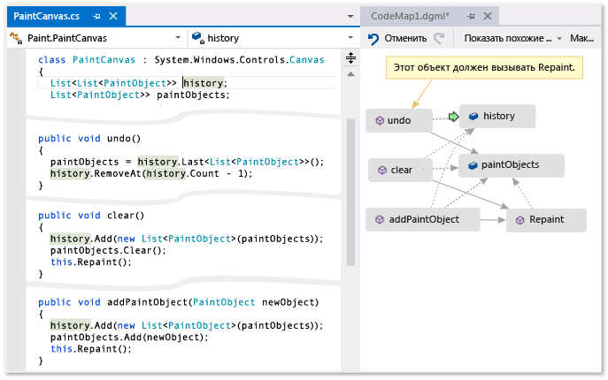

**Зеленая стрелка показывает нахождение курсора в редакторе.**

Дополнительные сведения о командах и действиях, которые можно использовать при работе с картами кода, см. в разделе [Обзор и реорганизация карт кода](../modeling/browse-and-rearrange-code-maps.md).

> [!NOTE]
> Для создания и редактирования карт кода требуется Visual Studio Enterprise Edition. В выпусках Visual Studio Community и Professional можно открывать схемы, созданные в выпуске Enterprise Edition, но нельзя изменять их.

## Определение проблемы
 Предположим, что возникла ошибка в программе рисования, над которой вы работаете. Чтобы воспроизвести ошибку, откройте решение в Visual Studio и нажмите клавишу **F5** , чтобы начать отладку.

 Когда вы нарисуете линию и выбираете **отменить последний росчерк**, ничего не происходит, пока вы не нарисуете следующую строку.

 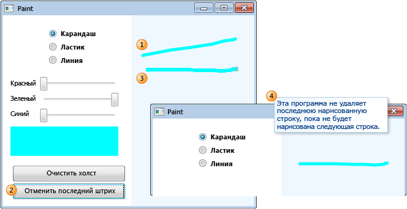

 Таким образом, вы начинаете поиск ошибки с поиска метода `Undo`. Он находится в классе `PaintCanvas`.

 

## Запуск сопоставления кода
 Теперь можно начинать сопоставление метода `undo` и его отношений. В редакторе кода добавьте метод `undo` и поля, на которые он ссылается, в новую карту кода. При создании новой карты потребуется какое-то время на индексацию кода. Благодаря этому последующие операции выполняются быстрее.

 

> [!TIP]
> Зеленым цветом выделены последние элементы, добавленные на карту. Зеленая стрелка показывает позицию курсора в коде. Стрелки между элементами представляют различные отношения. Можно получить дополнительные сведения об элементах на карте, наведя на них указатель мыши и изучив подсказки.

 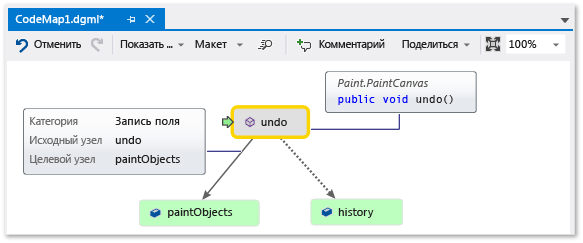

## Навигация и просмотр кода из сопоставления
 Чтобы просмотреть определение кода для каждого поля, дважды щелкните поле на карте или выберите поле и нажмите клавишу **F12**. Зеленая стрелка перемещается между элементами на карте. Курсор в редакторе кода также перемещается автоматически.

 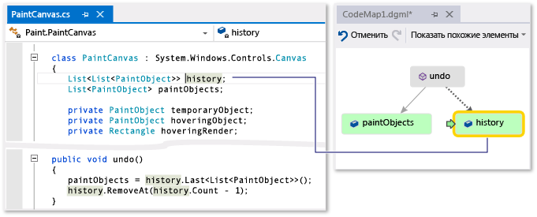

 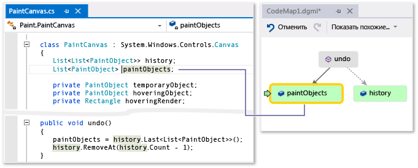

> [!TIP]
> Кроме того, для перемещения зеленой стрелки на карте можно перемещать курсор в редакторе кода.

## Отношения между частями кода
 Теперь необходимо узнать, какой другой код взаимодействует с полями `history` и `paintObjects`. Можно добавить все методы, которые ссылаются на эти поля, на карту. Это можно сделать из карты или из редактора кода.

 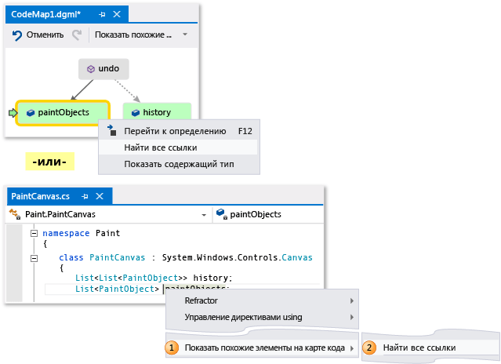

 

> [!NOTE]
> Если вы добавляете элементы из проекта, который совместно используется несколькими приложениями, такими как приложения Windows Phone или Магазина Windows, эти элементы всегда отображаются вместе с текущим активным проектом приложения на карте. Таким образом, при изменении контекста на другой проект приложения контекст на карте для вновь добавленных элементов из общего проекта также изменяется. Операции, выполняемые с элементом на карте, применяются только к тем элементам, которые имеют общий контекст.

 Измените макет, чтобы изменить поток отношений и упростить чтение карты. Также можно перемещать элементы по карте, перетаскивая их.

 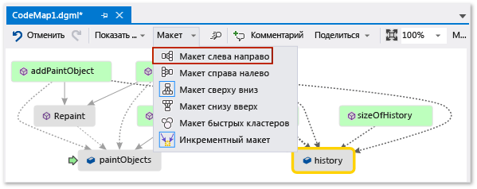

> [!TIP]
> По умолчанию **добавочный макет** включен. Это значит, что изменение макета карты будет минимальным при добавлении новых элементов. Чтобы перераспределить всю карту каждый раз при добавлении новых элементов, отключите **добавочный макет**.

 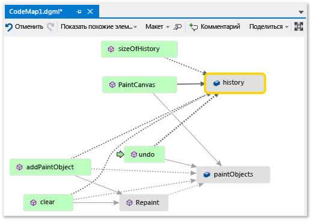

 Рассмотрим эти методы. На карте дважды щелкните метод **паинтканвас** или выберите этот метод и нажмите клавишу **F12**. Этот метод создаст `history` и `paintObjects` как пустые списки.

 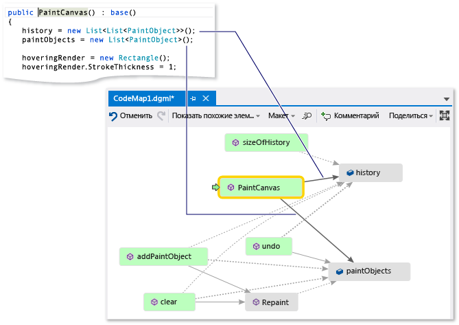

 Теперь повторите эти же шаги, чтобы просмотреть определение метода `clear`. Метод `clear` выполнит некоторые задачи с `paintObjects` и `history`. Затем он вызовет метод `Repaint`.

 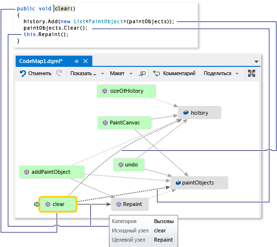

 Теперь просмотрите определение метода `addPaintObject`. Он также выполнит некоторые задачи с `history` и `paintObjects`. Он также вызовет `Repaint`.

 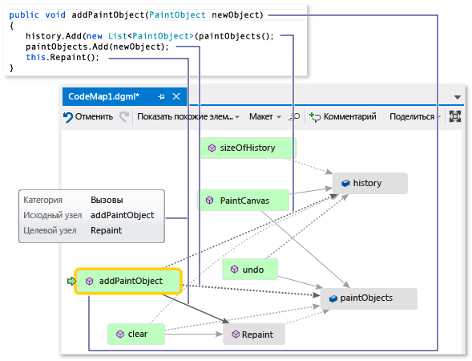

## Поиск проблемы путем анализа сопоставления
 Кажется, что все методы, изменяющие `history` и `paintObjects`, вызывают `Repaint`. Однако метод `undo` не вызывает `Repaint`, даже если `undo` изменяет те же поля. Поэтому эту проблему можно решить, вызвав метод `Repaint` из `undo`.

 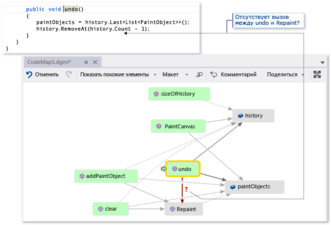

 Если бы не было карты, на которой можно проверить этот отсутствующий вызов, найти эту проблему было бы сложнее, особенно в более сложном коде.

## Совместное использование обнаружения и следующие действия
 Прежде чем вы или кто-то другой исправит эту ошибку, можно оставить на карте примечания о проблеме и о том, как ее исправить.

 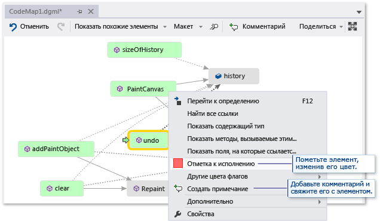

 Например, можно добавить комментарии на карту и отметить элементы с помощью цветов.

 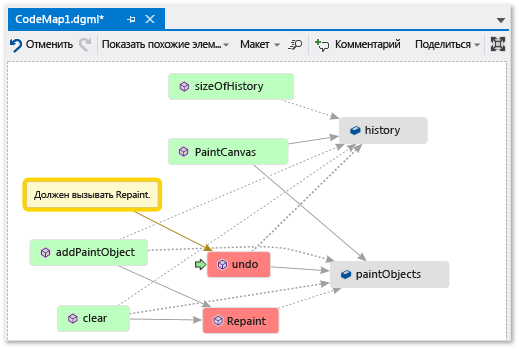

 Если установлена программа Microsoft Outlook, можно отправить карту другим пользователям по электронной почте. Можно также экспортировать карту в виде изображения или в другом формате.

 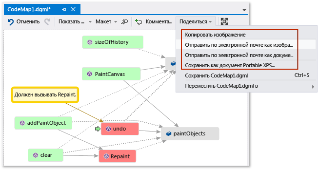

## Устранение проблемы и отображение сделанного
 Чтобы исправить ошибку, добавьте вызов `Repaint` в `undo`.

 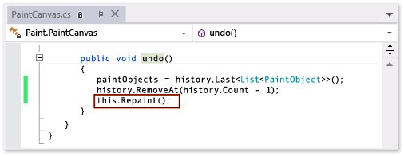

 Чтобы убедиться, что ошибка исправлена, перезапустите сеанс отладки и попробуйте воспроизвести ошибку. Теперь, выбрав пункт **отменить последний рукописный** ввод, вы можете подтвердить, что вы внесли правильное исправление.

 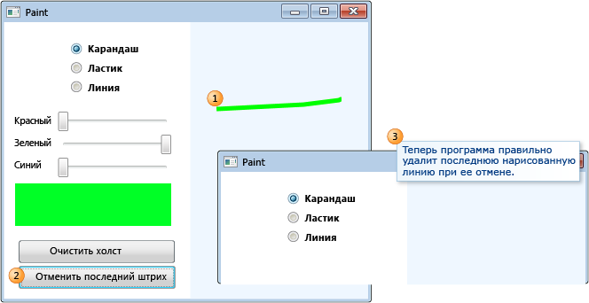

 Можно обновить карту для отображения внесенного исправления.

 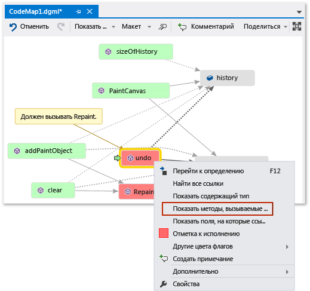

 Теперь на карте отображается ссылка между **операциями отмены** и **перерисовки**.

 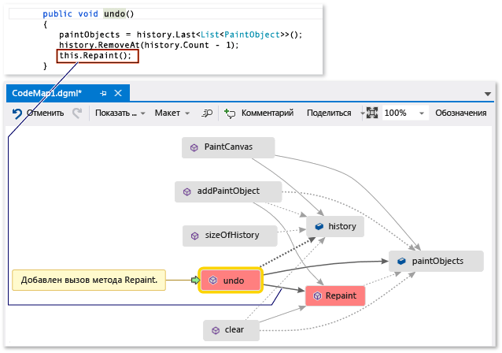

> [!NOTE]
> При обновлении карты можно увидеть сообщение об обновлении индекса кода, используемого для создания карты. Это значит, что кто-то изменил код, в результате чего ваша карта не соответствует текущему коду. Это не помешает обновить карту, однако может потребоваться заново создать карту, чтобы убедиться, что она соответствует коду.

 Теперь вы готовы к исследованию. Вы успешно нашли и устранили проблему путем сопоставления кода. Также у вас есть карта, с помощью которой можно переходить по коду, вспоминать предыдущие действия и просматривать действия, предпринятые для решения проблемы.

## См. также раздел

- [Сопоставление методов в визуализации стека вызовов при отладке](../debugger/map-methods-on-the-call-stack-while-debugging-in-visual-studio.md)
- [Визуализация кода](../modeling/visualize-code.md)
