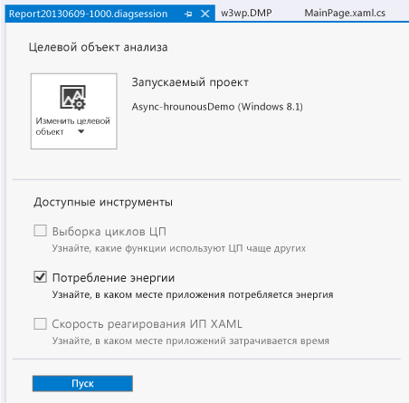
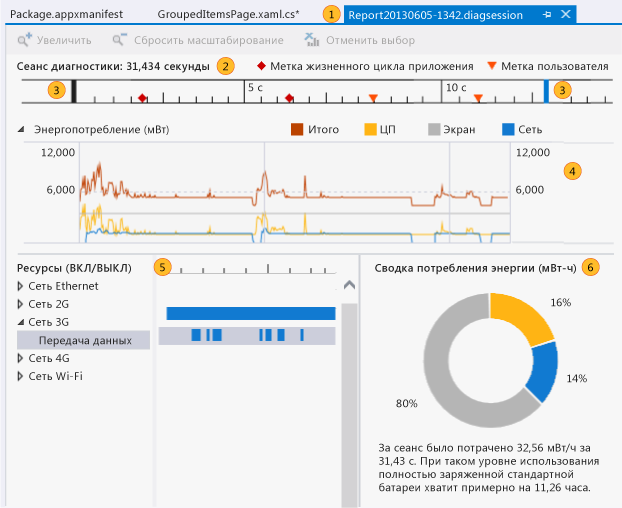
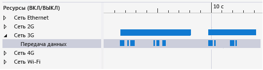
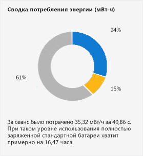

# <a name="analyze-energy-use-in-uwp-apps"></a>Анализ энергопотребления в приложениях универсальной платформы Windows

Профилировщик **Расход энергии** в Visual Studio позволяет анализировать расход энергии приложениями универсальной платформы Windows на планшетных устройствах с низким энергопотреблением, постоянно или периодически работающих от аккумуляторов. На устройстве, работающем от аккумулятора, приложение с большим энергопотреблением может вызывать такое недовольство пользователя, что он в конце концов удалит его. Оптимизация расхода энергии позволяет улучшить восприятие приложения пользователями и повысить степень его использования.

## <a name="what-the-energy-consumption-profiler-is-how-it-works-and-what-it-measures"></a>Что такое профилировщик "Расход энергии", как он работает и что измеряет

Во время сеанса профилирования профилировщик расхода энергии фиксирует операции дисплея, центрального процессора и сетевых подключений устройства. Затем он оценивает мощность, затраченную при выполнении этих операций, и общую энергию, израсходованную в течение сеанса профилирования.

> [!NOTE]
> Профилировщик расхода энергии оценивает потребляемую мощность и расход энергии с помощью программной модели стандартного оборудования эталонного устройства, представляющего планшетные устройства с низким энергопотреблением, на которых может работать приложение. Для получения наилучших оценок рекомендуется осуществлять сбор данных профилирования на планшетном устройстве с низким энергопотреблением.
>
> Хотя данная модель предоставляет хорошие оценки для различных устройств с низким энергопотреблением, фактические значения профилируемого устройства будут, скорее всего, другими. Используйте эти значения для поиска тех дисплейных, процессорных и сетевых операций, которые приводят к большему расходу энергии, чем использование других ресурсов, и поэтому могут быть хорошими кандидатами для оптимизации.

Для профилировщика расхода энергии используются следующие определения *мощности* и *энергии*.

- *Мощность* — это интенсивность использования силы для выполнения работы в течение определенного периода времени. В электротехнике стандартной единицей мощности является *Ватт*. Эта единица определяется как интенсивность, с которой выполняется работа при прохождении тока величиной один ампер через разность потенциалов один вольт. На диаграмме **Энергопотребление** единицы представляются в милливаттах ( **мВт** ). Один милливатт — это одна тысячная ватта.

   Поскольку мощность представляет собой интенсивность, она имеет направление (объем работы может увеличиваться или уменьшаться в определенном промежутке времени) и скорость (величина, на которую возрастает или уменьшается объем работы).

- *Энергия* — это суммарная мощность (например, энергоемкость аккумулятора), потребленная за определенный период времени. Единица измерения энергии — ватт-час (мощность величиной один ватт, постоянно подаваемая в течение одного часа). На диаграмме **Сводка энергии** единицы представляются в милливаттах в час ( **мВт-ч**).


Например, полностью заряженный аккумулятор в планшете имеет определенное количество накопленной энергии. Так как энергия используется для выполнения таких задач, как обмен данными по сети, расчет значений и отображение графики, мощность аккумулятора расходуется с разной интенсивностью. В течение любого периода времени общее количество потребляемой мощности измеряется также с использованием показателя "энергия".

## <a name="identify-scenarios-with-user-marks"></a>Определение сценариев с пользовательскими отметками
 Можно добавлять *пользовательские деления* в данные профилирования для облегчения идентификации областей на линейке временной шкалы.

 

 Отметка отображается в виде оранжевого треугольника на временной шкале в момент выполнения метода. При наведении указателя мыши на отметку отображаются сообщение и время в виде подсказки. Если две или несколько пользовательских отметок расположены рядом друг с другом, отметки и данные их всплывающих подсказок объединяются. Для разделения отметок можно увеличить масштаб изображения временной шкалы.

 **Добавление делений в код C#, Visual Basic, C++**

 Для добавления пользовательского деления в код C#, Visual Basic, C++ сначала создайте объект <xref:Windows.Foundation.Diagnostics.LoggingChannel?displayProperty=fullName>. Затем добавьте вызовы методов <xref:Windows.Foundation.Diagnostics.LoggingChannel.LogMessage%2A?displayProperty=nameWithType> в тех местах кода, которые требуется отметить. Используйте [LoggingLevel.Information](xref:Windows.Foundation.Diagnostics.LoggingLevel) в вызовах.

 При выполнении метода пользовательская отметка добавляется в данные профилирования вместе с сообщением.

> [!NOTE]
> - <xref:Windows.Foundation.Diagnostics.LoggingChannel?displayProperty=nameWithType> реализует интерфейс <xref:Windows.Foundation.IClosable?displayProperty=nameWithType> (проецируемый как <xref:System.IDisposable?displayProperty=nameWithType> в C# и VB). Во избежание утечки ресурсов операционной системы, вызовите <xref:Windows.Foundation.Diagnostics.LoggingChannel.Close%2A?displayProperty=nameWithType> (<xref:Windows.Foundation.Diagnostics.LoggingChannel.Dispose%2A?displayProperty=nameWithType> в C# и VB) после завершения работы с каналом ведения журнала.
> - Каждый открытый канал ведения журнала должен иметь уникальное имя. При попытке создать новый канал ведения журнала с тем же именем, что и у существующего канала, вызывается исключение.

Ознакомьтесь с примером кода Windows SDK [LoggingSession Sample](https://code.msdn.microsoft.com/windowsapps/LoggingSession-Sample-ccd52336).

::: moniker range="vs-2017"
**Добавление делений в код JavaScript**

Для добавления пользовательских делений добавьте следующий код в тех местах кода, которые необходимо отметить:

```JavaScript
if (performance && performance.mark) {
    performance.mark(markDescription);
}
```

*markDescription* — строка, содержащая сообщение, которое будет отображаться в подсказке пользовательского деления.
::: moniker-end

## <a name="configure-your-environment-for-profiling"></a>Настройка среды для профилирования
 Для получения точных оценок необходимо профилировать расход энергии приложением на устройстве с низким энергопотреблением, которое работает на своих аккумуляторах. Поскольку Visual Studio не работает на большинстве таких устройств, к устройству потребуется подключить компьютер Visual Studio с помощью инструментов удаленной отладки Visual Studio. Для подключения к удаленному устройству необходимо настроить как проект Visual Studio, так и удаленное устройство. См. дополнительные сведения о [запуске приложений универсальной платформы Windows на удаленном компьютере](../debugger/run-windows-store-apps-on-a-remote-machine.md).

> [!TIP]
> - Не рекомендуется выполнять профилирование энергопотребления на имитаторе универсальной платформы Windows или на компьютере с Visual Studio. При профилировании на реальном устройстве получаются гораздо более точные данные.
> - Выполняйте профилирование при работе целевого устройства на своих аккумуляторах.
> - Закройте другие приложения, которые могут использовать те же ресурсы (сеть, центральный процессор или дисплей).

## <a name="collect-energy-profile-data-for-your-app"></a>Сбор данных профилирования расхода энергии приложением

1. В меню **Отладка** выберите **Запуск диагностики без отладки**.

     

2. Выберите **Расход энергии** и нажмите кнопку **Запуск**.

    > [!NOTE]
    > При запуске профилировщика **Расход энергии** может появиться окно **Контроль учетных записей** с запросом на разрешение запуска файла *VsEtwCollector.exe*. Выберите **Да**.

3. Запустите приложение для сбора данных.

4. Чтобы остановить профилирование, вернитесь в Visual Studio (использовав сочетание клавиш Alt + Tab) и на странице "Концентратор диагностики" выберите **Остановка сбора** .

     

     Visual Studio анализирует собранные данные и отображает результаты.

## <a name="collect-energy-profile-data-for-an-installed-app"></a>Сбор данных профилирования расхода энергии установленным приложением
 Средство "Расход энергии" можно запускать только в приложениях UWP, запущенных из решения Visual Studio или установленных из Microsoft Store. Когда решение открыто в Visual Studio, конечный объект по умолчанию — **Запускаемый проект**. Выбор в качестве конечного объекта установленного приложения.

1. Щелкните **Изм. конечн. объект** и выберите **Установленное приложение**.

2. В списке **Выберите установленный пакет приложения** выберите целевой объект.

3. Выберите **расхода энергии** в Профилировщике производительности.

4. Выберите **Запуск** , чтобы начать профилирование.

   Чтобы остановить профилирование, вернитесь в Visual Studio (использовав сочетание клавиш Alt + Tab) и на странице "Концентратор диагностики" выберите **Остановка сбора** .

## <a name="analyze-energy-profile-data"></a>Анализ данных профилирования расхода энергии
 Данные профилирования энергопотребления отображаются в окне документа Visual Studio:

 

|Изображение|Описание|
|-|-|
||Имя файла отчета — Report *ГГГГММДД-ЧЧММ*.diagsession. При сохранении отчета имя можно изменить.|
||На временной шкале отображаются продолжительность сеанса профилирования, события активации жизненного цикла приложения и пользовательские отметки.|
||Отчет можно ограничить частью временной шкалы, перетащив синие панели, чтобы выбрать нужную область временной шкалы.|
||Диаграмма **Использование энергии** — это линейная диаграмма с несколькими графиками, на которой показывается изменение выходной мощности, вызванное каким-либо ресурсом устройства во время сеанса профилирования. Профилировщик "Расход энергии" отслеживает мощность, потребляемую центральным процессором, сетевыми операциями и дисплеем.|
||На диаграмме **Ресурсы (Вкл./Выкл.)**  отображаются сведения о затратах энергии для выполнения сетевых операций. На панели **Сеть** показывается время, в течение которого было открыто сетевое подключение. На дочерней панели **Передача данных** указывается время, в течение которого приложение принимало данные из сети или передавало их в сеть.|
||**Сводка потребления энергии** представляет пропорциональное количество общей энергии, использованной в выбранных временных рамках центральным процессором, сетевыми операциями и дисплеем.|

 **Действия для анализа данных профилирования энергопотребления**

 Найдите область с пиковой потребляемой мощностью. Соотнесите пиковую область с функциями приложения. Затем используйте панели элементов управления на временной шкале, чтобы увеличить масштаб данной области. Если интерес представляет использование сети, разверните узел **Сеть** на диаграмме **Ресурсы (Вкл./Выкл.)**  , чтобы сравнить время открытого состояния сетевого подключения с временем, в течение которого приложение принимало или передавало по нему данные. Очень эффективный способ оптимизации — сокращение времени, в течение которого сетевое подключение открыто без необходимости.

## <a name="optimize-energy-use"></a>Оптимизация расхода энергии
 Помимо расхода энергии на передачу данных, сетевые подключения требуют энергозатрат для своей инициализации, поддержания и закрытия. Некоторые сети поддерживают подключение в течение определенного периода времени после передачи или приема данных, чтобы можно было передать больше данных, используя одно подключение. Для выяснения способа взаимодействия приложения с подключением можно использовать панель **Ресурсы (Вкл./Выкл.)** .

 

 Если на панелях **Сеть** и **Передача данных** указывается, что подключение открыто в течение длительных периодов времени для периодической передачи ряда небольших пакетов данных, можно объединить данные для их передачи в одном пакете, сократить время открытого состояния сетевого подключения и снизить тем самым затраты энергии.

 

 Для дисплея имеется меньше возможностей управления затратами энергии. Большинству дисплеев требуется больше энергии для отображения светлых цветов, чем темных. Поэтому один из способов снижения затрат — использование темного фона.

## <a name="other-resources"></a>Другие источники

- В разделах **Управление состояниями подключений и затратами** для [C#/VB/C++ и XAML](/previous-versions/windows/apps/hh452985\(v\=win.10\)) описываются API-интерфейсы Windows, предоставляющие информацию о сетевых подключениях, которую приложение может использовать для минимизации затрат на сетевой трафик.

   Имитатор Visual Studio для приложений универсальной платформы Windows позволяет имитировать свойства подключений для передачи данных интерфейсов API, предоставляющих информацию о сети. См. раздел [Запуск приложений универсальной платформы Windows в симуляторе](../debugger/run-windows-store-apps-in-the-simulator.md).

- Инструменты **Загрузка ЦП** позволяют снизить нагрузку на ЦП, связанную с неэффективными функциями. Дополнительные сведения см. в статье об [анализе использования ЦП](../profiling/beginners-guide-to-performance-profiling.md).

## <a name="see-also"></a>См. также

- [Профилирование в Visual Studio](../profiling/index.yml)
- [Первое знакомство со средствами профилирования](../profiling/profiling-feature-tour.md)