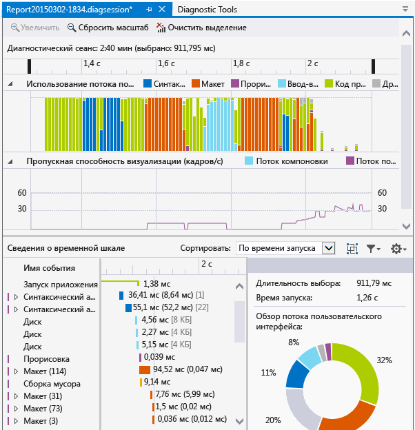
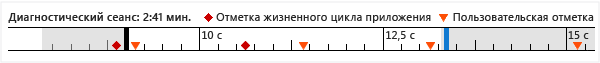
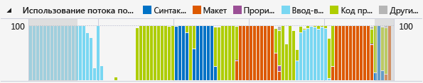

# Анализ потребления ресурсов и активности потоков пользовательского интерфейса (XAML)

Используйте профилировщик **Временная шкала приложения** , чтобы найти и исправить проблемы производительности в работе приложений XAML, связанные с взаимодействием. Это средство помогает улучшить производительность приложений XAML, предоставляя подробные сведения об использовании ресурсов приложений. Вы можете проанализировать время, затраченное приложением на подготовку кадров пользовательского интерфейса (макет и обработка), обработку запросов от сети и дисков, а также на такие сценарии, как запуск приложения, загрузка страницы и изменение размера окон.

**Временная шкала приложения** — это одно из средств, которое можно запустить, выбрав **Отладка** > **Профилировщик производительности**.

Это средство заменяет средство **проверки скорости реагирования пользовательского интерфейса XAML** , которое входило в набор средств диагностики для Visual Studio 2013.

Вы можете использовать это средство на следующих платформах:

- универсальные приложения для Windows (на Windows 10);
- Windows 8.1
- Windows Presentation Foundation (.NET 4.0 и более поздней версии).
- Windows 7

> [!NOTE]
> Вы можете собирать и анализировать данные о загрузке ЦП и энергопотреблении вместе с данными средства **Временная шкала приложения** . См. статью [Running Profiling Tools with or without the Debugger](../profiling/running-profiling-tools-with-or-without-the-debugger.md) (Выполнение средств профилирования с отладчиком или без него).

## Сбор данных временной шкалы приложения

Скорость реагирования приложения можно профилировать на локальном компьютере, подключенном устройстве, симуляторе или эмуляторах Visual Studio либо на удаленном устройстве. См. статью [Running Profiling Tools with or without the Debugger](../profiling/running-profiling-tools-with-or-without-the-debugger.md) (Выполнение средств профилирования с отладчиком или без него).

> [!TIP]
> Если это возможно, запустите приложение непосредственно на устройстве. Производительность приложения, наблюдаемая на имитаторе или посредством подключения к удаленному рабочему столу, может отличаться от фактической производительности на устройстве. С другой стороны, сбор данных с помощью удаленных средств Visual Studio не влияет на данные о производительности.

Ниже перечислены основные шаги.

1. Откройте приложение XAML.

2. Выберите **Отладка / Профилировщик производительности**. Должен появиться список средств профилирования в окне DIAGSESSION.

3. Выберите **Временная шкала приложения** и щелкните **Запустить** в нижней части окна.

   

   > [!NOTE]
   > Может появиться окно "Контроль учетных записей" с запросом на разрешение запуска файла *VsEtwCollector.exe*. Нажмите кнопку **Да**.

4. Запустите интересующий вас сценарий профилирования в приложении, чтобы собрать данные о производительности.

5. Чтобы остановить профилирование, переключитесь обратно на окно DIAGSESSION и щелкните **Остановить** в верхней части окна.

   Visual Studio анализирует собранные данные и отображает результаты.

   

## Анализ данных профилирования средства "Временная шкала"

После сбора данных профилирования выполните следующие действия для запуска анализа.

1. Просмотрите информацию на диаграммах **Использование потока пользовательского интерфейса** и **Пропускная способность визуализации (кадров/с)** , а затем с помощью панелей навигации временной шкалы выберите диапазон времени, который требуется проанализировать.

2. Используя информацию на диаграммах **Использование потока пользовательского интерфейса** или **Пропускная способность визуализации (кадров/с)** , просмотрите сведения в представлении **Сведения о временной шкале**, чтобы определить возможные причины кажущейся нехватки скорости реагирования.

###  Сценарии отчетов, категории и события

Средство **Временная шкала приложения** отображает данные о времени для сценариев, категорий и событий, которые относятся к производительности XAML.

###  Временная шкала диагностического сеанса

На линейке в верхней части страницы отображается временная шкала профилированной информации. Эта шкала применяется для диаграмм **Использование потока пользовательского интерфейса** и **Пропускная способность визуализации** . Область отчета можно сузить, перетащив панели навигации на временной шкале, чтобы выбрать ее сегмент.

На временной шкале также отображаются все вставленные пользовательские отметки и события жизненного цикла активации приложения.

###  Диаграмма использования потока пользовательского интерфейса

Диаграмма **Использование потока пользовательского интерфейса (%)** представляет собой линейчатую диаграмму, которая отображает относительный объем потраченного времени в категории в ходе сбора данных.

###  Диаграмма пропускной способности визуализации (кадров/с)

На диаграмме **Пропускная способность визуализации (кадров/с)** отображается число кадров в секунду в пользовательском интерфейсе и потоке компоновки приложения.

###  Сведения о временной шкале

Большая часть времени уходит на анализ отчета в подробном представлении. В нем показаны сведения об использовании ЦП в приложении по категориям: для подсистемы платформы пользовательского интерфейса или для компонента системы, который использует ресурсы ЦП.

Поддерживаются следующие события:

|name|Описание|
|-|-|
|**Синтаксический анализ**|Время, затраченное на синтаксический анализ файлов XAML и создание объектов.   Расширение узла **Синтаксический анализ** в представлении **Сведения о временной шкале** позволяет отображать цепочку зависимостей всех файлов XAML, которые были проанализированы в результате корневого события. Эта подсказка позволит идентифицировать ненужный синтаксический анализ файлов и создание объектов в сценариях, чувствительных к производительности, и оптимизировать их.|
|**Макет**|В больших приложениях на экране могут одновременно отображаться тысячи элементов. Это может привести к низкой частоте кадров пользовательского интерфейса и, соответственно, низкой скорости ответа приложения. Событие макета (Layout) точно определяет затраты на размещение каждого элемента (например, время, затраченное на Arrange, Measure, ApplyTemplate, ArrangeOverride и MeasureOverride). Он также создает визуальные деревья, которые участвовали в передаче макета. Эта визуализация позволяет определить, какие логические деревья требуют урезания, а также оценить другие механизмы отсрочки для оптимизации передачи макета.|
|**Прорисовка**|Время, затраченное на прорисовку элементов XAML на экране.|
|**Операции ввода-вывода**|Время, затраченное на получение данных с локального диска или из сетевых ресурсов, доступ к которым выполняется через [Microsoft Windows Internet (WinINet) API](/windows/desktop/WinInet/portal).|
|**Код приложения**|Время, затраченное на выполнение (пользовательского) кода приложения, который не связан с синтаксическим анализом и созданием макета.|
|**Другие данные XAML**|Время, потраченное на исполнение кода среды выполнения XAML.|

> [!TIP]
> Выберите средство **Использование ЦП** вместе со средством **Временная шкала приложения** при запуске профилирования, чтобы просмотреть методы приложений, которые выполняются в потоке пользовательского интерфейса. Перемещение кода приложения с длительным временем выполнения в фоновый поток может повысить скорость реагирования ИП.

####  Настройка сведений о временной шкале

Для сортировки, фильтрации и указания заметок для записей представления **Сведения о временной шкале** используйте панель инструментов **Сведения о временной шкале** .

|name|Описание|
|-|-|
|**Сортировать по**|Сортировка по времени начала или длительности событий.|
||Добавляет или удаляет категорию **Кадр** верхнего уровня, которая группирует события по кадрам.|
||Фильтрует список по выбранным категориям и длительности событий.|
||Позволяет указать заметки для событий.|

## См. также

- [Блог группы разработчиков WPF. Новое средство анализа производительности пользовательского интерфейса для приложений WPF](/archive/blogs/wpf/new-ui-performance-analysis-tool-for-wpf-applications)
- [Рекомендации по повышению производительности для приложений универсальной платформы Windows на C++, C# и Visual Basic](/previous-versions/windows/apps/hh750313\(v\=win.10\))
- [Улучшение производительности приложений WPF](/dotnet/framework/wpf/advanced/optimizing-wpf-application-performance)
- [Профилирование в Visual Studio](../profiling/index.yml)
- [Первое знакомство со средствами профилирования](../profiling/profiling-feature-tour.md)