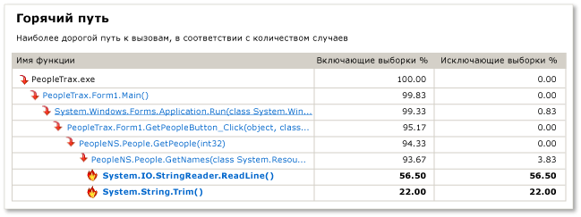
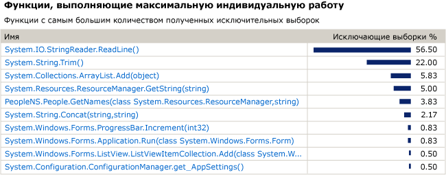
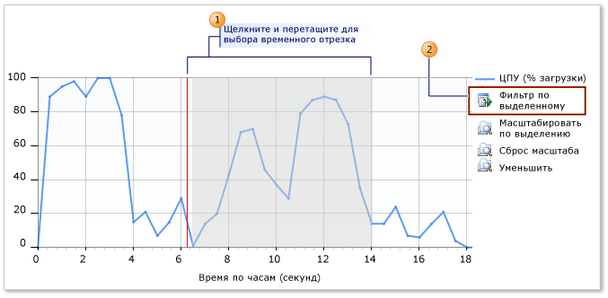

# Руководство по выборке циклов ЦП для начинающих
Средства профилирования Visual Studio можно использовать для анализа проблем с производительностью в приложении. Эта процедура показывает, как использовать данные **выборки**.

> [!NOTE]
> Если вам не требуются специальные функциональные возможности, такие как поддержка инструментария, рекомендуется использовать средство [Загрузка ЦП](../profiling/beginners-guide-to-performance-profiling.md) в окне средств диагностики, а не устаревший инструмент выборки циклов ЦП.

 **Выборка** представляет собой статистический метод профилирования, показывающий функции, которые выполняют основную часть работы в пользовательском режиме приложения. С выборки удобно начать поиск областей, позволяющих ускорить работу приложения.

 Метод **выборки** собирает сведения о функциях, которые выполняются в приложении, через заданные интервалы времени. После завершения сеанса профилирования представление **Сводка** показывает дерево вызовов наиболее активных функций, которое называется **горячим или критическим путем**, где была выполнена основная часть работы в приложении. Кроме того, в этом представлении перечислены функции, которые выполнили максимальный объем индивидуальной работы, а также представлен график временной шкалы, который позволяет сосредоточить внимание на определенных сегментах сеанса выборки.

 Если **выборка** не предоставляет необходимые данные, можно воспользоваться другими методами сбора данных профилирования, предоставляющими другие виды информации, которая может оказаться полезной. Дополнительные сведения о таких других методах см. в практическом руководстве [Выбор методов сбора данных](../profiling/how-to-choose-collection-methods.md).

> [!TIP]
> Если вы выполняете профилирование кода, вызывающего функции Windows, следует убедиться, что используются самые новые версии *PDB*-файлов. Без этих файлов имена функций Windows в представлениях отчетов будут отображаться в непонятном или трудном для понимания виде. Дополнительные сведения о том, как убедиться в наличии нужных файлов, см. в практическом руководстве [Справочная информация о символах Windows](../profiling/how-to-reference-windows-symbol-information.md).

## Создание и выполнение сеанса производительности
 Чтобы получить нужные данные для анализа, необходимо сначала создать сеанс производительности, а затем запустить его. Обе эти задачи помогает выполнить **мастер производительности**.

 Если вы не выполняете профилирование классического приложения Windows или приложения ASP.NET, необходимо использовать другое средство профилирования. См. раздел [Первое знакомство со средствами профилирования](../profiling/profiling-feature-tour.md).

#### Порядок создания и выполнения сеанса производительности

1. Откройте решение в Visual Studio. Выберите конфигурацию «Выпуск». (Найдите на панели инструментов поле **Конфигурации решений**, в котором по умолчанию задано значение **Отладка**. Измените это значение на **Выпуск**.)

    > [!IMPORTANT]
    > Если вы не являетесь администратором на том компьютере, где работаете, при использовании профилировщика следует запустить Visual Studio от имени администратора. (Щелкните правой кнопкой мыши значок приложения Visual Studio и выберите пункт **Запуск от имени администратора**.

2. В меню **Отладка** выберите пункт **Профилировщик**, а затем **Профилировщик производительности**.

3. Установите флажок **Мастер производительности** и нажмите кнопку **Запуск**.

4. Установите флажок **Выборка циклов ЦП (рекомендуется)** и нажмите кнопку **Готово**.

5. Запускается ваше приложение, а профилировщик начинает сбор данных.

6. Проверьте функции, которые могут вызывать проблемы с производительностью.

7. Закройте приложение обычным образом.

     После завершения работы приложения в основном окне Visual Studio отображается представление данных профилирования **Сводка** а в окне **Обозреватель производительности** отображается значок для нового сеанса.

## Шаг 2. Анализ данных выборки
 После завершения выполнения сеанса производительности в основном окне Visual Studio отображается представление отчета профилирования **Сводка**.

 Мы рекомендуем начать анализ данных с проверки **горячего пути**, затем проверить список функций, выполняющих основную часть работы, и наконец сосредоточиться на других функциях с помощью **шкалы сводки**. Можно также просмотреть предложения и предупреждения профилирования в окне **Список ошибок**.

 Имейте в виду, что метод выборки может не дать необходимые вам сведения. Например, выборки собираются только в том случае, когда приложение выполняет код пользовательского режима. Таким образом, выборка не охватывает некоторые функции, например операции ввода и вывода. В средствах профилирования предусмотрено несколько методов сбора, которые обеспечивают возможность сосредоточиться на важных данных. Дополнительные сведения о других методах см. в практическом руководстве [Выбор методов сбора данных](../profiling/how-to-choose-collection-methods.md).

 Каждая нумерованная область на рисунке соответствует определенному шагу в процедуре.

 

#### Анализ данных выборки

1. **Горячий путь** в представлении **Сводка** показывает ветвь дерева вызовов вашего приложения с наиболее инклюзивными выборками. Это путь выполнения, который был самым активным при сборе данных. Наиболее инклюзивные значения могут указывать на возможность оптимизации алгоритма, формирующего дерево вызовов. Найдите в коде функцию, находящуюся в самом конце пути. Обратите внимание, что этот путь может также содержать системные функции или функции во внешних модулях.

     

    1. **Инклюзивные выборки** указывают, какой объем работы был выполнен некоторой функцией и всеми вызванными ей функциями. Высокие инклюзивные значения указывают на функции, которые в целом являются наиболее дорогостоящими.

    2. **Эксклюзивные выборки** указывают, какой объем работы был выполнен кодом в теле функции, за исключением работы, выполненной вызванными ей функциями. Высокие эксклюзивные значения могут свидетельствовать об узких местах производительности внутри самой функции.

2. Щелкните имя функции для отображения представления **Сведения о функции** с данными профилирования. Представление **Сведения о функции** содержит графическое представление данных профилирования для выбранной функции, показывающее все функции, вызывавшие данную функцию, и все функции, которые были вызваны выбранной функцией.

    - Размер блоков вызывающих и вызываемых функций соответствует относительной частоте, с которой функции выполняли вызовы или были вызваны.

    - Можно щелкнуть имя вызывающей или вызываемой функции, чтобы она стала активной функцией в представлении «Сведения о функции».

    - На нижней панели окон **Сведения о функции** отображается код самой функции. Если вы проанализировали код и нашли возможность для оптимизации производительности, щелкните имя исходного файла, чтобы открыть его в редакторе Visual Studio.

3. Для продолжения анализа вернитесь в представление **Сводка**, выбрав элемент **Сводка** в раскрывающемся списке **Представление**. Затем проанализируйте функции в области **Функции с максимальной индивидуальной работой**. Этот список содержит функции с наиболее эксклюзивными выборками. Код в теле этих функций выполнял значительный объем работы, и вы можете быть в состоянии оптимизировать его. Для дальнейшего анализа определенной функции щелкните имя этой функции, чтобы отобразить ее в представлении **Сведения о функции**.

     

     Для продолжения анализа сеанса профилирования можно повторно проанализировать сегмент данных профилирования с помощью временной шкалы в представлении **Сводка**, чтобы отобразить показатели **Горячий путь** и **Функции с максимальной индивидуальной работой** для выбранного сегмента. Например, сосредоточившись на небольшом пике на временной шкале, можно выявить дорогостоящие деревья вызовов и функции, которые не были выявлены в рамках анализа всего сеанса профилирования.

     Чтобы заново проанализировать сегмент, выберите его в поле **Временная шкала сводки** и щелкните **Фильтр по выделенному**.

     

4. Профилировщик также использует набор правил, чтобы предлагать способы улучшения сеанса профилирования и выявлять возможные проблемы с производительностью. В случае обнаружения проблемы в окне **Список ошибок** отображается предупреждение. Чтобы открыть окно **Список ошибок**, щелкните пункт **Список ошибок** в меню **Вид**.

    - Чтобы просмотреть функции, вызвавшие предупреждение в представлении **Сведения о функции**, дважды щелкните это предупреждение.

    - Чтобы просмотреть подробные сведения о предупреждении, щелкните ошибку правой кнопкой мыши и выберите пункт **Показать справочные сведения об ошибке**.

## Шаг 3. Пересмотр кода и повторный запуск сеанса
 После нахождения и оптимизации одной или нескольких функций можно повторить сеанс профилирования и сравнить данные, чтобы определить, как внесенные изменения повлияли на производительность приложения.

#### Пересмотр кода и повторный запуск сеанса

1. Измените код.

2. Чтобы открыть **обозреватель производительности**, в меню **Отладка** выберите пункт **Профилировщик**, затем — **Обозреватель производительности** и щелкните **Показать обозреватель производительности**.

3. В **обозревателе производительности** щелкните правой кнопкой мыши сеанс, который необходимо запустить повторно, и выберите пункт **Запустить с профилированием.**

4. После повторного запуска сеанса в папку *Отчеты* папки для сеанса в **обозревателе производительности** добавляется другой файл данных. Выберите исходные и новые данные профилирования, щелкните выбранное правой кнопкой мыши и выберите пункт **Сравнить отчеты о производительности**.

     Открывается новое окно отчета с результатами сравнения. Дополнительные сведения об использовании представления сравнения см. в практическом руководстве [Сравнение файлов данных профилировщика](../profiling/how-to-compare-performance-data-files.md).

## См. также раздел
- [Обозреватель производительности](../profiling/performance-explorer.md)
- [Начало работы](../profiling/getting-started-with-performance-tools.md)
- [Разделы общих сведений](../profiling/overviews-performance-tools.md)
- [Профилирование в Visual Studio](../profiling/index.yml)
- [Первое знакомство со средствами профилирования](../profiling/profiling-feature-tour.md)
