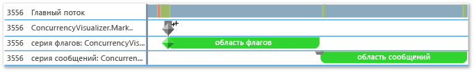
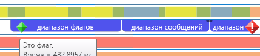
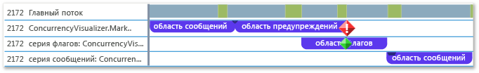

# <a name="how-to-use-the-concurrency-visualizer-markers-sdk"></a>Как выполнить: Использование пакета SDK визуализатора параллелизма для создания маркеров
В этом разделе содержатся сведения об использовании SDK визуализатора параллелизма для создания интервалов и записи флагов, сообщений и оповещений.

### <a name="to-use-c"></a>Использование C++

1. Добавьте поддержку пакета SDK визуализатора параллелизма в ваше приложение. Дополнительные сведения см. в статье [Concurrency Visualizer SDK](../profiling/concurrency-visualizer-sdk.md) (Пакет SDK визуализатора параллелизма).

2. Добавьте оператор `include` и оператор `using` для пакета SDK.

    ```cpp
    #include <cvmarkersobj.h>
    using namespace Concurrency::diagnostic;
    ```

3. Добавьте код для создания трех интервалов в последовательностях маркеров по умолчанию и записи флага, сообщения и оповещения (по одному для каждого диапазона). Методы для написания флагов, сообщений и оповещений являются членами класса [marker_series](../profiling/marker-series-class.md). Конструктору для класса [span](../profiling/span-class.md) требуется объект `marker_series`, чтобы каждый интервал был связан с конкретными последовательностями маркеров. `span` заканчивается, когда он является удаленным.

    ```cpp
    marker_series series;
    span *flagSpan = new span(series, 1, _T("flag span"));
    series.write_flag(_T("Here is the flag."));
    delete flagSpan;

    span *messageSpan = new span(series, 2, _T("message span"));
    series.write_flag(_T("Here is the message."));
    delete messageSpan;

    span *alertSpan = new span(series, 3, _T("alert span"));
    series.write_flag(_T("Here is the alert."));
    delete alertSpan;
    ```

4. В строке меню выберите **Анализ**, **Визуализатор параллелизма**, **Запустить с текущим проектом**, чтобы запустить приложение и открыть визуализатор параллелизма. На следующем рисунке показаны три интервала и три маркера в визуализаторе параллелизма.

     

5. Добавьте код для создания дополнительных пользовательских последовательностей маркеров, вызвав конструктор для `marker_series`, который принимает имя строки для последовательностей маркеров.

    ```cpp
    marker_series flagSeries(_T("flag series"));
    span *flagSeriesSpan = new span(flagSeries, 1, _T("flag span"));
    flagSeries.write_flag(1, _T("flag"));
    // Sleep to even out the display in the Concurrency Visualizer.
    Sleep(50);
    delete flagSeriesSpan;

    marker_series messageSeries(_T("message series"));
    span *messageSeriesSpan = new span(messageSeries, 1, _T("message span"));
    messageSeries.write_message(1, _T("message"));
    // Sleep to even out the display in the Concurrency Visualizer.
    Sleep(50);
    delete messageSeriesSpan;
    ```

6. Запустите текущий проект, чтобы открыть визуализатор параллелизма. Две последовательности маркеров отображаются на собственных дорожках в представлении потоков. На следующем рисунке показаны два новых интервала.

     

### <a name="to-use-visual-basic-or-c"></a>Использование Visual Basic или C\#

1. Добавьте поддержку пакета SDK визуализатора параллелизма в ваше приложение. Дополнительные сведения см. в статье [Concurrency Visualizer SDK](../profiling/concurrency-visualizer-sdk.md) (Пакет SDK визуализатора параллелизма).

2. Добавьте оператор `using` или `Imports` для пакета SDK.

    ```vb
    Imports Microsoft.ConcurrencyVisualizer.Instrumentation
    ```

    ```csharp
    using Microsoft.ConcurrencyVisualizer.Instrumentation;
    ```

3. Добавьте код для создания трех интервалов в последовательностях маркеров по умолчанию и записи флага, сообщения и оповещения (по одному для каждого диапазона). Объект [Span](/previous-versions/hh694189(v=vs.140)) можно создать путем вызова статического метода `EnterSpan`. Для записи ряда по умолчанию используйте статические методы записи класса [Markers](/previous-versions/hh694099(v=vs.140)).

    ```vb
    Dim flagSpan As Span = Markers.EnterSpan("flag span")
    Markers.WriteFlag("Here is the flag.")
    flagSpan.Leave()

    Dim messageSpan As Span = Markers.EnterSpan("message span")
    ' Sleep for a millisecond to even out the display in the Concurrency Visualizer.
    System.Threading.Thread.Sleep(1)
    Markers.WriteMessage("Here is a message")
    messageSpan.Leave()

    Dim alertSpan As Span = Markers.EnterSpan("alert span")
    ' Sleep for a millisecond to even out the display in the Concurrency Visualizer.
    System.Threading.Thread.Sleep(1)
    Markers.WriteAlert("Here is an alert")
    alertSpan.Leave()
    ```

    ```csharp
    Span flagSpan = Markers.EnterSpan("flag span");
    Markers.WriteFlag("Here is the flag.");
    flagSpan.Leave();

    Span messageSpan = Markers.EnterSpan("message span");
    // Sleep for a millisecond to even out the display in the Concurrency Visualizer.
    System.Threading.Thread.Sleep(1);
    Markers.WriteMessage("Here is a message");
    messageSpan.Leave();

    Span alertSpan = Markers.EnterSpan("alert span");
    // Sleep for a millisecond to even out the display in the Concurrency Visualizer.
    System.Threading.Thread.Sleep(1);
    Markers.WriteAlert("Here is an alert");
    alertSpan.Leave();
    ```

4. В строке меню выберите **Анализ**, **Визуализатор параллелизма**, **Запустить с текущим проектом**, чтобы запустить приложение и открыть визуализатор параллелизма. На следующем рисунке показаны три интервала и три маркера в представлении потоков в визуализаторе параллелизма.

     

5. Добавьте код для создания ряда маркеров клиента с помощью статического метода [CreateMarkerSeries](/previous-versions/hh694171(v=vs.140)). Класс [MarkerSeries](/previous-versions/hh694127(v=vs.140)) содержит методы для создания диапазонов и флагов записи, сообщений и оповещений.

    ```VB

    Dim flagSeries As MarkerSeries = Markers.DefaultWriter.CreateMarkerSeries("flag series")
    Dim flagSeriesSpan As Span = flagSeries.EnterSpan("flag span")
    System.Threading.Thread.Sleep(1)
    flagSeries.WriteFlag(1, "flag")
    System.Threading.Thread.Sleep(1)
    flagSeriesSpan.Leave()

    Dim messageSeries As MarkerSeries = Markers.DefaultWriter.CreateMarkerSeries("message series")
    Dim messageSeriesSpan As Span = messageSeries.EnterSpan("message span")
    messageSeries.WriteMessage("message")
    System.Threading.Thread.Sleep(1)
    messageSeriesSpan.Leave()
    ```

    ```csharp

    MarkerSeries flagSeries = Markers.DefaultWriter.CreateMarkerSeries("flag series");
    Span flagSeriesSpan = flagSeries.EnterSpan("flag span");
    System.Threading.Thread.Sleep(1);
    flagSeries.WriteFlag(1, "flag");
    System.Threading.Thread.Sleep(1);
    flagSeriesSpan.Leave();

    MarkerSeries messageSeries = Markers.DefaultWriter.CreateMarkerSeries("message series");
    Span messageSeriesSpan = messageSeries.EnterSpan("message span");
    messageSeries.WriteMessage("message");
    System.Threading.Thread.Sleep(1);
    messageSeriesSpan.Leave();
    ```

6. Запустите текущий проект, чтобы открыть визуализатор параллелизма. Три последовательности маркеров отображаются на собственных дорожках в представлении потоков. На следующем рисунке показаны три новых интервала.

     

## <a name="see-also"></a>См. также
- [Пакет SDK визуализатора параллелизма](../profiling/concurrency-visualizer-sdk.md)
