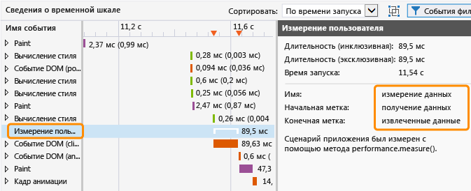
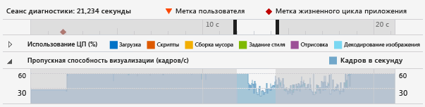
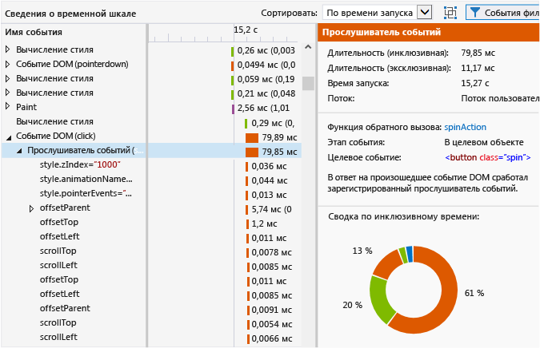
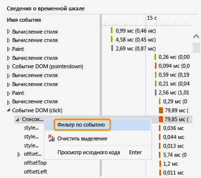
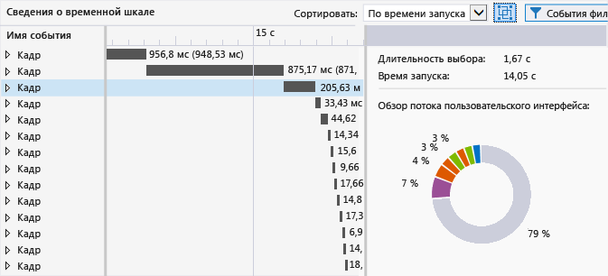

# <a name="analyze-html-ui-responsiveness-in-universal-windows-apps"></a>Анализ скорости реагирования пользовательского интерфейса HTML в универсальных приложениях Windows
В этой статье описано, как можно изолировать проблемы производительности в приложениях с помощью профилировщика скорости реагирования пользовательского интерфейса. Это специальное средство оценки производительности для универсальных приложений Windows.

 Профилировщик отклика пользовательского интерфейса позволяет выявить проблемы с откликом пользовательского интерфейса или побочные эффекты платформы, которые обычно возникают со следующими симптомами.

- Плохая скорость реагирования пользовательского интерфейса. В случае блокировки потока пользовательского интерфейса приложение может медленно реагировать на запросы. Поток пользовательского интерфейса может блокироваться, например, слишком большим синхронным кодом JavaScript, излишними действиями, связанными с макетом CSS или вычислениями CSS, синхронными запросами XHR, сборкой мусора, слишком большим временем рисования или кодом JavaScript, чрезмерно загружающим процессор.

- Медленная загрузка приложения или страницы. Обычно это вызвано тем, что загрузка ресурсов занимает слишком много времени.

- Обновления визуальных элементов происходят реже, чем ожидалось. Такой симптом возникает при слишком большой занятости потока пользовательского интерфейса для поддержания стабильной частоты кадров. Например, если поток пользовательского интерфейса занят, кадры могут отбрасываться. Некоторые операции, не связанные с потоком пользовательского интерфейса — например, сетевые запросы, декодирование изображений и рисование — также могут ограничивать частоту обновлений визуальных элементов. (Не все рисование выполняется в потоке пользовательского интерфейса.)

## <a name="run-the-html-ui-responsiveness-tool"></a>Запуск средства скорости реагирования пользовательского интерфейса HTML
 При наличии рабочего приложения UWP, открытого в Visual Studio, можно использовать средство "Скорость реагирования пользовательского интерфейса HTML".

1. При запуске приложения из Visual Studio в раскрывающемся списке **Начать отладку** на панели инструментов **Стандартные** выберите в качестве назначения развертывания **локальный компьютер** или **устройство**.

2. В меню **Отладка** выберите **Профилировщик производительности**.

     Если требуется изменить целевой объект анализа для профилировщика, выберите **Изменить целевой объект**.

     

     В качестве целевого объекта анализа предусмотрены следующие параметры:

    - **Запускаемый проект**. Выберите этот параметр, чтобы проанализировать текущий запускаемый проект. При запуске приложения на удаленном компьютере или устройстве необходимо использовать этот параметр (он предлагается по умолчанию).

    - **Выполняемое приложение**. Выберите этот параметр, чтобы выбрать приложение универсальной платформы Windows из списка выполняющихся. При запуске приложения на удаленном компьютере или устройстве этот параметр использовать нельзя.

         Его можно использовать для анализа производительности приложений, запущенных на локальном компьютере при отсутствии доступа к исходному коду.

    - **Установленное приложение**. Выберите этот параметр, чтобы выбрать установленное приложение, которое необходимо проанализировать. При запуске приложения на удаленном компьютере или устройстве этот параметр использовать нельзя.

         Его можно использовать для анализа производительности приложений, установленных на локальном компьютере при отсутствии доступа к исходному коду. Этим параметром также удобно пользоваться, если необходимо проанализировать производительность какого-либо приложения, не относящегося к разрабатываемым.

3. В меню **Доступные инструменты** выберите **Скорость реагирования ИП HTML** и выберите **Запуск**.

4. При запуске профилировщика скорости реагирования пользовательского интерфейса в окне "Контроль учетных записей" может быть запрошено разрешение на запуск файла Collector.exe трассировки событий Windows Visual Studio. Выберите **Да**.

     Взаимодействуйте с приложением для тестирования соответствующего сценария оценки производительности. Подробный рабочий процесс см. в разделах [Локализация проблемы скорости реагирования ИП](#Workflow) и [Isolate a visual throughput problem](#IsolateVisualThroughput).

5. Перейдите в Visual Studio, нажав сочетание клавиш ALT+TAB.

6. Чтобы остановить профилирование приложения и просмотреть данные, собранные профилировщиком, выберите **Остановка сбора**.

## <a name="isolate-an-issue"></a>Локализация проблемы
 Следующий раздел содержит рекомендации, помогающие локализовать проблемы производительности. Пошаговое объяснение способа обнаружения и устранения проблем производительности на примере приложения, тестирующего производительность, см. в разделе [Walkthrough: Improving UI responsiveness (HTML)](html-ui-responsiveness.md) (Пошаговое руководство. Повышение скорости реагирования пользовательского интерфейса HTML).

### <a name="isolate-a-ui-responsiveness-problem"></a><a name="Workflow"></a> Локализация проблемы скорости реагирования пользовательского интерфейса
 Перечисленные ниже действия представляют предлагаемый рабочий процесс, позволяющий обеспечить более эффективное использование профилировщика скорости реагирования пользовательского интерфейса.

1. Откройте приложение в Visual Studio.

2. Протестируйте приложение на предмет проблем скорости реагирования ИП. (Нажмите **CTRL**+**F5**, чтобы запустить приложение без отладки.)

     При обнаружении проблемы можно продолжить тестирование, чтобы ограничить интервал времени, в котором возникает проблема, или попытаться определить триггеры, вызывающие такое поведение.

3. Перейдите в Visual Studio (нажмите **ALT**+**TAB**) и остановите приложение (**SHIFT**+**ShiftF5**).

4. При необходимости добавьте в код пользовательские отметки с помощью [Добавление в код отметок для анализа](#ProfileMark).

    > [!TIP]
    > Пользовательские отметки могут помочь в выявлении проблемы скорости реагирования при просмотре данных профилировщика. Например, можно добавить пользовательскую отметку в начале и в конце раздела кода, который вызывает возникновение проблемы скорости реагирования.

5. Запустите профилировщик скорости реагирования ИП, следуя инструкциям в предыдущем подразделе.

6. Переведите приложение в состояние, которое приводит к проблеме скорости реагирования ИП.

7. Перейдите в Visual Studio (нажмите ALT+TAB) и на вкладке "Профилировщик" профилировщика скорости реагирования ИП выберите **Остановка сбора** .

8. Если добавлены пользовательские отметки, они будут отображаться на [Просмотр временной шкалы диагностического сеанса](#Ruler) профилировщика. На следующем рисунке показана отдельная пользовательская отметка, используемая для задания конкретной операции в коде.

     

9. Определить интересующую область на временной шкале и диаграммах профилировщика можно по пользовательским отметкам, событиям жизненного цикла приложения или данным, отображаемым на диаграммах. Ниже приведены некоторые рекомендации, помогающие анализировать и использовать данные на диаграммах.

    - Используйте [Просмотр временной шкалы диагностического сеанса](#Ruler) для просмотра [Добавление в код отметок для анализа](#ProfileMark), событий жизненного цикла приложения и связанной временной шкалы этих событий, а также временной шкалы данных на других диаграммах.

    - Используйте [CPU utilization graph](#CPUUtilization) для просмотра общих сведений о работе ЦП и типе выполняемых им операций в течение определенного периода времени. Периоды слишком большой загрузки ЦП с наибольшей вероятностью бывают связаны с проблемами скорости реагирования и отбрасыванием кадров.

    - При разработке игры или мультимедийного приложения используйте [Просмотр пропускной способности визуализации (кадров/с)](#VisualThroughput) для определения периодов времени, когда частота кадров падает.

10. Выберите интересующую область на одной из диаграмм, щелкнув часть диаграммы и перетащив указатель (или выберите ее с помощью клавиши TAB и клавиш со стрелками). При выборе периода времени путем выделения диаграмма сведений о временной шкале в нижней области профилировщика изменяется для отображения только выбранного периода.

     На следующем рисунке показана диаграмма использования ЦП с выделенной интересующей областью.

     

11. Используйте [Просмотр сведений о временной шкале](#TimelineDetails) , чтобы получить подробную информацию о событиях, выполнение которых либо занимает слишком много времени, либо производится слишком часто. Например, обратите внимание на следующее:

    - прослушиватели событий, таймеры и обратные вызовы кадров анимации. В зависимости от конкретного события предоставляемые данные могут включать в себя идентификатор измененных элементов DOM, имя измененных свойств CSS, ссылку на расположение источника, а также имя соответствующего события или функции обратного вызова.

    - события макета или скриптов, приводящие к отрисовке элементов, например вызовы `window.getComputedStyles`. Предоставляется связанный элемент DOM для события.

    - страницы или URL-ресурсы, загружаемые приложением, такие как вычисления скриптов для событий синтаксического анализа HTML. В сведениях присутствует имя файла или ресурса;

    - Другие события указаны в разделе [Profiler event reference](#profiler-event-reference).

    > [!TIP]
    > Основная часть полезной информации профилировщика отображается на диаграмме сведений о временной шкале.

12. Выбрав область на диаграмме пропускной способности визуализации (кадров/с) или использования ЦП, выберите **Увеличить** (кнопку или команду контекстного меню), чтобы получить более подробные сведения. Временная шкала диаграммы изменяется для отображения только выбранного периода времени.

13. После увеличения выделите часть диаграммы использования ЦП или пропускной способности визуализации. При выполнении выделения диаграмма сведений о временной шкале в нижней области профилировщика изменяется для отображения только выбранного периода времени.

### <a name="isolate-a-visual-throughput-problem"></a><a name="IsolateVisualThroughput"></a> Isolate a visual throughput problem
 Периоды чрезмерного использования ЦП являются причиной низкой или нестабильной частоты кадров. При разработке мультимедийных приложений и игр диаграмма пропускной способности визуализации может предоставлять более ценные данные, чем диаграмма использования ЦП.

 Чтобы локализовать проблему пропускной способности визуализации, следуйте инструкциям в предыдущем разделе, однако используйте в качестве одной из ключевых точек данных диаграмму пропускной способности визуализации.

### <a name="mark-code-for-analysis"></a><a name="ProfileMark"></a> Добавление в код отметок для анализа
 Чтобы локализовать раздел кода приложения, связанный с отображаемыми на диаграммах данными, можно добавить в приложение вызов функции, который даст профилировщику указание вставить пользовательскую отметку — перевернутый треугольник — во временную шкалу в момент выполнения функции. Все добавленные пользовательские отметки отображаются на временной шкале диаграммы использования ЦП, диаграммы пропускной способности визуализации и диаграммы сведений о временной шкале.

 Для добавления пользовательской отметки добавьте в приложение следующий код. В этом примере в качестве описании события используется строка "getting data".

```javascript
if (performance && performance.mark) {
    performance.mark("getting data");
}

```

 Описание события появляется в виде всплывающей подсказки при наведении указателя мыши на пользовательскую отметку. Можно добавить столько пользовательских отметок, сколько требуется.

> [!NOTE]
> `console.timeStamp`Команда хром также появляется как пользовательская отметка.

 На следующем рисунке показана линейка диагностики с одной пользовательской отметкой и ее всплывающей подсказкой.

 

 Кроме этого, в представлении сведений о временной шкале можно создать события, генерированные инструментами, для показа периода времени между двумя пользовательскими отметками. Следующий код добавляет вторую пользовательскую отметку и измерение времени, которое проходит между выполнением двух пользовательских отметок (предыдущий код показывает первую пользовательскую отметку).

```javascript
if (performance.mark && performance.measure) {
    performance.mark("data retrieved");
    performance.measure("data measure", "getting data", "data retrieved");
}
```

 Если вторая пользовательская отметка не указана, то `performance.measure` использует метку времени вместо нее. Первая пользовательская отметка обязательна.

 Измерение длительности появляется как событие **Показатель пользователя** в представлении сведений о временной шкале и в случае его выбора показывает подробную информацию.

 

## <a name="analyze-data"></a>Анализ данных
 В следующих разделах содержатся сведения, помогающие интерпретировать данные, отображаемые в профилировщике.

### <a name="view-the-diagnostic-session-timeline"></a><a name="Ruler"></a> Просмотр временной шкалы диагностического сеанса
 На линейке в верхней части профилировщика отображается временная шкала для профилируемой информации. Эта шкала относится и к диаграмме использования ЦП, и к диаграмме пропускной способности визуализации.

 Ниже показано, как выглядит временная шкала диагностического сеанса со всплывающей подсказкой для нескольких событий жизненного цикла приложения:

 

 На временной шкале отображаются моменты возникновения событий жизненного цикла приложения (например, событие активации), а также пользовательские отметки (треугольники пользовательских отметок), которые можно добавить в код. При выборе события появляются подсказки, содержащие дополнительные сведения. Дополнительные сведения о пользовательских отметках см. в разделе . [Добавление в код отметок для анализа](#ProfileMark) в этом разделе.

 События жизненного цикла отображаются в виде ромбов. Это события DOM, включая следующие:

- события`DOMContentLoaded` и `Load` events, which typically occur in the activated event hиler in your code. в подсказке для события указываются конкретное событие и URL-адрес;

- событие навигации, возникающее при переходе на другую страницу. в подсказке для события указывается URL-адрес страницы назначения.

### <a name="view-cpu-utilization"></a><a name="CPUUtilization"></a> Просмотр использования ЦП
 Диаграмма использования ЦП позволяет определить периоды времени со слишком большой загрузкой ЦП. Она предоставляет информация о средней нагрузке на ЦП, создаваемой приложением на протяжении периода времени. Информация имеет цветовую маркировку для представления следующих категорий: **Загрузка**, **Скрипты**,**Сборка мусора**, **Задание стиля**, **Отрисовка** и **Декодирование изображения**. Дополнительные сведения об этих категориях см. в подразделе [Profiler event reference](#profiler-event-reference) далее в этом разделе.

 На диаграмме использования ЦП отображается время, затраченное на обработку всех потоков приложения, причем значения использования одного или нескольких процессоров объединяются в одно значение, выраженное в процентах. Когда задействуется несколько процессоров, значение использования ЦП может превышать 100 процентов.

> [!NOTE]
> Использование ЦП не отображается на графике.

 На рисунке ниже представлен пример диаграммы использования ЦП.

 

 Используйте эту диаграмму для:

- определения общих проблемных областей;

- выбора конкретного периода времени для отображения на диаграмме сведений о временной шкале Для выбора какого-либо периода времени выделите какую-либо часть диаграммы и перетащите указатель.

- получения более подробного представления выбранного периода времени путем нажатия кнопки **Увеличить** .

  Дополнительные сведения об использовании диаграммы см. в подразделе [Isolate a UI responsiveness problem](#Workflow) далее в этом разделе.

### <a name="view-visual-throughput-fps"></a><a name="VisualThroughput"></a> Просмотр пропускной способности визуализации (кадров/с)
 Диаграмма пропускной способности визуализации позволяет определить периоды времени, в которых частота кадров снижается. На ней показано количество кадров приложения в секунду. Эта диаграмма наиболее эффективна для разработки игр и мультимедийных приложений.

 Отображаемое число кадров в секунду может отличаться от фактической частоты кадров, что следует иметь в виду при анализе данных на этой диаграмме.

- На диаграмме показывается производительность в кадрах в секунду, которую приложение может иметь в любое заданное время. Если приложение неактивно, число кадров в секунду равно частоте обновления монитора.

- Если приложение выполняет действия, требующие обновления визуальных элементов, на диаграмме отображается фактические число кадров в секунду.

- Если кадры отбрасываются, на диаграмме отображается нулевое значение.

  На рисунке ниже представлен пример диаграммы пропускной способности визуализации.

  

  Используйте эту диаграмму для:

- определения общих проблемных областей;

- выбора конкретного периода времени для отображения на диаграмме сведений о временной шкале Для выбора какого-либо периода времени выделите какую-либо часть диаграммы и перетащите указатель.

- получения более подробного представления выбранного периода времени путем нажатия кнопки **Увеличить** .

### <a name="view-timeline-details"></a><a name="TimelineDetails"></a> Просмотр сведений о временной шкале
 Диаграмма сведений о временной шкале отображается в нижней области профилировщика скорости реагирования ИП. Она предоставляет последовательные и иерархические данные о событиях, использовавших больше всего времени ЦП в течение выбранных периодов времени. С помощью этой диаграммы можно выяснить причину появления определенного события и как оно соотносится с исходным кодом (для некоторых событий). Эта диаграмма также позволяет определить время, необходимое для рисования обновлений визуальных элементов на экране.

 На диаграмме отображаются действия потока пользовательского интерфейса и действия в фоновых потоках, которые могут способствовать замедлению обновления визуальных элементов. На этой диаграмме не отражаются JIT-действия JavaScript, асинхронные действия графического процессора, действия, выполняемые вне хост-процесса (например, выполнение файлов RuntimeBroker.exe и dwm.exe), и действия для областей среды выполнения Windows, которые еще не были инструментированы для профилирования (например, операции дискового ввода-вывода).

> [!TIP]
> Когда в фоновом потоке происходит какое-либо событие, рядом с именем этого события в квадратных скобках отображается идентификатор потока.

 В приведенном ниже примере показана диаграмма сведений о временной шкале при выборе прослушивателя событий для события щелчка DOM.

 

 На этом рисунке обработчик событий **spinAction** в столбце **Имя события** является ссылкой, по которой можно перейти к обработчику событий в исходном коде. В правой области свойство **Функция обратного вызова** содержит такую же ссылку на исходный код. Другие свойства также предоставляют сведения о событии, например о связанном элементе DOM.

 Если выбрать часть временной шкалы для диаграмм использования ЦП и пропускной способности визуализации (кадров/с), то на диаграмме сведений о временной шкале будут показаны подробные сведения для выбранного периода времени.

 События на диаграмме сведений о временной шкале имеют цветовую маркировку для представления тех же категорий действий, которые показываются на диаграмме использования ЦП. Дополнительные сведения о категориях событий и конкретных событиях см. в подразделе [Profiler event reference](#profiler-event-reference) этого раздела.

 Используя диаграмму сведений о временной шкале, можно выполнять следующие действия.

- Просмотр приблизительных значений времени начала, длительности и времени окончания события в представлении в виде временной шкалы и сетки. На диаграмме сведений о временной шкале могут показываться периоды длительностью от 30 миллисекунд до 30 секунд в представлении в виде сетки в зависимости от используемого масштаба. Для значений длительности:

  - Инклюзивные значения времени представляют длительность события, включая его дочерние элементы. В представлении в виде сетки такие значения отображаются первыми.

  - Эксклюзивные значения времени представляют длительность события, не включая его дочерние элементы. В представлении в виде сетки такие значения показываются в скобках.

- Развертывание события в иерархии для просмотра его дочерних элементов. Дочерние элементы события — это другие события, которые вызываются родительским событием. Например, для события DOM могут иметься прослушиватели событий, отображаемые в качестве дочерних элементов. Прослушиватель событий может иметь другие, порождаемые им события, например событие макета.

- Сортировка событий по времени начала (по умолчанию) или длительности. Для выбора метода сортировки используйте список **Сортировать по** .

- Просмотр сведений для каждого события в области сведений (правая область). Свойства зависят от конкретного события, как показано в следующих примерах.

  - Для таймеров, прослушивателей событий (DOM) и обратных вызовов кадров анимации свойство **Функция обратного вызова** предоставляет ссылку на расположение исходного кода вместе с именем обработчика событий или функции обратного вызова.

  - Для таймеров, прослушивателей событий (событий DOM), макетов событий и обратных вызовов кадров анимации можно отобразить цветную сводку выбранного события и всех его дочерних элементов в разделе **Сводка по инклюзивному времени** (цветное кольцо). Каждый цветной срез изображения представляет тип события. В подсказках указывается имя типа события.

  > [!TIP]
  > Диаграмма со сведениями о временной шкале и **Сводка по инклюзивному времени** помогут идентифицировать области для оптимизации. Если какое-либо из этих представлений содержит большое количество мелких задач, событие, скорее всего, требует оптимизации. Например, приложение может часто обновлять элементы DOM, что является причиной большого числа событий макета и событий синтаксического анализа HTML. Возможно, пакетное выполнение этой работы позволит оптимизировать производительность.

### <a name="filter-timeline-details"></a><a name="FilterTimelineDetails"></a> Фильтр сведений о временной шкале
 Можно фильтровать представление сведений о временной шкале по определенному событию, выбрав **Фильтр для события** в контекстном меню для конкретного события. При выборе этого параметра временная шкала и представление в виде сетки фокусируются на выбранном событии. Выделение на диаграмме использования ЦП также фокусирует на определенном событии.

 

### <a name="filter-events"></a><a name="FilterEvents"></a> Фильтр событий
 Можно отфильтровать некоторые события из диаграммы сведений о временной шкале для очистки данных от шума или для удаления данных, которые не представляют интереса в этом сценарии производительности. Фильтровать можно по имени или длительности события или с использованием определенных фильтров, описанных здесь.

 Для отфильтровки декодирования изображения, наблюдающей загрузки и событий GC отключите параметр **Фоновое действие** , используя значок фильтра в нижней области. Поскольку с этими событиями нельзя выполнить большое количество действий, они скрыты по умолчанию.

 

 Для отфильтровки событий HTTP-запросов отключите параметр **Сетевой трафик** , используя значок фильтра в нижней области. По умолчанию эти события показываются на диаграмме сведений о временной шкале.

 Для отфильтровки активности потока ИП отключите параметр **Активность ИП** .

> [!TIP]
> Чтобы проанализировать проблемы, связанные с задержкой сети, отключите этот параметр и выберите параметр "Сетевой трафик".

 Для отфильтровки показателей пользователя отключите параметр **Показатели пользователя** . Показатели пользователя — это события верхнего уровня без дочерних событий.

### <a name="group-events-by-frame"></a><a name="GroupFrames"></a> События группы по кадрам
 События, которые появляются в представлении сведений о временной шкале, можно группировать по отдельным кадрам. Эти события кадров являются событиями, созданными инструментами, и представляют собой контейнеры событий верхнего уровня для всех действий потока ИП, которые возникают между событиями рисования. Чтобы включит это представление, выберите **Группировать события верхнего уровня по кадрам**.

 

 При группировании событий по кадрам каждое событие верхнего уровня в представлении сведений о временной шкале является кадром.

 

## <a name="save-a-diagnostic-session"></a>Сохранение диагностического сеанса
 В Visual Studio можно сохранить диагностический сеанс при закрытии связанной с ним вкладки. Сохраненные сеансы можно повторно открыть позднее.

## <a name="profiler-event-reference"></a>Profiler event reference
 События профилировщика классифицируются и маркируются цветом в профилировщике скорости реагирования пользовательского интерфейса. Ниже перечислены категории этих событий.

- **Загрузка.** Указывается время, затраченное на получение ресурсов приложения и синтаксический анализ кодов HTML и CSS при первой загрузке приложения. Может включать сетевые запросы.

- **Скрипты.** Указывается время, затраченное на синтаксический анализ и выполнение кода JavaScript. В эту категорию входят события DOM, таймеры, вычисление скрипта и операции, связанные с кадрами анимации. Включаются как код пользователя, так и код библиотеки.

- **Сборка мусора.** Указывается время, затраченное на сборку мусора.

- **Задание стиля.** Указывается время, затраченное на синтаксический анализ кода CSS и расчет представления и макета элемента.

- **Отрисовка.** Указывается время, затраченное на рисование экрана.

- **Декодирование изображения.** Указывается время, затраченное на распаковку и декодирование изображений.

  Для категорий "Скрипт" и "Задание стиля" профилировщик скорости реагирования пользовательского интерфейса может предоставлять данные, которые могут воздействовать на диаграмму сведений о временной шкале. Если обнаруживается проблема со скриптами, можно использовать профилировщик выборки циклов ЦП с профилировщиком скорости реагирования ИП. Также для получения более подробных сведений можно использовать профилировщик функций Visual Studio. Дополнительные сведения см. в разделах [Память JavaScript](../profiling/javascript-memory.md).

  Для других категорий событий можно выявлять побочные эффекты платформы, возникающие в результате добавления в приложение функций, но в таких случаях устранение конкретных проблем с производительностью с помощью профилировщика скорости реагирования пользовательского интерфейса может оказаться невозможным.

  В следующей таблице перечислены события и приведено их описание.

|Событие|Категория событий|Когда выполняется|
|-----------|--------------------|-----------------|
|Синтаксический анализ CSS|Загрузка|Обнаружено новое содержимое CSS и предпринята попытка его синтаксического анализа.|
|Синтаксический анализ HTML|Загрузка|Обнаружено новое содержимое HTML и предпринята попытка его синтаксического анализа с размещением в узлы и вставки в дерево DOM.|
|HTTP-запрос|Загрузка|Обнаружен удаленный ресурс в DOM или создан запрос XMLHttpRequest, приведший к HTTP-запросу.|
|Наблюдающая загрузка|Загрузка|В HTML-содержимом страницы был выполнен поиск необходимых ресурсов, чтобы можно было быстро запланировать последующие HTTP-запросы.|
|Функция обратного вызова кадра анимации|Скрипты|Браузер собирался воспроизвести другой кадр, что активировало поддерживаемую приложением функцию обратного вызова.|
|Событие DOM|Скрипты|Произошло и было выполнено событие DOM.<br /><br /> Свойство `context` события DOM, например  `DOMContentLoaded` или `click`, показывается в скобках.|
|Прослушиватель событий|Скрипты|Был вызван и выполнен прослушиватель событий.|
|Прослушиватель запросов мультимедиа.|Скрипты|Зарегистрированный запрос мультимедиа был объявлен недействительным, что привело к выполнению связанного с ним прослушивателя или прослушивателей.|
|Mutation Оbserver|Скрипты|Один или несколько наблюдаемых элементов DOM были изменены, что привело к выполнению связанного с эти обратного вызова MutationObserver.|
|Вычисление скрипта|Скрипты|В DOM найден новый элемент СКРИПТ и предпринята попытка синтаксического анализа и выполнения этого скрипта.|
|Таймер|Скрипты|Истекло время запланированного таймера и это привело к выполнению связанной с ним функции обратного вызова.|
|Функция асинхронного обратного вызова среды выполнения Windows|Скрипты|Объектом среды выполнения Windows была выполнена асинхронная операция, активировавшая функцию обратного вызова `Promise` .|
|Событие среды выполнения Windows|Скрипты|Событие, произошедшее в объекте среды выполнения Windows, активировало зарегистрированного прослушивателя.|
|Сборка мусора|Сборка мусора|Было потрачено время на сбор в памяти объектов, которые больше не использовались.|
|Вычисление CSS|Задание стиля|В модель DOM были внесены изменения, потребовавшие перерасчета свойств стиля всех затронутых элементов.|
|Layout|Задание стиля|В модель DOM были внесены изменения, потребовавшие перерасчета размера и положения всех затронутых элементов.|
|Paint|Отрисовка|В модель DOM были внесены визуальные изменения и предпринята попытка повторной отрисовки частей страницы.|
|Отрисовка слоя|Отрисовка|В независимо отрисованный фрагмент DOM (называемый слоем) были внесены визуальные изменения, потребовавшие отрисовки части страницы.|
|Декодирование изображения|Декодирование изображения|Изображение включено в DOM и предпринята попытка его распаковки и преобразования из исходного формата в растровое изображение.|
|Frame|Недоступно|Были сделаны визуальные изменения в DOM, что потребовало перерисовки всех затронутых частей страницы. Это созданное инструментом событие, используемое для группирования.|
|Показатель пользователя|Недоступно|Конкретный сценарий приложения был измерен с использованием метода `performance.measure` . Это созданное инструментом событие, используемое для анализа кода.|

## <a name="additional-information"></a>Дополнительные сведения

- Посмотрите [этот видеоролик](https://channel9.msdn.com/Events/Build/2013/3-316) о профилировщике скорости реагирования ИП с конференции Build 2013.

- Просмотрите советы по оптимизации производительности для приложений универсальной платформы Windows, созданных для Windows с использованием JavaScript. Дополнительные сведения см. в разделе [рекомендаций по оптимизации производительности для приложений универсальной платформы Windows на основе JavaScript](/previous-versions/windows/apps/hh465194\(v\=win.10\)).

- Сведения о модели и производительности однопотокового выполнения кода см. в разделе [Выполнение кода](/previous-versions/windows/apps/hh781217\(v\=win.10\)).

## <a name="see-also"></a>См. также
- [Первое знакомство со средствами профилирования](../profiling/profiling-feature-tour.md)
