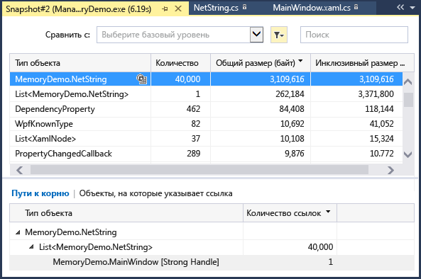
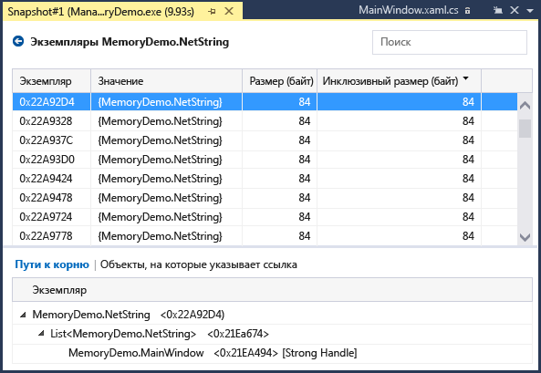
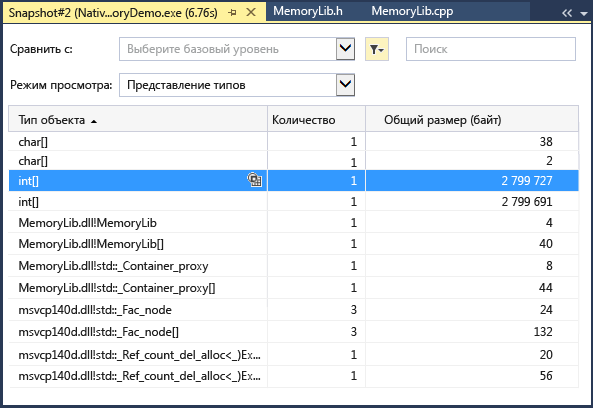
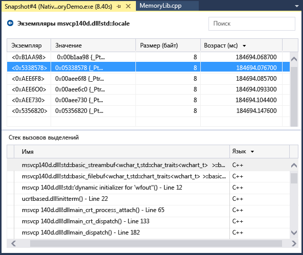
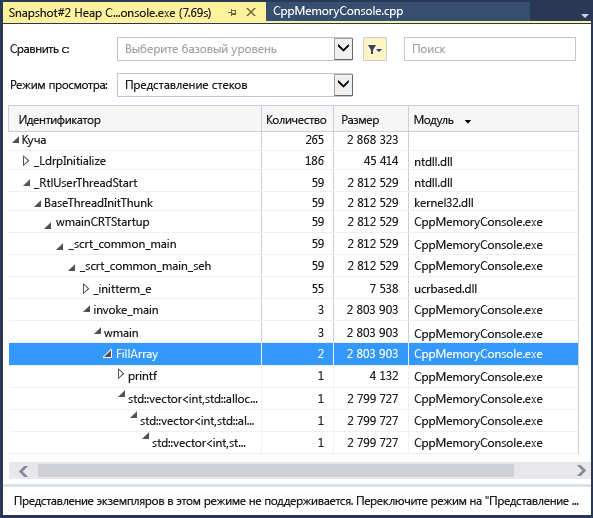

# Анализ использования памяти
С помощью встроенного в отладчик средства диагностики **Использование памяти** вы сможете находить утечки памяти и выявлять ее неэффективное использование. С помощью средства "Использование памяти" можно сделать один или несколько *снимков* управляемой и собственной памяти в куче. Вы можете делать снимки приложений .NET, приложений на основе машинного кода, а также смешанных программ (на основе .NET и машинного кода).  
  
-   Можно проанализировать один мгновенный снимок, чтобы понять относительное влияние типов объектов на использование памяти и найти код в приложении, который использует память неэффективно.  
  
-   Вы также можете сравнить (diff) два мгновенных снимка приложения, чтобы найти области в коде, вызывающие рост объема используемой памяти.  
  
 На рисунке ниже показано окно **Средства диагностики** (доступно в Visual Studio 2015 с обновлением 1 и в более поздних версиях).  
  
   
  
 Хотя с помощью средства **Использование памяти** можно делать снимки памяти в любой момент, для управления выполнением приложения во время анализа ошибок производительности вы можете использовать отладчик Visual Studio. Задание точек останова, пошаговое выполнение, всеобщее прерывание и другие действия отладчика могут помочь вам сосредоточиться на анализе производительности при обращении к наиболее важным ветвям кода. Выполняя эти действия, когда приложение запущено, вы сможете исключить влияние не интересующего вас кода и значительно ускорить диагностику проблем.  
  
 Средство анализа памяти можно также использовать отдельно от отладчика. См. раздел [Memory Usage without Debugging](../profiling/memory-usage-without-debugging2.md).  
  
> [!NOTE]
>  **Поддержка пользовательского распределителя** . Профилировщик внутренней памяти работает путем сбора данных событий [ETW](https://msdn.microsoft.com/en-us/library/windows/desktop/bb968803\(v=vs.85\).aspx) выделения памяти, создаваемых во время выполнения.  Распределители в CRT и пакете Windows SDK аннотированы на уровне исходного кода, что позволяет регистрировать их данные выделения.  Если вы создаете собственные распределители, любые функции, возвращающие указатель на только что выделенную память в куче, можно декорировать с помощью [__declspec](/cpp/cpp/declspec)(allocator), как показано в этом примере для myMalloc:  
>   
>  `__declspec(allocator) void* myMalloc(size_t size)` 

## Сбор данных об использовании памяти

1.  Откройте проект для отладки в Visual Studio и установите точку останова в приложении в точке, где вы хотите начать проверку использования памяти.

    Если вы подозреваете, что в определенной области памяти может возникнуть проблема, задайте первую точку останова до ее возникновения.

    > [!TIP]
    >  Так как из-за изменений в объеме выделяемой памяти создание профиля памяти для интересующей вас операции может быть затруднительно, разместите точки останова в начале и в конце операции или пройдите по ней, чтобы попробовать найти точку, в которой объем памяти изменился. 

2.  Установите вторую точку останова в конце функции или области кода, который требуется проанализировать, либо после возникновения предполагаемой проблемы с памятью.
  
3.  Окно **Средства диагностики** появится автоматически, если вы не отключали эту функцию. Чтобы снова открыть окно, щелкните **Отладка | Окна | Показать средства диагностики**.

4.  На панели инструментов выберите **Использование памяти**, применяя параметр **Выбор средств**.

     

5.  Щелкните **Отладка | Начать отладку** (**Запустить** на панели инструментов или **F5**).

     По завершении загрузки приложения отображается представление "Сводка" средств диагностики.

     

     > [!NOTE]
     >  Поскольку сбор данных об использовании памяти может повлиять на производительность отладки приложений, основанных на машинном коде, а также смешанных программ, по умолчанию снимки памяти выключены. Чтобы включить моментальные снимки для приложений на базе машинного кода или для смешанных программ, начните сеанс отладки (клавиша **F5**). Когда отобразится окно **Средства диагностики**, перейдите на вкладку "Использование памяти" и выберите **Профилирование кучи**.  
     >   
     >    
     >   
     >  Остановите (сочетание клавиш: **Shift + F5**) и перезапустите отладку.  

6.  Чтобы сделать моментальный снимок в начале сеанса отладки, на сокращенной панели инструментов **Использование памяти** выберите команду **Сделать снимок**. (Таким образом здесь также можно задать точку останова.)

     
     
     > [!TIP]
     >  Чтобы получить базовые показатели для сравнения состояния памяти, сделайте снимок в начале сеанса отладки.  

6.  Запустите сценарий, который вызвал срабатывание первой точки останова.

7.  После приостановки отладчика на первой точке останова на сокращенной панели инструментов **Использование памяти** выберите команду **Сделать снимок**.  

8.  Нажмите клавишу F5, чтобы запустить приложение до второй точки останова.

9.  Теперь создайте еще один моментальный снимок.

     На этом этапе можно начать анализировать данные.    
  
## Анализ данных использования памяти
В строках сводной таблицы "Использование памяти" приводятся моментальные снимки, сделанные во время сеанса отладки, и ссылки на дополнительные подробные представления.

 Имена столбцов зависят от режима отладки, выбранного в параметрах проекта: .NET, отладка машинного кода или смешанная отладка (для .NET и машинного кода).  
  
-   В столбцах **Объекты (разн.)** и **Выделения (разл.)** указывается число объектов в .NET и внутренней памяти на момент создания моментального снимка.  
  
-   В столбце **Размер кучи (разн.)** указывается число байтов в куче .NET и в собственных кучах. 

Если сделать несколько снимков, в каждой строке сводной таблицы будет отображаться разница значений с предыдущим снимком.  

Чтобы выполнить анализ данных об использовании памяти, щелкните одну из ссылок, которая позволяет открыть подробный отчет об использовании памяти:  

-   Чтобы отобразить подробности об изменении значения текущего моментального снимка по сравнению с предыдущим, щелкните разницу в значениях слева от стрелки (). Красная стрелка обозначает, что объем используемой памяти увеличился, а зеленая — что он снизился.

    > [!TIP]
    >  Чтобы быстрее выявить проблемы с памятью, типы объектов в отчетах об изменениях можно отсортировать по наибольшему увеличению общего объема (щелкните ссылку "Изменения" в столбце **Объекты (разн.)**) или по наибольшему увеличению размера кучи (щелкните ссылку "Изменения" в столбце **Размер кучи (разн.)**).

-   Чтобы отобразить подробности только для выбранного моментального снимка, щелкните ссылку "Без изменений". 
  
 Отчет отображается в новом окне.   
  
### Отчеты об управляемых типах  
 Щелкните текущее значение в столбце **Объекты (разн.)** или **Выделения (разл.)** в сводной таблице "Использование памяти".  
  
   
  
 В верхней области показываются число и размер типов, зарегистрированных снимком, включая размер всех объектов, на которые ссылаются типы (**Инклюзивный размер**).  
  
 В дереве **Пути к корню** в нижней области отображаются объекты, на которые ссылается тип, выбранный в верхней области. Сборщик мусора .NET Framework очищает память для объекта только при освобождении последнего типа, ссылавшегося на него.  
  
 В дереве **Типы, на которые указывает ссылка** отображаются ссылки, активные для выбранного в верхней области типа.  
  
   
  
 Чтобы отобразить экземпляры типа, выбранного в области сверху, щелкните значок .  
  
   
  
 На панели **Экземпляры** , которая открывается в верхней области, отображаются экземпляры выбранного объекта текущего снимка. На панелях "Пути к корню" и "Объекты, на которые указывает ссылка" отображаются объекты, которые ссылаются на выбранный экземпляр, а также типы, на которые ссылается выбранный экземпляр. Если создать снимок после остановки отладчика и навести указатель мыши на ячейку в столбце "Значение", во всплывающей подсказке отобразятся значения объекта.  
  
### Отчеты о собственных типах  
 Щелкните текущее значение в столбце **Выделения (разл.)** или **Размер кучи (разн.)** в сводной таблице "Использование памяти", отображаемой в окне **Средства диагностики**.  
  
   
  
 В режиме **Представление типов** отображается число и размер типов, зарегистрированных снимком.  
  
-   Чтобы отобразить информацию об объектах выбранного типа, зарегистрированных снимком, щелкните значок "Экземпляры" () в соответствующей строке.  
  
     В окне **Экземпляры** отображаются все экземпляры выбранного типа. При выборе экземпляра на панели **Стек вызовов выделений** отображается стек вызовов, использованный для создания этого экземпляра.  
  
       
  
-   Чтобы отобразить стек вызовов для выбранного типа, в раскрывающемся меню **Режим просмотра** выберите пункт **Представление стеков** .  
  
       
  
### Отчеты об изменениях  
  
-   В окне **Средства диагностики** щелкните в необходимой ячейке сводной таблицы **Использование памяти** разницу в значениях.  
  
       
  
-   Выберите моментальный снимок в списке **Сравнить с** , в котором отображаются управляемые или собственные отчеты.  
  
       
  
 С помощью отчета об изменениях в основной отчет можно добавить столбцы, помеченные надписью **(Разн.)**, в которых будет отображаться разница между двумя выбранными снимками. Отчет об изменениях собственных типов может выглядеть следующим образом.  
  
   
  
## Блоги и видео  
 [Окно отладчика "Средства диагностики" в Visual Studio 2015](http://blogs.msdn.com/b/visualstudioalm/archive/2015/01/16/diagnostic-tools-debugger-window-in-visual-studio-2015.aspx)  
  
 [Блог: применение средства "Использование памяти" при отладке в Visual Studio 2015](http://blogs.msdn.com/b/visualstudioalm/archive/2014/11/13/memory-usage-tool-while-debugging-in-visual-studio-2015.aspx)  
  
 [Блог о Visual C++: диагностика внутренней памяти в предварительной версии Visual Studio 2015](http://blogs.msdn.com/b/vcblog/archive/2014/11/21/native-memory-diagnostics-in-vs2015-preview.aspx)  
  
 [Блог о Visual C++: средства диагностики внутренней памяти для CTP-версии Visual Studio 2015](http://blogs.msdn.com/b/vcblog/archive/2014/06/04/native-memory-diagnostic-tools-for-visual-studio-14-ctp1.aspx)
