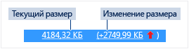

# Использование памяти
[!INCLUDE[vs2017banner](../code-quality/includes/vs2017banner.md)]

С помощью встроенного в отладчик средства диагностики **Использование памяти** вы сможете находить утечки памяти и выявлять неэффективное использование памяти. С помощью средства "Использование памяти" можно сделать один или несколько *снимков* управляемой и собственной памяти в куче. Вы можете делать снимки приложений .NET, приложений на основе машинного кода, а также смешанных программ \(на основе .NET и машинного кода\).  
  
-   Можно проанализировать один мгновенный снимок, чтобы понять относительное влияние типов объектов на использование памяти и найти код в приложении, который использует память неэффективно.  
  
-   Вы также можете сравнить \(diff\) два мгновенных снимка приложения, чтобы найти области в коде, вызывающие рост объема используемой памяти.  
  
 На рисунке ниже показано окно **Средства диагностики** в Visual Studio 2015 с обновлением 1.  
  
   
  
 Хотя с помощью средства **Использование памяти** можно делать снимки памяти в любой момент, для управления выполнением приложения во время анализа ошибок производительности вы можете использовать отладчик Visual Studio. Задание точек останова, пошаговое выполнение, всеобщее прерывание и другие действия отладчика могут помочь вам сосредоточиться на анализе производительности при обращении к наиболее важным ветвям кода. Выполняя эти действия, когда приложение запущено, вы сможете исключить влияние не интересующего вас кода и значительно ускорить диагностику проблем.  
  
 Средство анализа памяти можно также использовать отдельно от отладчика. См. раздел [Анализ использования памяти без отладки](../Topic/Memory%20Usage%20without%20Debugging1.md).  
  
> [!NOTE]
>  **Поддержка пользовательского распределителя**. Профилировщик внутренней памяти работает путем сбора данных событий [ETW](https://msdn.microsoft.com/en-us/library/windows/desktop/bb968803\(v=vs.85\).aspx) выделения памяти, создаваемых во время выполнения.  Распределители в CRT и пакете Windows SDK аннотированы на уровне исходного кода, что позволяет регистрировать их данные выделения.  Если вы создаете собственные распределители, то любые функции, возвращающие указатель на только что выделенную память в куче, можно декорировать с помощью [\_\_declspec](/visual-cpp/cpp/declspec)\(allocator\), как показано в этом примере для myMalloc:  
>   
>  `__declspec(allocator) void* myMalloc(size_t size)`  
  
## Анализ использования памяти с отладчиком  
  
> [!NOTE]
>  Поскольку сбор данных об использовании памяти может повлиять на производительность отладки приложений, основанных на машинном коде, а также смешанных программ, по умолчанию снимки памяти выключены. Чтобы включить снимки для приложений, основанных на машинном коде, или для смешанных программ, начните сеанс отладки \(быстрая клавиша: **F5**\). Когда отобразится окно **Средства диагностики**, перейдите на вкладку "Использование памяти" и выберите команду **Включить снимки**.  
>   
>    
>   
>  Остановите \(сочетание клавиш: **Shift \+ F5**\) и перезапустите отладку.  
  
 Каждый раз, когда вам требуется записать состояние памяти, нажимайте кнопку **Сделать снимок** на сокращенной панели инструментов **Использование памяти**.  
  
   
  
> [!TIP]
>  -   Чтобы получить базовые показатели для сравнения состояния памяти, сделайте снимок в начале сеанса отладки.  
> -   Поскольку из\-за изменений в количестве выделяемой памяти создание профиля памяти для интересующей вас операции может быть затруднительно, разместите точки останова в начале и в конце операции, или пройдите по ней, чтобы попробовать найти точку, в которой количество памяти изменилось.  
  
## Просмотр подробных сведений о снимках памяти  
 В строках сводной таблицы "Использование памяти" приводятся снимки, которые вы сделали во время сеанса отладки.  
  
 Столбцы зависят от режима отладки, выбранного в параметрах проекта:  .NET, отладка машинного кода или смешанная отладка \(для .NET и машинного кода\).  
  
-   В столбцах **Управляемые объекты** и **Собственные выделения** указывается число объектов в .NET и внутренней памяти на момент сохранения снимка.  
  
-   В столбцах  **Размер управляемой кучи** и **Размер собственной кучи** указывается число байтов в .NET и собственных кучах.  
  
-   Если сделать несколько снимков, в каждой строке сводной таблицы будет отображаться разница значений с предыдущим снимком.  
  
       
  
 **Отображение подробного отчета**  
  
-   Чтобы отобразить подробности только для выбранного снимка, щелкните текущее значение.  
  
-   Чтобы отобразить подробности об изменении значения текущего снимка по сравнению с предыдущим, щелкните разницу в значениях.  
  
 Отчет отображается в новом окне.  
  
## Подробные отчеты об использовании памяти  
  
### Отчеты об управляемых типах  
 Щелкните текущее значение в столбце **Управляемые объекты** или **Размер управляемой кучи** в сводной таблице "Использование памяти".  
  
   
  
 В верхней области показываются число и размер типов, зарегистрированных снимком, включая размер всех объектов, на которые ссылаются типы \(**Инклюзивный размер**\).  
  
 В дереве **Пути к корню** в нижней области отображаются объекты, на которые ссылается тип, выбранный в верхней области. Сборщик мусора .NET Framework очищает память для объекта только при освобождении последнего типа, ссылавшегося на него.  
  
 В дереве **Типы, на которые указывает ссылка** отображаются ссылки, активные для выбранного в верхней области типа.  
  
   
  
 Чтобы отобразить экземпляры типа, выбранного в верхней области, щелкните значок .  
  
   
  
 На панели **Экземпляры**, которая открывается в верхней области, отображаются экземпляры выбранного объекта текущего снимка. На панелях "Пути к корню" и "Объекты, на которые указывает ссылка" отображаются объекты, которые ссылаются на выбранный экземпляр, а также типы, на которые ссылается выбранный экземпляр. Если создать снимок после остановки отладчика и навести указатель мыши на ячейку в столбце "Значение", во всплывающей подсказке отобразятся значения объекта.  
  
### Отчеты о собственных типах  
 Щелкните текущее значение в столбце **Собственные выделения** или **Размер собственной кучи** в сводной таблице "Использование памяти", отображаемой в окне **Средства диагностики**.  
  
   
  
 В режиме **Представление типов** отображается число и размер типов, зарегистрированных снимком.  
  
-   Чтобы отобразить информацию об объектах выбранного типа, зарегистрированных снимком, щелкните значок "Экземпляры" \(\) в соответствующей строке.  
  
     В окне **Экземпляры** отображаются все экземпляры выбранного типа. При выборе экземпляра на панели **Стек вызовов выделений** отображается стек вызовов, использованный для создания этого экземпляра.  
  
       
  
-   Чтобы отобразить стек вызовов для выбранного типа, в раскрывающемся меню **Режим просмотра** выберите пункт **Представление стеков**.  
  
       
  
### Отчеты об изменениях  
  
-   В окне **Средства диагностики** щелкните в необходимой ячейке сводной таблицы **Использование памяти** разницу в значениях.  
  
       
  
-   Выберите моментальный снимок в списке **Сравнить с**, в котором отображаются управляемые или собственные отчеты.  
  
       
  
 С помощью отчета об изменениях в основной отчет можно добавить столбцы, помеченные надписью **\(Разн.\)**, в которых будет отображаться разница между двумя выбранными снимками. Отчет об изменениях собственных типов может выглядеть следующим образом:  
  
   
  
## Блоги и видео  
 [Окно отладчика "Средства диагностики" в Visual Studio 2015](http://blogs.msdn.com/b/visualstudioalm/archive/2015/01/16/diagnostic-tools-debugger-window-in-visual-studio-2015.aspx)  
  
 [Блог: применение средства "Использование памяти" при отладке в Visual Studio 2015](http://blogs.msdn.com/b/visualstudioalm/archive/2014/11/13/memory-usage-tool-while-debugging-in-visual-studio-2015.aspx)  
  
 [Блог о Visual C\+\+: диагностика внутренней памяти в предварительной версии Visual Studio 2015](http://blogs.msdn.com/b/vcblog/archive/2014/11/21/native-memory-diagnostics-in-vs2015-preview.aspx)  
  
 [Блог о Visual C\+\+: средства диагностики внутренней памяти для CTP\-версии Visual Studio 2015](http://blogs.msdn.com/b/vcblog/archive/2014/06/04/native-memory-diagnostic-tools-for-visual-studio-14-ctp1.aspx)