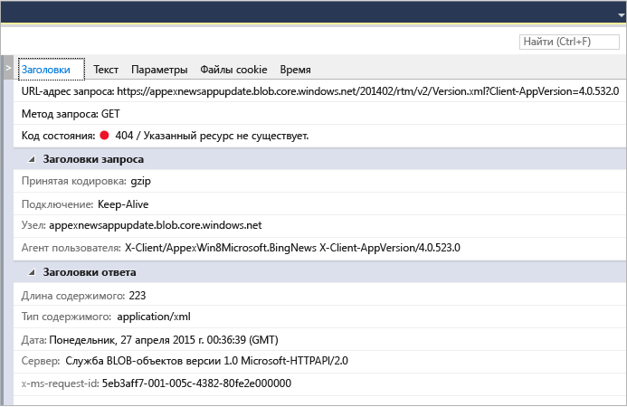

# Анализ использования сети для приложений UWP
Средство диагностики **Сеть** в Visual Studio собирает данные о сетевых операциях, выполняемых с помощью [Windows.Web.Http API](/uwp/api/windows.web.http). Анализ данных может помочь при устранении проблем, например, при доступе и проверке подлинности, при неправильном использовании кэша, при низкой производительности процесса отображения и загрузки.  
  
 Средство «Сеть» поддерживает только приложения универсальной платформы для Windows. Другие платформы в настоящее время не поддерживаются.  
  
> [!NOTE]
>  Более полное описание средства "Сеть" см. в разделе [Введение в средство "Сеть" Visual Studio](http://blogs.msdn.com/b/visualstudio/archive/2015/05/04/introducing-visual-studio-s-network-tool.aspx).  
  
## Сбор данных средством «Сеть»  
 Средство **Сеть** следует запускать с открытым проектом Visual Studio на компьютере Visual Studio.  
  
1.  Откройте проект в Visual Studio.  
  
2.  В меню выберите **Отладка, Профилировщик производительности**. Выберите **Сеть** и нажмите кнопку **Запуск**.  
  
3.  Средство "Сеть" начнет сбор HTTP-трафика вашего приложения.  
  
     При запуске приложения в представлении сводки на левой панели отобразится список записанных HTTP-операций. Выберите элемент в представлении сводки, чтобы получить дополнительные сведения на панели сведений в правой области.  
  
4.  Нажмите кнопку **Остановить**, чтобы закрыть приложение.  
  
 Окно отчета должно выглядеть следующим образом:  
  
   
  
## Анализ данных  
 Вы можете проанализировать записанный HTTP-трафик во время выполнения приложения и даже после того, как приложение будет закрыто, выбрав любую из сетевых операций, отображенных в представлении сводки.  
  
 В представлении сводки **Сеть** отображаются данные для каждой сетевой операции во время работы вашего приложения. Выберите заголовок столбца, чтобы отсортировать список, или выберите типы содержимого для отображения в представлении фильтра **Тип содержимого**.  
  
 Щелкните **Сохранить как HAR**, чтобы создать JSON-файл, который можно использовать в сторонних средствах, например Fiddler.  
  
 В представлениях сведений средства **Сеть** отображаются дополнительные сведения о выбранной в представлении сводки сетевой операции.  
  
   
  
|||  
|-|-|  
|**Заголовки**|Сведения о заголовках запроса события.|  
|**Текст**|Полезные данные запросов и ответов.|  
|**Параметры**|Имена параметров строки запроса и их значения.|  
|**Файлы "cookie"**|Данные cookie в запросе и ответе.|  
|**Время**|Диаграмма этапов при получении выбранных ресурсов.|  
  
 В строке **сводки** средства "Сеть" показано число отображенных сетевых операций, объем переданных данных, время их загрузки и число видимых ошибок (запросы с ответами 4xx или 5xx).  
  
### Советы по анализу  
 Это средство предоставляет информацию об определенных областях, которые могут оказаться полезными при выполнении анализа сети.  
  
1.  Запросы, ответы на которые полностью предоставляются из кэша, отображаются как **(из кэша)** в столбце **Полученные**. Это поможет определить, насколько эффективно вы используете кэш для экономии пропускной способности, потребляемой пользователями, и не кэшируете ли ответы по ошибке и предоставляете пользователям приложения устаревшие данные.  
  
2.  Ответы с ошибками (4xx или 5xx) отображаются в столбце **Результаты** с красным кодом состояния; они также отмечены в строке сводки. Это позволяет легко отслеживать ошибки среди многочисленных других запросов приложения.  
  
3.  Ответ кнопки «Качественная печать» (на вкладке «Текст») поможет проанализировать полезные данные ответов JSON, XML, HTML, CSS, JavaScript и TypeScript и повысит удобочитаемость содержимого.  
  
## См. также  
 [Запуск средств профилирования с отладчиком или без него](../profiling/running-profiling-tools-with-or-without-the-debugger.md)  
 [Блог о Visual Studio. Введение в инспектор сети Visual Studio](http://go.microsoft.com/fwlink/?LinkId=535022)   
 [Channel 9 Video: VS Diagnostics tools – New Network Profiler](http://channel9.msdn.com/Series/ConnectOn-Demand/206) (Видео на Channel 9: средства диагностики VS — новый профилировщик сети)  
 [Профилирование в Visual Studio](../profiling/index.md)  
 [Обзор возможностей профилирования](../profiling/profiling-feature-tour.md)