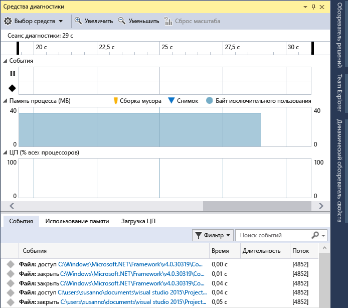

# Запуск средств профилирования с отладчиком или без него

Visual Studio предлагает различные средства для измерения производительности и профилирования. Некоторые средства, такие как **Загрузка ЦП** и **Использование памяти**, можно запустить с отладчиком или без него, а также для конфигураций сборок отладки или выпуска. Средства **Профилировщик производительности**, такие как **Временная шкала приложения**, могут выполняться для сборок отладки или выпуска. Встроенные в отладчик средства, такие как окно **Средства диагностики** и вкладка **События**, выполняются только во время сеансов отладки.

>[!NOTE]
>Вы можете использовать средства оценки производительности, не относящиеся к отладчику, в Windows 7 и более поздних версий. Для выполнения интегрированных в отладчик средств профилирования требуется Windows 8 или более поздней версии.

Не связанный с отладчиком **Профилировщик производительности** и встроенные в отладчик **Средства диагностики** предоставляют разные сведения и интерфейсы. Интегрированные в отладчик средства показывают точки останова и значения переменных. Не связанные с отладчиком средства дают результаты, которые ближе к взаимодействию с конечным пользователем.

Чтобы определить, какие средства и результаты для этого нужно использовать, примите во внимание следующее:

- Внешние проблемы производительности, например проблемы файлового ввода-вывода или скорости реагирования сети, не слишком различаются в средствах, связанных и не связанных с отладчиком.
- Для проблем, вызванных вызовами, которые приводят к высокой загрузке ЦП, возможны значительные различия по производительности между сборками отладки и выпуска. Проверьте, существует ли проблема в сборках выпуска.
- Если проблема возникает только в сборках отладки, скорее всего, запускать средства, не связанные с отладчиком, не требуется. При проблемах со сборками выпуска определите, поспособствуют ли средства отладчика дальнейшему изучению проблемы.
- В сборках выпуска присутствуют такие оптимизации, как встраивание вызовов функций и констант, удаление путей кода, способы хранения переменных, которые не могут использоваться отладчиком. Показатели производительности в средствах, встроенных в отладчик, менее точны, так как в сборках отладки нет подобных оптимизаций.
- Отладчик сам изменяет время производительности по мере того, как он выполняет необходимые операции отладки (например, перехват исключений и события загрузки модулей).
- Показатели производительности сборки выпуска в средствах **Профилировщик производительности** являются наиболее точными и достоверными. Результаты средств, встроенных в отладчик, наиболее удобны для сравнения с другими измерениями, связанными с отладкой.

##   Сбор данных профилирования во время отладки

Если запустить отладку в Visual Studio, выбрав **Отладка** > **Начать отладку** или нажав клавишу **F5**, по умолчанию отображается окно **Средства диагностики**. Чтобы открыть его вручную, выберите **Отладка** > **Окна** > **Отображение средств диагностики**. Окно **Средства диагностики** содержит сведения о событиях, памяти процессов и загрузке ЦП.

- Используйте значок **Параметры** на панели инструментов, чтобы указать, требуется ли просматривать показатели **Использование памяти**, **Анализ пользовательского интерфейса** и **Загрузка ЦП**.

- Выберите **Параметры** в раскрывающемся списке **Параметры**, чтобы открыть **страницы свойств средств диагностики** с дополнительными параметрами.

- В Visual Studio Enterprise можно включить или отключить IntelliTrace, выбрав **Сервис** > **Параметры** > **IntelliTrace** в Visual Studio.

Сеанс диагностики закончится при остановке отладки.

Вы также можете просмотреть **Средства диагностики** для целевых объектов удаленной отладки. Для удаленной отладки и профилирования на удаленном целевом устройстве должен быть установлен и запущен удаленный отладчик Visual Studio.
- Для проектов классических приложений для удаленной отладки и профилирования см. раздел [Удаленная отладка](../debugger/remote-debugging.md).
- Для приложений UWP для удаленной отладки и профилирования см. раздел [Отладка приложений UWP на удаленных компьютерах](../debugger/run-windows-store-apps-on-a-remote-machine.md).

### Вкладка "События"

Во время сеанса на отладке вкладка **События** окна **Средства диагностики** отображаются возникающие диагностические события. Префиксы категории **Breakpoint**, **File** и другие позволяют быстро просмотреть список в поисках нужной категории или пропустить категории, которые вас не интересуют.

Используйте раскрывающийся список **Фильтр** для фильтрации событий в представлении, выбирая определенные категории событий или отменяя их выбор.

Чтобы найти определенную строку в списке событий, используйте поле поиска. Здесь показаны результаты поиска строки "name", которой соответствуют четыре события:

Дополнительные сведения см. в разделе [Поиск и фильтрация на вкладке "События" окна "Средства диагностики"](https://devblogs.microsoft.com/devops/searching-and-filtering-the-events-tab-of-the-diagnostic-tools-window/).

## Сбор данных профилирования без отладки

Для сбора данных о производительности без отладки можно запустить средства **Профилировщик производительности**. Для запуска некоторых средств профилирования требуются права администратора. Вы можете открыть Visual Studio от имени администратора или запустить средства от имени администратора при запуске диагностического сеанса.

1. Открыв проект в Visual Studio, выберите **Отладка** > **Профилировщик производительности** или нажмите клавиши **ALT**+**F2**.

1. На странице запуска средств диагностики выберите режим запуска одного средства или нескольких средств. Отображаются только инструменты, подходящие типу проекта и языку программирования. Выберите **Показать все инструменты**, чтобы просмотреть средства, отключенные для этого диагностического сеанса. Так могут выглядеть выбранные варианты для приложения C# UWP:

   

1. Для запуска диагностического сеанса нажмите кнопку **Запуск**.

   Во время выполнения сеанса некоторые средства отображают графики по данным в режиме реального времени на странице средств диагностики.

    

1. Для завершения диагностического сеанса выберите команду **Остановить сбор**.

   Проанализированные данные отображаются на странице **Отчет**.

Вы также можете сохранить отчеты и открыть их из списка **Последние сеансы** на странице запуска средств диагностики.

### Отчет о профилировании
 

|||
|-|-|
||На временной шкале отображаются продолжительность сеанса профилирования, события активации жизненного цикла приложения и пользовательские отметки.|
||Отчет можно ограничить частью временной шкалы, перетащив синие панели, чтобы выбрать нужную область временной шкалы.|
||Каждое средство диагностики отображает один или несколько основных графов. Если диагностический сеанс содержит нескольких средств, будут отображаться все основные графы.|
||Индивидуальные графы каждого средства можно сворачивать и разворачивать.|
||Если данные охватывают несколько средств, сведения собираются на вкладках.|
||В нижней половине отчета показано одно или несколько подробных представлений для каждого средства. Вы можете отфильтровать представление, выбрав области временной шкалы.|

## Запуск диагностических сеансов в установленных или запущенных приложениях

 Кроме запуска приложения из проекта Visual Studio, диагностические сеансы также можно запускать на альтернативных целевых объектах. Например, может потребоваться диагностика проблем производительности для приложения, установленного из Магазина приложений Windows.

 

 Можно запускать приложения, которые уже установлены, или подключать средства диагностики к приложениям и процессам, которые уже работают. При выборе режима **выполняемого приложения** или **установленного приложения** вы выбираете приложение в списке приложений, найденных в указанном целевом объекте развертывания. Этот целевой объект может быть локальным или удаленным компьютером.

 

## См. также

Ниже приведены записи в блогах и статьи MSDN от команды разработчиков средств диагностики:
- [Журнал MSDN Magazine. Анализ производительности во время отладки в Visual Studio 2015](https://msdn.microsoft.com/magazine/dn973013.aspx)

- [Журнал MSDN Magazine. Использование IntelliTrace для ускоренной диагностики проблем](https://msdn.microsoft.com/magazine/dn973014.aspx)

- [Запись блога. Диагностика утечек памяти обработчика событий с помощью средства "Использование памяти" в Visual Studio 2015](https://devblogs.microsoft.com/devops/diagnosing-event-handler-leaks-with-the-memory-usage-tool-in-visual-studio-2015/)

- [Видео. Отладка с ведением журнала с помощью IntelliTrace в Microsoft Visual Studio Ultimate 2015](https://channel9.msdn.com/Events/Ignite/2015/BRK3716)

- [Видео. Отладка проблем производительности с помощью Visual Studio 2015](https://channel9.msdn.com/Events/Build/2015/3-731)

- [PerfTips. Информация о производительности прямо при отладке с помощью Visual Studio](https://devblogs.microsoft.com/devops/perftips-performance-information-at-a-glance-while-debugging-with-visual-studio/)

- [Окно отладчика "Средства диагностики" в Visual Studio 2015](https://devblogs.microsoft.com/devops/diagnostic-tools-debugger-window-in-visual-studio-2015/)

- [IntelliTrace в Visual Studio Enterprise 2015](https://devblogs.microsoft.com/devops/intellitrace-in-visual-studio-ultimate-2015/)
