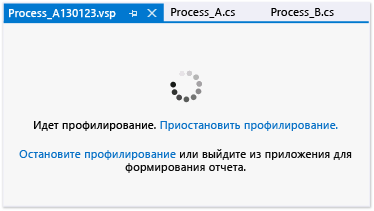

# Настройка общих параметров сеанса производительности

Вы можете настроить соглашения об именовании данных профилирования и методов сбора для сеанса производительности Средств профилирования Visual Studio на странице **Общие** в диалоговом окне свойств сеанса. Чтобы открыть это диалоговое окно из **обозревателя производительности**, щелкните правой кнопкой мыши сеанс анализа производительности и выберите пункт **Свойства**.

## Выбор способов сбора данных

Задать основной метод сбора можно путем выбора одного из вариантов в разделе **Набор профилирования**. Параметры описаны в следующей таблице.

|Параметр|Статья|
|-|-|
|**Выборка**. Метод выборки предполагает сбор сведений профилирования через определенные интервалы времени. Этот метод целесообразно использовать для нахождения проблем, относящихся к использованию процессора. Он также предлагается для выполнения большинства операций анализа производительности.|- [Использование метода выборки для сбора статистики производительности](../profiling/collecting-performance-statistics-by-using-sampling.md)|
|**Инструментирование**. Метод инструментирования предполагает внедрение в копию модуля кода профилирования, который записывает каждое событие входа, выхода и вызова функции для функций модуля во время сеанса профилирования. Этот метод удобен для сбора подробных временных данных для заданного фрагмента кода и для оценки влияния операций ввода/вывода на производительность приложения.|- [Сбор подробных сведений о времени с помощью инструментирования](../profiling/collecting-detailed-timing-data-by-using-instrumentation.md)|
|**Параллелизм**. Метод параллелизма предполагает сбор данных для каждого события, которое блокирует выполнение кода, например, когда поток ожидает открытия доступа к заблокированному ресурсу приложения. Этот метод удобен для анализа многопоточных приложений.|- [Сбор данных о параллелизме потоков и процессов](../profiling/collecting-thread-and-process-concurrency-data.md)|

 Данные памяти .NET можно собирать с использованием методов выборки или инструментирования. Тип данных можно выбрать в области **Набор профилирования памяти .NET**.

|Параметр|Статья|
|-|-|
|**Собирать сведения о выделении объектов .NET**. По умолчанию включаются сведения о количестве и размерах выделенных объектов. Установите или снимите этот флажок, чтобы включить или отключить сбор сведений об использовании памяти .NET. |- [Сбор данных о выделении памяти для объектов .NET и времени их жизни](../profiling/collecting-dotnet-memory-allocation-and-lifetime-data.md)|
|**Также собирать сведения о времени жизни объектов .NET**. Установите этот флажок, чтобы включить сведения о поколениях сборки мусора, которые использовались для удаления объектов памяти.|- [Сбор данных о выделении памяти для объектов .NET и времени их жизни](../profiling/collecting-dotnet-memory-allocation-and-lifetime-data.md) |

 Страница сеанса профилирования отобразится при запуске профилирования приложения; на ней можно приостановить, возобновить и остановить профилирование.

 

## Настройка параметров файла данных профилирования

|Параметр|Статья|
|-|-|
|**Отчет**. По умолчанию файлу данных профилирования (VSP) присваивается имя профилируемого приложения, и он располагается в папке проекта или решения. К именам файлов данных также добавляется строка с датой и номер с приращением, чтобы предотвратить создание одинаковых имен. Эти параметры можно изменить.|- [Практическое руководство. Настройка параметров имени файла с данными о производительности](../profiling/how-to-set-performance-data-file-name-options.md)|
