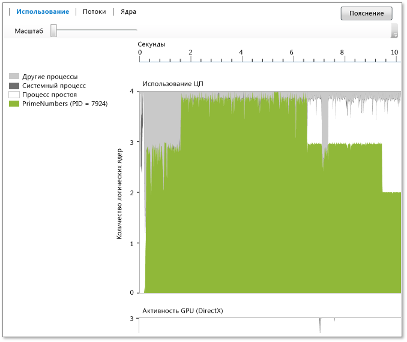

# Представление использования
[!INCLUDE[vs2017banner](../code-quality/includes/vs2017banner.md)]

**Представлении использования** отображает информацию о ЦП, GPU и других системных ресурсов, используемых текущим процессом.  Оно показывает среднюю интенсивность использования ядра во времени анализируемым процессом, системным процессом и другими процессами, запущенными в системе.  Оно не показывает, какое из ядер активно в заданный момент времени.  Например, если два ядра были загружены на 50 процентов производительности в течение заданного периода времени, график показывает, что было утилизировано одно логическое ядро.  Представление создается путем разделения времени профилирования на короткие временные сегменты.  Для каждого сегмента на графике показано среднее количество потоков процесса, выполняемых на логическом ядре в течение этого интервала.  
  
   
  
 Граф показывает время \(на оси x\) и среднее значение логических ядер, которые выполняются целевым процессом, простаивающим процессом и системным процессом. \(Простаивающий процесс показывает простаивающие ядра.  Системный процесс является процессом Windows, который может выполнять работу от имени других процессов.\) Для остальных процессов, которые запущены в системе, определяется использование остальных ядер.  
  
 Количество логических ядер показано на оси y.  Windows рассматривает одновременную поддержку многопоточности как логические ядра\(например, технологию Hyper\-Threading\).  Следовательно, система с четырехъядерным процессором, поддерживая два потока на ядро, будет выглядеть как восьмиядерная.  Это также применимо к представлению ядер.  Для получения дополнительной информации см. [Представление "Ядра"](../profiling/cores-view.md).  
  
 Диаграмма активности GPU показывает число обработчиков DirectX во времени.  Обработчик используется, если он обрабатывает пакет прямого доступа к памяти.  На диаграмме не показан определенный обработчик DirectX \(например, обработчик 3D, обработчик видео и др.\).  
  
## Назначение  
 Рекомендуется, чтобы представление использования ЦП было представлено в качестве начальной точки анализа производительности при использовании визуализатора параллелизма.  Поскольку он обеспечивает общие сведения о степени параллелизма в приложении в течение времени, его можно использовать, чтобы быстро определить области, для которых необходима настройка или параллелизация производительности.  
  
 Если вы заинтересованы в настройке производительности, вы можете попробовать обнаружить поведение, расходящееся с ожиданиями.  Также можно обнаружить наличие и причину областей малой загрузки логических ядер ЦП.  Можно также обнаружить шаблоны использования между ЦП и GPU.  
  
 Если вам нужно параллелизовать приложение, возможно выполнить поиск областей исполнения, связанных с ЦП, или областей, где не используется ЦП.  
  
 Области, связанные с ЦП, выделены зеленым цветом.  Граф отображает одно используемое ядро, если приложение является последовательным.  
  
 Области, где процессор не загружен, выделены серым цветом.  Таким образом могут быть представлены области, где приложение простаивает или выполняет блокирующие запросы ввода\-вывода, что предоставляет возможность для использования параллелизма путем наложения на другие операции, выполняемые ЦП.  
  
 Если найдется интересующее поведения, можно увеличить масштаб данной области, выбрав его.  После увеличения можно перейти к представлению "Потоки" или "Ядра", для более тщательного анализа.  
  
 Если использовать GPU с помощью C\+\+ AMP или DirectX, можно задать число используемых обработчиков GPU или области, где GPU бездействует.  
  
## Масштабирование  
 Для увеличения диаграммы использования ЦП или диаграммы активности GPU, выберите раздел или воспользуйтесь ползунком масштаба над графиком.  Масштаб сохраняется при переходе к другим представлениям.  Для уменьшения масштаба воспользуйтесь ползунком масштаба.  Также можно увеличить с помощью Ctrl\+scroll.  
  
## См. также  
 [Визуализатор параллелизма](../profiling/concurrency-visualizer.md)   
 [Представление "Ядра"](../profiling/cores-view.md)