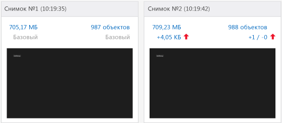
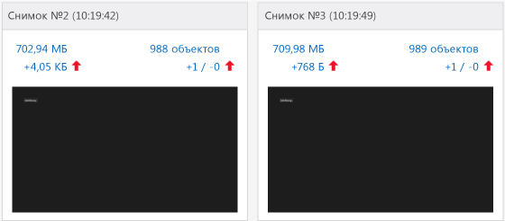
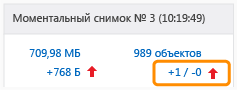
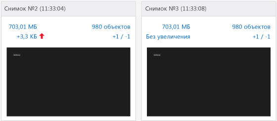

# <a name="walkthrough-find-a-memory-leak-javascript"></a>Пошаговое руководство. Поиск утечек памяти (JavaScript)
  
  
 В этом пошаговом руководстве описан процесс обнаружения и исправления простой проблемы с памятью с помощью анализатора памяти JavaScript. Анализатор памяти JavaScript доступен в Visual Studio для приложений из Магазина Windows, созданных для Windows с использованием JavaScript. В этом сценарии создается приложение, которое неверно сохраняет элементы DOM в памяти, вместо того чтобы избавляться от них с той же скоростью, с которой они создаются.  
  
 Несмотря на то, что причины утечки памяти в этом приложении достаточно специфичны, показанные здесь шаги демонстрируют рабочий процесс, который обыкновенно позволяет эффективно локализовать объекты, вызывающие утечки памяти.  
  
### <a name="running-the-javascript-memory-analyzer-test-app"></a>Запуск тестового приложения анализатора памяти JavaScript  
  
1.  В Visual Studio последовательно щелкните **Файл**, **Создать**, **Проект**.  
  
2.  Щелкните **JavaScript** в левой области, выберите **Windows**, **Windows 8**, а затем выберите **Универсальные приложения** или **Приложения Windows Phone**.  
  
    > [!IMPORTANT]
    >  Результаты использования памяти, приведенные в этом разделе, проверены в приложении Windows 8.  
  
3.  Выберите шаблон проекта **Пустое приложение** в средней области.  
  
4.  В поле **Имя** укажите имя, например `JS_Mem_Tester`, а затем нажмите кнопку **ОК**.  
  
5.  В **обозревателе решений** откройте файл default.html и вставьте следующий код между тегами \<body>:  
  
    ```html  
    <div class="wrapper">  
        <div id="item"></div>  
        <button class="memleak" style="display: block" >Leak Memory</button>  
    </div>  
    ```  
  
    > [!IMPORTANT]
    >  Если используется шаблон универсального приложения, необходимо обновить код HTML и CSS в проектах .Windows и .WindowsPhone.  
  
6.  Откройте файл default.css и добавьте следующий код CSS.  
  
    ```css  
    .memleak {  
        position: absolute; top: 100px; left: 100px;  
    }  
    ```  
  
7.  Откройте файл default.js и замените весь код следующим кодом.  
  
    ```javascript  
    (function () {  
        "use strict";  
  
        var app = WinJS.Application;  
        var activation = Windows.ApplicationModel.Activation;  
  
        var wrapper;  
        var elem;  
  
        app.onactivated = function (args) {  
            if (args.detail.kind === activation.ActivationKind.launch) {  
                if (args.detail.previousExecutionState !== activation.ApplicationExecutionState.terminated) {  
                } else {  
                }  
                args.setPromise(WinJS.UI.processAll());  
  
                elem = document.getElementById("item");  
                wrapper = document.querySelector(".wrapper");  
                var btn = document.querySelector(".memleak");  
                btn.addEventListener("click", btnHandler);  
                run();  
            }  
        };  
  
        app.oncheckpoint = function (args) {  
        };  
  
        app.start();  
  
        function run() {  
            initialize();  
            load();  
        }  
  
        function initialize() {  
  
            if (wrapper != null) {  
                elem.removeNode(true);  
            }  
        }  
  
        function load() {  
  
            var newDiv = document.createElement("div");  
  
            newDiv.style.zIndex = "-1";  
            newDiv.id = "item";  
  
            wrapper.appendChild(newDiv);  
        }  
  
        function btnHandler(args) {  
            run();  
        }  
  
    })();  
    ```  
  
8.  Нажмите клавишу F5, чтобы начать отладку. Убедитесь, что кнопка **Утечка памяти** отображается на странице.  
  
9. Вернитесь в Visual Studio (ALT+Tab) и нажмите клавиши SHIFT+F5, чтобы остановить отладку.  
  
     Теперь, когда вы проверили работоспособность приложения, можно проверить использование памяти.  
  
### <a name="analyzing-the-memory-usage"></a>Анализ использования памяти  
  
1.  На панели инструментов **Отладка** в списке **Начать отладку** выберите объект отладки для обновленного проекта: либо один из эмуляторов Windows Phone, либо **Симулятор**.  
  
    > [!TIP]
    >  Для приложения для Магазина Windows в этом перечне можно также выбрать **Локальный компьютер** или **Удаленный компьютер** . Однако преимущество использования эмулятора или имитатора заключается в том, что можно разместить его рядом с Visual Studio и легко переключаться между запущенным приложением и анализатором памяти JavaScript. Дополнительные сведения см. в разделах [Запуск приложений из Visual Studio](../debugger/run-store-apps-from-visual-studio.md) и [Запуск приложений для Магазина Windows на удаленном компьютере](../debugger/run-windows-store-apps-on-a-remote-machine.md).  
  
2.  В меню **Отладка** выберите пункт **Профилировщик производительности...**  
  
3.  В меню **Доступные инструменты**выберите **Память JavaScript**и щелкните **Запуск**.  
  
     В этом руководстве анализатор памяти будет прикреплен к запускаемому проекту. Сведения о других вариантах, например о подключении анализатора памяти к установленному приложению, см. в разделе [Память JavaScript](../profiling/javascript-memory.md).  
  
     При запуске анализатора памяти может появиться сообщение системы контроля учетных записей с запросом разрешения на запуск файла VsEtwCollector.exe. Выберите **Да**.  
  
4.  Четыре раза подряд выберите кнопку **Утечки памяти** .  
  
     Когда кнопка выбирается, код обработки события в файле default.js выполняет работу, которая становится причиной утечки памяти. Это будет использоваться в диагностических целях.  
  
    > [!TIP]
    >  Повторение сценария, который необходимо проверить на предмет утечки памяти, помогает отфильтровать не представляющую интерес информацию, например объекты, добавляемые в кучу во время инициализации приложения или при загрузке страницы.  
  
5.  Из запущенного приложения переключитесь в Visual Studio (ALT+TAB).  
  
     Анализатор памяти JavaScript отображает сведения на новой вкладке в Visual Studio.  
  
     В графе памяти в сводном представлении отображается использование памяти процессом с течением времени. В этом представлении также доступны такие команды как **Создать снимок кучи**. Снимок содержит подробные сведения об использовании памяти в определенный момент времени. Дополнительные сведения см. в разделе [Память JavaScript](../profiling/javascript-memory.md).  
  
6.  Щелкните **Создать снимок кучи**.  
  
7.  Перейдите к приложению и выберите команду **Утечки памяти**.  
  
8.  Переключитесь к Visual Studio и снова выберите **Создать снимок кучи** .  
  
     На этом рисунке показан базовый снимок (№1) и снимок №2.  
  
       
  
    > [!NOTE]
    >  Эмулятор Windows Phone не отображает снимок экрана приложения во время выполнения снимка.  
  
9. Перейдите к приложению и снова нажмите кнопку **Утечки памяти** .  
  
10. Переключитесь к Visual Studio и выберите команду **Создать снимок кучи** третий раз.  
  
    > [!TIP]
    >  Третий снимок позволяет отфильтровать изменения между базовым снимком и вторым снимком, которые не связаны с утечками памяти. Например, это могут быть ожидаемые изменения, такие как обновление верхнего и нижнего колонтитулов на странице, которые обуславливают некоторые изменения в использовании памяти, но вряд ли связаны с утечками.  
  
     На этом рисунке показан снимок №2 и снимок №3.  
  
       
  
11. В Visual Studio выберите **Остановить** , чтобы остановить профилирование.  
  
12. В Visual Studio сравните моментальные снимки. Снимок 2 содержит следующую информацию:  
  
    -   Размер кучи (отображается красной стрелкой вверх слева) увеличился на несколько КБ по сравнению со снимком №1.  
  
        > [!IMPORTANT]
        >  Точные значения использования памяти для размера кучи зависят от объекта отладки.  
  
    -   Число объектов в куче (отображается красной стрелкой вверх справа) увеличилось по сравнению со снимком №1. Один объект был добавлен (+1), ни одного объекта не удалено (-0).  
  
     Снимок 3 содержит следующую информацию:  
  
    -   Размер кучи увеличился снова на несколько сотен байт по сравнению со снимком №2.  
  
    -   Количество объектов в куче снова увеличилось по сравнению со снимком №2. Один объект был добавлен (+1), ни одного объекта не удалено (-0).  
  
13. На снимке №3 выберите текст ссылки справа, который отображает значение +1/-0 рядом с красной стрелкой вверх.  
  
       
  
     Откроется дифференциальное представление объектов кучи под названием **Снимок №3 - Снимок №2**, а представление "Тип" будет отображаться по умолчанию. По умолчанию отображается список объектов, которые были добавлены в кучу между снимками №2 и №3.  
  
14. В фильтре **Область** выберите **Объекты, оставшиеся из снимка №2**.  
  
15. Откройте объект HTMLDivElement вверху дерева объектов, как показано здесь.  
  
       
  
     Это представление отображает полезные сведения об утечке памяти, например:  
  
    -   В этом представлении показан элемент DIV с идентификатором `item`, а полный размер для объекта составляет несколько сотен байт (точное значение будет другим).  
  
    -   Этот объект остался из снимка №2 и представляет потенциальную утечку памяти.  
  
     На этом этапе поможет знание приложения. При нажатии кнопки **Утечки памяти** должен быть удален элемент DIV и добавлен какой-либо элемент. Очевидно, что код работает неправильно (т. е. возникает утечка памяти). В следующем разделе показано, как решить эту проблему.  
  
    > [!TIP]
    >  Иногда для идентификации объекта достаточно определить расположение объекта относительно объекта `Global` . Для этого откройте контекстное меню идентификатора и щелкните **Показать в корневом представлении**.  
  
##  <a name="a-namefixingmemorya-fixing-the-memory-issue"></a><a name="FixingMemory"></a> Исправления проблемы памяти  
  
1.  Используя данные, показанные профилировщиком, вы проверяете код, который отвечает за удаление элементов DOM, с помощью идентификатора "элемент". Это происходит в функции `initialize()`.  
  
    ```javascript  
    function initialize() {  
  
        if (wrapper != null) {  
            elem.removeNode(true);  
        }  
    }  
    ```  
  
     `elem.removeNode(true)`, возможно, работает неверно. Вы изучаете, как код кэширует элемент DOM, и обнаруживаете проблему; ссылка на кэшированный элемент не обновляется.  
  
2.  В файле default.js, добавьте следующую строку кода в функцию загрузки непосредственно перед вызовом `appendChild`.  
  
    ```javascript  
    elem = newDiv;  
    ```  
  
     Этот код обновляет ссылку на кэшированный элемент, чтобы элемент правильно удалялся при нажатии кнопки **Утечки памяти** . Полный код для функции загрузки теперь выглядит следующим образом:  
  
    ```javascript  
    function load() {  
  
        wrapper = document.querySelector(".wrapper");  
  
        var newDiv = document.createElement("div");  
  
        newDiv.style.zIndex = "-1";  
        newDiv.id = "item";  
        elem = newDiv;  
  
        wrapper.appendChild(newDiv);  
    }  
    ```  
  
3.  В меню **Отладка** выберите пункт **Производительность и диагностика**.  
  
4.  В меню **Доступные инструменты**выберите **Память JavaScript**и щелкните **Запуск**.  
  
5.  Выполните ту же процедуру, что и ранее, чтобы сделать три снимка. Инструкции кратко перечислены ниже.  
  
    1.  В приложении четыре раза подряд выберите кнопку **Утечки памяти** .  
  
    2.  Переключитесь к Visual Studio и выберите команду **Создать снимок кучи** для базового снимка.  
  
    3.  В приложении нажмите кнопку **Утечки памяти** .  
  
    4.  Переключитесь к Visual Studio и выберите команду **Создать снимок кучи** для второго снимка.  
  
    5.  В приложении нажмите кнопку **Утечки памяти** .  
  
    6.  Переключитесь к Visual Studio и выберите команду **Создать снимок кучи** для третьего снимка.  
  
     Снимок №3 теперь отображает размер кучи как **Без увеличения** по сравнению со снимком №2, а количество объектов равно +1 / -1, что означает, что один объект добавлен и один объект удален. Это желательное поведение.  
  
     На следующем рисунке показан снимок №2 и снимок №3.  
  
       
  
## <a name="see-also"></a>См. также  
 [Память JavaScript](../profiling/javascript-memory.md)
