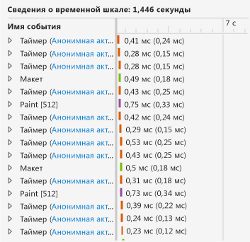
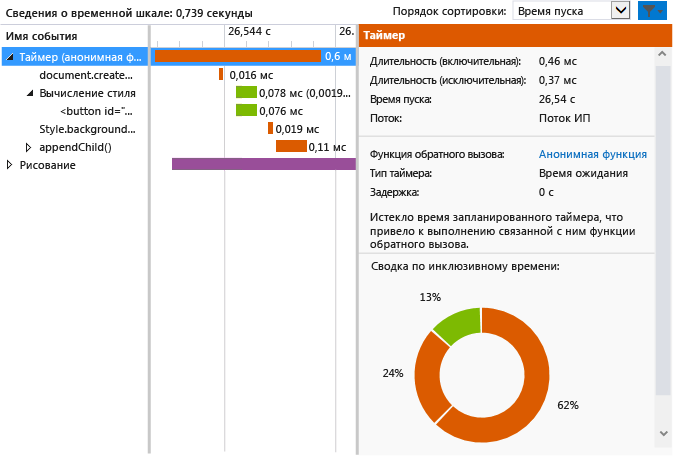

# <a name="walkthrough-improving-ui-responsiveness-html"></a>Пошаговое руководство. Повышение скорости отклика пользовательского интерфейса (HTML)
В этом пошаговом руководстве описывается процесс определения и исправления проблем производительности с помощью [профилировщика скорости реагирования пользовательского интерфейса HTML](../profiling/html-ui-responsiveness.md). Профилировщик доступен в Visual Studio для универсальных приложений Windows и приложений для Магазина Windows, созданных с использованием JavaScript. В этом сценарии создается приложение тестирования производительности, которое обновляет элементы DOM слишком часто, а профилировщик используется для определения и решения этой проблемы.  
  
### <a name="creating-and-running-the-performance-test-app"></a>Создание и запуск приложения тестирования производительности  
  
1.  В Visual Studio создайте проект универсального приложения Windows на JavaScript. (Выберите **Файл > Создать > Проект**.) Щелкните **JavaScript** в левой области, выберите **Windows**, **Windows 10**, а затем выберите **Универсальные приложения** или **Windows Phone**.  
  
2.  > [!IMPORTANT]
    >  Результаты диагностики, приведенные в этом разделе, проверены в приложении Windows 8.  
  
3.  Выберите один из пустых шаблонов проектов в средней области, например **Пустое приложение**.  
  
4.  В поле **Имя** укажите имя, например `JS_Perf_Tester`, а затем нажмите кнопку **ОК**.  
  
5.  В **обозревателе решений** откройте файл default.html и вставьте следующий код между тегами \<body>:  
  
    ```html  
    <div class="wrapper">  
        <button id="content">Waiting for values</button>  
    </div>  
    ```  
  
6.  Откройте файл default.css и добавьте следующий код CSS.  
  
    ```css  
    #content {  
        margin-left: 100px;  
        margin-top: 100px;  
    }  
    ```  
  
7.  Откройте файл default.js и замените весь код следующим кодом.  
  
    ```javascript  
    (function () {  
        "use strict";  
  
        var app = WinJS.Application;  
        var activation = Windows.ApplicationModel.Activation;  
  
        var content;  
        var wrapper;  
  
        app.onactivated = function (args) {  
            if (args.detail.kind === activation.ActivationKind.launch) {  
                if (args.detail.previousExecutionState !== activation.ApplicationExecutionState.terminated) {  
  
                    content = document.getElementById("content");  
                    wrapper = document.querySelector(".wrapper");  
  
                    content.addEventListener("click", handler);  
  
                } else {  
                }  
  
                args.setPromise(WinJS.UI.processAll());  
            }  
        };  
  
        app.oncheckpoint = function (args) {  
        };  
  
        app.start();  
  
        var idx = 0;  
        var count = 0;  
        var max = 5000;  
        var text = ["what", "is", "the", "Matrix?"];  
        var color = ["red", "crimson", "maroon", "purple"];  
  
        function increment() {  
  
            setTimeout(function () {  
  
                idx++;  
                count++;  
  
                if (idx > 3) { idx = 0; }  
                if (count < max) { increment(); }  
  
            }, 1000);  
        }  
  
        function setValues() {  
  
            content = document.getElementById("content");  
            content.removeNode(true);  
  
            var newNode = document.createElement("button");  
            newNode.id = "content";  
            newNode.textContent = text[idx];  
            //newNode.textContent = getData();  
            newNode.style.backgroundColor = color[idx];  
            //newNode.style.animationName = "move";  
            //count++;  
  
            wrapper.appendChild(newNode);  
  
        }  
  
        function update() {  
  
            setTimeout(function () {  
  
                setValues();  
                if (count < max) { update(); }  
            });  
        }  
  
        function handler(args) {  
  
            content.textContent = "eenie";  
            increment();  
            update();  
        }  
  
    })();  
  
    ```  
  
8.  Нажмите клавишу F5, чтобы начать отладку. Убедитесь в том, что кнопка **Ожидание значений** отображается на странице.  
  
9. Нажмите кнопку **Ожидание значений** и убедитесь в том, что текст и цвет кнопки обновляются примерно один раз в секунду. Это сделано намеренно.  
  
10. Вернитесь в Visual Studio (ALT+Tab) и нажмите клавиши SHIFT+F5, чтобы остановить отладку.  
  
     Теперь, когда проверено, что приложение работает, можно изучить его производительность с помощью профилировщика.  
  
### <a name="analyzing-performance-data"></a>Анализ данных производительности  
  
1.  На панели инструментов **Отладка** выберите в списке **Начать отладку** один из эмуляторов Windows Phone или **симулятор**.  
  
2.  В меню **Отладка** выберите пункт **Производительность и диагностика**.  
  
3.  В меню **Доступные инструменты** выберите **Скорость реагирования польз. интерфейса HTML** и нажмите **Запуск**.  
  
     В этом руководстве профилировщик будет прикреплен к запускаемому проекту. Сведения о других вариантах, например о прикреплении профилировщика к установленному приложению, см. в разделе [Скорость реагирования пользовательского интерфейса HTML](../profiling/html-ui-responsiveness.md).  
  
     При запуске профилировщика может появиться сообщение системы контроля учетных записей с запросом разрешения на запуск файла VsEtwCollector.exe. Выберите **Да**.  
  
4.  В запущенном приложении нажмите кнопку **Ожидание значений** и подождите около 10 секунд. Убедитесь, что текст и цвет кнопки обновляются примерно один раз в секунду.  
  
5.  Из запущенного приложения переключитесь в Visual Studio (ALT+TAB).  
  
6.  Выберите **Остановка сбора**.  
  
     Профилировщик отображает сведения на новой вкладке в Visual Studio. Просматривая данные об использовании ЦП и пропускной способности визуализации (кадров/с), можно легко определить несколько тенденций.  
  
    -   Загрузка ЦП значительно возрастает примерно через 3 секунды (при нажатии кнопки **Ожидание значений**) и с этого момента демонстрирует однозначную модель событий (последовательное сочетание событий скрипта, задания стиля и отрисовки).  
  
    -   На пропускную способность визуализации это не влияет, и на протяжении всего процесса частота кадров в секунду остается равной 60 (т.е. пропущенные кадры отсутствуют).  
  
     Рассмотрим типичный раздел графика утилизации ЦП, чтобы узнать, что приложение делает в период высокой активности.  
  
7.  Выделите часть в середине графика использования ЦП продолжительностью от 1 до 2 секунд (щелкните и перетащите или воспользуйтесь клавишей tab и клавишами со стрелками). На следующем рисунке показан график использования ЦП после выделения. Эта незатененная область представляет собой выделение.  
  
       
  
8.  Выберите **Увеличить**.  
  
     График изменится, отображая выбранный период более подробно. На следующем рисунке показан график использования ЦП после увеличения. (Специфические данные могут различаться, но общая модель будет явной.)  
  
       
  
     Сведения временной шкалы в нижней области отображаются в качестве примера сведений для выбранного периода.  
  
       
  
     События в разделе сведений о временной шкале соответствуют видимым тенденциям на графике использования ЦП: множество событий происходит за короткий период времени. Представление сведений о шкале времени показывает, что это события `Timer`, `Layout` и `Paint`.  
  
9. Откройте контекстное меню (щелкните правой кнопкой мыши) одного из событий `Timer` в нижней области и выберите **Фильтр для события**. На следующей иллюстрации приводится пример подробных сведений для одного из событий `Timer` в этом тестовом приложении.  
  
       
  
     Из этих данных можно сделать несколько фактических выводов. Например:  
  
    -   Каждое событие `Timer` обозначения цветом в целях идентификации в качестве события скрипта, включает вызов `document.createElement`, за которым следует вычисление стиля и вызов `style.backgroundColor` и `appendChild()`.  
  
    -   В выбранном коротком временном диапазоне (от 1 до 2 секунд) происходит огромное количество событий `Timer`, `Layout` и `Paint`. События `Timer` происходят гораздо чаще, чем одно обновление в секунду, которое отображается после запуска приложения и нажатия кнопки **Ожидание значений**.  
  
10. Чтобы выяснить причины этого, щелкните ссылку на анонимную функцию для одного из событий `Timer` в нижней левой области. Следующая функция будет открыта в файле default.js.  
  
    ```javascript  
    function update() {  
  
        setTimeout(function () {  
  
            setValues();  
            if (count < max) { update(); }  
        });  
    }  
    ```  
  
     Такая рекурсивная функция настраивает цикл, который вызывает функцию `setValues()`, обновляющую кнопку в ИП. Изучив различные события таймера в профилировщике, вы обнаружите, что все они или большинство из них проистекают из данного кода, который выполняется слишком часто, следовательно, весьма вероятно, что причина проблемы кроется именно здесь.  
  
### <a name="fixing-the-performance-issue"></a>Исправление проблемы производительности  
  
1.  Замените функцию `update()` следующим кодом.  
  
    ```javascript  
    function update() {  
  
        setTimeout(function () {  
  
            setValues();  
            if (count < max) { update(); }  
        }, 1000 );  
    }  
    ```  
  
     Исправленная версия кода включает задержку продолжительностью 1 000 миллисекунд, которой не было в предыдущей версии кода, в результате чего используется значение задержки по умолчанию. Судя по данным профилировщика, значение по умолчанию равно нулю миллисекунд, что вызвало слишком частый запуск функции `setValues()`.  
  
2.  Запустите профилировщик отклика пользовательского интерфейса HTML еще раз и проверьте график использования ЦП. Обнаружится, что чрезмерные события удалены и использование ЦП опустилось практически до нуля. Готово!  
  
## <a name="see-also"></a>См. также  
 [Скорость реагирования пользовательского интерфейса HTML](../profiling/html-ui-responsiveness.md)
