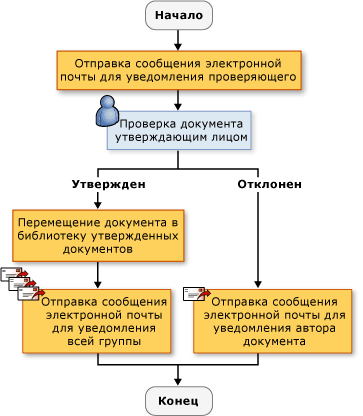
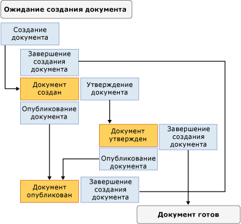

# Создание решений рабочих процессов SharePoint

[!INCLUDE[vsprvs](../sharepoint/includes/vsprvs-md.md)] предоставляет средства, помогающие создавать пользовательские рабочие процессы, которые управляют жизненным циклом документов и элементов списков на веб-сайте SharePoint. Предоставляется конструктор, набор элементов управления действием и ссылки на необходимые сборки. В [!INCLUDE[vsprvs](../sharepoint/includes/vsprvs-md.md)] также есть **мастер настройки SharePoint**, помогающий создавать и настраивать рабочие процессы.

Дополнительные сведения о SharePoint см. на странице, посвященной [продуктам и технологиям Microsoft SharePoint](/sharepoint/dev/).

## Рабочие процессы в SharePoint
 При добавлении рабочего процесса в библиотеку или список SharePoint ко всем элементам в этой библиотеке или списке применяется бизнес-процесс. Рабочий процесс описывает действия, которые система или пользователь должны выполнить с каждым элементом. Например, это может быть отправка элемента на редактирование и последующую проверку. Такие *действия* — это стандартные блоки, из которых состоит рабочий процесс.

 Вы можете создавать рабочие процессы SharePoint в [!INCLUDE[vsprvs](../sharepoint/includes/vsprvs-md.md)] и развертывать их на веб-сайте SharePoint. После развертывания рабочего процесса в SharePoint он связывается с библиотекой или списком. Затем он может запускаться автоматически, процессом или вручную пользователем. Дополнительные сведения о принципах действия рабочих процессов см. в статье [Разработка рабочих процессов SharePoint с помощью Visual Studio](/sharepoint/dev/general-development/develop-sharepoint-workflows-using-visual-studio).

## Создание пользовательских рабочих процессов SharePoint
 В [!INCLUDE[vsprvs](../sharepoint/includes/vsprvs-md.md)] доступны два проекта рабочих процессов SharePoint: **Последовательный рабочий процесс** и **Рабочий процесс конечного автомата**.

 *Последовательный рабочий процесс* представляет ряд шагов. Шаги выполняются один за другим, пока не будет завершено последнее действие. Последовательные рабочие процессы всегда имеют строгую очередность выполнения. Так как они могут принимать внешние события и включать в себя параллельные логические потоки, точный порядок выполнения может варьироваться. На приведенной ниже иллюстрации показан пример последовательного рабочего процесса.

 

 *Рабочий процесс конечного автомата* представляет набор состояний, переходов и действий. Действия в рабочем процессе конечного автомата выполняются асинхронно. Это означает, что они не обязательно выполняются одно за другим, а активируются другими действиями и состояниями. Одно состояние задается как начальное, и в зависимости от события происходит переход в другое состояние. Конечный автомат может иметь конечное состояние, которое определяет завершение рабочего процесса. На приведенной ниже схеме показан пример рабочего процесса конечного автомата.

 

 Дополнительные сведения о типах рабочих процессов см. в статье [Типы рабочих процессов](/previous-versions/office/developer/sharepoint-2010/ms468447(v=office.14)).

### Использование мастера
 При создании проекта рабочего процесса SharePoint в [!INCLUDE[vsprvs](../sharepoint/includes/vsprvs-md.md)]необходимо сначала указать его параметры в **мастере настройки SharePoint**. Мастер использует эти параметры для создания проекта в **обозревателе решений**. Этот проект содержит файл кода, несколько файлов, служащих для развертывания рабочего процесса, и ссылки на сборки, необходимые для создания пользовательского рабочего процесса SharePoint.

 После создания рабочего процесса его свойства можно изменить в окне "Свойства". Хотя большинство свойств рабочего процесса можно изменить непосредственно в окне "Свойства", для некоторых требуется нажать кнопку с многоточием (). При ее нажатии снова запускается **мастер настройки SharePoint**. Изменив значения свойств, нажмите кнопку **Готово**, чтобы подтвердить их.

> [!NOTE]
> Свойство **Тип рабочего процесса** доступно только для чтения. Изменить его невозможно. Чтобы изменить тип рабочего процесса, необходимо создать новый рабочий процесс.

## Разработка рабочего процесса SharePoint
 После определения всех шагов бизнес-процесса используйте конструктор рабочих процессов [!INCLUDE[vsprvs](../sharepoint/includes/vsprvs-md.md)] для разработки рабочего процесса SharePoint. Чтобы открыть конструктор, дважды щелкните файл Workflow1.cs или Workflow1.vb в **обозревателе решений** или откройте контекстное меню для любого из этих файлов и выберите пункт **Открыть**.

### Действия
 Чтобы разработать рабочий процесс, добавьте действия с **панели элементов** в *расписание рабочего процесса* в конструкторе. Расписание рабочего процесса содержит последовательность действий в том порядке, в котором они должны выполняться.

 Существует два вида действий:

- *Простые действия* выполняют одну задачу, например "задержка на 1 день" или "запуск веб-службы".

- *Составные действия* содержат другие действия. Например, условное действие может иметь две ветви.

  Оба типа действий доступны на **панели элементов**.

  Действия могут иметь свойства, методы и события. Используйте окно **Свойства** для задания свойств действия.

  Можно также создать пользовательское действие. Дополнительные сведения см. в разделе [Пошаговое руководство: Создание пользовательского действия рабочего процесса сайта](../sharepoint/walkthrough-create-a-custom-site-workflow-activity.md).

  Действия упорядочены на **панели элементов** по следующим вкладкам:

- **Рабочий процесс SharePoint**

- **Рабочий процесс Windows версии 3.0**

- **Рабочий процесс Windows версии 3.5**

  SharePoint поддерживает не все основные действия рабочего процесса. Дополнительные сведения см. в статье [Общие сведения о действиях рабочих процессов для Windows SharePoint Services](/previous-versions/office/developer/sharepoint-2010/ms446847(v=office.14)).

#### Действия рабочего процесса SharePoint
 На вкладке **Рабочий процесс SharePoint** приводятся специальные действия, предназначенные для использования в [!INCLUDE[wss_14_long](../sharepoint/includes/wss-14-long-md.md)]. Эти действия упрощают и ускоряют разработку рабочих процессов для управления жизненным циклом документов. Дополнительные сведения о действиях, перечисленных на вкладке **Рабочий процесс SharePoint**, см. в статье [Общие сведения о действиях рабочих процессов для Windows SharePoint Services](/previous-versions/office/developer/sharepoint-2010/ms446847(v=office.14)).

#### Действия рабочего процесса Windows
 На вкладках **Рабочий процесс Windows** приводятся действия, предоставляемые [!INCLUDE[TLA#tla_workflow](../sharepoint/includes/tlasharptla-workflow-md.md)]. Эти действия можно использовать для создания расписаний рабочих процессов для приложений Windows любого типа.

 Дополнительные сведения о действиях, перечисленных на вкладке **Рабочие процессы Windows**, см. в статье [Действия Windows Workflow Foundation](/previous-versions/dotnet/netframework-3.5/ms733615(v=vs.90)). Дополнительные сведения о Windows Workflow Foundation см. в статье [Общие сведения о Windows Workflow Foundation](/previous-versions/dotnet/netframework-3.5/ms734631(v=vs.90)).

### Работа с действиями в конструкторе
 Расписание рабочего процесса может содержать сочетание действий рабочего процесса Windows и действий рабочего процесса SharePoint.

 В конструкторе отображаются визуальные подсказки, помогающие правильно расположить и настроить действия. При перетаскивании или копировании действия из расписания рабочего процесса конструктор показывает зеленые значки плюс (+), которые показывают верные расположения для этого действия в рабочем процессе. Действие нельзя разместить в месте, где оно будет недопустимым. Например, действие отправки не может быть первым в ветви ожидания передачи данных. Дополнительные сведения см. в [Центре разработки конструктора SharePoint](https://developer.microsoft.com/office/docs).

## Сбор сведений во время рабочего процесса
 На определенных этапах рабочего процесса может требоваться собирать сведения от пользователей. Данные можно собирать с помощью форм или свойств элементов.

### Формы
 Формы подобны диалоговым окнам, которые содержат вопросы и дают пользователям возможность ответить на них.

 В рабочем процессе можно использовать четыре типа форм:

- Взаимосвязь

- Запуск

- Изменение

- Задача

  В [!INCLUDE[vsprvs](../sharepoint/includes/vsprvs-md.md)] есть шаблоны элементов для форм связывания и запуска. Примером *формы связывания* может служить форма, которая позволяет администратору, устанавливающему рабочий процесс, ввести параметры, связанные с рабочим процессом, например предельную сумму расходов для рабочего процесса отчета по затратам. Пример *формы запуска*: пользователь рабочего процесса отчета по затратам имеет возможность ввести сумму затрат рабочего процесса. Дополнительные сведения об этих типах форм см. в статье [Шаблоны проектов и элементов проектов SharePoint](../sharepoint/sharepoint-project-and-project-item-templates.md).

### Свойства элементов
 Сведения от пользователей можно также собирать с помощью свойств элемента в библиотеке или списке SharePoint. Основной файл кода (Workflow1.cs или Workflow1.vb) объявляет экземпляр класса Microsoft.SharePoint.Workflow.SPWorkflowActivationProperties.WorkflowProperties с именем `workflowProperties`. Используйте объект `workflowProperties` для доступа к свойствам библиотеки или списка в коде. Пример см. в разделе [Пошаговое руководство. Создание и отладка решения рабочих процессов SharePoint](../sharepoint/walkthrough-creating-and-debugging-a-sharepoint-workflow-solution.md).

## Отладка шаблона рабочего процесса SharePoint
 Проект рабочего процесса SharePoint можно отлаживать так же, как другие веб-проекты [!INCLUDE[vsprvs](../sharepoint/includes/vsprvs-md.md)]. При запуске отладчика [!INCLUDE[vsprvs](../sharepoint/includes/vsprvs-md.md)] [!INCLUDE[vsprvs](../sharepoint/includes/vsprvs-md.md)] использует параметры, указанные в **мастере настройки SharePoint**, чтобы открыть соответствующий веб-сайт SharePoint и автоматически связать шаблон рабочего процесса с соответствующей библиотекой или списком. [!INCLUDE[vsprvs](../sharepoint/includes/vsprvs-md.md)] также присоединяет отладчик [!INCLUDE[vsprvs](../sharepoint/includes/vsprvs-md.md)] к процессу [!INCLUDE[wss_14_long](../sharepoint/includes/wss-14-long-md.md)] с именем *w3wp.exe*.

 Чтобы протестировать рабочий процесс, его необходимо запустить вручную. Дополнительные сведения см. в разделе "Отладка рабочих процессов" статьи [Отладка решений SharePoint](../sharepoint/debugging-sharepoint-solutions.md). Дополнительные сведения об отладке веб-приложений [!INCLUDE[vsprvs](../sharepoint/includes/vsprvs-md.md)] см. в статье, посвященной [отладке веб-приложений и скриптов](../debugger/how-to-enable-debugging-for-aspnet-applications.md).

## Развертывание шаблона рабочего процесса SharePoint
 Проекты рабочих процессов SharePoint в [!INCLUDE[vsprvs](../sharepoint/includes/vsprvs-md.md)] развертываются так же, как и другие проекты SharePoint в [!INCLUDE[vsprvs](../sharepoint/includes/vsprvs-md.md)]. Дополнительные сведения см. в статье [Упаковка и развертывание решений SharePoint](../sharepoint/packaging-and-deploying-sharepoint-solutions.md).

## Импорт рабочих процессов с возможностью глобального повторного использования
 SharePoint Designer позволяет создавать рабочие процессы с возможностью повторного использования не только в пределах сайта, но и *глобального повторного использования*, то есть использования на любом сайте SharePoint. Импорт проекта рабочего процесса с возможностью повторного использования в [!INCLUDE[vsprvs](../sharepoint/includes/vsprvs-md.md)] в настоящее время не поддерживает импорт рабочих процессов с возможностью глобального повторного использования. Однако вы можете преобразовать рабочий процесс с возможностью глобального повторного использования в повторно используемый рабочий процесс с помощью SharePoint Designer или импортировать рабочий процесс как непреобразованный декларативный рабочий процесс. Дополнительные сведения см. в статье [Импорт элементов с существующего сайта SharePoint](../sharepoint/importing-items-from-an-existing-sharepoint-site.md).

## См. также

|Заголовок|Описание|
|-----------|-----------------|
|[Пошаговое руководство: Создание и отладка решения рабочих процессов SharePoint](../sharepoint/walkthrough-creating-and-debugging-a-sharepoint-workflow-solution.md)|Содержит пошаговые инструкции по созданию и отладке простого рабочего процесса [!INCLUDE[vsprvs](../sharepoint/includes/vsprvs-md.md)].|
|[Пошаговое руководство: Создание рабочего процесса с формами связывания и запуска](../sharepoint/walkthrough-creating-a-workflow-with-association-and-initiation-forms.md)|Содержит пошаговые инструкции по созданию полнофункционального рабочего процесса [!INCLUDE[vsprvs](../sharepoint/includes/vsprvs-md.md)] с формами связывания и запуска.|
|[Пошаговое руководство: Добавление страницы приложения в рабочий процесс](../sharepoint/walkthrough-add-an-application-page-to-a-workflow.md)|Продолжает [пошаговое руководство по созданию рабочего процесса с формами связывания и запуска](../sharepoint/walkthrough-creating-a-workflow-with-association-and-initiation-forms.md): добавляется дополнительная страница приложения *.aspx*, которая сообщает данные, введенные в течение рабочего процесса.|
|[Пошаговое руководство: Создание пользовательского действия рабочего процесса сайта](../sharepoint/walkthrough-create-a-custom-site-workflow-activity.md)|Демонстрируется выполнение двух основных задач: создания рабочего процесса на уровне сайта и создания пользовательского действия рабочего процесса.|
|[Пошаговое руководство: Импорт рабочего процесса SharePoint Designer с возможностью повторного использования в Visual Studio](../sharepoint/walkthrough-import-a-sharepoint-designer-reusable-workflow-into-visual-studio.md)|Демонстрируется импорт декларативных рабочих процессов с возможностью повторного использования, созданный в SharePoint Designer 2010, в проект SharePoint в [!INCLUDE[vsprvs](../sharepoint/includes/vsprvs-md.md)].|

## См. также раздел

- [Разработка решений SharePoint](../sharepoint/developing-sharepoint-solutions.md)
- [Сборка и отладка решений SharePoint](../sharepoint/building-and-debugging-sharepoint-solutions.md)
- [Создание страниц приложений для SharePoint](../sharepoint/creating-application-pages-for-sharepoint.md)