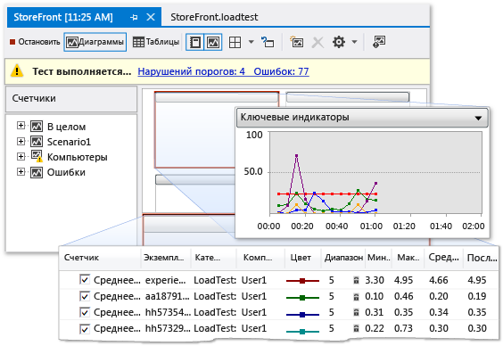

# Профилирование производительности приложений SharePoint
  Если медленно выполняемых приложений SharePoint или неэффективно, можно использовать функции профилирования в Visual Studio для определения неисправного кода и других элементов. С помощью нагрузочного тестирования функции, можно определить, как приложение SharePoint выполняет под нагрузкой, например, если многие пользователи доступ к приложению одновременно. Выполняя веб-тесты производительности, можно оценить, как приложение выполняет в Интернете. С помощью закодированных тестов пользовательского интерфейса, можно проверить, ли все приложение SharePoint, включая ее пользовательский интерфейс функционирует правильно. При совместном использовании этих тестов, они могут помочь выявить проблемы производительности, перед развертыванием приложения.  
  
## Обзор средств профилирования  
 Профилирование относится к процессу наблюдения и записи производительности поведение приложения во время его выполнения. При профилировании приложения, позволяет выявлять проблемы, например узких мест, неэффективный код и проблемы выделения памяти, заставляющие приложениям работать медленно или используют слишком много памяти. Например профилирования можно использовать для идентификации точек беспроводного доступа в коде, которые являются сегментами кода, часто называются и снижает общую производительность приложения. После определения точки беспроводного доступа, часто можно оптимизировать или их устранения.  
  
 Можно использовать несколько средств профилирования в интегрированной среде разработки (IDE) для идентификации и обнаружения такого рода проблем с производительностью. Эти средства работают одинаково для проектов SharePoint, как и для других типов проектов Visual Studio. Мастер производительности средств профилирования описываются шаги создания сеанса анализа производительности, использующий тесты, которые можно задать. Сеанс анализа производительности — это набор данных конфигурации, который используется для сбора данных о производительности из приложения, и результаты в один или несколько запусков профилирования. Сеансы анализа производительности, хранятся в папке проекта, и вы можете просматривать их в **Обозреватель производительности**. Дополнительные сведения см. в статье [Общие сведения о методах сбора данных по производительности](/visualstudio/profiling/understanding-performance-collection-methods).  
  
 После создания и запуска анализа профиль для приложения, в отчете содержится информация о его производительности. Этот отчет может включать элементы, как диаграмма использования ЦП по времени, стек вызова функции иерархических или дерево вызовов. Точное содержимое отчета может изменяться в зависимости от типа теста, который выполняется, например выборки или инструментирования. Дополнительные сведения см. в разделе [Обзор отчетов средств профилирования](http://go.microsoft.com/fwlink/?LinkId=224689).  
  
## Процесс сеанса производительности  
 Чтобы выполнить профилирование приложения, сначала с помощью мастера производительности средств профилирования для создания сеанса анализа производительности. В строке меню выберите **анализ**, **запустить мастер производительности**. Как вы завершите работу мастера, то введите необходимые сведения для сеанса анализа производительности, такие как метод профиля, который вы хотите и приложение, которое требуется профилировать. Дополнительные сведения см. в разделе [как: профилирование веб-сайта или веб-приложения с помощью мастера производительности](http://go.microsoft.com/fwlink/?LinkId=224692). В качестве альтернативы можно использовать параметры командной строки для установки и запуска сеанса анализа производительности. Дополнительные сведения см. в разделе [профилирование средства из командной строки с помощью](http://go.microsoft.com/fwlink/?LinkId=224703). Если вы хотите вручную настроить каждый аспект сеанс анализа производительности, см. раздел [как: вручную создавать сеансы анализа производительности с помощью средств профилирования](http://go.microsoft.com/fwlink/?LinkId=224691). Также можно создать сеанс анализа производительности из модульного теста, в **результаты теста** окна, открыв контекстное меню модульного теста и выбрав **создания сеанса анализа производительности**.  
  
 После настройки сеанса анализа производительности Конфигурация сеанса сохраняется, сервер настроен для предоставления данных профилирования и запускает приложение. По мере использования приложения данные производительности записываются в файл журнала. Сеансы анализа производительности, перечислены в **Обозреватель производительности** под **цели** папки. После завершения сеанса анализа производительности, отчет отображается в **отчеты** папки в **Обозреватель производительности**. Чтобы отобразить отчет, откройте его в **Обозреватель производительности**. Чтобы просмотреть или настроить свойства сеанса анализа производительности, откройте ее контекстное меню в **Обозреватель производительности**, а затем выберите **свойства**. Дополнительные сведения о конкретных свойств сеанса анализа производительности см. в разделе [Настройка сеансов анализа производительности средств профилирования](http://go.microsoft.com/fwlink/?LinkId=224694). Сведения об интерпретации результатов сеанса анализа производительности см. в разделе [анализ данных средств профилирования](http://go.microsoft.com/fwlink/?LinkId=224704).  
  
## Нагрузочное тестирование  
 Можно анализировать производительность нагрузки приложений путем создания нагрузочных тестов и веб-тестов производительности в Visual Studio Ultimate. При создании нагрузочного теста в Visual Studio, можно задать сочетание факторов, вызывается сценарий, чтобы протестировать приложение на. Эти факторы включают шаблона нагрузки, модели тестового набора, тестовый набор, смешанный сетевой профиль и набор браузеров. Сценариев нагрузочного тестирования можно включать модульные тесты и веб-тесты производительности.  
  
 Рисунок 1: Нагрузочное тестирование приводит пример  
  
   
  
 Веб-тесты производительности имитировать как конечный пользователь может взаимодействовать с приложением SharePoint. Веб-тесты производительности создаются путем записи HTTP-запросов в сеансе браузера или с помощью **веб-тестов производительности**. Веб-запросов, отображаются в **редактора веб-тестов производительности** после завершения сеанса браузера. Можно отлаживать результаты в **просмотра результатов тестов веб-производительности**. Можно также вручную создавать веб-тестов производительности с помощью **редактора веб-тестов производительности**.  
  
## Тестирование пользовательских интерфейсов  
 Закодированные тесты пользовательского интерфейса автоматически проверки работы приложения SharePoint через его пользовательский интерфейс (UI). Эти тесты обеспечивают покрытие элементов управления пользовательского интерфейса, такие как кнопки и меню, чтобы убедиться в их правильной. Этот тип тестирования особенно полезен, если проверки или другую логику выполняется в пользовательском Интерфейсе, например на веб-странице. Можно также использовать закодированные тесты пользовательского интерфейса для автоматизации ручных тестов. При создании закодированных тестов пользовательского интерфейса для приложений SharePoint таким же образом, как создать тесты для других типов приложений. Дополнительные сведения см. в разделе [тестирование приложений SharePoint 2010 с помощью закодированных тестов пользовательского интерфейса](/visualstudio/test/testing-sharepoint-2010-applications-with-coded-ui-tests).  
  
## См. также  
  
|Заголовок|Описание:|  
|-----------|-----------------|  
|[Пошаговое руководство. Профилирование приложения SharePoint](../sharepoint/walkthrough-profiling-a-sharepoint-application.md)|Показано, как анализ профиль выборки в приложении SharePoint.|  
|[Проверка производительности приложения перед выпуском](https://www.visualstudio.com/docs/test/performance-testing/run-performance-tests-app-before-release)|Описывает, как можно создавать нагрузочные тесты, которые помогают нагрузочного тестирования приложения SharePoint.|  
|[Модульное тестирование кода](/visualstudio/test/unit-test-your-code)|Описывает способ поиска логических ошибок в коде с помощью модульных тестов.|  
|[Тестирование приложений SharePoint 2010 с помощью закодированных тестов пользовательского интерфейса](/visualstudio/test/testing-sharepoint-2010-applications-with-coded-ui-tests)|Описание способов тестирования пользовательского интерфейса приложений SharePoint.|  
  
## См. также  
 [Построение и отладка решений SharePoint](../sharepoint/building-and-debugging-sharepoint-solutions.md)   
 [Тестирование приложения](/devops-test-docs/test/test-apps-early-and-often)   
 [Улучшение качества кода](/visualstudio/test/improve-code-quality)  
  
  