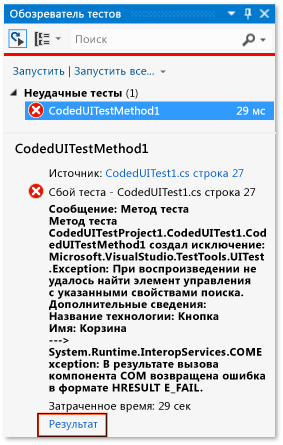
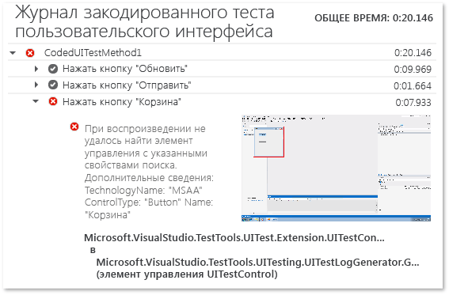

# <a name="analyzing-coded-ui-tests-using-coded-ui-test-logs"></a>Анализ закодированных тестов пользовательского интерфейса с помощью журналов закодированных тестов пользовательского интерфейса

Журналы закодированных тестов ИП фильтруют и записывают важную информацию о запуске тестов. Журналы представлены в формате, который облегчает устранение проблем.

[!INCLUDE [coded-ui-test-deprecation](includes/coded-ui-test-deprecation.md)]

## <a name="step-1-enable-logging"></a>Шаг 1. Включение ведения журнала

В зависимости от сценария используйте один из указанных ниже методов, чтобы включить ведение журнала.

- Если файл *App.config* отсутствует в проекте теста, сделайте следующее:

   1. Определите, какой процесс *QTAgent\*.exe* запускается при выполнении теста. Для этого можно воспользоваться вкладкой **Подробности** в **диспетчере задач** Windows.

   2. Откройте соответствующий файл *.config* из папки *% ProgramFiles (x86) %\Microsoft Visual Studio\\\<версии >\\\<выпуск > \Common7\IDE*. Например, если запускается процесс *QTAgent_40.exe*, откройте файл *QTAgent_40.exe.config*.

   2. Задайте требуемый уровень журнала в значении **EqtTraceLevel**.

      ```xml
      <!-- You must use integral values for "value".
           Use 0 for off, 1 for error, 2 for warn, 3 for info, and 4 for verbose. -->
      <add name="EqtTraceLevel" value="4" />
      ```

   3. Сохраните файл.

- Если файл *App.config* присутствует в проекте теста, сделайте следующее:

  - Откройте файл *App.config* проекта и добавьте следующий код в узле конфигурации:

    ```xml
    <system.diagnostics>
      <switches>
        <add name="EqtTraceLevel" value="4" />
      </switches>
    </system.diagnostics>`
    ```

- Включение ведения журнала в коде теста:

   ```csharp
   Microsoft.VisualStudio.TestTools.UITesting.PlaybackSettings.LoggerOverrideState = HtmlLoggerState.AllActionSnapshot;
   ```

## <a name="step-2-run-your-coded-ui-test-and-view-the-log"></a>Шаг 2. Запуск кодированного теста пользовательского интерфейса и просмотр журнала

При запуске закодированного теста пользовательского интерфейса после внесения изменений в файл *QTAgent\*.exe.config* вы увидите выходную ссылку в результатах **обозревателя тестов**. Если выбран подробный уровень трассировки **verbose**, файлы журнала создаются не только при ошибке теста, но и при успешном выполнении теста.

1. В меню **Тест** выберите **Окна** и щелкните **Обозреватель тестов**.

2. В меню **Построение** выберите **Построить решение**.

3. В **обозревателе тестов** выберите закодированный тест пользовательского интерфейса, который нужно выполнить, откройте его контекстное меню и выберите пункт **Выполнить выбранные тесты**.

     Автоматизированные тесты будут выполнены, и будет предоставлена информация об их успешном выполнении или выполнении с ошибками.

    > [!TIP]
    > Для просмотра **обозревателя тестов** выберите **Тест** > **Окна**, а затем пункт **Обозреватель тестов**.

4. В результатах **обозревателя тестов** щелкните ссылку **Выходные данные**.

     

     Здесь отображаются результаты теста, содержащие ссылку на журнал действий.

     

5. Выберите ссылку *UITestActionLog.html*.

     Журнал появится в браузере.

     

## <a name="see-also"></a>См. также раздел

- [Использование автоматизации пользовательского интерфейса для тестирования кода](../test/use-ui-automation-to-test-your-code.md)
- [Практическое руководство. Запуск тестов из Microsoft Visual Studio](https://msdn.microsoft.com/Library/1a1207a9-2a33-4a1e-a1e3-ddf0181b1046)
