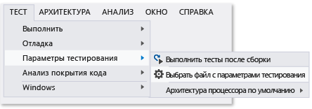

# <a name="configure-unit-tests-by-using-a-runsettings-file"></a>Настройка модульных тестов с помощью файла *.runsettings*

Модульные тесты в Visual Studio можно настроить с помощью файла *.runsettings*. Например, можно изменить версию платформы .NET Framework, на которой выполняются тесты, каталог для результатов теста и данные, собранные во время тестового запуска.

> [!NOTE]
> Имя файла не имеет значения, если вы используете расширение ".runsettings".

Если вам не требуется специальная конфигурация, файл *.runsettings* не нужен. Чаще всего файл *.runsettings* используют для настройки [анализа объема протестированного кода](../test/customizing-code-coverage-analysis.md).

## <a name="customize-tests"></a>Настройка тестов

1. Добавьте XML-файл в решение Visual Studio и задайте для него имя *test.runsettings*.

1. Замените содержимое файла XML в следующем примере и при необходимости настройте его.

1. В меню **Тест** щелкните **Параметры тестирования** > **Выбрать файл параметров теста**.

Можно создать несколько файлов *.runsettings* в решении и включить или отключить их в разное время с помощью меню **Параметры тестирования**.



## <a name="example-runsettings-file"></a>Пример файла *.runsettings*

Ниже приводится пример стандартного файла *.runsettings*. Каждый элемент файла необязателен, поскольку каждое значение имеет значение по умолчанию.

```xml
<?xml version="1.0" encoding="utf-8"?>
<RunSettings>
  <!-- Configurations that affect the Test Framework -->
  <RunConfiguration>
    <MaxCpuCount>1</MaxCpuCount>
    <!-- Path relative to solution directory -->
    <ResultsDirectory>.\TestResults</ResultsDirectory>

    <!-- x86 or x64
      - You can also change it from menu Test, Test Settings, Default Processor Architecture -->
    <TargetPlatform>x86</TargetPlatform>

    <!-- Framework35 | [Framework40] | Framework45 -->
    <TargetFrameworkVersion>Framework40</TargetFrameworkVersion>

    <!-- Path to Test Adapters -->
    <TestAdaptersPaths>%SystemDrive%\Temp\foo;%SystemDrive%\Temp\bar</TestAdaptersPaths>
  
     <!--TestSessionTimeout is only available with Visual Studio 2017 version 15.5 and higher -->
     <!-- Specify timeout in milliseconds. A valid value should be greater than 0 -->
     <TestSessionTimeout>10000</TestSessionTimeout>
  </RunConfiguration>

  <!-- Configurations for data collectors -->
  <DataCollectionRunSettings>
    <DataCollectors>
      <DataCollector friendlyName="Code Coverage" uri="datacollector://Microsoft/CodeCoverage/2.0" assemblyQualifiedName="Microsoft.VisualStudio.Coverage.DynamicCoverageDataCollector, Microsoft.VisualStudio.TraceCollector, Version=11.0.0.0, Culture=neutral, PublicKeyToken=b03f5f7f11d50a3a">
        <Configuration>
          <CodeCoverage>
            <ModulePaths>
              <Exclude>
                <ModulePath>.*CPPUnitTestFramework.*</ModulePath>
              </Exclude>
            </ModulePaths>

            <!-- We recommend you do not change the following values: -->
            <UseVerifiableInstrumentation>True</UseVerifiableInstrumentation>
            <AllowLowIntegrityProcesses>True</AllowLowIntegrityProcesses>
            <CollectFromChildProcesses>True</CollectFromChildProcesses>
            <CollectAspDotNet>False</CollectAspDotNet>

          </CodeCoverage>
        </Configuration>
      </DataCollector>

      <!--Video data collector is only available with Visual Studio 2017 version 15.5 and higher -->
      <DataCollector uri="datacollector://microsoft/VideoRecorder/1.0" assemblyQualifiedName="Microsoft.VisualStudio.TestTools.DataCollection.VideoRecorder.VideoRecorderDataCollector, Microsoft.VisualStudio.TestTools.DataCollection.VideoRecorder, Version=15.0.0.0, Culture=neutral, PublicKeyToken=b03f5f7f11d50a3a" friendlyName="Screen and Voice Recorder">
      </DataCollector>

    </DataCollectors>
  </DataCollectionRunSettings>

  <!-- Parameters used by tests at runtime -->
  <TestRunParameters>
    <Parameter name="webAppUrl" value="http://localhost" />
    <Parameter name="webAppUserName" value="Admin" />
    <Parameter name="webAppPassword" value="Password" />
  </TestRunParameters>

  <!-- Adapter Specific sections -->

  <!-- MSTest adapter -->
  <MSTest>
    <MapInconclusiveToFailed>True</MapInconclusiveToFailed>
    <CaptureTraceOutput>false</CaptureTraceOutput>
    <DeleteDeploymentDirectoryAfterTestRunIsComplete>False</DeleteDeploymentDirectoryAfterTestRunIsComplete>
    <DeploymentEnabled>False</DeploymentEnabled>
    <AssemblyResolution>
      <Directory Path="D:\myfolder\bin\" includeSubDirectories="false"/>
    </AssemblyResolution>
  </MSTest>

</RunSettings>
```

Файл *.runsettings* также используется для настройки [анализа объема протестированного кода](../test/customizing-code-coverage-analysis.md).

Далее в этой статье описывается содержимое файла.

## <a name="edit-your-runsettings-file"></a>Правка файла *.runsettings*

В последующих разделах подробно описаны элементы файла *.runsettings*.

### <a name="test-run-configuration"></a>Конфигурация тестового запуска

|Узел|По умолчанию|Значения|
|----------|-------------|------------|
|`ResultsDirectory`||Каталог для сохранения результатов тестов.|
|`TargetFrameworkVersion`|Framework40|Framework35, Framework40, Framework45<br /><br /> Этот параметр указывает, какая версия платформы модульных тестов используется для поиска и выполнения тестов. Эта версия может отличаться от версии платформы .NET, указанной в свойствах сборки проекта модульного теста.|
|`TargetPlatform`|x86|x86, x64|
|`TreatTestAdapterErrorsAsWarnings`|False|false, true|
|`TestAdaptersPaths`||Один или несколько путей к каталогу, где находятся адаптеры TestAdapters|
|`MaxCpuCount`|1|Этот параметр управляет степенью параллелизма при выполнении тестов при запуске модульных тестов, используя доступные ядра на компьютере. Модуль выполнения тестов запускается как отдельный процесс на каждом доступном ядре и дает каждому ядру контейнер с запускаемыми тестами. Контейнером может быть сборка, библиотека DLL или соответствующий артефакт. Тестовый контейнер — это модуль, работающий по расписанию. В каждом контейнере тесты запускаются в соответствии с платформой тестов. Если контейнеров много, то после выполнения тестов в контейнере процессам предоставляются следующие доступные контейнеры.<br /><br /> MaxCpuCount может быть:<br /><br /> n, где 1 < = n < = числа ядер — будет запущено до n процессов.<br /><br /> n, где n = любое другое значение — число запускаемых процессов будет соответствовать числу доступных ядер на компьютере.|
|`TestSessionTimeout`||Дает пользователям возможность завершить сеанс тестирования, если его длительность превышает заданный промежуток времени. Задав время ожидания, вы обеспечите надлежащее использование ресурсов и ограничите выполнение сеансов тестирования определенным периодом. Этот параметр доступен в **Visual Studio 2017 версии 15.5** и более поздних версий.

### <a name="diagnostic-data-adapters-data-collectors"></a>Адаптеры данных диагностики (сборщики данных)

Элемент `DataCollectors` определяет параметры адаптеров диагностических данных. Адаптеры диагностических данных собирают дополнительные сведения о среде и тестируемом приложении. Для каждого адаптера заданы параметры по умолчанию; указывать параметры следует, только если вы не хотите использовать параметры по умолчанию.

#### <a name="code-coverage-adapter"></a>Адаптер покрытия кода

Сборщик данных о покрытии кода создает журнал с указанием того, какие части кода приложения были включены в тест. Дополнительные сведения о настройке параметров объема протестированного кода см. в разделе [Настройка анализа покрытия кода](../test/customizing-code-coverage-analysis.md).

#### <a name="video-data-collector"></a>Сборщик видеоданных

Сборщик видеоданных захватывает запись экрана при выполнении тестов. Эта запись полезна для устранения неполадок тестов пользовательского интерфейса. Сборщик видеоданных доступен в **Visual Studio 2017 версии 15.5** и более поздних версий.

Для настройки любого другого типа адаптера диагностических данных необходимо использовать файл параметров тестирования. Дополнительные сведения см. в разделе [Указание параметров тестирования для тестов Visual Studio](/devops-test-docs/test/specifying-test-settings-for-visual-studio-tests).

### <a name="testrunparameters"></a>TestRunParameters

TestRunParameters предоставляет способ определения переменных и значений, доступных для тестов во время выполнения. Доступ к этим переменным можно получить с помощью объекта [TestContext](https://msdn.microsoft.com/library/microsoft.visualstudio.testtools.unittesting.testcontext(v=vs.140).aspx).

```csharp
[TestMethod]
public void HomePageTest()
{
    string appURL = TestContext.Properties["webAppUrl"];
```

Чтобы использовать TestContext, добавьте в тестовый класс закрытое поле [TestContext](https://msdn.microsoft.com/library/microsoft.visualstudio.testtools.unittesting.testcontext(v=vs.140).aspx) и общедоступное свойство `TestContext`.

### <a name="mstest-run-settings"></a>Параметры запуска MSTest

Эти параметры относятся к адаптеру тестов, выполняющему методы теста, которые имеют атрибут `[TestMethod]`.

|Конфигурация|Значение по умолчанию|Значения|
|-------------------|-------------|------------|
|ForcedLegacyMode|False|В Visual Studio 2012 адаптер MSTest был оптимизирован для повышения скорости и масштабируемости. Некоторое поведение, в частности порядок, в котором выполняются тесты, может немного отличаться от поведения в предыдущих выпусках Visual Studio. Установите это значение равным `true` для использования старого адаптера теста.<br /><br /> Например, этот параметр можно использовать при наличии файла *app.config*, указанного для модульного теста.<br /><br /> Рекомендуется рассмотреть возможность рефакторинга тестов для включения возможности использования более нового адаптера.|
|IgnoreTestImpact|False|Функция влияния на тесты определяет приоритет тестов, на которые повлияли последние изменения, при выполнении в MSTest или из Microsoft Test Manager. Этот параметр деактивирует функцию. Дополнительные сведения см. в разделе [Практическое руководство. Сбор данных для определения тестов, которые должны быть выполнены после изменения кода](http://msdn.microsoft.com/Library/2f921ea1-9bb0-4870-a30f-0521fc22cb47).|
|SettingsFile||Здесь можно задать файл параметров тестирования для использования с адаптером теста MS. Файл параметров тестирования можно также задать с помощью меню **Тест**, **Параметры тестирования**, **Выбрать файл параметров теста**.<br /><br /> Если задано это значение, необходимо также задать для параметра **ForcedlegacyMode** значение **true**.<br /><br /> `<RunSettings>   <MSTest>     <SettingsFile>my.testsettings</SettingsFile>      <ForcedLegacyMode>true</ForcedLegacyMode>    </MSTest> </RunSettings>`|
|KeepExecutorAliveAfterLegacyRun|False|После завершения тестового запуска MSTest завершает работу. Будет также завершен любой процесс, запущенный в рамках теста. Чтобы сохранить исполнитель тестов в активном состоянии, задайте для этой конфигурации значение true.<br /><br /> Например, этот параметр можно использовать, чтобы браузер продолжал работать в перерывах между закодированными тестами пользовательского интерфейса.|
|DeploymentEnabled|true|Если установить это значение равным false, элементы развертывания, заданные в методе теста, не будут копироваться в каталог развертывания.|
|CaptureTraceOutput|true|Можно сделать запись в трассировку отладки из метода теста с помощью Trace.WriteLine. Используя эту конфигурацию, можно отключить эти трассировки отладки.|
|DeleteDeploymentDirectoryAfterTestRunIsComplete|true|Можно сохранить каталог развертывания после завершения тестового запуска, установив это значение равным false.|
|MapInconclusiveToFailed|False|Если тест возвращает неопределенное состояние, оно обычно сопоставляется с состоянием "Пропущено" в обозревателе тестов. Если требуется, чтобы тесты с неопределенным результатом отображались как непройденные, используйте эту конфигурацию.|
|InProcMode|False|Если требуется выполнить тесты в том же процессе, что и адаптер теста MS, установите это значение равным true. Этот параметр обеспечивает небольшое повышение производительности. Но если в тесте создано исключение, другие тесты выполняться не будут.|
|AssemblyResolution|False|При поиске и выполнении модульных тестов можно указать пути для дополнительных сборок. Эти пути можно использовать, например, для сборок зависимостей, которые не находятся в том же каталоге, что и тестовая сборка. Чтобы указать путь, используйте элемент "Путь к каталогу". Пути могут содержать переменные окружения.<br /><br /> `<AssemblyResolution>  <Directory Path="D:\myfolder\bin\" includeSubDirectories="false"/> </AssemblyResolution>`|

## <a name="see-also"></a>См. также

[Настройка анализа покрытия кода](../test/customizing-code-coverage-analysis.md)
