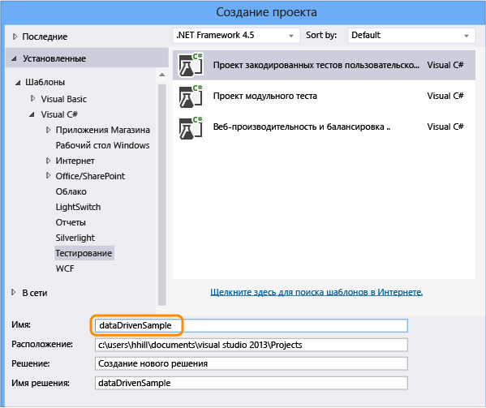
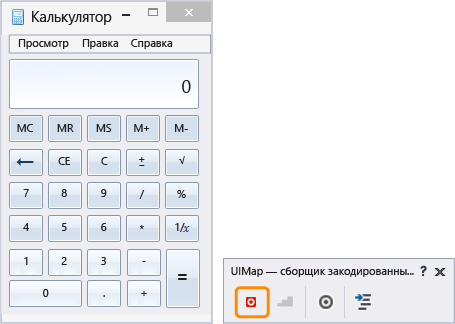
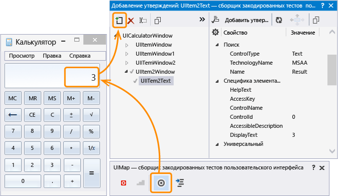
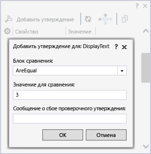
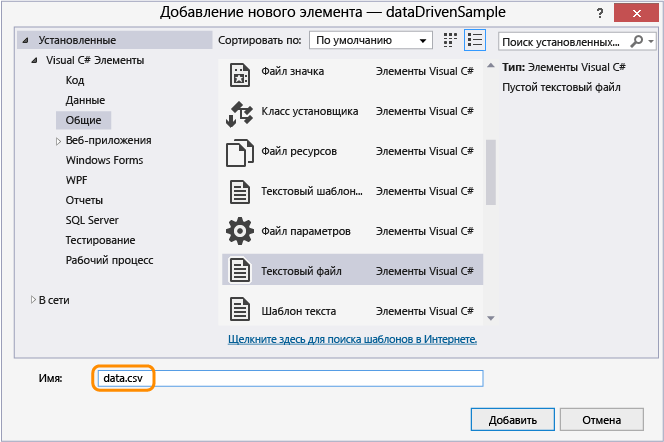
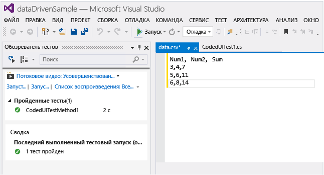
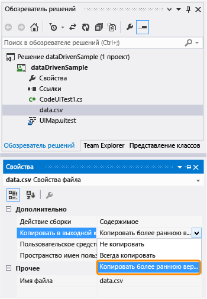
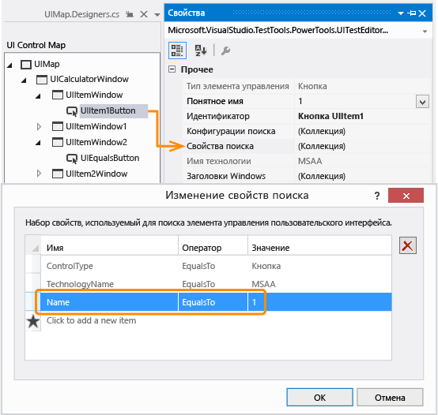

# <a name="creating-a-data-driven-coded-ui-test"></a>Создание управляемого данными закодированного теста пользовательского интерфейса
Для тестирования различных условий можно запускать тесты несколько раз с различными значениями параметров. Управляемые данными закодированные тесты пользовательского интерфейса — удобный способ сделать это. Вы задаете значения параметров в источнике данных, и каждая строка в источнике данных — это итерация закодированного теста пользовательского интерфейса. Общий результат теста будет основываться на результате всех итераций. Например если одна итерация завершается неудачей, общим результатом теста будет ошибка.  
  
 **Requirements**  
  
-   Visual Studio Enterprise  
  
## <a name="create-a-data-driven-coded-ui-test"></a>Создание управляемого данными закодированного теста пользовательского интерфейса  
 В этом примере создается закодированный тест пользовательского интерфейса, который работает в приложении "Калькулятор Windows". Он складывает два числа и использует утверждение для проверки правильности суммы. Далее утверждение и значения параметров для двух чисел кодируются в управляемые данными и сохраняются в файле с разделителями-запятыми (CSV).  
  
#### <a name="step-1---create-a-coded-ui-test"></a>Шаг 1. Создание закодированного теста пользовательского интерфейса  
  
1.  Создайте проект.  
  
       
  
2.  Выберите запись действий.  
  
       
  
3.  Откройте приложение "Калькулятор" и начните запись теста.  
  
       
  
4.  Сложите 1 и 2, приостановите средство записи и создайте метод теста. Позже эти значения ввода пользователя будут заменены значениями из файла данных.  
  
       
  
     Закройте построитель теста. Метод добавляется в тест.  
  
    ```csharp  
    [TestMethod]  
    public void CodedUITestMethod1()  
    {  
        // To generate code for this test, select "Generate Code for Coded UI Test" from the shortcut menu and select one of the menu items.  
        this.UIMap.AddNumbers();  
  
    }  
    ```  
  
5.  С помощью метода `AddNumbers()` проверьте, выполняется ли тест. Поместите курсор в метод теста, показанный выше, откройте контекстное меню и выберите пункт **Запуск тестов**. (Сочетание клавиш: Ctrl + R, T).  
  
     В окне обозревателя тестов отображается результат теста, показывающий, пройден тест или нет. Чтобы открыть окно обозревателя тестов, в меню **ТЕСТ** выберите пункт **Окна**, а затем выберите пункт **Обозреватель тестов**.  
  
6.  Так как источник данных также может использоваться для значений параметров утверждения, с помощью которых тест проверяет ожидаемые значения, добавим утверждение для проверки правильности суммы двух чисел. Поместите курсор в методе теста, показанном выше, откройте контекстное меню, выберите пункт **Сформировать код для закодированного теста пользовательского интерфейса**, а затем выберите пункт **Использовать построитель закодированных тестов пользовательского интерфейса**.  
  
     Сопоставьте элемент управления "Текст" с калькулятором, который отображает сумму.  
  
       
  
7.  Добавьте утверждение, которое проверяет правильность значения суммы. Выберите свойство **DisplayText**, которое имеет значение **3**, а затем выберите **Добавить утверждение**. С помощью средства сравнения **AreEqual** проверьте, имеет ли сравнение значение **3**.  
  
       
  
8.  После настройки утверждения снова создайте код из построителя. При этом создается новый метод для проверки.  
  
       
  
     Так как метод `ValidateSum` проверяет результаты метода `AddNumbers`, переместите его в нижнюю часть блока кода.  
  
    ```csharp  
    public void CodedUITestMethod1()  
    {  
  
        // To generate code for this test, select "Generate Code for Coded UI Test" from the shortcut menu and select one of the menu items.  
        this.UIMap.AddNumbers();  
        this.UIMap.ValidateSum();  
  
    }  
    ```  
  
9. Убедитесь, что тест выполняется, с помощью метода `ValidateSum()`. Поместите курсор в метод теста, показанный выше, откройте контекстное меню и выберите пункт **Запуск тестов**. (Сочетание клавиш: Ctrl + R, T).  
  
     На этом этапе все значения параметров заданы в соответствующих методах как константы. Теперь давайте создадим набор данных, чтобы сделать наш тест управляемым данными.  
  
#### <a name="step-2---create-a-data-set"></a>Шаг 2. Создание набора данных  
  
1.  Добавьте в проект dataDrivenSample текстовый файл с именем `data.csv`.  
  
       
  
2.  Заполните CSV-файл следующими данными.  
  
    |Num1|Num2|Sum|  
    |----------|----------|---------|  
    |3|4|7|  
    |5|6|11|  
    |6|8|14|  
  
     После добавления данных этот файл должен выглядеть следующим образом.  
  
       
  
3.  Важно сохранить этот CSV-файл в правильной кодировке. В меню **ФАЙЛ** выберите **Дополнительные параметры сохранения** и выберите в качестве кодировки **Юникод (UTF-8 без сигнатуры) — кодовая страница 65001**.  
  
4.  Этот CSV-файл необходимо скопировать в выходной каталог, иначе не удается запустить тест. Скопируйте его с помощью окна «Свойства».  
  
       
  
     Теперь, когда у нас есть созданный набор данных, следует привязать данные к тесту.  
  
#### <a name="step-3---add-data-source-binding"></a>Шаг 3. Добавление привязки источника данных  
  
1.  Чтобы привязать источник данных, добавьте атрибут `DataSource` в существующий атрибут `[TestMethod]`, который находится сразу над методом теста.  
  
    ```  
    [DataSource("Microsoft.VisualStudio.TestTools.DataSource.CSV", "|DataDirectory|\\data.csv", "data#csv", DataAccessMethod.Sequential), DeploymentItem("data.csv"), TestMethod]  
    public void CodedUITestMethod1()  
    {  
  
        // To generate code for this test, select "Generate Code for Coded UI Test" from the shortcut menu and select one of the menu items.  
        this.UIMap.AddNumbers();  
        this.UIMap.ValidateSum();  
  
    }  
  
    ```  
  
     Источник данных теперь доступен для использования в этом тестовом методе.  
  
    > [!TIP]
    >  Примеры использования других типов источников данных, таких как XML, SQL Express и Excel, см. в разделе [Примеры атрибутов источников данных](#CreateDataDrivenCUIT_QA_DataSourceAttributes).  
  
2.  Запустите тест.  
  
     Обратите внимание, что тест выполняется в три итерации. Это происходит потому, что привязанный источник данных содержит три строки данных. Однако можно также заметить, что тест по-прежнему использует константные значения параметров и каждый раз складывает 1 и 2, получая сумму 3.  
  
     Далее мы будем настраивать тест для использования значений из файла источника данных.  
  
#### <a name="step-4---use-the-data-in-the-coded-ui-test"></a>Шаг 4. Использование данных в закодированном тесте пользовательского интерфейса  
  
1.  Добавьте `using Microsoft.VisualStudio.TestTools.UITesting.WinControls` в верхнюю часть файла CodedUITest.cs:  
  
    ```  
    using System;  
    using System.Collections.Generic;  
    using System.Text.RegularExpressions;  
    using System.Windows.Input;  
    using System.Windows.Forms;  
    using System.Drawing;  
    using Microsoft.VisualStudio.TestTools.UITesting;  
    using Microsoft.VisualStudio.TestTools.UnitTesting;  
    using Microsoft.VisualStudio.TestTools.UITest.Extension;  
    using Keyboard = Microsoft.VisualStudio.TestTools.UITesting.Keyboard;  
    using Microsoft.VisualStudio.TestTools.UITesting.WinControls;  
    ```  
  
2.  Добавьте `TestContext.DataRow[]` в метод `CodedUITestMethod1()`, который будет применять значения из источника данных. Значения из источника данных переопределяют константы, назначенные элементам управления UIMap, с помощью элементов управления `SearchProperties`:  
  
    ```  
    public void CodedUITestMethod1()  
    {  
  
        // To generate code for this test, select "Generate Code for Coded UI Test" from the shortcut menu and select one of the menu items.  
        this.UIMap.UICalculatorWindow.UIItemWindow.UIItem1Button.SearchProperties[WinButton.PropertyNames.Name] = TestContext.DataRow["Num1"].ToString();this.UIMap.UICalculatorWindow.UIItemWindow21.UIItem2Button.SearchProperties[WinButton.PropertyNames.Name] = TestContext.DataRow["Num2"].ToString();  
        this.UIMap.AddNumbers();  
        this.UIMap.ValidateSumExpectedValues.UIItem2TextDisplayText = TestContext.DataRow["Sum"].ToString();  
        this.UIMap.ValidateSum();  
  
    }  
    ```  
  
     Чтобы понять, в какие свойства поиска следует кодировать данные, используйте редактор закодированных тестов пользовательского интерфейса.  
  
    -   Откройте файл UIMap.uitest.  
  
           
  
    -   Выберите действие пользовательского интерфейса и просмотрите соответствующее сопоставление элементов управления пользовательского интерфейса. Обратите внимание, как сопоставление соответствует коду, например, `this.UIMap.UICalculatorWindow.UIItemWindow.UIItem1Button`.  
  
           
  
    -   В окне свойств откройте **свойства поиска**. Значение **Имя** свойств поиска — это то, что обрабатывается в коде с помощью источника данных. Например, `SearchProperties` назначаются значения в первом столбце каждой строки данных: `UIItem1Button.SearchProperties[WinButton.PropertyNames.Name] = TestContext.DataRow["Num1"].ToString();`. В рамках трех итераций этот тест изменит значение **Имя** для свойства поиска на 3, затем на 5 и, наконец, на 6.  
  
           
  
3.  Сохраните решение.  
  
#### <a name="step-5---run-the-data-driven-test"></a>Шаг 5. Запуск управляемого данными теста  
  
1.  Убедитесь, что тест теперь управляется данными, запустив его еще раз.  
  
     Вы должны увидеть, как тест проходит по трем итерациям, используя значения из CSV-файла. Проверка также должна работать, и тест в обозревателе тестов должен отображаться как пройденный.  
  
 **Руководство**  
  
 Дополнительные сведения см. в разделах [Тестирование непрерывной доставки с Visual Studio 2012 — глава 2. Модульное тестирование. Внутреннее тестирование](http://go.microsoft.com/fwlink/?LinkID=255188) и [Тестирование непрерывной доставки с Visual Studio 2012 — глава 5. Автоматизация системных тестов](http://go.microsoft.com/fwlink/?LinkID=255196).  
  
## <a name="q--a"></a>Вопросы и ответы  
  
###  <a name="CreateDataDrivenCUIT_QA_DataSourceAttributes"></a> Что такое атрибуты источника данных для других типов источников данных, таких как SQL Express или XML?  
 Можно использовать строки примеров источников данных из таблицы ниже, скопировав их в код, и внести необходимые настройки.  
  
 **Типы и атрибуты источников данных**  
  
-   CSV  
  
     `[DataSource("Microsoft.VisualStudio.TestTools.DataSource.CSV", "|DataDirectory|\\data.csv", "data#csv", DataAccessMethod.Sequential), DeploymentItem("data.csv"), TestMethod]`  
  
-   Excel  
  
     `DataSource("System.Data.Odbc", "Dsn=ExcelFiles;Driver={Microsoft Excel Driver (*.xls)};dbq=|DataDirectory|\\Data.xls;defaultdir=.;driverid=790;maxbuffersize=2048;pagetimeout=5;readonly=true", "Sheet1$", DataAccessMethod.Sequential), DeploymentItem("Sheet1.xls"), TestMethod]`  
  
-   Тестовый случай в Team Foundation Server  
  
     `[DataSource("Microsoft.VisualStudio.TestTools.DataSource.TestCase", "http://vlm13261329:8080/tfs/DefaultCollection;Agile", "30", DataAccessMethod.Sequential), TestMethod]`  
  
-   XML  
  
     `[DataSource("Microsoft.VisualStudio.TestTools.DataSource.XML", "|DataDirectory|\\data.xml", "Iterations", DataAccessMethod.Sequential), DeploymentItem("data.xml"), TestMethod]`  
  
-   SQL Express  
  
     `[DataSource("System.Data.SqlClient", "Data Source=.\\sqlexpress;Initial Catalog=tempdb;Integrated Security=True", "Data", DataAccessMethod.Sequential), TestMethod]`  
  
### <a name="q-can-i-use-data-driven-tests-on-my-windows-phone-app"></a>Вопрос. Можно ли использовать управляемые данными тесты в моем приложении Windows Phone?  
 **О.** Да. Закодированные тесты ИП на основе данных для Windows Phone определяются с помощью атрибута DataRow тестового метода. В следующем примере для x и y заданы значения 1 и 2 в первой итерации и значения -1 и -2 во второй итерации теста.  
  
```  
[DataRow(1, 2, DisplayName = "Add positive numbers")]  
[DataRow(-1, -2, DisplayName = "Add negative numbers")]  
[TestMethod]  
public void DataDrivingDemo_MyTestMethod(int x, int y)  
  
```  
  
 Дополнительные сведения см. в разделе [Использование управляемых данными закодированных тестов пользовательского интерфейса в приложениях Windows Phone](../test/test-windows-phone-8-1-apps-with-coded-ui-tests.md#TestingPhoneAppsCodedUI_DataDriven).  
  
### <a name="q-why-cant-i-modify-the-code-in-the-uimapdesigner-file"></a>В. Почему не следует изменять файл UIMap.Designer?  
 **О**. Любые изменения кода, внесенные в файл UIMapDesigner.cs, будут перезаписываться каждый раз при создании кода с помощью построителя кодированных тестов ИП. В этом примере и в большинстве случаев изменения кода, необходимые, чтобы тест использовал источник данных, можно делать в файле исходного кода теста (т. е. CodedUITest1.cs).  
  
 Если требуется изменить записанный метод, необходимо скопировать его в файл UIMap.cs и переименовать. Файл UIMap.cs можно использовать для переопределения методов и свойств в файле UIMapDesigner.cs. Необходимо удалить ссылку на исходный метод в файле CodedUITest.cs и заменить ее именем переименованного метода.  
  
## <a name="see-also"></a>См. также  
 <xref:Microsoft.VisualStudio.TestTools.UITest.Common.UIMap.UIMap>   
 <xref:Microsoft.VisualStudio.TestTools.UnitTesting.Assert>   
 [Использование модели автоматизации пользовательского интерфейса для тестирования кода](../test/use-ui-automation-to-test-your-code.md)   
 [Создание закодированных тестов пользовательского интерфейса](../test/use-ui-automation-to-test-your-code.md#VerifyingCodeUsingCUITCreate)   
 [Рекомендации по выполнению закодированных тестов пользовательского интерфейса](../test/best-practices-for-coded-ui-tests.md)   
 [Поддерживаемые конфигурации и платформы для закодированных тестов пользовательского интерфейса и записей действий](../test/supported-configurations-and-platforms-for-coded-ui-tests-and-action-recordings.md)

