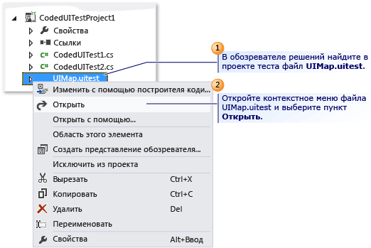
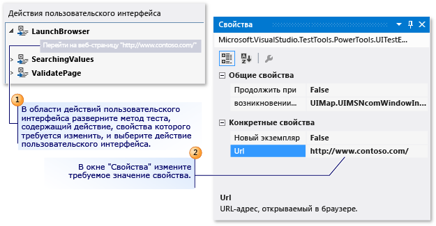
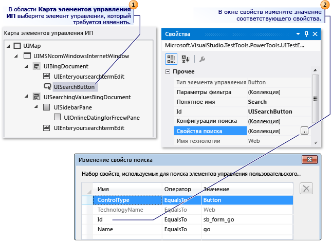
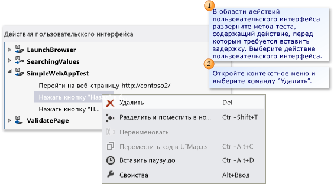
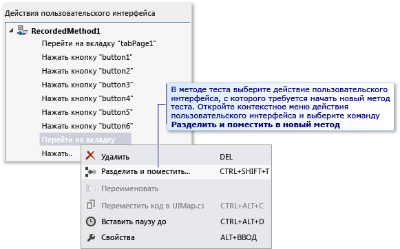
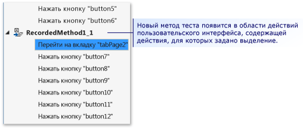
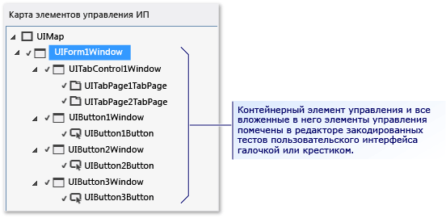
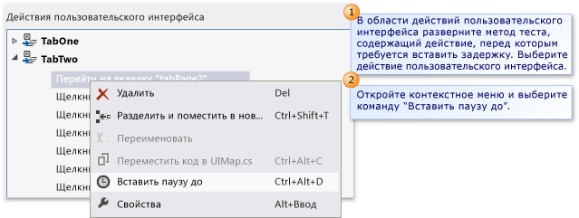

# Изменение закодированных тестов пользовательского интерфейса с помощью редактора закодированных тестов пользовательского интерфейса

Редактор закодированных тестов пользовательского интерфейса позволяет легко изменять закодированные тесты пользовательского интерфейса. В редакторе закодированных тестов пользовательского интерфейса можно искать, просматривать и редактировать свойства методов теста и действия пользовательского интерфейса. Кроме того, можно использовать карту элементов управления пользовательского интерфейса для просмотра и редактирования соответствующих элементов управления.

[!INCLUDE [coded-ui-test-deprecation](includes/coded-ui-test-deprecation.md)]

**Требования**

- Visual Studio Enterprise
- Закодированный тест пользовательского интерфейса

## Функции редактора закодированных тестов пользовательского интерфейса

Эффективнее и быстрее работать в редакторе закодированных тестов пользовательского интерфейса, чем редактировать код методов закодированных тестов пользовательского интерфейса в редакторе кода. В редакторе закодированных тестов пользовательского интерфейса можно использовать панель инструментов и контекстное меню для быстрого поиска, а также изменять значения свойств, связанных с действиями пользовательского интерфейса и элементами управления. Например, с помощью панели инструментов редактора закодированных тестов пользовательского интерфейса вы можете выполнить следующие команды.

1. Команда [Найти](../ide/finding-and-replacing-text.md) позволяет определить расположение действий и элементов управления пользовательского интерфейса.

2. Команда **Удалить** удаляет ненужные действия пользовательского интерфейса.

3. Команда **Переименовать** изменяет имена методов и элементов управления теста.

4. Команда **Свойства** открывает окно **Свойства** для выбранного элемента.

5. Команда **Разделить и поместить в новый метод** позволяет разбить действия пользовательского интерфейса на модули.

6. Команда **Переместить код** добавляет пользовательский код в методы теста.

7. Команда **Вставить паузу до** позволяет вставить перед действием пользовательского интерфейса паузу, длительность которой задается в миллисекундах.

8. **Найти элемент управления пользовательского интерфейса** определяет расположение элемента управления в пользовательском интерфейсе тестируемого приложения.

9. Команда **Найти все** позволяет просмотреть изменения свойств элемента управления и другие существенные изменения, которые выполнены для элементов управления приложения.

При открытии файла *UIMap.uitest*, связанного с закодированным тестом пользовательского интерфейса, соответствующий тест откроется в **редакторе закодированных тестов пользовательского интерфейса**. Следующие процедуры описывают, как можно найти и отредактировать методы тестов, свойства действий пользовательского интерфейса и элементы управления, используя контекстное меню и панель инструментов редактора.

## Открытие кодированного теста пользовательского интерфейса

Вы можете просмотреть и отредактировать закодированный тест пользовательского интерфейса на основе Visual C# и Visual Basic, используя **редактор закодированных тестов пользовательского интерфейса**.

В **обозревателе решений** откройте контекстное меню для *UIMap.uitest* и выберите **Открыть**. Закодированный тест пользовательского интерфейса откроется в **редакторе закодированных тестов пользовательского интерфейса**. Теперь можно просматривать и редактировать записанные методы, действия и соответствующие элементы управления в закодированном тесте пользовательского интерфейса.

> [!TIP]
> При выборе действия пользовательского интерфейса, расположенного в методе в области **действий пользовательского интерфейса** , соответствующий элемент управления выделяется. Вы также можете изменять свойства действия или элемента управления пользовательского интерфейса.

## Изменение свойств действий и элементов управления пользовательского интерфейса

В редакторе закодированных тестов пользовательского интерфейса можно быстро найти и просмотреть все действия пользовательского интерфейса в методах теста. При выборе действия пользовательского интерфейса в редакторе соответствующий элемент управления автоматически выделяется. Аналогичным образом при выборе элемента управления выделяются связанные действия пользовательского интерфейса. Таким образом, если выбрать действие пользовательского интерфейса или элемент управления, в окне **Свойства** можно легко изменить соответствующие ему свойства.

Для изменения свойств действия пользовательского интерфейса, в области **Действие пользовательского интерфейса** разверните метод теста, который содержит действие пользовательского интерфейса, свойства для которого необходимо изменить, и выделите действие пользовательского интерфейса, а затем измените свойства с помощью окна свойств.

Например, если сервер недоступен и имеется действие пользовательского интерфейса, связанное с веб-браузером, сообщающее **Перейти на веб-страницу \/http://Contoso1/default.aspx**, можно изменить URL-адрес на `http://Contoso2/default.aspx`.

Изменение свойств для элемента управления происходит таким же образом, как и изменение действий пользовательского интерфейса. В области **Карта элементов управления ИП** выберите элемент управления, который требуется отредактировать, и измените его свойства с помощью окна **свойств**.

Например, разработчик мог изменить свойство **(ID)** элемента управления "Кнопка" в исходном коде для тестируемого приложения с idSubmit на idLogin. Если свойство **(ID)** в приложении изменено, закодированный тест пользовательского интерфейса не сможет обнаружить кнопку и завершится с ошибкой. В этом случае можно открыть коллекцию **Свойства поиска** и изменить свойство **Id** , чтобы оно соответствовало новому значению, которое разработчик использовал в приложении. Можно также изменить значение свойства **Понятное имя** Submit на Login. Вследствие этого изменения соответствующее действие пользовательского интерфейса в редакторе закодированных тестов пользовательского интерфейса изменяется с "Нажмите кнопку Submit" на "Нажмите кнопку Login".

Сохраните выполненные изменения в файл *UIMap.Designer*, выбрав **Сохранить** на панели инструментов Visual Studio.

### Советы

- Если окно **Свойства** не отображается, нажмите клавишу **ВВОД**, удерживая нажатой клавишу **ALT**, или клавишу **F4**.

- Чтобы отменить изменения свойств, в меню **Правка** выберите команду **Отменить** или нажмите клавиши **CTRL**+**Z**.

- Вы можете использовать кнопку **Найти** на панели инструментов в редакторе закодированных тестов пользовательского интерфейса, чтобы открыть инструмент **поиска и замены** в Visual Studio. Для поиска операции пользовательского интерфейса в редакторе закодированных тестов пользовательского интерфейса можно воспользоваться элементом управления **Найти**. Например, можно попытаться найти "Нажмите кнопку Login". Такой способ удобно применять в больших тестах. Использовать функцию замены в инструменте **Поиск и замена** в редакторе закодированных тестов пользовательского интерфейса нельзя. Дополнительные сведения см. в разделе элемента управления "Поиск" в статье [Поиск и замена текста](../ide/finding-and-replacing-text.md).

- В некоторых случаях представить, где находятся элементы управления пользовательского интерфейса тестируемого приложения, может быть сложно. Одна из возможностей в редакторе закодированных тестов пользовательского интерфейса заключается в том, что вы можете выбрать элемент управления, перечисленный в карте элементов управления пользовательского интерфейса, и посмотреть его расположение в тестируемом приложении. Дополнительные сведения см. в разделе [Поиск элемента управления пользовательского интерфейса в тестируемом приложении](#locate-a-ui-control-in-the-application-under-test), расположенном далее в этой статье.

- Может потребоваться развернуть контейнерный элемент управления, содержащий элемент управления, который требуется изменить. Дополнительные сведения см. в разделе [Определение расположения элемента управления и его потомков](#locate-a-control-and-its-descendants) далее в этой статье.

## Удаление ненужных действий пользовательского интерфейса

Вы можете легко удалить ненужные действия пользовательского интерфейса в закодированном тесте пользовательского интерфейса.

В области **действия пользовательского интерфейса** разверните метод теста, содержащий действие пользовательского интерфейса, которое требуется удалить. Откройте контекстное меню для действия пользовательского интерфейса и выберите **Удалить**.

## Разбиение метода теста на два отдельных метода

Можно разбить метод теста, чтобы уточнить или распределить действия пользовательского интерфейса. Например, в тесте может быть один метод теста с действиями пользовательского интерфейса в двух контейнерных элементах управления. Действия пользовательского интерфейса можно разбить на модули в двух методах, соответствующих одному контейнеру.

В области **Действие пользовательского интерфейса** разверните метод теста, который требуется разбить на два отдельных метода, и выберите действие пользовательского интерфейса, в котором должен начаться новый метод теста. Или откройте контекстное меню для действия пользовательского интерфейса, а затем выберите **Разделить и поместить в новый метод**, или нажмите кнопку **Разделить и поместить в новый метод** на панели инструментов редактора закодированных тестов пользовательского интерфейса. Новый метод теста отображается в области **действий пользовательского интерфейса**. Она содержит действия пользовательского интерфейса, начиная с действия, в котором было указано разделение.

Выполнив разбиение метода, сохраните изменения в файл *UIMap.Designer*, выбрав **Сохранить** на панели инструментов Visual Studio.

> [!WARNING]
> В случае разделения метода необходимо изменить любой код, который вызывает существующий метод, так, чтобы он также вызывал новый метод, который планируется создать, если при этом требуется включить эти действия пользовательского интерфейса. Если разделить метод, откроется диалоговое окно Microsoft Visual Studio. Оно предупреждает, что необходимо изменить любой код, который вызывает существующий метод, чтобы он также вызывал новый метод, который вы собираетесь создать. Выберите **Да**.

### Советы

- Чтобы отменить разбиение, в меню **Правка** выберите команду **Отменить** или нажмите клавиши **CTRL**+**Z**.

- Вы можете переименовать новый метод. Выберите его в области **Действия пользовательского интерфейса** и на панели редактора закодированных тестов пользовательского интерфейса выберите кнопку **Переименовать**.

   -или-

   Откройте контекстное меню для нового метода теста и выберите **Переименовать**.

   Откроется диалоговое окно Microsoft Visual Studio. Оно предупреждает, что необходимо изменить любой код, ссылающийся на этот метод. Выберите **Да**.

## Перемещение метода теста в файл UIMap для упрощения настройки

Если определяется, что один из методов теста в закодированном тесте пользовательского интерфейса требует пользовательский код, необходимо переместить его в файл *UIMap.cs* или файл *UIMap.vb*. В противном случае код будет перезаписан при повторной компиляции закодированного теста пользовательского интерфейса. Если вы не перемещаете метод, пользовательский код перезаписывается каждый раз, когда выполняется повторная компиляция теста.

В области **Действия пользовательского интерфейса** выберите метод теста, который требуется переместить в файл *UIMap.cs* или *UIMap.vb*, чтобы упростить функциональность пользовательского кода. В этом случае он не будет переписываться при каждой компиляции кода теста. После этого нажмите кнопку **Переместить код** на панели инструментов редактора закодированных тестов пользовательского интерфейса или откройте контекстное меню для метода теста и выберите **Переместить код**. Метод теста удаляется из файла *UIMap.uitest* и перестает отображаться в области **Действия пользовательского интерфейса**. Чтобы внести изменения в перемещенный тестовый файл, откройте файл *UIMap.cs* или *UIMap.vb* в **обозревателе решений**.

Выполнив перемещение метода, сохраните изменения в файл *UIMap.Designer*, выбрав **Сохранить** на панели инструментов Visual Studio.

> [!WARNING]
> После перемещения метода его нельзя изменять в редакторе закодированных тестов пользовательского интерфейса. Для добавления и обслуживания пользовательского кода следует использовать редактор кода. Если переместить метод, откроется диалоговое окно Microsoft Visual Studio. В нем отобразится предупреждение о том, что метод будет перемещен из файла *UIMap.uitest* в файл *UIMap.cs* или *UIMap.vb*, после чего метод нельзя будет изменять в редакторе закодированных тестов пользовательского интерфейса. Выберите **Да**.

### Советы

Чтобы отменить перемещение, в меню **Правка** выберите команду **Отменить** или нажмите клавиши **CTRL**+**Z**. Однако затем вы должны вручную удалить этот код в файле *UIMap.cs* или *UIMap.vb*.

## Поиск элемента управления пользовательского интерфейса в тестируемом приложении

В некоторых случаях представить, где находятся элементы управления пользовательского интерфейса тестируемого приложения, может быть сложно. Одна из возможностей в редакторе закодированных тестов пользовательского интерфейса заключается в том, что вы можете выбрать элемент управления, перечисленный в карте элементов управления пользовательского интерфейса, и посмотреть его расположение в тестируемом приложении. С помощью функции **Найти элемент управления пользовательского интерфейса** в тестируемом приложении можно также проверять изменения свойств поиска, внесенные в элемент управления.

В области **карты элементов управления пользовательского интерфейса** выберите элемент управления, который требуется найти в приложении, связанном с тестом. Затем откройте контекстное меню для элемента управления, а затем выберите **Найти элемент управления ИП**. В тестируемом приложении этот элемент управления выделяется синей рамкой.

> [!NOTE]
> Прежде чем приступать к поиску элемента управления пользовательского интерфейса, убедитесь в том, что связанное с тестом приложение запущено.

### Советы

С помощью команды **Найти все** можно проверить, все ли элементы управления в контейнере можно найти правильно. Эта возможность описана в следующем разделе.

## Определение расположения элемента управления и его потомков

Можно убедиться, что при тестировании расположение всех элементов управления контейнера в пользовательском интерфейсе приложения определяется правильно. Это может быть полезным при проверке изменений свойств поиска, сделанных в контейнере. Кроме того, если в пользовательском интерфейсе тестируемого приложения были сделаны существенные изменения, можно проверить правильность свойств поиска существующего элемента управления.

В области **карты элементов управления пользовательского интерфейса** выберите контейнерный элемент управления, потомки которого требуется найти и просмотреть. Затем откройте контекстное меню элемента управления и выберите команду **Найти все**. Контейнерный элемент управления и все элементы управления, которые являются его потомками, выделяются в редакторе закодированных тестов пользовательского интерфейса зелеными флажками или красным значком "X". Эти метки позволяют понять, были ли элементы управления успешно найдены в тестируемом приложении.

> [!NOTE]
> Прежде чем приступать к поиску элементов управления пользовательского интерфейса, убедитесь в том, что связанное с тестом приложение запущено.

## Вставка задержки перед действием пользовательского интерфейса

В некоторых ситуациях может потребоваться, чтобы тест ожидал возникновения определенных событий, например открытия окна, исчезновения строки хода выполнения и т. д. С помощью редактора закодированных тестов пользовательского интерфейса это можно сделать, вставив задержку перед действием пользовательского интерфейса. Можно указать, сколько секунд должна длиться задержка.

В области **действия пользовательского интерфейса** разверните метод теста, содержащий действие пользовательского интерфейса, перед которым требуется вставить задержку. Выберите действие пользовательского интерфейса. Затем откройте контекстное меню для действия пользовательского интерфейса и выберите команду **Вставить паузу до**. Задержка вставляется и выделяется перед выбранным действием пользовательского интерфейса со следующим текстом: **Подождите прерывание пользователя между действиями в течение 1 секунды**. В окне **Свойства** измените значение свойства **Задержка** на необходимое число миллисекунд.

Выполнив вставку задержки, сохраните изменения в файл *UIMap.Designer*, выбрав **Сохранить** на панели инструментов Visual Studio.

Если требуется убедиться в доступности конкретного элемента управления перед действием пользовательского интерфейса, рассмотрите возможность добавления пользовательского кода в метод теста с помощью соответствующего метода UITestControl.WaitForControlXXX(). Дополнительные сведения см. в разделе [Настройка закодированного теста пользовательского интерфейса таким образом, чтобы во время воспроизведения он дожидался определенных событий](../test/making-coded-ui-tests-wait-for-specific-events-during-playback.md).

## См. также

- [Использование автоматизации пользовательского интерфейса для тестирования кода](../test/use-ui-automation-to-test-your-code.md)
- [Создание закодированных тестов пользовательского интерфейса](../test/use-ui-automation-to-test-your-code.md)
- [Создание управляемого данными закодированного теста пользовательского интерфейса](../test/creating-a-data-driven-coded-ui-test.md)
- [Пошаговое руководство: Создание, изменение и обслуживание закодированного теста пользовательского интерфейса](../test/walkthrough-creating-editing-and-maintaining-a-coded-ui-test.md)
