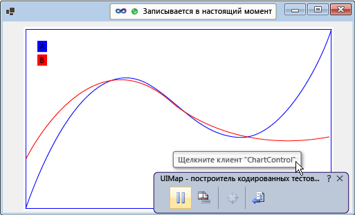
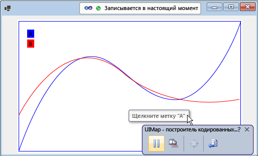

# <a name="enable-coded-ui-testing-of-your-controls"></a>Включение закодированных тестов пользовательского интерфейса для элементов управления

Реализуйте поддержку платформы закодированных тестов пользовательского интерфейса, чтобы повысить эффективность тестирования элементов управления. Вы можете последовательно добавлять повышение уровней поддержки. Начать можно с поддержки проверки записи, воспроизведения и свойств. После этого можно включить построитель закодированных тестов пользовательского интерфейса, чтобы распознать настраиваемые свойства элемента управления. Предоставьте настраиваемые классы для доступа к этим свойствам из сгенерированного кода. Вы также можете помочь построителю закодированных тестов пользовательского интерфейса захватывать действия способом, который в большей степени соответствует цели записываемого действия.

!Экран "Схема, показывающая, как классы в ChartControl расширяются с помощью класса CreateAccessabilityInstance до классов в ChartControlExtensionPackage.] (../ test / media / cuit_full.png)"

[!INCLUDE[coded-ui-test-deprecation](../test/includes/coded-ui-test-deprecation.md)]

## <a name="support-record-and-playback-and-property-validation-by-implementing-accessibility"></a>Поддержка записи, воспроизведения и проверки свойства путем реализации специальных возможностей

Построитель закодированных тестов пользовательского интерфейса собирает сведения об элементах управления, которые он обнаруживает во время записи, а затем создает код для повторения этого сеанса. Если элемент управления не поддерживает специальные возможности, построитель закодированных тестов пользовательского интерфейса захватывает действия (например, щелчки мышью) с помощью координат экрана. Созданный код выполняет действия в тех же экранных координатах при воспроизведении теста. Если во время воспроизведения теста элемент управления отображается в другом месте на экране, созданный код не сможет выполнить это действие на элементе управления. Если специальные возможности не реализованы, при воспроизведении теста в другой конфигурации, в другой среде или в пользовательском интерфейсе с измененным макетом могут возникать ошибки.



При реализации специальных возможностей построитель закодированных тестов пользовательского интерфейса использует их для того, чтобы получить сведения об элементе управления во время записи теста. Затем, при выполнении теста, созданный код повторит эти события для элемента управления, даже если он находится где-либо еще в интерфейсе пользователя. Авторы теста могут также создавать утверждения благодаря использованию основных свойств элемента управления.



### <a name="to-support-record-and-playback-property-validation-and-navigation-for-a-windows-forms-control"></a>Поддержка записи, воспроизведения, проверки свойств и навигации для элемента управления Windows Forms
Реализуйте специальные возможности для элемента управления согласно описанной ниже процедуре. Подробные пояснения см. в разделе <xref:System.Windows.Forms.AccessibleObject>.


1. Реализуйте производный от <xref:System.Windows.Forms.Control.ControlAccessibleObject> класс и переопределите свойство <xref:System.Windows.Forms.Control.AccessibilityObject%2A> для возврата объекта класса.

    ```csharp
    public partial class ChartControl : UserControl
    {
        // Overridden to return the custom AccessibleObject for the control.
        protected override AccessibleObject CreateAccessibilityInstance()
        {
            return new ChartControlAccessibleObject(this);
        }

        // Inner class ChartControlAccessibleObject represents accessible information
        // associated with the ChartControl and is used when recording tests.
        public class ChartControlAccessibleObject : ControlAccessibleObject
        {
            ChartControl myControl;
            public ChartControlAccessibleObject(ChartControl ctrl)
                : base(ctrl)
            {
                myControl = ctrl;
            }
        }
    }
    ```

2. Переопределите свойства, методы и <xref:System.Windows.Forms.AccessibleObject.Role%2A>, <xref:System.Windows.Forms.AccessibleObject.State%2A>, <xref:System.Windows.Forms.AccessibleObject.GetChild%2A><xref:System.Windows.Forms.AccessibleObject.GetChildCount%2A> объекта специальных возможностей.

3. Реализуйте другой объект специальных возможностей для дочернего элемента управления и переопределите свойство дочернего элемента управления <xref:System.Windows.Forms.Control.AccessibilityObject%2A> для получения объекта специальных возможностей.

4. Переопределите свойства, методы и <xref:System.Windows.Forms.AccessibleObject.Bounds%2A>, <xref:System.Windows.Forms.AccessibleObject.Name%2A>, <xref:System.Windows.Forms.AccessibleObject.Parent%2A>, <xref:System.Windows.Forms.AccessibleObject.Role%2A>, <xref:System.Windows.Forms.AccessibleObject.State%2A>, <xref:System.Windows.Forms.AccessibleObject.Navigate%2A>, <xref:System.Windows.Forms.AccessibleObject.Select%2A> объекта специальных возможностей дочернего элемента управления.

> [!NOTE]
> Этот раздел начинается с примера специальных возможностей в <xref:System.Windows.Forms.AccessibleObject>, а затем берется в основу остальных процедур. Если вам требуется создать рабочую версию образца специальных возможностей, создайте консольное приложение, а затем замените код в файле *Program.cs* на пример кода. Добавьте ссылки на Accessibility, System.Drawing и System.Windows.Forms. Измените значение **Внедрить типы взаимодействия** для объекта специальных возможностей на **False**, чтобы исключить предупреждение сборки. Можно изменить тип выходных данных проекта с **консольного приложения** на **приложение Windows**, чтобы окно консоли не отображалось при запуске приложения.

## <a name="support-custom-property-validation-by-implementing-a-property-provider"></a>Поддержка проверки пользовательского свойства путем реализации поставщика свойства

После реализации базовой поддержки проверки записи, воспроизведения и свойств вы можете сделать пользовательские свойства элемента управления доступными закодированным тестам пользовательского интерфейса путем реализации подключаемого модуля <xref:Microsoft.VisualStudio.TestTools.UITesting.UITestPropertyProvider>. Например, в следующей процедуре создается поставщик свойства, позволяющий закодированным тестам пользовательского интерфейса получать доступ к свойству состояния дочерних элементов управления CurveLegend элемента управления диаграммы:


### <a name="to-support-custom-property-validation"></a>Поддержка проверки пользовательского свойства


1. Переопределите свойство <xref:System.Windows.Forms.AccessibleObject.Description%2A> объекта специальных возможностей кривой условных обозначений, чтобы передавать в строке описания форматируемые значения свойств. Для разделения значений используйте точки с запятыми (;).

    ```csharp
    public class CurveLegendAccessibleObject : AccessibleObject
    {
        // add the state property value to the description
        public override string Description
        {
            get
            {
                // Add ";" and the state value to the end
                // of the curve legend's description
                return "CurveLegend; " + State.ToString();
            }
        }
    }
    ```

1. Создайте пакет расширений тестов пользовательского интерфейса для пользовательского элемента управления, создав проект библиотеки классов. Добавьте ссылки на Accessibility, Microsoft.VisualStudio.TestTools.UITesting, Microsoft.VisualStudio.TestTools.UITest.Common и Microsoft.VisualStudio.TestTools.Extension. Измените значение **Внедрить типы взаимодействия** для объекта специальных возможностей на **False**.

1. Добавьте класс поставщика свойства, который является производным от <xref:Microsoft.VisualStudio.TestTools.UITesting.UITestPropertyProvider>:

    ```csharp
    using System;
    using System.Collections.Generic;
    using Accessibility;
    using Microsoft.VisualStudio.TestTools.UITesting;
    using Microsoft.VisualStudio.TestTools.UITest.Extension;
    using Microsoft.VisualStudio.TestTools.UITesting.WinControls;
    using Microsoft.VisualStudio.TestTools.UITest.Common;

    namespace ChartControlExtensionPackage
    {
        public class ChartControlPropertyProvider : UITestPropertyProvider
        {
        }
    }
    ```

1. Реализуйте поставщик свойства, установив имена свойств и дескрипторы свойств в <xref:System.Collections.Generic.Dictionary%602>.

1. Переопределите <xref:Microsoft.VisualStudio.TestTools.UITesting.UITestPropertyProvider.GetControlSupportLevel%2A?displayProperty=fullName>, чтобы указать, что сборка обеспечивает поддержку отдельного элемента управления для элемента управления и его дочерних элементов.

1. Переопределение оставшихся абстрактных методов <xref:Microsoft.VisualStudio.TestTools.UITesting.UITestPropertyProvider?displayProperty=fullName>

1. Добавьте класс пакета расширений, который является производным от <xref:Microsoft.VisualStudio.TestTools.UITest.Extension.UITestExtensionPackage>.

1. Задайте атрибут `UITestExtensionPackage` для сборки.

1. В классе пакета расширений переопределите <xref:Microsoft.VisualStudio.TestTools.UITest.Extension.UITestExtensionPackage.GetService%2A?displayProperty=fullName>, чтобы возвратить класс поставщика свойства, когда будет запрошен поставщик свойства.

1. Переопределите оставшиеся абстрактные методы и свойства <xref:Microsoft.VisualStudio.TestTools.UITest.Extension.UITestExtensionPackage>.

1. Выполните сборку двоичных файлов и скопируйте их в каталог *%ProgramFiles%\Common\Microsoft Shared\VSTT\10.0\UITestExtensionPackages*.

> [!NOTE]
> Этот пакет расширений применяется к любому элементу управления типа "Текст". Если вы тестируете несколько элементов управления одного типа, то необходимо тестировать их поодиночке, указывая во время записи тестов, какие пакеты расширений развертывать.

## <a name="support-code-generation-by-implementing-a-class-to-access-custom-properties"></a>Поддержка создания кода путем реализации класса для доступа к пользовательским свойствам

Когда построитель закодированных тестов пользовательского интерфейса создает код из записи сеанса, он использует класс <xref:Microsoft.VisualStudio.TestTools.UITesting.UITestControl> для получения доступа к элементам управления.

При реализации поставщика свойства для предоставления доступа к пользовательским свойствам элемента управления можно добавить специализированный класс, используемый для доступа к этим свойствам. Добавление специализированного класса упрощает создаваемый код.

### <a name="to-add-a-specialized-class-to-access-your-control"></a>Добавление специализированного класса для доступа к элементу управления


1. Реализуйте класс, производный от <xref:Microsoft.VisualStudio.TestTools.UITesting.WinControls.WinControl>, и добавьте тип элемента управления к коллекции свойств поиска в конструкторе.

1. Реализуйте пользовательские свойства элемента управления как свойства класса.

1. Переопределите метод <xref:Microsoft.VisualStudio.TestTools.UITesting.UITestPropertyProvider.GetSpecializedClass%2A?displayProperty=fullName> поставщика свойства для возврата типа нового класса для дочерних элементов управления легенды кривой.

1. Переопределите метод <xref:Microsoft.VisualStudio.TestTools.UITesting.UITestPropertyProvider.GetPropertyNamesClassType%2A> поставщика свойства, чтобы возвратить тип метода PropertyNames новых классов.

## <a name="support-intent-aware-actions-by-implementing-an-action-filter"></a>Поддержка действий, учитывающих намерение, путем реализации фильтра действий

В то время, как Visual Studio записывает тест, записываются все события мыши и клавиатуры. Однако в некоторых случаях цель действия может быть потеряна в ряде событий мыши и клавиатуры. Например, если элемент управления поддерживает автозаполнение, то один и тот же набор событий мыши и клавиатуры может возникать в разных значениях во время воспроизведения теста в другой среде. Вы можете добавить подключаемый модуль фильтра действий, который заменяет ряд событий клавиатуры и мыши на одно действие. Таким образом, можно заменить ряд событий мыши и клавиатуры для выделения значения на одно действие, которое задает значение. Это защитит закодированные тесты пользовательского интерфейса от различий в автозаполнении в различных средах.

### <a name="to-support-intent-aware-actions"></a>Поддержка действий, учитывающих намерение


1. Реализуйте класс фильтра действий, производный от [UITestActionFilter](/previous-versions/visualstudio/visual-studio-2012/dd985757(v=vs.110)), переопределив свойства [ApplyTimeout](/previous-versions/visualstudio/visual-studio-2012/dd984649%28v%3dvs.110%29), [Category](/previous-versions/visualstudio/visual-studio-2012/dd986905(v=vs.110)), [Enabled](/previous-versions/visualstudio/visual-studio-2012/dd985633(v=vs.110)), [FilterType](/previous-versions/visualstudio/visual-studio-2012/dd778726(v=vs.110)), [Group](/previous-versions/visualstudio/visual-studio-2012/dd779219(v=vs.110)) и [Name](/previous-versions/visualstudio/visual-studio-2012/dd998334(v=vs.110)).

1. Переопределите [ProcessRule](/previous-versions/visualstudio/visual-studio-2012/dd987281(v=vs.110)). Ниже приведен пример замены действия двойного щелчка на действие одним щелчком.

1. Добавьте фильтр действий в метод <xref:Microsoft.VisualStudio.TestTools.UITest.Extension.UITestExtensionPackage.GetService%2A> данного пакета расширений.

1. Выполните сборку двоичных файлов и скопируйте их в каталог *%ProgramFiles%\Common Files\Microsoft Shared\VSTT\10.0\UITestExtensionPackages*.

> [!NOTE]
> Фильтр действий не зависит от реализации специальных возможностей или от поставщика свойств.

## <a name="debug-your-property-provider-or-action-filter"></a>Отладка поставщика свойств или фильтра действий

Ваши поставщик свойств и фильтр действий реализуются в пакете расширений. Построитель тестов запускает пакет расширений в отдельном от приложения процессе.

### <a name="to-debug-your-property-provider-or-action-filter"></a>Отладка поставщика свойств или фильтра действий

1. Выполните сборку отладочной версии пакета расширений и скопируйте *DLL-файлы* и *PDB-файлы* в каталог *%ProgramFiles%\Common Files\Microsoft Shared\VSTT\10.0\UITestExtensionPackages*.

2. Запустите приложение (не в отладчике).

3. Запустите построитель закодированного теста пользовательского интерфейса.

     `codedUITestBuilder.exe  /standalone`

4. Присоедините отладчик к процессу codedUITestBuilder.

5. Задайте точки останова в коде.

6. В построителе закодированных тестов пользовательского интерфейса создайте утверждения для работы поставщика свойств и запишите действия для использования фильтров действий.

## <a name="see-also"></a>См. также раздел

- <xref:System.Windows.Forms.AccessibleObject>
- [Использование автоматизации пользовательского интерфейса для тестирования кода](../test/use-ui-automation-to-test-your-code.md)
