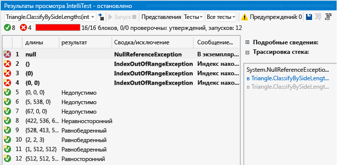
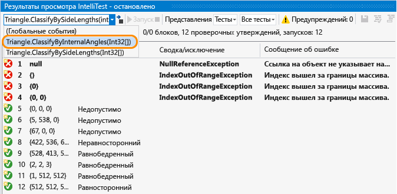
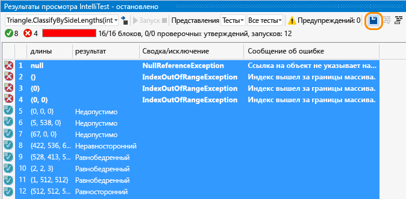
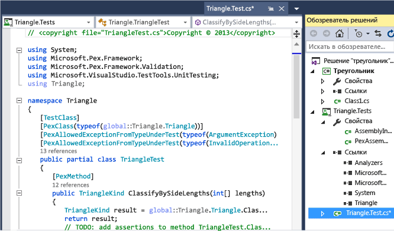
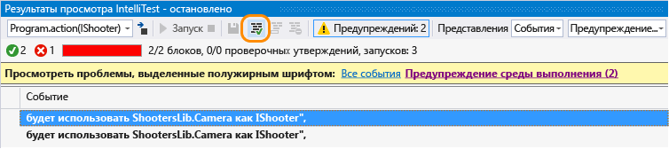
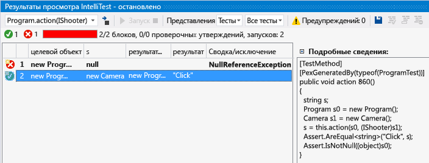

# Практическое руководство. Создание модульных тестов с помощью IntelliTest

IntelliTest изучает код .NET, чтобы создать тестовые данные и набор модульных тестов. Для каждого оператора в коде создаются входные данные теста, которые будут выполнять этот оператор. Анализ случая выполняется для каждой условной ветви в коде. Например, анализируются операторы `if`, утверждения и все операции, которые могут вызывать исключения. Этот анализ используется в целях создания данных теста для параметризованного модульного теста для каждого из методов, создающих модульные тесты с высоким покрытием кода.

При запуске IntelliTest легко увидеть, какие тесты завершились сбоем, и добавить код для их исправления. Вы можете выбрать, какие созданные тесты следует сохранить в тестовый проект, чтобы предоставить набор регрессий. Изменив код, необходимо перезапустить IntelliTest, чтобы синхронизировать созданные тесты с изменениями в коде.

## Высокая доступность и расширения

Команды меню **Создать IntelliTest** и **Запустить IntelliTest**

* Доступны в только в версии Visual Studio Enterprise Edition.

* Поддерживают только код C#, предназначенный для .NET Framework.

* [Расширяемые](#extend-framework) и поддерживают порождающие тесты в формате MSTest, MSTest V2, NUnit и xUnit.

* Не поддерживают конфигурацию x64.

## Изучение. Использование IntelliTest для изучения кода и создания модульных тестов

Для формирования модульных тестов типы должны быть открытыми.

1. Откройте решение в Visual Studio и откройте файл класса, содержащий методы, которые вы хотите протестировать.

2. Щелкните правой кнопкой мыши метод и выберите пункт **Запустить IntelliTest**, чтобы создать модульные тесты для кода в используемом методе.

   

   IntelliTest выполняет код несколько раз с разными вводными данными. Каждое выполнение представлено в таблице с входными данными теста и выходными результатами или исключением.

   

Чтобы создать модульные тесты для всех общедоступных методов в классе, просто щелкните правой кнопкой мыши класс, а не конкретный метод, а затем выберите команду **Запустить IntelliTest**. Используйте раскрывающийся список в окне **Результаты просмотра**, чтобы отобразить модульные тесты и входные данные для каждого метода в классе.

Убедитесь, что полученные результаты для выполненных тестов в столбце результатов соответствуют ожидаемому коду. Для тестов, которые завершились ошибкой, исправьте код соответствующим образом. Затем перезапустите IntelliTest для проверки исправлений.

## Сохранение. Сохранение модульных тестов в виде набора регрессий

1. Выберите строки данных, которые следует сохранить с параметризованным модульным тестом в тестовый проект.

     

     Можно просмотреть тестовый проект и параметризованный модульный тест, который был создан, — отдельные модульные тесты, соответствующие каждой строке, сохраняются в файл *.g.cs* в тестовом проекте, а параметризованный модульный тест сохраняется в соответствующий *CS-файл*. Вы можете запускать модульные тесты и просматривать результаты в обозревателе тестов так же, как в случае с любыми созданными вручную модульными тестами.

     

     Все необходимые ссылки также добавляются в тестовый проект.

     При изменении кода метода перезапустите IntelliTest, чтобы синхронизировать модульные тесты с внесенными изменениями.

## Помощь. Использование IntelliTest для просмотра кода

1. Если у вас имеется более сложный код, IntelliTest поможет сконцентрироваться на просмотре кода. Например, при наличии метода с интерфейсом в виде параметра и более одного класса, который реализует этот интерфейс, IntelliTest обнаружит эти классы и выдаст предупреждение.

     Просмотрите предупреждения, чтобы решить, что следует сделать.

     

2. После изучения кода и выбора цели тестирования можно исправить предупреждение, чтобы выбрать классы для тестирования интерфейса.

     

     Выбранные элементы добавляются в файл *PexAssemblyInfo.cs*.

     `[assembly: PexUseType(typeof(Camera))]`

3. Теперь можно перезапустить IntelliTest, чтобы создать параметризованный модульный тест и данные теста c использованием одного только исправленного класса.

     

## Указание. Использование IntelliTest для проверки правильности свойств, указанных в коде

Укажите общую связь между входными и выходными данными, которые должны быть проверены созданными модульными тестами. Эта спецификация инкапсулируется в метод, который подобен методу тестирования, но связан квантором общности. Это метод параметризованного модульного теста, и все утверждения должны сохраняться для всех возможных входных значений, создаваемых IntelliTest.

## Вопросы и ответы

### Вопрос. Можно ли использовать IntelliTest для неуправляемого кода?

**Ответ.** Нет. IntelliTest работает только с управляемым кодом.

### Вопрос. Каковы условия выполнения или сбоя созданного теста?

**Ответ.** Он, как и любой модульный тест, выполняется в случае отсутствия исключений. Сбой происходит при сбое утверждений или если код в тесте вызывает необработанное исключение.

Если у вас есть тест, который может быть выполнен при возникновении определенных исключений, можно задать один из следующих атрибутов на основе требований в методе тестирования, тестовом классе и уровне сборки:

- **PexAllowedExceptionAttribute**

- **PexAllowedExceptionFromTypeAttribute**

- **PexAllowedExceptionFromTypeUnderTestAttribute**

- **PexAllowedExceptionFromAssemblyAttribute**

### Вопрос. Можно ли добавить допущения в параметризованный модульный тест?

**Ответ.** Да, используйте допущения, чтобы указать, какие данные теста не нужны для модульного теста при использовании определенного метода. Используйте класс <xref:Microsoft.Pex.Framework.PexAssume> для добавления допущений. Например, можно добавить допущение, что переменная `lengths` не является NULL в отличие от этой.

`PexAssume.IsNotNull(lengths);`

Если добавляется допущение и перезапускается IntelliTest, тестовые данные, которые больше не нужны, будут удалены.

### Вопрос. Можно ли добавить утверждения в параметризованный модульный тест?

**Ответ.** Да, IntelliTest проверит правильность утверждения в операторе при запуске модульных тестов. Для добавления утверждений используйте класс <xref:Microsoft.Pex.Framework.PexAssert> или API утверждения, входящий в состав платформы тестирования. Например, можно добавить утверждение о равенстве двух переменных.

`PexAssert.AreEqual(a, b);`

Если добавляется допущение и перезапускается IntelliTest, инструмент проверяет допустимость утверждения. Если утверждение недопустимо, происходит сбой теста.

###  Вопрос. Можно ли создавать параметризованные модульные тесты, не запуская предварительно IntelliTest?

**О** . Да, щелкните правой кнопкой мыши в коде класса или метода и выберите пункт **Создать IntelliTest**.

Примите формат по умолчанию для формирования тестов или измените способ именования вашего проекта и тестов. Вы можете создать новый тестовый проект или сохранить тесты в существующем проекте.

### В. Можно ли использовать другие платформы модульного тестирования с IntelliTest?

**О** . Да, выполните инструкции по [поиску и установке других платформ](../test/install-third-party-unit-test-frameworks.md).
Расширения платформы тестирования также доступны в Visual Studio Marketplace, например [генератор тестов NUnit](https://marketplace.visualstudio.com/items?itemName=NUnitDevelopers.TestGeneratorNUnitextension-18371).

Перезапустив Visual Studio и открыв решение повторно, щелкните правой кнопкой мыши в коде класса или метода и выберите пункт **Создать IntelliTest**. Выберите установленную платформу здесь:

Затем запустите IntelliTest, чтобы сформировать отдельные модульные тесты в соответствующих файлах *.g.cs*.

### Вопрос. Можно получить более подробную информацию о создании тестов?

**О** . Да, общий обзор приведен в этой [записи блога](https://devblogs.microsoft.com/devops/intellitest-one-test-to-rule-them-all/).
