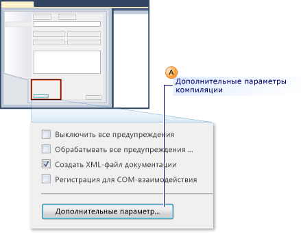
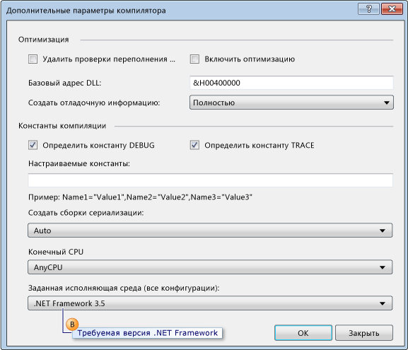
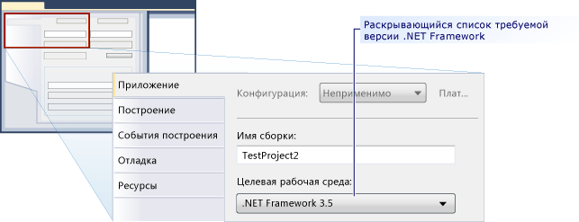

# <a name="how-to-configure-unit-tests-to-target-an-earlier-version-of-the-net-framework"></a>Практическое руководство. настройку модульных тестов для предыдущей версии .NET Framework

При создании тестового проекта в Microsoft Visual Studio последняя версия платформы .NET Framework устанавливается в качестве целевой по умолчанию. Кроме того, при обновлении тестовых проектов, созданных в предыдущих версиях Visual Studio, они обновляются до последней версии платформы .NET Framework. Путем изменения свойств проекта можно явно изменить целевую версию .NET Framework для проекта на более раннюю.

Вы можете создавать проекты модульных тестов, предназначенные для определенных версий .NET Framework. Целевой версией может быть версия 3.5 или более поздняя и не может быть версия клиента. Visual Studio включает следующую базовую поддержку для модульных тестов, которые предназначены для определенных версий:

- Можно создать проекты модульных тестов и установить для них определенную версию платформы .NET Framework.

- Можно запускать модульные тесты, которые предназначены для определенной версии платформы .NET Framework, в Visual Studio на локальном компьютере.

- Модульные тесты, которые предназначены для определенной версии платформы .NET Framework, можно запускать с помощью программы *MSTest.exe* из командной строки.

- Можно выполнять модульные тесты в агенте сборки в рамках сборки.

**Тестирование приложений SharePoint**

Перечисленные выше возможности также позволяют с помощью Visual Studio создавать модульные тесты и тесты интеграции для приложений SharePoint. Дополнительные сведения о способах разработки приложений SharePoint в Visual Studio см. в статьях [Создание решений SharePoint](../sharepoint/create-sharepoint-solutions.md), [Сборка и отладка решений SharePoint](../sharepoint/building-and-debugging-sharepoint-solutions.md) и [Проверка и отладка кода SharePoint](../sharepoint/verifying-and-debugging-sharepoint-code.md).

**Ограничения**

При изменении требуемой версии .NET Framework для тестовых проектов на более раннюю версию действуют указанные ниже ограничения.

- В .NET Framework 3.5 настройка для различных версий поддерживается для тестовых проектов, содержащих только модульные тесты. Версия .NET Framework 3.5 не поддерживает какие-либо другие типы тестов, например закодированные тесты пользовательского интерфейса или нагрузочные тесты. Изменение требуемой версии .NET Framework заблокировано для всех типов тестов, кроме модульных тестов.

- Выполнение тестов, которые предназначены для более ранних версий платформы .NET Framework, поддерживается только в адаптере по умолчанию. Оно не поддерживается для адаптера ASP.NET. Приложения ASP.NET, которые должны выполняться в контексте ASP.NET Development Server, должны быть совместимы с текущей версией .NET Framework.

- Поддержка сбора данных отключена при запуске тестов, поддерживающих настройку для различных версий, включая .NET Framework 3.5. Покрытие кода можно обеспечить с помощью программ командной строки Visual Studio.

- Модульные тесты, использующие .NET Framework 3.5, нельзя выполнять на удаленном компьютере.

- Невозможно назначить модульные тесты для более ранних клиентских версий платформы.

## <a name="retargeting-for-visual-basic-unit-test-projects"></a>Перенацеливание для проектов модульных тестов Visual Basic

1. Создайте **Проект модульного теста** на Visual Basic.

2. В **обозревателе решений** выберите пункт **Свойства** в контекстном меню нового тестового проекта Visual Basic.

     Будут показаны свойства тестового проекта Visual Basic.

3. На вкладке **Компиляция** выберите **Дополнительные параметры компиляции**, как показано на приведенной ниже иллюстрации.

     

4. С помощью раскрывающегося списка **Заданная исполняющая среда (все конфигурации)** измените требуемую версию на **.NET Framework 3.5** или на более позднюю, как показано в выноске В на рисунке ниже. Указывать версию клиента не следует.

     

## <a name="retargeting-for-c-unit-test-projects"></a>Перенацеливание для проектов модульных тестов C#

1. Создайте **Проект модульного теста** на C#.

2. В **обозревателе решений** выберите пункт **Свойства** в контекстном меню нового тестового проекта C#.

   Отображаются свойства тестового проекта C#.

3. На вкладке **Приложение** выберите **Целевая платформа**. В раскрывающемся списке выберите **.NET Framework 3.5** или более поздней версии, как показано на следующем рисунке. Указывать версию клиента не следует.

   

## <a name="retargeting-for-ccli-unit-test-projects"></a>Перенацеливание для проектов модульных тестов C++/CLI

1. Создайте **Проект модульного теста** на C++.

   > [!WARNING]
   > Для сборки модульных тестов C++/CLI для предыдущей версии платформы .NET Framework для Visual C++ следует использовать соответствующую версию Visual Studio.

2. В **обозревателе решений** выберите команду **Выгрузить проект** для нового тестового проекта C++.

3. В **обозревателе решений** выберите выгруженный тестовый проект C++, а затем **Изменить \<project name>.vcxproj**.

   *VCXPROJ*-файл откроется в редакторе.

4. Задайте для `TargetFrameworkVersion` версию 3.5 или более позднюю в группе `PropertyGroup`, обозначенной как `"Globals"`. Указывать версию клиента не следует.

    ```xml
    <PropertyGroup Label="Globals">
        <TargetName>DefaultTest</TargetName>
        <ProjectTypes>{3AC096D0-A1C2-E12C-1390-A8335801FDAB};{8BC9CEB8-8B4A-11D0-8D11-00A0C91BC942}</ProjectTypes>
        <ProjectGUID>{CE16D77A-E364-4ACD-948B-1EB6218B0EA3}</ProjectGUID>
        <TargetFrameworkVersion>3.5</TargetFrameworkVersion>
        <Keyword>ManagedCProj</Keyword>
        <RootNamespace>CPP_Test</RootNamespace>
      </PropertyGroup>
    ```

5. Сохраните и закройте *VCXPROJ*-файл.

6. В **обозревателе решений** выберите в контекстном меню нового тестового проекта C++ пункт **Перезагрузить проект**.

## <a name="see-also"></a>См. также

- [Создание решений SharePoint](../sharepoint/create-sharepoint-solutions.md)
- [Сборка и отладка решений SharePoint](../sharepoint/building-and-debugging-sharepoint-solutions.md)
- [Диалоговое окно "Дополнительные параметры компилятора" (Visual Basic)](../ide/reference/advanced-compiler-settings-dialog-box-visual-basic.md)
