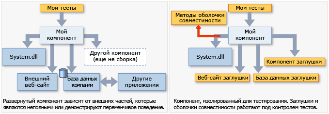

# <a name="isolate-code-under-test-with-microsoft-fakes"></a>Изоляция тестируемого кода с помощью Microsoft Fakes

Microsoft Fakes помогает изолировать тестируемый код, заменяя другие части приложения *заглушками* или *оболочками*. Это небольшие части кода, которые управляются тестами. Изолируя код для тестирования, при непрохождении теста вы будете знать, что причина лежит именно в этом коде, а не где-либо еще. Заглушки и оболочки также позволяют тестировать код, даже если другие части приложения еще не работают.

Fakes предлагает два варианта на выбор:

- [Заглушка](#get-started-with-stubs) заменяет класс небольшим заменителем, реализующим тот же интерфейс.  Для использования заглушек необходимо разработать приложение таким образом, чтобы каждый компонент зависел только от интерфейса, а не от других компонентов. (В данном случае "компонент" означает класс или группу классов, которые разрабатываются и обновляются вместе и обычно содержатся в сборке.)

- [Оболочка](#get-started-with-shims) изменяет скомпилированный код приложения во время выполнения, чтобы вместо заданного вызова метода он запускал код-оболочку, предоставляемый тестом. Оболочки можно использовать для замены вызовов сборок, которые невозможно изменить, например сборок .NET.



**Требования**

- Visual Studio Enterprise
- Проект .NET Framework
::: moniker range=">=vs-2019"
- Поддержка проектов в стиле пакета SDK, .NET Core и .NET 5.0, представленная в Visual Studio 2019 (обновление 6), включена по умолчанию в обновление 8. Дополнительные сведения см. в статье [Microsoft Fakes для проектов .NET Core и проектов в стиле SDK](/visualstudio/releases/2019/release-notes#microsoft-fakes-for-net-core-and-sdk-style-projects).
::: moniker-end

> [!NOTE]
> - Профилирование с помощью Visual Studio недоступно для тестов, использующих Microsoft Fakes.

## <a name="choose-between-stub-and-shim-types"></a>Выбор между заглушкой и оболочкой
Обычно проект Visual Studio считается компонентом, потому что эти классы разрабатываются и обновляются одновременно. Заглушки и оболочки можно использовать для вызовов, осуществляемых проектом в отношении других проектов в решении или других сборок, на которые ссылается проект.

Как правило, заглушки рекомендуется использовать для вызовов в пределах решения Visual Studio, а оболочки — для вызовов других сборок, на которые указывают ссылки. Это происходит потому, что в собственном решении рекомендуется отделять компоненты, указывая интерфейсы нужным заглушкам способом. Однако внешние сборки, такие как *System.dll*, обычно не предоставляются с отдельными определениями интерфейса, поэтому вместо них приходится использовать оболочки.

Вот некоторые другие причины.

**Производительность.** Оболочки выполняются медленнее, потому что они перезаписывают код во время выполнения. Заглушки не приводят к снижению производительности и выполняются так же быстро, как и виртуальные методы.

**Статические методы, запечатанные типы.** Заглушки можно использовать только для реализации интерфейсов. Таким образом, типы заглушек невозможно использовать для статических методов, невиртуальных методов, запечатанных виртуальных методов, методов в запечатанных типах и т. д.

**Внутренние типы.** Как заглушки, так и оболочки можно использовать с внутренними типами, доступ к которым предоставляется посредством атрибута сборки <xref:System.Runtime.CompilerServices.InternalsVisibleToAttribute>.

**Закрытые методы.** Оболочки могут заменять вызовы закрытых методов, если все типы в сигнатуре метода являются видимыми. Заглушки могут заменять только видимые методы.

**Интерфейсы и абстрактные методы.** Заглушки позволяют реализовывать интерфейсы и абстрактные методы, которые можно использовать при тестировании. Оболочки не могут реализовать интерфейсы и абстрактные методы, поскольку они не имеют тел методов.

Как правило, типы заглушек рекомендуется использовать для изоляции от зависимостей в базе кода. Для этого можно скрыть компоненты за интерфейсами. Типы оболочек можно использовать для изоляции от сторонних компонентов, которые не предоставляют пригодного для тестирования API.

## <a name="get-started-with-stubs"></a>Начало работы с заглушками
Дополнительные сведения см. в статье [Использование заглушек для изоляции частей приложений друг от друга при модульном тестировании](../test/using-stubs-to-isolate-parts-of-your-application-from-each-other-for-unit-testing.md).

1. **Вставка интерфейсов**

     Для использования заглушек необходимо написать код, который требуется протестировать таким образом, чтобы он явно не упоминал классы в другом компоненте приложения. В данном случае "компонент" значит класс или классы, которые разрабатываются и обновляются вместе и обычно содержатся в одном проекте Visual Studio. Переменные и параметры должны быть объявлены с помощью интерфейсов, а экземпляры других компонентов должны быть переданы в фабрику или созданы с ее помощью. Например, если StockFeed — это класс в другом компоненте приложения, то следующий код будет считаться неудачным.

     `return (new StockFeed()).GetSharePrice("COOO"); // Bad`

     Вместо этого определите интерфейс, который может быть реализован другим компонентом или заглушкой в целях тестирования.

    ```csharp
    public int GetContosoPrice(IStockFeed feed) => feed.GetSharePrice("COOO");
    ```

    ```vb
    Public Function GetContosoPrice(feed As IStockFeed) As Integer
     Return feed.GetSharePrice("COOO")
    End Function

    ```

2. **Добавление сборки Fakes**

   1. В **Обозревателе решений** выполните следующие действия: 
       - Для более старого проекта .NET Framework (не в стиле пакета SDK) разверните узел **Ссылки** проекта модульного теста.
       ::: moniker range=">=vs-2019"
       - Для проекта в стиле SDK, предназначенного для .NET Framework, .NET Core или .NET 5.0, разверните узел **Зависимости**, чтобы найти сборку, которую нужно имитировать в разделе **Сборки**, **Проекты** или **Пакеты**.
       ::: moniker-end
       - При работе в Visual Basic на панели инструментов **Обозревателя решений** необходимо выбрать команду **Показать все файлы**, чтобы просмотреть узел **Ссылки**.
   2. Выделите сборку, содержащую определения классов, для которых необходимо создать оболочки. Например, если требуется создать оболочку для **DateTime**, выберите **System.dll**.

   3. В контекстном меню щелкните **Добавить сборку имитаций**.

3. В тестах создайте экземпляры заглушки и предоставьте код для ее методов.

    ```csharp
    [TestClass]
    class TestStockAnalyzer
    {
        [TestMethod]
        public void TestContosoStockPrice()
        {
          // Arrange:

            // Create the fake stockFeed:
            IStockFeed stockFeed =
                 new StockAnalysis.Fakes.StubIStockFeed() // Generated by Fakes.
                     {
                         // Define each method:
                         // Name is original name + parameter types:
                         GetSharePriceString = (company) => { return 1234; }
                     };

            // In the completed application, stockFeed would be a real one:
            var componentUnderTest = new StockAnalyzer(stockFeed);

          // Act:
            int actualValue = componentUnderTest.GetContosoPrice();

          // Assert:
            Assert.AreEqual(1234, actualValue);
        }
        ...
    }
    ```

    ```vb
    <TestClass()> _
    Class TestStockAnalyzer

        <TestMethod()> _
        Public Sub TestContosoStockPrice()
            ' Arrange:
            ' Create the fake stockFeed:
            Dim stockFeed As New StockAnalysis.Fakes.StubIStockFeed
            With stockFeed
                .GetSharePriceString = Function(company)
                                           Return 1234
                                       End Function
            End With
            ' In the completed application, stockFeed would be a real one:
            Dim componentUnderTest As New StockAnalyzer(stockFeed)
            ' Act:
            Dim actualValue As Integer = componentUnderTest.GetContosoPrice
            ' Assert:
            Assert.AreEqual(1234, actualValue)
        End Sub
    End Class

    ```

    Особую роль здесь играет класс `StubIStockFeed`. Для каждого интерфейса в сборке, на которую указывает ссылка, механизм Microsoft Fakes создаст класс заглушки. Имя класса заглушки является производным от имени интерфейса, где `Fakes.Stub` — это префикс, за которым следуют имена типов параметров.

    Заглушки также создаются для методов получения и задания свойств, для событий и для универсальных методов. Дополнительные сведения см. в статье [Использование заглушек для изоляции частей приложений друг от друга при модульном тестировании](../test/using-stubs-to-isolate-parts-of-your-application-from-each-other-for-unit-testing.md).

## <a name="get-started-with-shims"></a>Начало работы с оболочками совместимости
(Дополнительные сведения см. в разделе [Использование оболочек совместимости для изоляции приложения от других сборок при модульном тестировании](../test/using-shims-to-isolate-your-application-from-other-assemblies-for-unit-testing.md).)

Предположим, что компонент содержит вызовы `DateTime.Now`.

```csharp
// Code under test:
    public int GetTheCurrentYear()
    {
       return DateTime.Now.Year;
    }
```

Во время тестирования потребовалось заменить свойство `Now` оболочкой, поскольку реальная версия при каждом вызове возвращает разные значения, что создает неудобства.

Для использования оболочек не следует изменять код приложения или писать его определенным способом.

1. **Добавление сборки Fakes**

     В **обозревателе решений** откройте ссылки проекта модульного теста и выберите ссылку на сборку, содержащую метод, который требуется имитировать. В этом примере класс `DateTime` находится в файле *System.dll*.  Чтобы просмотреть ссылки в проекте Visual Basic, щелкните **Показать все файлы**.

     Выберите **Добавить сборку имитаций**.

2. **Вставка оболочки в ShimsContext**

    ```csharp
    [TestClass]
    public class TestClass1
    {
            [TestMethod]
            public void TestCurrentYear()
            {
                int fixedYear = 2000;

                // Shims can be used only in a ShimsContext:
                using (ShimsContext.Create())
                {
                  // Arrange:
                    // Shim DateTime.Now to return a fixed date:
                    System.Fakes.ShimDateTime.NowGet =
                    () =>
                    { return new DateTime(fixedYear, 1, 1); };

                    // Instantiate the component under test:
                    var componentUnderTest = new MyComponent();

                  // Act:
                    int year = componentUnderTest.GetTheCurrentYear();

                  // Assert:
                    // This will always be true if the component is working:
                    Assert.AreEqual(fixedYear, year);
                }
            }
    }
    ```

    ```vb
    <TestClass()> _
    Public Class TestClass1
        <TestMethod()> _
        Public Sub TestCurrentYear()
            Using s = Microsoft.QualityTools.Testing.Fakes.ShimsContext.Create()
                Dim fixedYear As Integer = 2000
                ' Arrange:
                ' Detour DateTime.Now to return a fixed date:
                System.Fakes.ShimDateTime.NowGet = _
                    Function() As DateTime
                        Return New DateTime(fixedYear, 1, 1)
                    End Function

                ' Instantiate the component under test:
                Dim componentUnderTest = New MyComponent()
                ' Act:
                Dim year As Integer = componentUnderTest.GetTheCurrentYear
                ' Assert:
                ' This will always be true if the component is working:
                Assert.AreEqual(fixedYear, year)
            End Using
        End Sub
    End Class
    ```

    Имена классов оболочки создаются путем добавления префикса `Fakes.Shim` к имени исходного типа. Имена параметров добавляются к имени метода. (Ссылки на сборки в System.Fakes можно не добавлять.)

В предыдущем примере использовалась оболочка для статического метода. Чтобы использовать оболочку для метода экземпляра, вставьте `AllInstances` между именем типа и именем метода.

```vb
System.IO.Fakes.ShimFile.AllInstances.ReadToEnd = ...
```

(Нет сборки System.IO.Fakes для ссылки. Пространство имен создается в процессе создания оболочки. Однако можно использовать using или Import обычным способом.)

Можно также создать оболочки для отдельных экземпляров, конструкторов и свойств. Дополнительные сведения см. в статье [Использование оболочек совместимости для изоляции приложения от других сборок при модульном тестировании](../test/using-shims-to-isolate-your-application-from-other-assemblies-for-unit-testing.md).

## <a name="using-microsoft-fakes-in-the-ci"></a>Использование Microsoft Fakes при непрерывной интеграции

### <a name="microsoft-fakes-assembly-generation"></a>Создание сборки Microsoft Fakes
Так как для Microsoft Fakes требуется Visual Studio Enterprise, то для создания сборок Fakes необходимо создать проект с помощью [задачи сборки Visual Studio](/azure/devops/pipelines/tasks/build/visual-studio-build?view=azure-devops&preserve-view=true).

::: moniker range=">=vs-2019"
> [!NOTE]
> Альтернативный вариант — проверить сборки Fakes в процессе непрерывной интеграции и использовать [задачи MSBuild](../msbuild/msbuild-task.md?view=vs-2019&preserve-view=true). После этого необходимо убедиться, что в тестовом проекте есть ссылка на созданную сборку Fakes, как показано в следующем фрагменте кода:

```xml
<Project Sdk="Microsoft.NET.Sdk">
    <ItemGroup>
        <Reference Include="FakesAssemblies\System.Fakes.dll">
    </ItemGroup>
</Project>
```

Эту ссылку необходимо добавить вручную в конкретные проекты в стиле пакета SDK (.NET Core, .NET 5.0 и .NET Framework), так как мы перешли к неявному добавлению ссылок на сборки в тестовом проекте. При использовании этого метода необходимо убедиться, что сборки Fakes обновляются при изменении родительской сборки.
::: moniker-end

### <a name="running-microsoft-fakes-tests"></a>Запуск тестов Microsoft Fakes
Пока в настроенном каталоге `FakesAssemblies` имеются сборки Microsoft Fakes (по умолчанию `$(ProjectDir)FakesAssemblies`), можно запустить тесты с помощью [задачи vstest](/azure/devops/pipelines/tasks/test/vstest?view=azure-devops&preserve-view=true).

::: moniker range=">=vs-2019"
Для распределенного тестирования с помощью [задачи vstest](/azure/devops/pipelines/tasks/test/vstest?view=azure-devops&preserve-view=true) для проектов .NET Core и .NET 5.0, использующих Microsoft Fakes, требуется Microsoft Visual Studio 2019 (обновление 9) предварительной версии `20201020-06` и более поздней.
::: moniker-end

::: moniker range=">=vs-2019"
## <a name="transitioning-your-net-framework-test-projects-that-use-microsoft-fakes-to-sdk-style-net-framework-net-core-or-net-50-projects"></a>Переход от тестовых проектов .NET Framework, использующих Microsoft Fakes, к проектам .NET Core, .NET 5.0 или .NET Framework в стиле пакета SDK
Потребуется внести минимальные изменения в настройки .NET Framework для Microsoft Fakes, чтобы перейти на использование .NET Core или .NET 5.0. Ниже приведены требования, которые необходимо учитывать.
- Если вы используете шаблон пользовательского проекта, убедитесь, что он в стиле пакета SDK и создан для совместимой требуемой версии .NET Framework.
- Некоторые типы существуют в разных сборках в .NET Framework и .NET Core/.NET 5.0 (например, `System.DateTime` существует в `System`/`mscorlib` в .NET Framework, а `System.Runtime` — в .NET Core и .NET 5.0). В этих сценариях необходимо изменить подделываемую сборку.
- Если имеется ссылка на сборку Fakes и тестовый проект, может появиться предупреждение сборки об отсутствии ссылки, подобное этому:
  ```
  (ResolveAssemblyReferences target) ->
  warning MSB3245: Could not resolve this reference. Could not locate the assembly "AssemblyName.Fakes". Check to make sure the assembly exists on disk.
  If this reference is required by your code, you may get compilation errors.
  ```
  Это предупреждение отображается, так как необходимые изменения, внесенные при создании сборки Fakes, можно игнорировать. Этого можно избежать, удалив ссылку на сборку из файла проекта, так как теперь мы неявно добавляем их во время сборки.
::: moniker-end

## <a name="microsoft-fakes-support"></a>Поддержка Microsoft Fakes 
### <a name="microsoft-fakes-in-older-projects-targeting-net-framework-non-sdk-style"></a>Microsoft Fakes в старых проектах, предназначенных для .NET Framework (не в стиле пакета SDK).
- Создание сборки Microsoft Fakes поддерживается в Visual Studio Enterprise 2015 и более поздних версиях.
- Тесты Microsoft Fakes можно выполнять со всеми доступными пакетами NuGet Microsoft.TestPlatform.
- Объем протестированного кода поддерживается для тестовых проектов с помощью Microsoft Fakes в Visual Studio Enterprise 2015 и более поздних версиях.

### <a name="microsoft-fakes-in-sdk-style-net-framework-net-core-and-net-50-projects"></a>Microsoft Fakes в проектах .NET Core, .NET Framework и .NET 5.0 в стиле пакета SDK
- Создание сборки Microsoft Fakes, представленное в Visual Studio Enterprise 2019 (обновление 6), включено по умолчанию в обновлении 8.
- Тесты Microsoft Fakes для проектов, которые предназначены для .NET Framework, можно выполнять со всеми доступными пакетами NuGet Microsoft.TestPlatform.
- Тесты Microsoft Fakes для проектов, которые предназначены для .NET Core и .NET 5.0, можно выполнять с пакетами NuGet Microsoft.TestPlatform с версиями [16.9.0-preview-20210106-01](https://www.nuget.org/packages/Microsoft.TestPlatform/16.9.0-preview-20210106-01) и выше.
- Объем протестированного кода поддерживается для тестовых проектов, которые предназначены для .NET Framework, с помощью Microsoft Fakes в Visual Studio Enterprise версии 2015 и более поздних.
- Поддержка покрытия кода для тестовых проектов, предназначенных для .NET Core и .NET 5.0, с помощью Microsoft Fakes, доступна в Visual Studio 2019 с обновлением 9 и более поздних версий.


## <a name="in-this-section"></a>Содержание раздела
[Использование заглушек для изоляции частей приложений друг от друга при модульном тестировании](../test/using-stubs-to-isolate-parts-of-your-application-from-each-other-for-unit-testing.md)

[Использование оболочек совместимости для изоляции приложения от других сборок при модульном тестировании](../test/using-shims-to-isolate-your-application-from-other-assemblies-for-unit-testing.md)

[Формирование и компиляция кода, а также соглашения об именовании в Microsoft Fakes](../test/code-generation-compilation-and-naming-conventions-in-microsoft-fakes.md)
