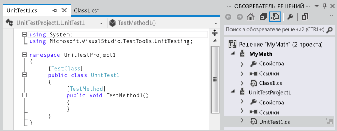
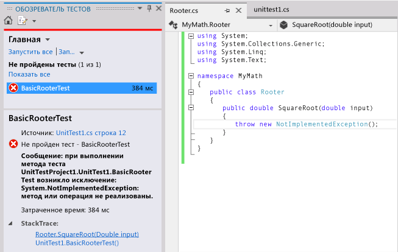
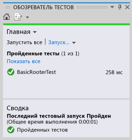
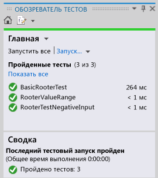

# <a name="quickstart-test-driven-development-with-test-explorer"></a>Краткое руководство. Разработка на основе тестирования с помощью обозревателя тестов

Рекомендуется создать модульные тесты, чтобы помочь обеспечивать правильность работы кода при многошаговой разработке. Существует несколько платформ, которые можно использовать для написания модульных тестов, в том числе разработанные третьими сторонами. Некоторые тестовые среды специализируются на тестировании на различных языках или платформах. Обозреватель тестов предоставляет единый интерфейс модульных тестов для любых таких платформ. Доступны адаптеры для наиболее часто используемых платформ, при этом можно написать собственные адаптеры для других платформ.

Обозреватель тестов замещает окна модульных тестов предыдущих выпусков Visual Studio. Преимущества:

- Возможность запуска .NET, базы данных и других типов тестов с использованием единого интерфейса.

- Возможность использовать платформу модульных тестов, например NUnit или MSTest.

- Возможность увидеть всю требуемую информацию в одном окне.

## <a name="use-test-explorer"></a>Использование обозревателя тестов


### <a name="to-run-unit-tests-by-using-test-explorer"></a>Запуск модульных тестов с помощью обозревателя тестов

1. Создайте модульные тесты, которые используют выбранные тестовые среды. Например, для создания теста, использующего платформу MSTest:

   1. Создайте проект **Проект модульного теста** для C#, Visual Basic или C++.

   2. Напишите каждый модульный тест в виде метода. Добавьте каждый тестовый метод к атрибуту `[TestMethod]` .

2. Если отдельные тесты не имеют зависимостей, предотвращающих запуск этих тестов в любом порядке, включите параллельное тестирование с помощью переключателя  на панели инструментов. Это может заметно сократить время, необходимое для выполнения всех тестов.

3. В строке меню выберите **Тест** > **Выполнение модульных тестов** > **Все тесты**.

    Выполняется сборка решения, запускаются тесты.

    Обозреватель тестов откроет и отобразит сводку результатов.

   **Чтобы просмотреть весь список тестов:** выберите **Показать все** в любой категории.

   **Чтобы просмотреть сведения о результате теста:** для просмотра подробных сведений, например сообщений об исключениях, в области подробных сведений выберите тест в обозревателе тестов.

   **Чтобы перейти к коду теста:** дважды щелкните тест в обозревателе тестов или выберите **Открыть тест** в контекстном меню.

   **Чтобы выполнить отладку теста:** откройте контекстное меню одного или нескольких тестов, а затем выберите **Отладить выбранные тесты**.

> [!IMPORTANT]
> Отобразятся результаты для самого последнего запуска. Выделенная цветом панель результатов отображает только результаты тестов, которые были запущены. Например, если были запущены тесты, некоторые из которых завершились неудачей, а затем запущены только успешно завершенные тесты, панель результатов будет выделена зеленым цветом.

> [!NOTE]
> Если тест не отображается, убедитесь в том, что установлен адаптер для связи обозревателя тестов с используемой для тестов платформой. Дополнительные сведения см. в разделе [Установка платформ модульного тестирования сторонних поставщиков](install-third-party-unit-test-frameworks.md).

## <a name="walkthrough-using-unit-tests-to-develop-a-method"></a>Пошаговое руководство. Использование модульных тестов для разработки метода

В данном пошаговом руководстве показано, как разработать тестируемый метод в C# с помощью платформы для выполнения модульных тестов Microsoft. Можно легко адаптировать его для других языков, а также использовать другие тестовые платформы, например NUnit. Дополнительные сведения см. в разделе [Установка платформ модульного тестирования сторонних поставщиков](install-third-party-unit-test-frameworks.md).

### <a name="create-the-test-and-method"></a>Создание теста и метода

1. Создайте проект **Библиотека классов** на C#. Данный проект будет содержать код, который необходимо предоставить. В этом примере используется имя `MyMath`.

2. Создайте проект **Проект модульного теста**.

   

3. Напишите основной тестовый метод. Проверьте результат, полученный для определенных входных данных:

   ```csharp

   [TestMethod]
   public void BasicRooterTest()
   {
     // Create an instance to test:
     Rooter rooter = new Rooter();
     // Define a test input and output value:
     double expectedResult = 2.0;
     double input = expectedResult * expectedResult;
     // Run the method under test:
     double actualResult = rooter.SquareRoot(input);
     // Verify the result:
     Assert.AreEqual(expectedResult, actualResult,
         delta: expectedResult / 100);
   }
   ```

4. Создайте метод из теста.

   1. Поместите курсор в `Rooter` и в контекстном меню выберите пункт **Сформировать** > **Создать тип**.

   2. В диалоговом окне **Сформировать новый тип** установите **Проект** в проект библиотеки классов. В этом примере это `MyMath`.

   3. Поместите курсор в `SquareRoot` и в контекстном меню выберите пункт **Сформировать** > **Заглушка метода**.

5. Выполните модульный тест.

   1. В меню **Тест** выберите **Выполнение модульных тестов** > **Все тесты**.

        Выполняется сборка и запуск решения.

        Открывается обозреватель тестов, в котором отображаются результаты.

        Данный тест отобразится в разделе **Неудачные тесты**.

6. Выберите имя теста.

    Дополнительные сведения о тесте появятся в нижней части обозревателя тестов.

7. Выберите элементы в разделе **Трассировка стека** , чтобы увидеть, где тест не пройден.

   

   На данном этапе создан тест и заглушка, которые будут изменены таким образом, что тест будет успешно пройден.

#### <a name="after-every-change-make-all-the-tests-pass"></a>После каждого изменения все тесты должны быть успешно пройдены

1. В *MyMath\Rooter.cs* усовершенствуйте код `SquareRoot`:

    ```csharp
    public double SquareRoot(double input)
     {
       return input / 2;
     }
    ```

2. В разделе "Обозреватель тестов" выберите **Запустить все**.

     Выполняется сборка кода и запуск тестов.

     Тест проходит.

     

#### <a name="add-tests-to-extend-the-range-of-inputs"></a>Добавьте тесты, чтобы расширить диапазон входных данных

1. Для уверенности, что код работает во всех случаях, добавьте тесты, которые используют более широкий диапазон входных значений.

    > [!TIP]
    > Избегайте изменения существующих успешно выполненных тестов. Вместо этого добавьте новые тесты. Изменяйте существующие тесты только в тех случаях, когда меняются пользовательские требования. Такой подход позволяет не потерять существующие функциональные возможности при работе с расширенным кодом.

     В тестовом классе добавьте следующий тест, который использует диапазон входных значений:

    ```csharp
    [TestMethod]
    public void RooterValueRange()
    {
      // Create an instance to test:
      Rooter rooter = new Rooter();
      // Try a range of values:
      for (double expectedResult = 1e-8;
          expectedResult < 1e+8;
          expectedResult = expectedResult * 3.2)
      {
        RooterOneValue(rooter, expectedResult);
      }
    }

    private void RooterOneValue(Rooter rooter, double expectedResult)
    {
      double input = expectedResult * expectedResult;
      double actualResult = rooter.SquareRoot(input);
      Assert.AreEqual(expectedResult, actualResult,
          delta: expectedResult / 1000);
    }
    ```

2. В разделе "Обозреватель тестов" выберите **Запустить все**.

     Новый тест завершается неудачей несмотря на то, что первый тест по-прежнему завершается успешно.

     Для нахождения точки сбоя выберите завершенный неудачей тест в нижней части обозревателя тестов и выберите верхний элемент **Трассировка стека**.

3. Проверьте тестируемый метод, чтобы узнать, что не так. В классе `MyMath.Rooter` перепишите код:

    ```csharp
    public double SquareRoot(double input)
    {
      double result = input;
      double previousResult = -input;
      while (Math.Abs(previousResult - result) > result / 1000)
      {
        previousResult = result;
        result = result - (result * result - input) / (2 * result);
      }
      return result;
    }
    ```

4. В разделе "Обозреватель тестов" выберите **Запустить все**.

     Теперь оба теста завершаются успешно.

#### <a name="add-tests-for-exceptional-cases"></a>Добавление тестов для исключительных случаев

1. Добавьте тест для отрицательных входных значений:

    ```csharp
    [TestMethod]
     public void RooterTestNegativeInputx()
     {
         Rooter rooter = new Rooter();
         try
         {
             rooter.SquareRoot(-10);
         }
         catch (ArgumentOutOfRangeException e)
         {
             return;
         }
         Assert.Fail();
     }
    ```

2. В разделе "Обозреватель тестов" выберите **Запустить все**.

     Тестируемый метод зацикливается, его необходимо отменить вручную.

3. Выберите **Отмена**.

     Тест останавливается через 10 секунд.

4. Исправьте код метода:

    ```csharp

    public double SquareRoot(double input)
    {
      if (input <= 0.0)
      {
        throw new ArgumentOutOfRangeException();
      }
    ...
    ```

5. В разделе "Обозреватель тестов" выберите **Запустить все**.

     Все тесты завершаются успешно.

#### <a name="refactor-without-changing-tests"></a>Рефакторинг без изменения тестов

1. Упростите код, но не изменяйте тесты.

    > [!TIP]
    > *Рефакторинг* — это изменение, которое делает код более производительным или более понятным. Это действие не предназначено для изменения поведения кода, поэтому тесты не изменяются.
    >
    > Рекомендуется выполнять рефакторинг отдельно от расширения функциональности. Неизменяемость тестов уменьшает шансы случайных ошибок во время рефакторинга.

    ```csharp
    public class Rooter
    {
      public double SquareRoot(double input)
      {
        if (input <= 0.0)
        {
          throw new ArgumentOutOfRangeException();
        }
        double result = input;
        double previousResult = -input;
        while (Math.Abs(previousResult - result) > result / 1000)
        {
          previousResult = result;
          result = (result + input / result) / 2;
          //was: result = result - (result * result - input) / (2*result);
        }
        return result;
      }
    }
    ```

2. Выберите **Запустить все**.

     Все тесты по-прежнему завершаются успехом.

     
