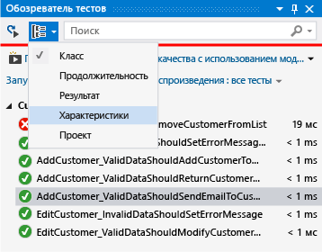
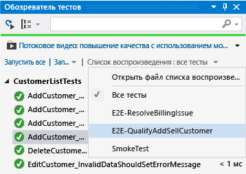
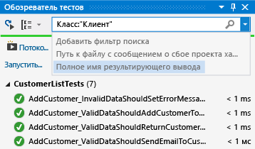

# <a name="run-unit-tests-with-test-explorer"></a>Выполнение модульных тестов с помощью обозревателя тестов

С помощью обозревателя тестов вы можете запускать модульные тесты из Visual Studio или сторонних проектов модульного тестирования. Кроме того, обозреватель тестов позволяет группировать тесты по категориям, фильтровать список тестов, а также создавать, сохранять и запускать списки воспроизведения тестов. Вы также можете анализировать объем протестированного кода и [отлаживать модульные тесты](../test/debug-unit-tests-with-test-explorer.md).

Тесты в **обозревателе тестов** можно выполнять из нескольких тестовых проектов в решении, а также из тестовых классов, которые входят в производственные проекты. Тестовые проекты могут использовать различные платформы модульного тестирования. При написании тестируемого кода для платформы .NET тестовый проект можно написать на любом языке, который также ориентирован на платформу .NET, независимо от языка целевого кода. Проекты машинного кода C/C++ необходимо тестировать с помощью платформы модульного тестирования C++.

## <a name="build-your-test-project"></a>Сборка тестового проекта

Если вы еще не подготовили тестовый проект в решении Visual Studio, необходимо сначала создать его и выполнить его сборку.

- [Приступая к работе с модульным тестированием (.NET)](../test/getting-started-with-unit-testing.md)
- [Написание модульных тестов для C/C++](writing-unit-tests-for-c-cpp.md)

Visual Studio включает платформу модульного тестирования Майкрософт для управляемого и машинного кода. Однако с помощью обозревателя тестов можно также запустить любую платформу модульного тестирования, в которой реализован адаптер обозревателя тестов. Дополнительные сведения об установке сторонних платформ модульного тестирования см. в разделе [Установка платформ модульного тестирования сторонних поставщиков](../test/install-third-party-unit-test-frameworks.md)

## <a name="run-tests-in-test-explorer"></a>Выполнение тестов в обозревателе тестов

При построении проекта тестирования тесты появляются в Обозревателе тестов. Если обозреватель тестов не виден, выберите **Тест** в меню Visual Studio, **Окна**, затем **Обозреватель тестов** (или нажмите клавиши **CTRL** + **E**, **T**).

::: moniker range="vs-2017"

::: moniker-end
::: moniker range=">=vs-2019"

::: moniker-end

::: moniker range="vs-2017"
При выполнении, написании и повторном запуске тестов обозреватель тестов отображает результаты в группах по умолчанию **Неудачные тесты**, **Пройденные тесты**, **Пропущенные тесты** и **Не запущенные тесты**. Можно изменить способ группировки тестов обозревателем тестов.
::: moniker-end
::: moniker range=">=vs-2019"
При запуске, записи и повторном запуске тестов результаты в обозревателе тестов отображаются в стандартных группах **Проект**, **Пространство имен** и **Класс**. Вы можете изменить способ группировки тестов обозревателем тестов.
::: moniker-end

Большую часть работы по поиску, организации и выполнению тестов можно выполнять из панели инструментов **обозревателя тестов**.

::: moniker range="vs-2017"

::: moniker-end
::: moniker range=">=vs-2019"

::: moniker-end

### <a name="run-tests"></a>Выполнить тесты

::: moniker range="vs-2017"
Можно выполнить все тесты в решении, все тесты в группе или выбранный набор тестов. Выполните одно из следующих действий.

- Чтобы выполнить все тесты в решении, выберите **Запустить все** (или нажмите клавиши **CTRL** + **R**, **V**).

- Чтобы выполнить все тесты в группе по умолчанию, выберите **Запуск**, а затем группу в меню.

- Выберите отдельные тесты, которые требуется запустить, откройте контекстное меню для выбранного теста и щелкните **Запустить выбранные тесты** (или нажмите клавиши **CTRL** + **R**, **T**).

- Если отдельные тесты не имеют зависимостей, предотвращающих запуск этих тестов в любом порядке, включите параллельное тестирование с помощью переключателя  на панели инструментов. Это может заметно сократить время, необходимое для выполнения всех тестов.

Анимированная строка **Пройдено/сбой** вверху окна **обозревателя тестов** изменяется по мере выполнения тестов. По завершении тестового запуска эта строка становится зеленой, если все тесты пройдены, или красной, если какой-либо из тестов не пройден **.**
::: moniker-end
::: moniker range=">=vs-2019"
Можно выполнить все тесты в решении, все тесты в группе или выбранный набор тестов. Выполните одно из следующих действий.

- Чтобы выполнить все тесты в решении, выберите значок **Выполнить все** (или нажмите клавиши **CTRL** + **R**, **V**).

- Чтобы выполнить все тесты в группе по умолчанию, выберите значок **Запуск**, а затем группу в меню.

- Выберите отдельные тесты, которые требуется запустить, откройте контекстное меню для выбранного теста и щелкните **Запустить выбранные тесты** (или нажмите клавиши **CTRL** + **R**, **T**).

- Если отдельные тесты не имеют зависимостей, предотвращающих запуск этих тестов в любом порядке, включите параллельное тестирование в меню параметров на панели инструментов. Это может заметно сократить время, необходимое для выполнения всех тестов.
::: moniker-end

### <a name="run-tests-after-every-build"></a>Запуск тестов после каждой сборки
::: moniker range="vs-2017"
|Кнопка|Описание|
|-|-|
||Чтобы запускать модульные тесты после каждой локальной сборки, в стандартном меню выберите **Тест**, а затем выберите **Выполнить тесты после сборки** в панели инструментов **обозревателя тестов**.|

> [!NOTE]
> Запуск модульных тестов после каждой сборки требует Visual Studio 2017 Enterprise или Visual Studio 2019. В Visual Studio 2019 он включен в Community и Professional, а также в Enterprise.
::: moniker-end
::: moniker range=">=vs-2019"
Чтобы запустить модульные тесты после каждой локальной сборки, на панели инструментов обозревателя тестов щелкните значок "Параметры" и выберите в меню пункт **Выполнить тесты после сборки**.
::: moniker-end

## <a name="view-test-results"></a>Просматривать результаты тестов

При выполнении, написании и повторном запуске тестов обозреватель тестов отображает результаты в группах **Неудачные тесты**, **Пройденные тесты**, **Пропущенные тесты** и **Не запущенные тесты**. В области сведений в нижней или боковой части окна обозревателя тестов отображается сводка тестового запуска.

### <a name="view-test-details"></a>Просмотр сведений о тесте

Для просмотра подробных сведений для отдельного теста выберите тест.

::: moniker range="vs-2017"

::: moniker-end
::: moniker range=">=vs-2019"

::: moniker-end

В области сведений о тесте отображаются следующие сведения.

- Имя исходного файла и номер строки метода теста.

- Состояние теста.

- Время, затраченное на выполнение метода теста.

Если тест не пройден, в области сведений также отображается следующее:

- сообщение, возвращенное платформой модульного тестирования для теста;

- трассировка стека во время сбоя теста.

### <a name="view-the-source-code-of-a-test-method"></a>Просмотр исходного кода метода теста

Чтобы вывести исходный код для метода теста в редакторе Visual Studio, выберите тест, а затем в контекстном меню щелкните **Открыть тест** (или нажмите клавишу **F12**).

## <a name="group-and-filter-the-test-list"></a>Группировка и фильтрация списка тестов

Обозреватель тестов позволяет группировать тесты в стандартные категории. Большинство платформ модульного тестирования, которые работают в обозревателе тестов, позволяют определить собственные категории и пары "категория — значение" для группировки тестов. Кроме того, список тестов можно фильтровать, сопоставляя строки со свойствами теста.

### <a name="group-tests-in-the-test-list"></a>Группирование тестов в списке тестов

::: moniker range="vs-2017"
Чтобы изменить способ организации тестов, щелкните стрелку "вниз" рядом с кнопкой **Группировать** и выберите новые условия группировки.


::: moniker-end
::: moniker range=">=vs-2019"
Обозреватель тестов позволяет группировать тесты в иерархию. Иерархические группы по умолчанию: **Проект**, **Пространство имен**, а затем **Класс**. Чтобы изменить способ упорядочения тестов, нажмите кнопку **Группировать по** и выберите новые условия группировки.


Вы можете определить собственные уровни иерархии и сгруппировать по **состоянию**, а затем **классу**, например, выбрав параметры "Группировать по" в порядке предпочтения.


::: moniker-end

### <a name="test-explorer-groups"></a>Группы обозревателя тестов

::: moniker range="vs-2017"
|Группа|Описание|
|-|-----------------|
|**Длительность**|Группировка тестов по времени выполнения: **Быстро**, **Средне** и **Медленно**.|
|**Результат**|Группировка тестов по результатами выполнения: **Неудачные тесты**, **Пропущенные тесты**, **Пройденные тесты**.|
|**Признаки**|Группировка тестов по паре "категория — значение", заданной пользователем. Синтаксис для указания категорий и значений признаков определяется платформой модульного тестирования.|
|**Проект**|Группировка тестов по именам проектов.|
::: moniker-end
::: moniker range=">=vs-2019"
|Группа|Описание|
|-|-----------------|
|**Длительность**|Группировка тестов по времени выполнения: **Быстро**, **Средне** и **Медленно**.|
|**Состояние**|Группировка тестов по результатами выполнения: **Неудачные тесты**, **Пропущенные тесты**, **Пройденные тесты**, **Не выполнено**.|
|**Целевая рабочая среда** | Группировка тестов по платформе цели их проекта. |
|**Пространство имен**|Группировка тестов по пространству имен, к которому они относятся.|
|**Project**|Группировка тестов по проекту, к которому они относятся.|
|**Класс**|Группировка тестов по классу, в который они входят.|
::: moniker-end

### <a name="traits"></a>Признаки

Признак обычно представляет собой пару "имя — значение" категории, однако может быть и отдельной категорией. Признаки могут назначаться методам, которые идентифицируются платформой модульного тестирования как методы теста. Платформа модульного тестирования может определять категории признаков. Чтобы определить собственные пары "имя — значение" категории, можно добавлять значения в категории признаков. Синтаксис для указания категорий и значений признаков определяется платформой модульного тестирования.

**Признаки в платформе модульного тестирования Майкрософт для управляемого кода**

В платформе модульного тестирования Майкрософт для управляемых приложений можно определить пару "имя — значение" признака в атрибуте  <xref:Microsoft.VisualStudio.TestTools.UnitTesting.TestPropertyAttribute> . Платформа тестирования также содержит следующие стандартные признаки.

|Признак|Описание|
|-|-----------------|
|<xref:Microsoft.VisualStudio.TestTools.UnitTesting.OwnerAttribute>|Категория "Владелец" определяется платформой модульного тестирования. Вы должны указать строковое значение владельца.|
|<xref:Microsoft.VisualStudio.TestTools.UnitTesting.PriorityAttribute>|Категория "Приоритет" определяется платформой модульного тестирования. Вы должны указать целочисленное значение приоритета.|
|<xref:Microsoft.VisualStudio.TestTools.UnitTesting.TestCategoryAttribute>|Атрибут TestCategory позволяет указать категорию модульного теста.|
|<xref:Microsoft.VisualStudio.TestTools.UnitTesting.TestPropertyAttribute>|Атрибут TestProperty позволяет определять пары "категория — значение" признака.|


**Признаки в платформе модульного тестирования Майкрософт для C++**

См. раздел [Использование платформы модульного тестирования Майкрософт для C++](how-to-use-microsoft-test-framework-for-cpp.md).

## <a name="create-custom-playlists"></a>Создание настраиваемых списков воспроизведения

::: moniker range="vs-2017"
Вы можете создавать и сохранять список тестов, которые необходимо выполнять или просматривать как группу. Если выбрать список воспроизведения, тесты в списке отображаются в обозревателе тестов. Вы можете добавить тест в несколько списков воспроизведения, а если выбрать список воспроизведения по умолчанию **Все тесты** , будут доступны все тесты в проекте.



**Чтобы создать список воспроизведения**, выберите один или несколько тестов в обозревателе тестов. В контекстном меню выберите **Добавить в список воспроизведения** > **Новый список воспроизведения**. Сохраните файл с именем и в расположении, указанном в диалоговом окне **Создать новый список воспроизведения** .

**Чтобы добавить тест в список воспроизведения**, выберите один или несколько тестов в обозревателе тестов. В контекстном меню выберите **Добавить в список воспроизведения**, а затем выберите список воспроизведения, в который хотите добавить тесты.

**Чтобы открыть список воспроизведения**, щелкните **Тест** > **Список воспроизведения** в меню Visual Studio, а затем выберите список воспроизведения в списке недавно использовавшихся элементов или нажмите кнопку **Открыть список воспроизведения**, чтобы указать имя и расположение нужного списка.

Если отдельные тесты не имеют зависимостей, предотвращающих запуск этих тестов в любом порядке, включите параллельное тестирование с помощью переключателя  на панели инструментов. Это может заметно сократить время, необходимое для выполнения всех тестов.
::: moniker-end
::: moniker range=">=vs-2019"
Вы можете создавать и сохранять список тестов, которые необходимо выполнять или просматривать как группу. Если выбрать список воспроизведения, тесты в списке отображаются на новой вкладке обозревателя тестов. Вы можете добавить тест в несколько списков воспроизведения.

**Чтобы создать список воспроизведения**, выберите один или несколько тестов в обозревателе тестов. В контекстном меню выберите **Добавить в список воспроизведения** > **Новый список воспроизведения**.


Список воспроизведения открывается на новой вкладке обозревателя тестов. Этот список воспроизведения можно использовать один раз, а затем удалить его. Вы также можете нажать кнопку **Сохранить** на панели инструментов окна списка воспроизведения, а затем выбрать имя и расположение, чтобы сохранить список.


**Чтобы создать список воспроизведения**, выберите один или несколько тестов в обозревателе тестов. Щелкните правой кнопкой мыши и выберите **Добавить в список воспроизведения** > **Новый список воспроизведения**.

**Чтобы открыть список воспроизведения**, выберите значок списка воспроизведения на панели инструментов Visual Studio и выберите в меню сохраненный ранее файл списка.

**Чтобы изменить список воспроизведения**, щелкните правой кнопкой мыши любой тест и воспользуйтесь пунктами меню для его добавления или удаления в списке.

Начиная с Visual Studio 2019 версии 16.7, кнопка **Изменить** доступна на панели инструментов. Рядом с тестами отобразятся флажки, которые показывают, какие тесты включены в список воспроизведения и исключены из него. Внесите необходимые изменения в группы.


Вы также можете помечать флажком родительские группы в иерархии. Это делает список воспроизведения динамическим, и он будет постоянно обновляться в зависимости от тестов в той или иной группе. Например, если установить флажок напротив класса, то любой добавляемый из этого класса тест будет включаться в список. Если удалить тест из этого класса, он будет удален из списка воспроизведения. Чтобы получить дополнительные сведения о правилах, сохраните список воспроизведения с помощью кнопки "Сохранить" на панели инструментов и откройте файл *.playlist*, созданный на диске. В этом файле перечислены все правила и отдельные тесты, входящие в список воспроизведения.


Если вы хотите создать список воспроизведения для признаков, используйте для MSTest указанный ниже формат.
```xml
<Playlist Version="2.0">
    <Rule Name="Includes" Match="Any">
        <Property Name="Trait" Value="SchemaUpdateBasic" />
    </Rule>
</Playlist>
```

Для xUnit используйте указанный ниже формат. Убедитесь в наличии пробела между вашим названием `TestCategory` и `[Value]`.
```xml
<Playlist Version="2.0">
  <Rule Name="Includes" Match="Any">
    <Rule Match="All">
      <Property Name="Solution" />
        <Rule Match="Any">
            <Property Name="Trait" Value="TestCategory [Value]" />
        </Rule>
    </Rule>
  </Rule>
</Playlist>
```

::: moniker-end

::: moniker range=">=vs-2019"
### <a name="test-explorer-columns"></a>Столбцы обозревателя тестов

[Группы](#test-explorer-groups) также доступны в качестве столбцов в обозревателе тестов вместе с параметрами "Признак", "Трассировка стека", "Сообщение об ошибке" и "Полное имя". Большинство столбцов не отображаются по умолчанию. Вы можете настроить, какие столбцы отображаются и в каком порядке.


### <a name="filter-sort-and-rearrange-test-columns"></a>Фильтрация, сортировка и изменение порядка столбцов теста

Можно отфильтровать, отсортировать столбцы и изменить их порядок.
* Чтобы выполнить фильтрацию по конкретным признакам, щелкните значок фильтра в верхней части столбца "Признаки".

  

* Чтобы изменить порядок столбцов, щелкните заголовок столбца и перетащите его влево или вправо.

* Чтобы отсортировать столбец, щелкните заголовок столбца. Не все столбцы можно отсортировать. Можно также выполнить сортировку по дополнительному столбцу, удерживая клавишу **SHIFT** и щелкнув дополнительный заголовок столбца.

  
::: moniker-end

## <a name="search-and-filter-the-test-list"></a>Поиск и фильтрация списка тестов

Фильтры поиска обозревателя тестов можно также использовать для ограничения методов теста в проектах, которые вы просматриваете и запускаете.

Когда вы вводите строку в поле поиска **обозревателя тестов** и нажимаете клавишу **ВВОД**, список тестов фильтруется для отображения только тех тестов, полные имена которых содержат эту строку.

Фильтрация по различным условиям

1. Откройте раскрывающийся список справа от поля поиска.

2. Выберите новое условие.

3. Введите значение фильтра в кавычках. Если требуется найти точное совпадение в строке вместо совпадения, содержащего в себе текст, используйте знак равенства (=) вместо двоеточия (:).

::: moniker range="vs-2017"

::: moniker-end
::: moniker range=">=vs-2019"

::: moniker-end

> [!NOTE]
> Поиск выполняется без учета регистра и сопоставляет указанную строку с любой частью значения условия.

::: moniker range="vs-2017"
|Квалификатор|Описание|
|-|-----------------|
|**Признак**|Поиск категории и значения признака, совпадающих с заданной строкой. Синтаксис для указания категорий и значений признаков определяется платформой модульного тестирования.|
|**Project**|Поиск имен тестовых проектов, совпадающих с заданной строкой.|
|**Сообщение об ошибке**|Поиск определяемых пользователем сообщений об ошибке, возвращаемых утверждениями со сбоями, совпадающих с заданной строкой.|
|**Путь к файлу**|Поиск полных имен для исходных файлов теста, совпадающих с заданной строкой.|
|**Полное имя**|Поиск полных имен пространств имен, классов и методов тестов, совпадающих с заданной строкой.|
|**Выходные данные**|Поиск определяемых пользователем сообщений об ошибке, записанных в стандартный вывод (stdout) или стандартные ошибки (stderr). Синтаксис для указания выходных сообщений определяется платформой модульного тестирования.|
|**Результат**|Поиск совпадений в именах категорий обозревателя тестов: **Неудачные тесты**, **Пропущенные тесты**, **Пройденные тесты**.|
::: moniker-end
::: moniker range=">=vs-2019"
|Квалификатор|Описание|
|-|-----------------|
|**Состояние**|Поиск совпадений в именах категорий обозревателя тестов: **Неудачные тесты**, **Пропущенные тесты**, **Пройденные тесты**.|
|**Признаки**|Поиск категории и значения признака, совпадающих с заданной строкой. Синтаксис для указания категорий и значений признаков определяется платформой модульного тестирования.|
|**Полное имя**|Поиск полных имен пространств имен, классов и методов тестов, совпадающих с заданной строкой.|
|**Project**|Поиск имен тестовых проектов, совпадающих с заданной строкой.|
|**Целевая рабочая среда**|Поиск совпадений в именах категорий обозревателя тестов: **Неудачные тесты**, **Пропущенные тесты**, **Пройденные тесты**.|
|**Пространство имен**|Поиск имен тестовых пространств имен, совпадающих с заданной строкой.|
|**Класс**|Поиск имен тестовых классов, совпадающих с заданной строкой.|
::: moniker-end

Чтобы исключить подмножество результатов фильтра, используйте следующий синтаксис.

```
FilterName:"Criteria" -FilterName:"SubsetCriteria"
```

Например, `FullName:"MyClass" - FullName:"PerfTest"` возвращает все тесты, имена которых включают MyClass, за исключением тестов с именами, включающими PerfTest.

### <a name="analyze-unit-test-code-coverage"></a>Анализ покрытия кода модульного теста

Можно определить количество кода продукта, который действительно был проверен модульным тестированием, при помощи средства покрытия кода Visual Studio, доступного в выпуске Visual Studio Enterprise. Можно запустить покрытие кода на выбранных тестах или на всех тестах решения.

Для запуска покрытия кода для методов теста в решении

::: moniker range="vs-2017"

1. выберите **Тесты** в верхнем меню, затем выберите **Анализ покрытия кода**.

2. Выберите одну из следующих команд во вложенном меню.

    - **Выбранные тесты** — запускаются методы тестирования, которые были выбраны в обозревателе тестов.

    - **Все тесты** — запускаются все методы тестирования в решении.

::: moniker-end

::: moniker range=">=vs-2019"

* Щелкните правой кнопкой мыши в обозревателе тестов и выберите **Анализ покрытия кода для выбранных тестов**.

::: moniker-end

Окно **результатов объема протестированного кода** отображает процент блоков кода продукта, которые были задействованы по строке, функции, классу, пространству имен и модулю.

Дополнительные сведения см. в статье [Использование параметра объема протестированного кода для определения объема протестированного кода](../test/using-code-coverage-to-determine-how-much-code-is-being-tested.md).

## <a name="test-shortcuts"></a>Сочетания клавиш для управления тестами

Чтобы запустить тест из обозревателя тестов, щелкните тест правой кнопкой мыши в редакторе кода и выберите **Запустить тест**. Кроме того, для этого можно использовать установленные по умолчанию [сочетания клавиш обозревателя тестов](../ide/default-keyboard-shortcuts-in-visual-studio.md#bkmk_testexplorerGLOBAL) в Visual Studio. Некоторые сочетания клавиш зависят от контекста. Это значит, что они запускают тесты или [выполняют их отладку](../test/debug-unit-tests-with-test-explorer.md) в зависимости от того, в каком месте редактора кода находится курсор. Если курсор находится внутри метода теста, этот метод запускается. Если курсор находится на уровне класса, запускаются все тесты в этом классе. Аналогичным образом реализуется поведение на уровне пространства имен.

|Часто используемые команды| Сочетания клавиш|
|-|------------------------|
|TestExplorer.DebugAllTestsInContext|**CTRL**+**R**, **CTRL**+**T**|
|TestExplorer.RunAllTestsInContext|**CTRL**+**R**, **T**|
|TestExplorer.RunAllTests|**CTRL**+**R**, **A**|
|TestExplorer.RepeatLastRun|**CTRL**+**R**, **L**|

> [!NOTE]
> Тест нельзя запускать в абстрактном классе, поскольку в абстрактных классах тесты только определяются и для них не создаются экземпляры. Чтобы запустить тест в абстрактном классе, создайте класс, который будет производным от нужного абстрактного класса.

::: moniker range=">=vs-2019"
## <a name="test-audio-cue"></a>Звуковая подсказка для тестов
Обозреватель тестов может воспроизводить звуковой сигнал при завершении тестового запуска. Имеются два звука: один свидетельствует об успешном прохождении всех тестов, а другой — о том, что как минимум один из них в тестовом запуске не пройден. Вы можете настроить эти звуки в диалоговом окне звуков Windows 10 по умолчанию. Данная функция впервые доступна в Visual Studio 2019 с обновлением 16.9, предварительная версия 3.

1. Откройте диалоговое окно звуков Windows 10 по умолчанию.
2. Перейдите на вкладку **Звуки**.
3. Найдите категорию **Microsoft Visual Studio**. Выберите для звуков **Тестовый запуск выполнен** или **Тестовый запуск не пройден** либо заранее установленный, либо ваш собственный звуковой файл.  


::: moniker-end
## <a name="see-also"></a>См. также

- [Модульное тестирование кода](../test/unit-test-your-code.md)
- [Отладка модульных тестов с помощью Обозревателя тестов](../test/debug-unit-tests-with-test-explorer.md)
- [Выполнение модульного теста как 64-разрядного процесса](../test/run-a-unit-test-as-a-64-bit-process.md)
- [Вопросы и ответы по обозревателю тестов](test-explorer-faq.md)
