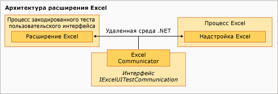

# Пример расширения закодированного теста пользовательского интерфейса для Excel
[!INCLUDE[vs2017banner](../code-quality/includes/vs2017banner.md)]

Компонент расширения примера выполняется в процессе закодированного теста пользовательского интерфейса [!INCLUDE[vsprvs](../code-quality/includes/vsprvs_md.md)] и в некотором смысле является иерархическим с базовым классом `ExtensionPackage`.  Классы `TechnologyManager`, `ActionFilter` и `PropertyProvider` находятся на следующем уровне, а элементы управления — на верхнем уровне.  
  
   
Архитектура расширения Excel  
  
## Точки расширения  
 Эти классы представляют точки расширения, реализованные в примере, чтобы сделать возможным применение к [!INCLUDE[ofprexcel](../test/includes/ofprexcel_md.md)] закодированных тестов пользовательского интерфейса.  
  
### ExtensionPackage  
 Наследуется от класса <xref:Microsoft.VisualStudio.TestTools.UITest.Extension.UITestExtensionPackage>, является точкой входа для расширения закодированных тестов пользовательского интерфейса.  Реализация этого абстрактного класса предоставляет среде закодированных тестов пользовательского интерфейса внутренний доступ к пользовательскому диспетчеру технологий тестирования пользовательского интерфейса, поставщику свойств тестирования пользовательского интерфейса и фильтру действий тестирования пользовательского интерфейса.  Для получения дополнительной информации см. [Класс ExtensionPackage](../test/sample-excel-extension-extensionpackage-class.md).  
  
### TechnologyManager  
 Наследуется от класса <xref:Microsoft.VisualStudio.TestTools.UITest.Extension.UITechnologyManager> и реализует диспетчер технологий для записи и воспроизведения тестов.  Для получения дополнительной информации см. [Класс TechnologyManager](../test/sample-excel-extension-technologymanager-class.md).  
  
### ActionFilter  
 Наследуется от класса <xref:Microsoft.VisualStudio.TestTools.UITest.Common.UITestActionFilter> и предоставляет базовый класс для объединения результатов сходных действий теста в единый набор результатов теста.  Для получения дополнительной информации см. [Класс ActionFilter](../test/sample-excel-extension-actionfilter-class.md).  
  
### Технологические элементы  
 Базовый класс, наследуемый от <xref:Microsoft.VisualStudio.TestTools.UITest.Extension.UITechnologyElement>; реализует основу для технологических элементов в тестах пользовательского интерфейса, поддерживающих запись и воспроизведение.  Для получения дополнительной информации см. [Классы Element](../test/sample-excel-extension-element-classes.md).  
  
### PropertyProvider  
 Наследуется от класса <xref:Microsoft.VisualStudio.TestTools.UITesting.UITestPropertyProvider> и обеспечивает базовый класс для поддержки свойств элементов пользовательского интерфейса для записи и воспроизведения тестов.  Для получения дополнительной информации см. [Класс PropertyProvider](../test/sample-excel-extension-propertyprovider-class.md).  
  
## См. также  
 <xref:Microsoft.VisualStudio.TestTools.UITesting.UITestPropertyProvider>   
 <xref:Microsoft.VisualStudio.TestTools.UITest.Extension.UITechnologyElement>   
 <xref:Microsoft.VisualStudio.TestTools.UITest.Common.UITestActionFilter>   
 <xref:Microsoft.VisualStudio.TestTools.UITest.Extension.UITestExtensionPackage>   
 [Класс ExtensionPackage](../test/sample-excel-extension-extensionpackage-class.md)   
 [Класс TechnologyManager](../test/sample-excel-extension-technologymanager-class.md)   
 [Класс ActionFilter](../test/sample-excel-extension-actionfilter-class.md)   
 [Классы Element](../test/sample-excel-extension-element-classes.md)   
 [Класс PropertyProvider](../test/sample-excel-extension-propertyprovider-class.md)