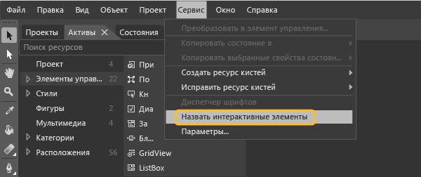

# <a name="set-a-unique-automation-property-for-uwp-controls-for-testing"></a>Назначение уникального свойства автоматизации элементам управления универсальной платформы Windows для тестирования

Чтобы выполнять закодированные тесты пользовательского интерфейса для XAML-приложения универсальной платформы Windows, каждый элемент управления должен определяться уникальным свойством автоматизации. Можно назначить уникальное свойство автоматизации на основе типа элемента управления XAML в вашем приложении.

[!INCLUDE [coded-ui-test-deprecation](includes/coded-ui-test-deprecation.md)]

## <a name="static-xaml-definition"></a>Статическое определение XAML

Чтобы задать уникальное свойство автоматизации для элемента управления, который определен в XAML-файле, необходимо явным или неявным образом задать значение **AutomationProperties.AutomationId** или **AutomationProperties.Name**, как показано в следующих примерах. При настройке любого из этих значений элементу управления присваивается уникальное свойство автоматизации, которое может использоваться для идентификации этого элемента при создании закодированного теста пользовательского интерфейса или записи действий.

### <a name="set-the-property-implicitly"></a>Неявная установка свойства

Присвойте параметру **AutomationProperties.AutomationId** значение **ButtonX**, используя свойство **Name** в XAML-коде элемента управления.

```xaml
<Button Name="ButtonX" Height="31" HorizontalAlignment="Left" Margin="23,26,0,0"  VerticalAlignment="Top" Width="140" Click="ButtonX_Click" />
```

Присвойте параметру **AutomationProperties.Name** значение **ButtonY**, используя свойство **Content** в XAML-коде элемента управления.

```xaml
<Button Content="ButtonY" Height="31" HorizontalAlignment="Left" Margin="23,76,0,0" VerticalAlignment="Top" Width="140" Click="ButtonY_Click" />
```

### <a name="set-the-property-explicitly"></a>Явная установка свойства

Явно присвойте параметру **AutomationProperties.AutomationId** значение **ButtonX** в XAML-коде элемента управления.

```xaml
<Button AutomationProperties.AutomationId="ButtonX" Height="31" HorizontalAlignment="Left" Margin="23,26,0,0"  VerticalAlignment="Top" Width="140" Click="ButtonX_Click" />
```

Явно присвойте параметру **AutomationProperties.Name** значение **ButtonY** в XAML-коде элемента управления.

```xaml
<Button AutomationProperties.Name="ButtonY" Height="31" HorizontalAlignment="Left" Margin="23,76,0,0" VerticalAlignment="Top" Width="140" Click="ButtonY_Click" />
```

## <a name="assign-unique-names"></a>Назначение уникальных имен

В Blend для Visual Studio можно назначать уникальные имена таким интерактивным элементам, как кнопки, списки, поля со списком и текстовые поля. Благодаря этому элементы управления получают уникальные значения **AutomationProperties.Name**.

Чтобы присвоить уникальные имена существующим элементам управления, выберите пункт меню **Сервис** > **Задать имена интерактивных элементов**.



Чтобы автоматически присвоить уникальные имена для новых добавляемых элементов управления, выберите пункт меню **Сервис** > **Параметры**, чтобы открыть диалоговое окно **Параметры**. Выберите **Конструктор XAML**, а затем установите флажок **Автоматически именовать интерактивные элементы при создании**. Чтобы закрыть диалоговое окно, нажмите кнопку **ОК**.

## <a name="use-a-data-template"></a>Использование шаблона данных

Вы можете определить с помощью **ItemTemplate** простой шаблон для привязки значений в поле со списком к переменным:

```xaml
<ListBox Name="listBox1" ItemsSource="{Binding Source={StaticResource employees}}">
   <ListBox.ItemTemplate>
      <DataTemplate>
         <StackPanel Orientation="Horizontal">
            <TextBlock Text="{Binding EmployeeName}" />
            <TextBlock Text="{Binding EmployeeID}" />
         </StackPanel>
      </DataTemplate>
   </ListBox.ItemTemplate>
</ListBox>
```

Также вы можете использовать шаблон с **ItemContainerStyle** для привязки значений к переменным:

```xaml
<ListBox Name="listBox1" ItemsSource="{Binding Source={StaticResource employees}}">
   <ListBox.ItemContainerStyle>
      <Style TargetType="ListBoxItem">
         <Setter Property="Template">
            <Setter.Value>
               <ControlTemplate TargetType="ListBoxItem">
                  <Grid>
                     <Button Content="{Binding EmployeeName}" AutomationProperties.AutomationId="{Binding EmployeeID}"/>
                  </Grid>
               </ControlTemplate>
            </Setter.Value>
         </Setter>
      </Style>
   </ListBox.ItemContainerStyle>
</ListBox>
```

В обоих примерах необходимо переопределить метод **ToString()** класса **ItemSource**, как показано в следующем примере. В этом коде проверяется установка уникального значения **AutomationProperties.Name**, так как нельзя задать уникальное свойство автоматизации для каждого привязанного к данным элемента списка с использованием привязки. В этом случае достаточно задать уникальное значение для **Automation Properties.Name**.

> [!NOTE]
> При таком подходе внутреннее содержимое элемента списка можно также задавать посредством привязки к строке в Employee. Как показано в этом примере, элементу управления "Кнопка" внутри каждого элемента списка присваивается уникальный идентификатор автоматизации (идентификатор сотрудника).

```csharp
Employee[] employees = new Employee[]
{
   new Employee("john", "4384"),
   new Employee("margaret", "7556"),
   new Employee("richard", "8688"),
   new Employee("george", "1293")
};

listBox1.ItemsSource = employees;

public override string ToString()
{
    return EmployeeName + EmployeeID; // Unique Identification to be set as the AutomationProperties.Name
}
```

## <a name="use-a-control-template"></a>Использование шаблона элемента управления

Вы можете использовать шаблон элемента управления, благодаря чему каждый экземпляр конкретного типа получает уникальное свойство оптимизации при его определении в коде. Создайте шаблон для привязки свойства **AutomationProperty** к уникальному идентификатору в экземпляре элемента управления. Следующий XAML-код демонстрирует один из способов создания такой привязки с помощью шаблона элемента управления:

```xaml
<Style x:Key="MyButton" TargetType="Button">
<Setter Property="Template">
   <Setter.Value>
<ControlTemplate TargetType="Button">
   <Grid>
      <CheckBox HorizontalAlignment="Left" AutomationProperties.AutomationId="{TemplateBinding Content}"></CheckBox>
      <Button Width="90" HorizontalAlignment="Right" Content="{TemplateBinding Content}" AutomationProperties.AutomationId="{TemplateBinding Content}"></Button>
   </Grid>
</ControlTemplate>
   </Setter.Value>
</Setter>
</Style>
```

При определении двух экземпляров кнопки с помощью шаблона элемента управления кнопки идентификатору автоматизации присваивается уникальная строка содержимого элементов управления в шаблоне, как показано в следующем XAML-коде:

```xaml
<Button Content="Button1" Style="{StaticResource MyButton}" Width="140"/>
<Button Content="Button2" Style="{StaticResource MyButton}" Width="140"/>
```

### <a name="dynamic-controls"></a>Динамические элементы управления

Если у вас есть элементы управления, которые создаются динамически из кода, а не статически или с помощью шаблонов в XAML-файлах, необходимо задать свойства **Content** или **Name** для элемента управления. Это действие гарантирует, что каждый динамический элемент управления будет иметь уникальное свойство автоматизации. Например если у вас есть флажок, который должен отображаться при выборе элемента списка, эти свойства можно задать, как показано ниже:

```csharp
private void CreateCheckBox(string txt, StackPanel panel)
{
   CheckBox cb = new CheckBox();
   cb.Content = txt; // Sets the AutomationProperties.Name
   cb.Height = 50;
   cb.Width = 100;
   cb.Name = "DynamicCheckBoxAid"+ txt; // Sets the AutomationProperties.AutomationId
   panel.Children.Add(cb);
}
```

## <a name="see-also"></a>См. также раздел

- [Тестирование приложений UWP с помощью закодированных тестов пользовательского интерфейса](../test/test-uwp-app-with-coded-ui-test.md)
