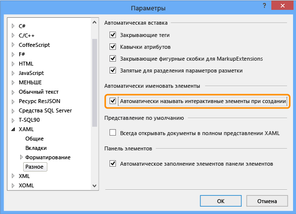
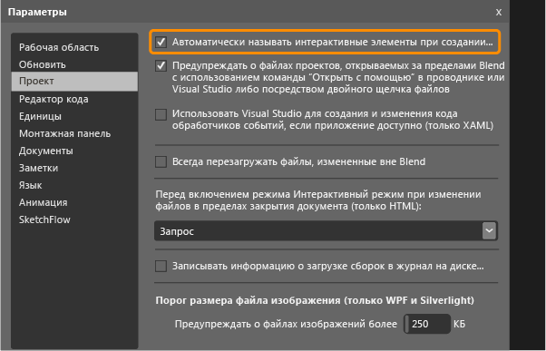

# <a name="set-a-unique-automation-property-for-uwp-controls-for-testing"></a>Назначение уникального свойства автоматизации элементам управления универсальной платформы Windows для тестирования

Чтобы выполнять закодированные тесты пользовательского интерфейса для XAML-приложения универсальной платформы Windows, необходимо настроить уникальное свойство автоматизации, определяющее каждый элемент управления.

 Можно назначить уникальное свойство автоматизации на основе типа элемента управления XAML в вашем приложении. Ниже описывается, как можно назначить уникальное свойство автоматизации в следующих ситуациях.

-   [Статическое определение XAML для элементов управления](#UniquePropertyWindowsStoreControlsStaticXAML)

-   [Назначение уникальных свойств автоматизации с помощью Visual Studio или Blend для Visual Studio](#UniquePropertyWindowsStoreControlsExpressionBlend)

-   [Использование шаблона данных DataTemplate](#UniquePropertyWindowsStoreControlsDataTemplate)

-   [Использование шаблона элемента управления](#UniquePropertyWindowsStoreControlsControlTemplate)

-   [Динамические элементы управления](#UniquePropertyWindowsStoreControlsDynamicControls)

## <a name="use-methods-to-assign-a-unique-automation-property"></a>Использование методов для назначения уникального свойства автоматизации

###  <a name="UniquePropertyWindowsStoreControlsStaticXAML"></a> Статическое определение XAML для элементов управления
 Чтобы задать уникальное свойство автоматизации для элемента управления, который определен в XAML-файле, необходимо явным или неявным образом настроить AutomationProperties.AutomationId или AutomationProperties.Name, как показано в следующих примерах. При настройке любого из этих значений элементу управления присваивается уникальное свойство автоматизации, которое может использоваться для идентификации этого элемента при создании закодированного теста пользовательского интерфейса или записи действий.

 **Неявная установка свойства**

Присвойте параметру AutomationProperties.AutomationId значение **ButtonX**, используя свойство Name в XAML-коде элемента управления.

```xaml
<Button Name="ButtonX" Height="31" HorizontalAlignment="Left" Margin="23,26,0,0"  VerticalAlignment="Top" Width="140" Click="ButtonX_Click" />
```

Присвойте параметру AutomationProperties.Name значение **ButtonY**, используя свойство Content в XAML-коде элемента управления.

```xaml
<Button Content="ButtonY" Height="31" HorizontalAlignment="Left" Margin="23,76,0,0" VerticalAlignment="Top" Width="140" Click="ButtonY_Click" />
```

 **Явная установка свойства**

 Явно присвойте параметру AutomationProperties.AutomationId значение **ButtonX** в XAML-коде элемента управления.

```xaml
<Button AutomationProperties.AutomationId="ButtonX" Height="31" HorizontalAlignment="Left" Margin="23,26,0,0"  VerticalAlignment="Top" Width="140" Click="ButtonX_Click" />
```

 Явно присвойте параметру AutomationProperties.Name значение **ButtonY** в XAML-коде элемента управления.

```
<Button AutomationProperties.Name="ButtonY" Height="31" HorizontalAlignment="Left" Margin="23,76,0,0" VerticalAlignment="Top" Width="140" Click="ButtonY_Click" />
```

###  <a name="UniquePropertyWindowsStoreControlsExpressionBlend"></a> Назначение уникальных свойств автоматизации с помощью Visual Studio или Blend для Visual Studio
 С помощью Visual Studio и Blend для Visual Studio можно назначать уникальные номера таким интерактивным элементам, как кнопки, списки, поля со списком и текстовые поля. Это позволяет присвоить элементу управления уникальное значение AutomationProperties.Name.

 **Visual Studio.** В меню **Сервис** выберите пункт **Параметры**, а затем последовательно щелкните **Текстовый редактор**, **XAML** и **Прочее**.

 Установите флажок **Автоматически именовать интерактивные элементы при создании** и нажмите кнопку **ОК**.

 

 **Blend для Visual Studio.** Используйте один из следующих способов.

> [!NOTE]
> Этот метод можно использовать только для элементов управления, созданных статически с помощью XAML.


 **Присвоение уникального имение существующим элементам управления**

 В меню **Сервис** выберите пункт **Задать имена интерактивных элементов**, как показано ниже:

 

 **Автоматическое присвоение уникального имени создаваемым элементам управления**

 В меню **Сервис** выберите пункт **Параметры**, а затем щелкните **Проект**. Установите флажок **Автоматически именовать интерактивные элементы при создании** и нажмите кнопку **ОК**, как показано ниже:

 

###  <a name="UniquePropertyWindowsStoreControlsDataTemplate"></a> Использование шаблона данных
 Вы можете определить с помощью ItemTemplate простой шаблон для привязки значений в поле со списком к переменным с использованием следующего XAML-кода.

```xaml
<ListBox Name="listBox1" ItemsSource="{Binding Source={StaticResource employees}}">
   <ListBox.ItemTemplate>
      <DataTemplate>
         <StackPanel Orientation="Horizontal">
            <TextBlock Text="{Binding EmployeeName}" />
            <TextBlock Text="{Binding EmployeeID}" />
         </StackPanel>
      </DataTemplate>
   </ListBox.ItemTemplate>
</ListBox>
```

 Также вы можете использовать шаблон с ItemContainerStyle для привязки значений к переменным с использованием следующего XAML-кода:

```xaml
      <ListBox Name="listBox1" ItemsSource="{Binding Source={StaticResource employees}}">
            <ListBox.ItemContainerStyle>
                <Style TargetType="ListBoxItem">
                    <Setter Property="Template">
                        <Setter.Value>
                            <ControlTemplate TargetType="ListBoxItem">
                                <Grid>
                                    <Button Content="{Binding EmployeeName}" AutomationProperties.AutomationId="{Binding EmployeeID}"/>
                                </Grid>
                            </ControlTemplate>
                        </Setter.Value>
                    </Setter>
                </Style>
            </ListBox.ItemContainerStyle>
        </ListBox>
```

 В обоих примерах необходимо переопределить метод ToString() в ItemSource, как показано в следующем примере. В этом коде проверяется установка уникального значения AutomationProperties.Name, так как нельзя задать уникальное свойство автоматизации для каждого привязанного к данным элемента списка с использованием привязки. В этом случае достаточно задать уникальное значение для AutomationProperties.Name.

> [!NOTE]
> При таком подходе внутреннее содержимое элемента списка можно также задавать посредством привязки к строке в Employee. Как показано в этом примере, элементу управления "Кнопка" внутри каждого элемента списка присваивается уникальный идентификатор автоматизации (идентификатор сотрудника).

```csharp
Employee[] employees = new Employee[]
{
   new Employee("john", "4384"),
   new Employee("margaret", "7556"),
   new Employee("richard", "8688"),
   new Employee("george", "1293")
};

listBox1.ItemsSource = employees;

public override string ToString()
{
    return EmployeeName + EmployeeID; // Unique Identification to be set as the AutomationProperties.Name
}
```

###  <a name="UniquePropertyWindowsStoreControlsControlTemplate"></a> Использование шаблона элемента управления

Вы можете использовать шаблон элемента управления, благодаря чему каждый экземпляр конкретного типа получает уникальное свойство оптимизации при его определении в коде. Создайте шаблон для привязки свойства автоматизации к уникальному идентификатору в экземпляре элемента управления. Следующий XAML-код демонстрирует один из способов создания такой привязки с помощью шаблона элемента управления.

```xaml
<Style x:Key="MyButton" TargetType="Button">
<Setter Property="Template">
   <Setter.Value>
<ControlTemplate TargetType="Button">
   <Grid>
      <CheckBox HorizontalAlignment="Left" AutomationProperties.AutomationId="{TemplateBinding Content}"></CheckBox>
      <Button Width="90" HorizontalAlignment="Right" Content="{TemplateBinding Content}" AutomationProperties.AutomationId="{TemplateBinding Content}"></Button>
   </Grid>
</ControlTemplate>
   </Setter.Value>
</Setter>
</Style>
```

 При определении двух экземпляров кнопки с помощью шаблона элемента управления кнопки идентификатору автоматизации присваивается уникальная строка содержимого элементов управления в шаблоне, как показано в следующем XAML-коде:

```xaml
<Button Content="Button1" Style="{StaticResource MyButton}" Width="140"/>
<Button Content="Button2" Style="{StaticResource MyButton}" Width="140"/>
```

###  <a name="UniquePropertyWindowsStoreControlsDynamicControls"></a> Динамические элементы управления
 Если у вас есть элементы управления, которые создаются динамически из кода, а не статически или с помощью шаблонов в XAML-файлах, необходимо задать свойства содержимого или имени для элемента управления. Это гарантирует, что каждый динамический элемент управления будет иметь уникальное свойство автоматизации. Например если у вас есть флажок, который должен отображаться при выборе элемента списка, эти свойства можно задать, как показано ниже:

```csharp
private void CreateCheckBox(string txt, StackPanel panel)
   {
      CheckBox cb = new CheckBox();
      cb.Content = txt; // Sets the AutomationProperties.Name
      cb.Height = 50;
      cb.Width = 100;
      cb.Name = "DynamicCheckBoxAid"+ txt; // Sets the AutomationProperties.AutomationId
      panel.Children.Add(cb);
    }
```

## <a name="see-also"></a>См. также

- [Тестирование приложений Windows UWP с помощью закодированных тестов пользовательского интерфейса](../test/test-windows-store-8-1-apps-with-coded-ui-tests.md)
