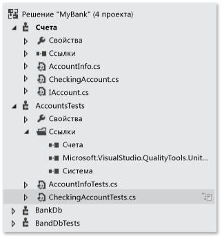
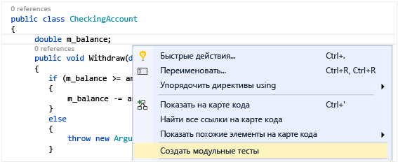
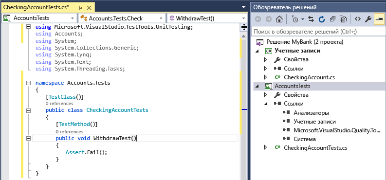
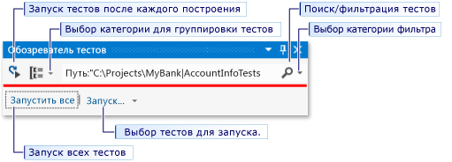
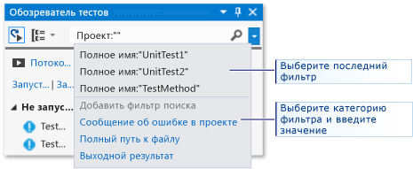
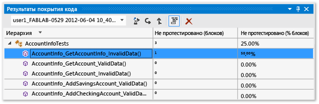

# <a name="unit-test-basics"></a>Основные сведения о модульных тестах

Убедитесь, что код работает, как ожидалось, создав и выполнив модульные тесты. Модульное тестирование получило такое название, так как функции программы разбиваются на отдельные тестируемые участки поведения, которые можно протестировать в качестве отдельных *модулей*. Обозреватель тестов Visual Studio предоставляет гибкий и эффективный способ запуска модульных тестов и просмотра результатов в Visual Studio. Visual Studio устанавливает платформы модульного тестирования Microsoft для управляемого и машинного кода. *Платформа модульного тестирования* используется для создания модульных тестов, их запуска и создания отчетов о результатах таких тестов. Завершив внесение изменений, запустите модульные тесты повторно, чтобы убедиться, что код по-прежнему работает правильно. Visual Studio Enterprise может выполнять эту задачу автоматически с помощью функции [Live Unit Testing](live-unit-testing-intro.md), которая определяет тесты, затронутые вносимыми в код изменениями, и выполняет их в фоновом режиме в процессе ввода.

Модульное тестирование максимально влияет на качество кода, когда оно является неотъемлемой частью рабочего процесса разработки ПО. После написания функции или другого блока кода приложения создаются модульные тесты, которые проверяют поведение кода в ответ на стандартные, граничные и некорректные случаи ввода данных; также проверяются любые явные или предполагаемые допущения, сделанные кодом. При *разработке, управляемой тестами*, модульные тесты создаются перед написанием кода, поэтому модульные тесты используются в качестве технической документации и спецификации функциональности.

Обозреватель тестов также может запускать тесты c платформ модульных тестов стороннего производителя и платформ на основе открытого кода, имеющих дополнительные интерфейсы для Обозревателя тестов. Многие из этих платформ могут быть добавлены при помощи Менеджера расширений Visual Studio и Галереи Visual Studio. Дополнительные сведения см. в разделе [Установка платформ модульного тестирования сторонних поставщиков](../test/install-third-party-unit-test-frameworks.md).

Можно быстро создавать тестовые проекты и методы теста из кода или создавать тесты вручную при необходимости. При использовании компонента IntelliTest для изучения кода .NET можно создавать тестовые данные и наборы модульных тестов. Для каждого оператора в коде создаются входные данные теста, которые будут выполнять этот оператор. Узнайте, как [создавать модульные тесты для кода .NET](generate-unit-tests-for-your-code-with-intellitest.md).

## <a name="get-started"></a>Начало работы

Для получения информации по введению в модульное тестирование, которое знакомит вас сразу с созданием кода, см. один из следующих разделов.

- [Пошаговое руководство: создание и выполнение модульных тестов для кода .NET](../test/walkthrough-creating-and-running-unit-tests-for-managed-code.md)

- [Пошаговое руководство: Разработка на основе тестирования с помощью обозревателя тестов](../test/quick-start-test-driven-development-with-test-explorer.md)

- [Написание модульных тестов для C/C++ в Visual Studio](../test/writing-unit-tests-for-c-cpp.md)

## <a name="the-mybank-solution-example"></a>Пример решения MyBank

В этой статье в качестве примера используется разработка ненастоящего приложения, которое называется `MyBank`. Чтобы следовать разъяснениям в данном разделе, действительного кодирования не потребуется. Методы тестирования написаны на C# и представлены при помощи платформы модульного тестирования Microsoft для управляемого кода. Но эти принципы применимы и к другим языкам и платформам.

::: moniker range="vs-2017"

::: moniker-end
::: moniker range=">=vs-2019"

::: moniker-end

Первая попытка проектирования приложения `MyBank` включает в себя компонент счетов, который представляет собой лицевой счет и его транзакции с банком, а также компонент базы данных, который включает в себя функции объединения лицевых счетов и управления ими.

Создается решение `MyBank` , которое содержит два проекта.

- `Accounts`

- `BankDb`

Первая попытка создания проекта `Accounts` содержит класс для хранения базовой информации о счете, интерфейс, который определяет функции счета любого типа, например, для внесения и снятия средств со счета и класс, производный от интерфейса, который представляет собой текущий счет. Проект Счета начинается с создания следующих исходных файлов:

- *AccountInfo.cs*, который определяет основную информацию о счете;

- *IAccount.cs*, определяющего стандартный интерфейс `IAccount` для счета, включая методы внесения и снятия средств со счета и получения баланса счета;

- *CheckingAccount.cs*, содержащего класс `CheckingAccount`, который реализует интерфейс `IAccount` для чекового счета.

Из опыта известно, что при снятии средств с текущего счета необходимо убедиться, что количество снимаемых средств меньше, чем размер баланса счета. Поэтому метод `IAccount.Withdraw` в `CheckingAccount` перекрывается методом, который проверяет данное условие. Метод может выглядеть следующим образом.

```csharp
public void Withdraw(double amount)
{
    if(m_balance >= amount)
    {
        m_balance -= amount;
    }
    else
    {
        throw new ArgumentException(nameof(amount), "Withdrawal exceeds balance!");
    }
}
```

Теперь, когда есть немного кода, можно провести тестирование.

## <a name="create-unit-test-projects-and-test-methods"></a>Создание проектов модульных тестов и методов теста

Для C# как правило, проще создать проект модульного теста и заглушки модульных тестов из кода. Кроме того, можно создать проект модульных тестов и тесты вручную в зависимости от потребностей. Если вы хотите создавать модульные тесты из кода на сторонней платформе, вам потребуется установить одно из этих расширений: [NUnit](https://marketplace.visualstudio.com/items?itemName=NUnitDevelopers.TestGeneratorNUnitextension-18371) или [xUnit](https://marketplace.visualstudio.com/items?itemName=YowkoTsai.xUnitnetTestGenerator). Если вы не используете C#, пропустите этот раздел и перейдите к разделу [Создание проекта и модульных тестов вручную](#create-the-unit-test-project-and-unit-tests-manually).

### <a name="generate-unit-test-project-and-unit-test-stubs"></a>Создание проекта модульного теста и заглушек модульных тестов

1. В окне редактора кода выберите в контекстном меню команду [**Создать модульные тесты**](create-unit-tests-menu.md).

   ::: moniker range="vs-2017"
   

   > [!NOTE]
   > Команда меню **Создать модульные тесты** доступна только для управляемого кода, предназначенного для платформы .NET Framework (но не .NET Core).
   ::: moniker-end
   ::: moniker range=">=vs-2019"
   

   > [!NOTE]
   > Команда меню **Создать модульные тесты** доступна только для кода C#.
   ::: moniker-end

2. Нажмите кнопку **ОК**, чтобы принять значения по умолчанию для создания модульных тестов, или измените значения, которые использовались для создания и назначения имени проекта модульного теста и модульных тестов. Можно выбрать код, который добавляется по умолчанию в методы модульных тестов.

   

3. Заглушки модульных тестов создаются в новом проекте модульного теста для всех методов в классе.

   ::: moniker range="vs-2017"
   
   ::: moniker-end
   ::: moniker range=">=vs-2019"
   
   ::: moniker-end

4. Теперь рассмотрим [добавление кода в методы модульных тестов](#write-your-tests) (чтобы сделать модульный тест значимым), а также дополнительных модульных тестов, которые могут потребоваться для тщательного тестирования кода.

### <a name="create-the-unit-test-project-and-unit-tests-manually"></a>Создание проекта и модульных тестов вручную

Проект модульного теста отражает структуру проекта кода. В примере MyBank добавляются два проекта модульного тестирования с именами `AccountsTests` и `BankDbTests` в решение `MyBanks` . Имена проекта теста произвольны, но рекомендуется принять концепцию стандартного именования.

**Добавление нового проекта модульного тестирование в решение**

1. В **обозревателе решений** щелкните решение правой кнопкой мыши и выберите **Добавить** > **Создать** **Проект**.

::: moniker range="vs-2017"

2. В диалоговом окне **Новый проект** разверните узел **Установлено**, выберите требуемый язык для тестового проекта, а затем **Тест**.

3. Чтобы использовать одну из платформ модульного тестирования Microsoft выберите **Проект модульного тестирования** из списка шаблонов проекта. В иных случаях выберите шаблон проекта платформы модульного тестирования, который необходимо использовать. Для тестирования проекта `Accounts` в нашем примере проект будет назван `AccountsTests`.

   > [!NOTE]
   > Не все платформы модульного тестирования сторонних разработчиков и на основе открытого кода предоставляют шаблоны проекта Visual Studio. Просмотрите информацию в документе платформы по созданию проекта.

::: moniker-end

::: moniker range=">=vs-2019"

2. Используйте поле поиска шаблона проекта, чтобы найти шаблон проекта модульных тестов, который требуется использовать.

3. На следующей странице присвойте проекту имя. Для тестирования проекта `Accounts` в нашем примере проект можно назвать `AccountsTests`.

::: moniker-end

4. В проекте модульного тестирования добавьте ссылку на проект кода в тесте, а в данном примере — на проект Счета.

   Создание ссылки на проект кода

   1. Выберите проект в **обозревателе решений**.

   2. В меню **Проект** выберите **Добавить ссылку**.

   3. В диалоговом окне **диспетчера ссылок** откройте узел **Решение** и выберите **Проекты**. Выберите наименование проекта кода и закройте диалоговое окно.

Каждый проект модульного тестирования содержит классы, которые отражают имена классов в проекте кода. В данном примере проект `AccountsTests` будет содержать следующие классы.

- Класс`AccountInfoTests` содержит методы модульного тестирования для класса `AccountInfo` в проекте `Accounts` .

- Класс`CheckingAccountTests` содержит методы модульного тестирования для класса `CheckingAccount` .

## <a name="write-your-tests"></a>Написание тестов

Платформа модульного тестирования и Visual Studio IntelliSense помогут вам в написании кода модульных тестов для проекта кода. Для запуска в **обозревателе тестов** многие платформы требуют добавления особых атрибутов для определения методов модульного тестирования. Платформы также предоставляют способ — обычно при помощи оператора контроля или атрибутов метода -— для определения успешности или не успешности теста. Другие атрибуты определяют необязательные методы установки, которые выполняются при инициализации класса и перед каждым методом тестирования, а также методы разборки, которые запускаются после каждого метода тестирования и после уничтожения класса.

Модель AAA (размещение, действие, утверждение) является стандартным способом написания модульных тестов для метода тестирования.

- Подраздел **Размещение** метода модульного тестирования инициализирует объекты и устанавливает значение данных, которые переданы методу для теста.

- Подраздел **Действие** вызывает метод для теста с размещенными параметрами.

- Подраздел **Утверждение** проверяет, чтобы метод для теста действовал, как ожидается.

Для тестирования метода `CheckingAccount.Withdraw` в нашем примере можно написать два теста: один проверит стандартное поведение метода, а другой проверит, что снятие средств в количестве большем, чем указано в балансе, не будет успешным. В классе `CheckingAccountTests` добавьте следующие методы.

```csharp
[TestMethod]
public void Withdraw_ValidAmount_ChangesBalance()
{
    // arrange
    double currentBalance = 10.0;
    double withdrawal = 1.0;
    double expected = 9.0;
    var account = new CheckingAccount("JohnDoe", currentBalance);

    // act
    account.Withdraw(withdrawal);

    // assert
    Assert.AreEqual(expected, account.Balance);
}

[TestMethod]
public void Withdraw_AmountMoreThanBalance_Throws()
{
    // arrange
    var account = new CheckingAccount("John Doe", 10.0);

    // act and assert
    Assert.ThrowsException<System.ArgumentException>(() => account.Withdraw(20.0));
}
```

Дополнительные сведения о платформах модульного тестирования Microsoft см. в одном из следующих разделов:

- [Модульное тестирование кода](unit-test-your-code.md)

- [Создание модульных тестов для C/C++](writing-unit-tests-for-c-cpp.md)

- [Использование платформы MSTest в модульных тестах](using-microsoft-visualstudio-testtools-unittesting-members-in-unit-tests.md)

## <a name="set-timeouts-for-unit-tests"></a>Настройка времени ожидания для модульных тестов

Если вы используете платформу MSTest, можно использовать <xref:Microsoft.VisualStudio.TestTools.UnitTesting.TimeoutAttribute> для установки времени ожидания в отдельном методе теста:

```csharp
[TestMethod]
[Timeout(2000)]  // Milliseconds
public void My_Test()
{ ...
}
```

Задние лимита времени на максимально разрешенный

```csharp
[TestMethod]
[Timeout(TestTimeout.Infinite)]  // Milliseconds
public void My_Test ()
{ ...
}
```

## <a name="run-tests-in-test-explorer"></a>Выполнение тестов в обозревателе тестов

При построении проекта тестирования тесты появляются в **обозревателе тестов**. Если **обозреватель тестов** не виден, выберите **Тест** в меню Visual Studio, **Windows**, затем **обозреватель тестов** (или нажмите клавиши **CTRL** + **E**, **T**).

::: moniker range="vs-2017"

::: moniker-end
::: moniker range=">=vs-2019"

::: moniker-end

При выполнении, написании и повторном запуске тестов **обозреватель тестов** может отображать результаты в группах **Неудачные тесты**, **Пройденные тесты**, **Пропущенные тесты** и **Незапущенные тесты**. Можно выбирать различные группы по параметрам на панели инструментов.

Кроме того, можно фильтровать тесты по совпадению текста в поле поиска на глобальном уровне или с помощью одного из предустановленных фильтров. Можно запустить любую выборку тестов в любое время. Результаты запущенного теста появляются сразу же в строке "успешно/не успешно" наверху окна обозревателя. Детальная информация результата метода тестирования отображается при выборе теста.

### <a name="run-and-view-tests"></a>Выполнение и просмотр тестов

Панель инструментов **обозревателя тестов** помогает найти, организовать и запустить необходимые тесты.

::: moniker range="vs-2017"

::: moniker-end
::: moniker range=">=vs-2019"

::: moniker-end

Можно выбрать **Запустить все**, чтобы запустить все тесты (или нажать клавиши **CTRL** + **R**, **V**), или выбрать **Запустить**, чтобы выбрать подмножество тестов для запуска (или нажать клавиши **CTRL** + **R**, **T**). Выберите тест, чтобы просмотреть детальную информацию по нему на панели сведений. Выберите **Открыть текст** в контекстном меню (клавиша **F12**) для отображения исходного кода выбранного теста.

::: moniker range="vs-2017"

Если отдельные тесты не имеют зависимостей, предотвращающих запуск этих тестов в любом порядке, включите параллельное тестирование с помощью переключателя  на панели инструментов. Это может заметно сократить время, необходимое для выполнения всех тестов.

::: moniker-end

::: moniker range=">=vs-2019"

Если отдельные тесты не имеют зависимостей, предотвращающих запуск этих тестов в любом порядке, включите параллельное тестирование в меню параметров на панели инструментов. Это может заметно сократить время, необходимое для выполнения всех тестов.

::: moniker-end

### <a name="run-tests-after-every-build"></a>Запуск тестов после каждой сборки

::: moniker range="vs-2017"

|Кнопка|Описание|
|-|-|
||Чтобы запускать модульные тесты после каждой локальной сборки, в стандартном меню выберите **Тест**, а затем выберите **Выполнить тесты после сборки** в панели инструментов **обозревателя тестов**.|

> [!NOTE]
> Запуск модульных тестов после каждой сборки требует Visual Studio 2017 Enterprise или Visual Studio 2019. В Visual Studio 2019 эта функция доступна в выпусках Community и Professional, а также в выпуске Enterprise.

::: moniker-end

::: moniker range=">=vs-2019"

Чтобы запустить модульные тесты после каждой локальной сборки, на панели инструментов обозревателя тестов щелкните значок "Параметры" и выберите в меню пункт **Выполнить тесты после сборки**.

::: moniker-end

### <a name="filter-and-group-the-test-list"></a>Фильтрация и группировка списка тестов

Если тестов много, можно отфильтровать список по определенной строке. Для этого введите соответствующий текст в поле поиска **обозревателя тестов**. Можно ограничить фильтр при помощи выбора фильтров из списка.

::: moniker range="vs-2017"

::: moniker-end
::: moniker range=">=vs-2019"

::: moniker-end

|Кнопка|Описание|
|-|-|
||Для группировки тестов по категории, нажмите кнопку **Группировать по** .|

Дополнительные сведения см. в разделе [Выполнение модульных тестов с помощью обозревателя тестов](../test/run-unit-tests-with-test-explorer.md).

## <a name="qa"></a>Вопросы и ответы

**Вопрос. Как выполнять отладку модульных тестов?**

**Ответ.** Чтобы запустить сеанс отладки для тестов, можно использовать **обозреватель тестов**. Пошагово выполняя код, отладчик Visual Studio плавно переключается назад и вперед между модульными тестами и проектом для тестирования. Начало отладки

1. В редакторе Visual Studio установите точку останова в одном или нескольких методах тестирования, которые вы хотите проверить.

    > [!NOTE]
    > Так как методы тестирования могут запускаться в любом порядке, необходимо устанавливать точки останова во всех методах тестирования, которые необходимо проверить.

2. В **обозревателе тестов** выберите методы тестирования и затем **Отладить выбранные тесты** из меню быстрого запуска.

См. дополнительные сведения об [отладке модульных тестов](../debugger/debugger-feature-tour.md).

**Вопрос. Если я использую TDD, как я могу создать код из тестов?**

**Ответ.** Используйте быстрые действия для создания классов и методов в коде проекта. Напишите инструкцию в методе тестирования, которая вызывает класс или метод, который необходимо создать, затем щелкните значок лампочки, отображаемый под ошибкой. Если вызов предназначен для конструктора нового класса, выберите **Сформировать тип** из меню и следуйте подсказкам мастера, чтобы вставить класс в проект кода. Если вызов предназначен для метода, выберите **Сформировать метод** из меню IntelliSense.

::: moniker range="vs-2017"

::: moniker-end
::: moniker range=">=vs-2019"

::: moniker-end

**Вопрос. Можно ли создать модульные тесты, которые принимают несколько наборов данных в качестве входных данных для выполнения теста?**

**Ответ.** Да. *Управляемые данными методы тестирования* позволяют тестировать диапазон значений с помощью одного метода модульного теста. Примените к методу теста атрибут `DataSource` , который определяет источник данных и таблицу, в которых содержатся подлежащие тестированию значения переменных.  В теле метода назначьте ряд значений для переменных при помощи индексатора `TestContext.DataRow[`*ColumnName*`]` .

> [!NOTE]
> Эти процедуры применяются только к методам тестирования, которые пишутся при помощи платформы модульного тестирования Microsoft для управляемого кода. Если используется другая платформа, проконсультируйтесь с документацией по платформе для эквивалентного функционала.

Например, предположим, что был добавлен ненужный метод в класс `CheckingAccount`, который называется `AddIntegerHelper`. `AddIntegerHelper` добавляет два целочисленных значения.

Для создания управляемого данными теста для метода `AddIntegerHelper` сначала создается база данных доступа с именем *AccountsTest.accdb* и таблица с именем `AddIntegerHelperData`. Таблица `AddIntegerHelperData` определяет колонки для указания первого и второго операнда сложения и колонку, указывающую ожидаемый результат. Заполняем несколько рядов соответствующими значениями.

```csharp
[DataSource(
    @"Provider=Microsoft.ACE.OLEDB.12.0;Data Source=C:\Projects\MyBank\TestData\AccountsTest.accdb",
    "AddIntegerHelperData"
)]
[TestMethod()]
public void AddIntegerHelper_DataDrivenValues_AllShouldPass()
{
    var target = new CheckingAccount();
    int x = Convert.ToInt32(TestContext.DataRow["FirstNumber"]);
    int y = Convert.ToInt32(TestContext.DataRow["SecondNumber"]);
    int expected = Convert.ToInt32(TestContext.DataRow["Sum"]);
    int actual = target.AddIntegerHelper(x, y);
    Assert.AreEqual(expected, actual);
}
```

Метод с атрибутом запускается один раз для каждого ряда в таблице. **Обозреватель тестов** оповещает о неудачном тесте для метода, если одна из итераций не была успешной. Панель подробных результатов теста для метода показывает статус "прошел/неудачен" для каждого ряда данных.

Дополнительные сведения о [модульных тестах, управляемых данными](../test/how-to-create-a-data-driven-unit-test.md).

**Вопрос. Можно ли узнать, какой объем кода проверяется модульными тестами?**

**Ответ.** Да. Можно определить объем кода, который был фактически проверен модульными тестами, с помощью средства покрытия кода в Visual Studio Enterprise. Поддерживаются машинные и управляемые языки и все платформы модульного тестирования, которые могут быть запущены платформой модульного тестирования.

Можно запустить покрытие кода на выбранных тестах или на всех тестах решения. Окно **результатов объема протестированного кода** отображает процент блоков кода продукта, которые были задействованы по строке, функции, классу, пространству имен и модулю.

Чтобы запустить анализ объема протестированного кода для методов теста в решении, выберите **Тестирование** > **Анализ покрытия кода для всех тестов**.

Результаты покрытия появляются в окне **Результаты объема протестированного кода**.



Дополнительные сведения о [покрытии кода](../test/using-code-coverage-to-determine-how-much-code-is-being-tested.md) .

**Вопрос. Можно ли протестировать методы в коде, которые имеют внешние зависимости?**

**Ответ.** Да. В выпуске Visual Studio Enterprise компонент Microsoft Fakes можно использовать с методами тестов, которые были написаны с помощью платформ модульного тестирования для управляемого кода.

Microsoft Fakes использует два подхода при создании классов-заменителей для внешних зависимостей:

1. *Заглушки* создают классы на замену, которые являются производными от родительского интерфейса класса зависимости цели. Методы заглушек могут быть заменены на публичные виртуальные методы класса цели.

2. *Оболочки* используют инструментарий среды выполнения для перевода вызовов целевого метода на метод заменяющей оболочки для невиртуальных методов.

При обоих подходах используются созданные делегаты вызовов для метода зависимости для определения требуемого поведения в данном методе тестирования.

Дополнительные сведения об [изоляции методов модульного тестирования с помощью Microsoft Fakes](../test/isolating-code-under-test-with-microsoft-fakes.md).

**В. Можно ли использовать другие платформы модульного тестирования для создания модульных тестов?**

**О** . Да, выполните инструкции по [поиску и установке других платформ](../test/install-third-party-unit-test-frameworks.md). Перезапустив Visual Studio, повторно откройте решение, чтобы создать модульные тесты, и выберите установленные платформы здесь:


Заглушки модульных тестов будут созданы с помощью выбранной платформы.
