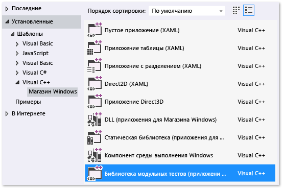

# Модульное тестирование библиотеки DLL на Visual C++ для приложений Магазина
[!INCLUDE[vs2017banner](../code-quality/includes/vs2017banner.md)]

В этом разделе описывается один из способов создания модульных тестов для библиотеки DLL на C\+\+ для приложений магазина Windows. Библиотека DLL RooterLib демонстрирует концепции теории пределов из математического анализа путем реализации функции, которая вычисляет оценку квадратного корня из заданного числа.  Библиотеки DLL могут быть включены в приложение для Магазина Windows, демонстрирующее пользователям интересные вещи, которые можно сделать с помощью математических функций.  
  
 В этом разделе показано использование модульного тестирования в качестве первого шага разработки.  При таком подходе сначала необходимо написать метод теста, который проверяет определенное поведение тестируемой системы, а затем написать код, который проходит этот тест.  Порядок описанных ниже процедур можно изменить, и сначала написать код, который требуется протестировать, а затем написать сами модульные тесты.  
  
 В этом разделе также создается одно решение Visual Studio и отдельные проекты для модульных тестов и для тестируемой библиотеки DLL.  Модульные тесты можно включить непосредственно в проект библиотеки DLL или создать отдельные решения для модульных тестов и для библиотеки DLL.  Рекомендации по выбору структуры см. в разделе [Добавление модульных тестов в существующие приложения C\+\+](../test/unit-testing-existing-cpp-applications-with-test-explorer.md).  
  
##  <a name="BKMK_In_this_topic"></a> Содержание раздела  
 В этом разделе рассматривается выполнение следующих задач.  
  
 [Создание решения и проекта модульного теста](#BKMK_Create_the_solution_and_the_unit_test_project)  
  
 [С помощью обозревателя тестов проверьте, что тесты выполняются](#BKMK_Verify_that_the_tests_run_in_Test_Explorer)  
  
 [Добавление в решение проекта библиотеки DLL](#BKMK_Add_the_DLL_project_to_the_solution)  
  
 [Объединение проекта теста с проектом библиотеки DLL](#BKMK_Couple_the_test_project_to_the_dll_project)  
  
 [Итеративное расширение тестов и обеспечение их успешного выполнения](#BKMK_Iteratively_augment_the_tests_and_make_them_pass)  
  
 [Отладка непройденного теста](#BKMK_Debug_a_failing_test)  
  
 [Рефакторинг кода без изменения тестов](#BKMK_Refactor_the_code_without_changing_tests)  
  
##  <a name="BKMK_Create_the_solution_and_the_unit_test_project"></a> Создание решения и проекта модульного теста  
  
1.  В меню **Файл** выберите команду **Создать** и пункт **Новый проект**.  
  
2.  В диалоговом окне «Новый проект» разверните узел **Установленные**, а затем узел **Visual C\#** и выберите **Магазин Windows**.  В списке шаблонов проектов выберите **Библиотека модульных тестов \(приложения для Магазина Windows\)**.  
  
       
  
3.  Назовите проект `RooterLibTests`, укажите расположение, назовите решение `RooterLib`, установите флажок **Создать каталог для решения**.  
  
       
  
4.  В новом проекте откройте **unittest1.cpp**.  
  
       
  
     Обратите внимание на следующее.  
  
    -   Каждый тест определяется с использованием `TEST_METHOD(YourTestName){...}`.  
  
         Стандартную сигнатуру функции писать не требуется.  Сигнатура создается макросом TEST\_METHOD.  Этот макрос создает экземпляр функции, которая возвращает значение типа void.  Она также создает статическую функцию, которая возвращает сведения о тестовом методе.  Эти сведения позволят обозревателю тестов найти этот метод.  
  
    -   Тестовые методы группируются в классы с помощью `TEST_CLASS(YourClassName){...}`.  
  
         Во время выполнения тестов создается экземпляр каждого тестового класса.  Тестовые методы вызываются в неопределенном порядке.  Можно задать особые методы, которые вызываются до и после каждого модуля, класса или метода.  Дополнительные сведения см. в разделе [Использование пространства имен Microsoft.VisualStudio.TestTools.CppUnitTestFramework](../test/using-microsoft-visualstudio-testtools-cppunittestframework.md) в библиотеке MSDN.  
  
##  <a name="BKMK_Verify_that_the_tests_run_in_Test_Explorer"></a> С помощью обозревателя тестов проверьте, что тесты выполняются  
  
1.  Добавьте код теста:  
  
    ```cpp  
    TEST_METHOD(TestMethod1)  
    {  
        Assert::AreEqual(1,1);  
    }  
    ```  
  
     Обратите внимание, что класс `Assert` содержит несколько статических методов, которые можно использовать для проверки результатов в методах теста.  
  
2.  В меню **Тест** выберите **Выполнить**, а затем выберите **Запустить все**.  
  
     Будет построен и запущен проект теста.  Появится окно обозревателя тестов, а тест будет указан в разделе **Пройденные тесты**.  Область сводки в нижней части окна содержит дополнительные сведения о выбранном тесте.  
  
       
  
##  <a name="BKMK_Add_the_DLL_project_to_the_solution"></a> Добавление в решение проекта библиотеки DLL  
  
1.  В обозревателе решений выберите имя проекта.  В контекстном меню выберите команду **Добавить**, а затем — **Добавить новый проект**.  
  
       
  
2.  В диалоговом окне **Добавление нового проекта** выберите **DLL \(приложения для Магазина Windows\).**  
  
3.  Добавьте следующий код в файл **RooterLib.h**:  
  
    ```cpp  
    // The following ifdef block is the standard way of creating macros which make exporting   
    // from a DLL simpler. All files within this DLL are compiled with the ROOTERLIB_EXPORTS  
    // symbol defined on the command line. This symbol should not be defined on any project  
    // that uses this DLL. This way any other project whose source files include this file see   
    // ROOTERLIB_API functions as being imported from a DLL, whereas this DLL sees symbols  
    // defined with this macro as being exported.  
    #ifdef ROOTERLIB_EXPORTS  
    #define ROOTERLIB_API  __declspec(dllexport)  
    #else  
    #define ROOTERLIB_API __declspec(dllimport)  
    #endif //ROOTERLIB_EXPORTS  
  
    class ROOTERLIB_API CRooterLib {  
    public:  
        CRooterLib(void);  
        double SquareRoot(double v);  
    };  
    ```  
  
     Комментарии содержат пояснения к блоку ifdef не только для разработчика библиотеки DLL, но и для тех, кто ссылается на библиотеку DLL в своих проектах.  С помощью свойств проекта библиотеки DLL можно добавить в командную строку символ ROOTERLIB\_EXPORTS.  
  
     Класс `CRooterLib` объявляет конструктор и метод оценки `SqareRoot`.  
  
4.  Добавьте символ ROOTERLIB\_EXPORTS в командную строку.  
  
    1.  В обозревателе решений выберите проект **RooterLib**, а затем выберите пункт **Свойства** в контекстном меню.  
  
           
  
    2.  В диалоговом окне страницы свойств RooterLib разверните узел **Свойства конфигурации**, а затем **C\+\+** и выберите параметр **Препроцессор**.  
  
    3.  Выберите параметр **\< Изменить \>** в списке **Определения препроцессора**, а затем добавьте `ROOTERLIB_EXPORTS` в диалоговом окне «Определения препроцессора».  
  
5.  Добавьте минимальные реализации объявленных функций.  Откройте **RooterLib.cpp** и добавьте следующий код:  
  
    ```  
    // constructor  
    CRooterLib::CRooterLib()  
    {  
    }  
  
    // Find the square root of a number.  
    double CRooterLib::SquareRoot(double v)  
    {  
        return 0.0;  
    }  
  
    ```  
  
##  <a name="BKMK_Couple_the_test_project_to_the_dll_project"></a> Объединение проекта теста с проектом библиотеки DLL  
  
1.  Добавьте RooterLib в проект RooterLibTests.  
  
    1.  В обозревателе решений выберите проект **RooterLibTests**, а затем в контекстном меню выберите пункт **Ссылки**.  
  
    2.  В диалоговом окне свойств проекта RooterLib разверните узел **Общие свойства** и выберите узел **.NET Framework и ссылки**.  
  
    3.  Выберите **Добавить новую ссылку...**.  
  
    4.  В диалоговом окне **Добавление ссылки** разверните узел **Решение** и выберите **Проекты**.  Затем выберите элемент **RouterLib**.  
  
2.  Включите файл заголовка RooterLib в **unittest1.cpp**.  
  
    1.  Откройте файл **unittest1.cpp**.  
  
    2.  Добавьте следующий код ниже строки `#include "CppUnitTest.h"`:  
  
        ```cpp  
        #include "..\RooterLib\RooterLib.h"  
        ```  
  
3.  Добавьте тест, который использует импортированную функцию.  Добавьте следующий код в файл **unittest1.cpp**:  
  
    ```  
    TEST_METHOD(BasicTest)  
    {  
        CRooterLib rooter;  
        Assert::AreEqual(  
            // Expected value:  
            0.0,   
            // Actual value:  
            rooter.SquareRoot(0.0),   
            // Tolerance:  
            0.01,  
            // Message:  
            L"Basic test failed",  
            // Line number - used if there is no PDB file:  
            LINE_INFO());  
    }  
  
    ```  
  
4.  Выполните построение решения.  
  
     Новый тест появится в обозревателе тестов в узле **Незапускавшиеся тесты**.  
  
5.  В обозревателе тестов выберите **Запустить все**.  
  
       
  
 Вы настроили тест и проекты кода и подтвердили, что можно выполнять тесты, которые запускают функции из проекта кода.  Теперь можно начать писать реальные тесты и код.  
  
##  <a name="BKMK_Iteratively_augment_the_tests_and_make_them_pass"></a> Итеративное расширение тестов и обеспечение их успешного выполнения  
  
1.  Добавьте новый тест.  
  
    ```  
    TEST_METHOD(RangeTest)  
    {  
        CRooterLib rooter;  
        for (double v = 1e-6; v < 1e6; v = v * 3.2)  
        {  
            double expected = v;  
            double actual = rooter.SquareRoot(v*v);  
            double tolerance = expected/1000;  
            Assert::AreEqual(expected, actual, tolerance);  
        }  
    };  
  
    ```  
  
    > [!TIP]
    >  Рекомендуется не изменять пройденные тесты.  Вместо этого добавьте новый тест, обновите код так, чтобы тест проходил успешно, а затем добавьте еще один тест и т. д.  
    >   
    >  При изменении пользователями требований отключите тесты, которые больше не являются корректными.  Создавайте новые тесты по одному и следите за тем, чтобы они работали.  
  
2.  В обозревателе тестов выберите **Запустить все**.  
  
3.  Тест не пройден.  
  
       
  
    > [!TIP]
    >  Убедитесь в том, что каждый тест завершается сбоем, сразу после того, как вы написали его.  Это поможет избежать распространенной ошибки, заключающейся в написании теста, который никогда не завершается сбоем.  
  
4.  Измените код теста, чтобы новый тест был пройден.  Добавьте следующий код в файл **RooterLib.cpp**:  
  
    ```cpp  
    #include <math.h>  
    ...  
    // Find the square root of a number.  
    double CRooterLib::SquareRoot(double v)  
    {  
        double result = v;  
        double diff = v;  
        while (diff > result/1000)  
        {  
            double oldResult = result;  
            result = result - (result*result - v)/(2*result);  
            diff = abs (oldResult - result);  
        }  
        return result;  
    }  
  
    ```  
  
5.  Постройте решение, а затем в обозревателе тестов выберите **Запустить все**.  
  
     Оба теста будут пройдены успешно.  
  
> [!TIP]
>  Разрабатывайте код, добавляя тесты по одному.  После каждой итерации проверяйте, все ли тесты завершаются успешно.  
  
##  <a name="BKMK_Debug_a_failing_test"></a> Отладка непройденного теста  
  
1.  Добавьте в файл **unittest1.cpp** еще один тест:  
  
    ```  
    // Verify that negative inputs throw an exception.  
     TEST_METHOD(NegativeRangeTest)  
     {  
       wchar_t message[200];  
       CRooterLib rooter;  
       for (double v = -0.1; v > -3.0; v = v - 0.5)  
       {  
         try   
         {  
           // Should raise an exception:  
           double result = rooter.SquareRoot(v);  
  
           swprintf_s(message, L"No exception for input %g", v);  
           Assert::Fail(message, LINE_INFO());  
         }  
         catch (std::out_of_range ex)  
         {  
           continue; // Correct exception.  
         }  
         catch (...)  
         {  
           swprintf_s(message, L"Incorrect exception for %g", v);  
           Assert::Fail(message, LINE_INFO());  
         }  
       }  
    };  
  
    ```  
  
2.  В обозревателе тестов выберите **Запустить все**.  
  
     Тест не пройден.  Выберите имя теста в обозревателе тестов.  Ошибочное проверочное утверждение будет выделено.  Сообщение об ошибке отображается в области сведений обозревателя тестов.  
  
       
  
3.  Чтобы определить причину сбоя теста, пошагово выполните функцию.  
  
    1.  Установите точку останова перед функцией `SquareRoot`.  
  
    2.  В контекстном меню непройденного теста выберите **Отладить выбранные тесты**.  
  
         При остановке выполнения на точке останова выполните код пошагово.  
  
    3.  Добавьте код в файл **RooterLib.cpp**, чтобы перехватить исключение:  
  
        ```  
        #include <stdexcept>  
        ...  
        double CRooterLib::SquareRoot(double v)  
        {  
            //Validate the input parameter:  
            if (v < 0.0)   
            {  
              throw std::out_of_range("Can't do square roots of negatives");  
            }  
        ...  
  
        ```  
  
    1.  В обозревателе тестов выберите **Запустить все**, чтобы протестировать исправленный метод и убедиться, что не была добавлена регрессия.  
  
 Теперь все тесты проходятся.  
  
   
  
##  <a name="BKMK_Refactor_the_code_without_changing_tests"></a> Рефакторинг кода без изменения тестов  
  
1.  Упростите основной расчет функции `SquareRoot`:  
  
    ```  
    // old code  
    //result = result - (result*result - v)/(2*result);  
    // new code  
    result = (result + v/result) / 2.0;  
  
    ```  
  
2.  Выберите команду **Запустить все**, чтобы протестировать подвергнутый рефакторингу метод и убедиться, что не была добавлена регрессия.  
  
    > [!TIP]
    >  Стабильный набор хороших модульных тестов придает уверенность в том, что изменение кода не привело к появлению ошибок.  
    >   
    >  Рефакторинг должен осуществляться отдельно от других изменений.