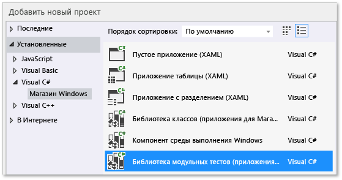

# Модульное тестирование кода Visual C# в приложениях Магазина
[!INCLUDE[vs2017banner](../code-quality/includes/vs2017banner.md)]

В этом разделе описывается один из способов создания модульных тестов для класса Visual C\# в приложении для Магазина Windows.  Класс Rooter демонстрирует концепции теории пределов из математического анализа за счет реализации функции, которая вычисляет оценку квадратного корня из заданного числа.  Приложение Maths затем может использовать эту функцию для представления интересных операций, которые можно выполнять с помощью математических функций.  
  
 В этом разделе демонстрируется использование модульного тестирования в качестве первого шага разработки.  При таком подходе сначала необходимо написать метод теста, который проверяет определенное поведение тестируемой системы, а затем написать код, который проходит этот тест.  Порядок описанных ниже процедур можно изменить, и сначала написать код, который требуется протестировать, а затем написать сами модульные тесты.  
  
 В этом разделе также создается одно решение Visual Studio и отдельные проекты для модульных тестов и для тестируемой библиотеки DLL.  Модульные тесты можно включить непосредственно в проект библиотеки DLL или создать отдельные решения для модульных тестов и для DLL.  
  
> [!NOTE]
>  Visual Studio Community, Enterprise  и Professional предоставляют дополнительные функции для модульного тестирования.  
>   
>  -   Можно использовать любые сторонние среды модульного тестирования и среды с открытым кодом, для которых создан адаптер\-надстройка для обозревателя тестов корпорации Майкрософт.  Кроме того, можно анализировать и отображать данные о покрытии кода для тестов.  
> -   Проводите тесты после каждой сборки.  
> -   VS Enterprise также содержит Microsoft Fakes — платформу изоляции управляемого кода, которая позволяет сосредоточиться на тестировании вашего собственного кода путем замены кода, реализующего системные и сторонние функции.  
>   
>  Дополнительные сведения см. в разделе [Проверка кода с помощью модульных тестов](http://msdn.microsoft.com/library/dd264975.aspx) в библиотеке MSDN.  
  
##  <a name="BKMK_In_this_topic"></a> Содержание раздела  
 [Создание решения и проекта модульного теста](#BKMK_Create_the_solution_and_the_unit_test_project)  
  
 [С помощью обозревателя тестов проверьте, что тесты выполняются](#BKMK_Verify_that_the_tests_run_in_Test_Explorer)  
  
 [Добавление класса Rooter в проект Maths](#BKMK_Add_the_Rooter_class_to_the_Maths_project)  
  
 [Объединение проекта теста с проектом приложения](#BKMK_Couple_the_test_project_to_the_app_project)  
  
 [Итеративное расширение тестов и обеспечение их успешного выполнения](#BKMK_Iteratively_augment_the_tests_and_make_them_pass)  
  
 [Отладка непройденного теста](#BKMK_Debug_a_failing_test)  
  
 [Рефакторинг кода](#BKMK_Refactor_the_code_)  
  
##  <a name="BKMK_Create_the_solution_and_the_unit_test_project"></a> Создание решения и проекта модульного теста  
  
1.  В меню **Файл** выберите команду **Создать** и пункт **Новый проект**.  
  
2.  В диалоговом окне **Новый проект** разверните узел **Установленные**, узел **Visual C\#** и выберите **Магазин Windows**.  В списке шаблонов проектов выберите **Пустое приложение**.  
  
3.  Назовите проект `Maths` и проверьте, что установлен флажок **Создать каталог для решения**.  
  
4.  В обозревателе решений выберите имя решения, в контекстном меню выберите команду **Добавить** и выберите пункт **Новый проект**.  
  
5.  В диалоговом окне **Новый проект** разверните узел **Установленные**, а затем узел **Visual C\#** и выберите **Магазин Windows**.  В списке шаблонов проектов выберите **Библиотека модульных тестов \(приложения для Магазина Windows\)**.  
  
       
  
6.  В редакторе Visual Studio откройте файл UnitTest1.cs.  
  
    ```c#  
  
    using System;  
    using System.Collections.Generic;  
    using System.Linq;  
    using System.Text;  
    using Microsoft.VisualStudio.TestPlatform.UnitTestFramework;  
    using Maths;  
  
    namespace RooterTests  
    {  
        [TestClass]  
        public class UnitTest1  
  
            [TestMethod]  
            public void TestMethod1()  
            {  
  
            }  
  
    ```  
  
     Обратите внимание на следующее.  
  
    1.  Каждый тест определен с помощью `[TestMethod]`.  Метод теста должен возвращать значение типа void и не может иметь параметров.  
  
    2.  Методы теста должны находиться в классе, обозначенном атрибутом `[TestClass]`.  
  
         При запуске тестов создается экземпляр каждого класса теста.  Тестовые методы вызываются в неопределенном порядке.  
  
    3.  Можно задать особые методы, которые вызываются до и после каждого модуля, класса или метода.  Дополнительные сведения см. в разделе [Использование членов Microsoft.VisualStudio.TestTools.UnitTesting в модульных тестах](../test/using-microsoft-visualstudio-testtools-unittesting-members-in-unit-tests.md) в библиотеке MSDN.  
  
##  <a name="BKMK_Verify_that_the_tests_run_in_Test_Explorer"></a> С помощью обозревателя тестов проверьте, что тесты выполняются  
  
1.  Добавьте некоторый код теста в `TestMethod1` файла **UnitTest1.cs**:  
  
    ```c#  
  
    [TestMethod]  
    public void TestMethod1()  
    {  
        Assert.AreEqual(0, 0);  
    }  
  
    ```  
  
     Обратите внимание, что класс `Assert` содержит несколько статических методов, которые можно использовать для проверки результатов в методах теста.  
  
2.  В меню **Тест** выберите **Выполнить**, а затем выберите **Запустить все**.  
  
     Будет построен и запущен проект теста.  Появится окно обозревателя тестов, а тест будет указан в разделе **Пройденные тесты**.  Область сводки в нижней части окна содержит дополнительные сведения о выбранном тесте.  
  
       
  
##  <a name="BKMK_Add_the_Rooter_class_to_the_Maths_project"></a> Добавление класса Rooter в проект Maths  
  
1.  В обозревателе решений выберите имя проекта **Maths**.  В контекстном меню выберите команду **Добавить**, а затем — **Класс**.  
  
2.  Назовите файл класса `Rooter.cs`  
  
3.  Добавьте следующий код в файл класса **Rooter.cs**:  
  
    ```c#  
  
    public Rooter()  
    {  
    }  
  
    // estimate the square root of a number  
    public double SquareRoot(double x)  
    {  
        return 0.0;  
    }  
  
    ```  
  
     Класс `Rooter` объявляет конструктор и метод оценки `SqareRoot`.  
  
4.  Метод `SqareRoot` представляет собой минимальную реализацию, достаточную для проверки базовой структуры тестирования.  
  
##  <a name="BKMK_Couple_the_test_project_to_the_app_project"></a> Объединение проекта теста с проектом приложения  
  
1.  Добавьте ссылку на приложение Maths в проект RooterTests.  
  
    1.  В обозревателе решений выберите проект **RooterTests** и в контекстном меню выберите команду **Добавить ссылку...**.  
  
    2.  В диалоговом окне **Добавить ссылку \- RooterTests** разверните узел **Решение** и выберите **Проекты**.  Затем выберите элемент **Maths**.  
  
           
  
2.  Добавьте оператор using в файл UnitTest1.cs.  
  
    1.  Откройте файл **UnitTest1.cs**.  
  
    2.  Добавьте следующий код ниже строки `using Microsoft.VisualStudio.TestPlatform.UnitTestFramework;`:  
  
        ```c#  
        using Maths;  
        ```  
  
3.  Добавьте тест, который использует функцию Rooter.  Добавьте следующий код в файл **UnitTest1.cpp**:  
  
    ```c#  
    [TestMethod]  
    public void BasicTest()  
    {  
        Maths.Rooter rooter = new Rooter();  
        double expected = 0.0;  
        double actual = rooter.SquareRoot(expected * expected);  
        double tolerance = .001;  
        Assert.AreEqual(expected, actual, tolerance);  
    }  
  
    ```  
  
4.  Выполните построение решения.  
  
     Новый тест появится в обозревателе тестов в узле **Незапускавшиеся тесты**.  
  
5.  В обозревателе тестов выберите **Запустить все**.  
  
       
  
 Вы настроили тест и проекты кода и подтвердили, что можно выполнять тесты, которые запускают функции из проекта кода.  Теперь можно начать писать реальные тесты и код.  
  
##  <a name="BKMK_Iteratively_augment_the_tests_and_make_them_pass"></a> Итеративное расширение тестов и обеспечение их успешного выполнения  
  
1.  Добавьте новый тест.  
  
    ```c#  
    [TestMethod]  
    public void RangeTest()  
    {  
        Rooter rooter = new Rooter();  
        for (double v = 1e-6; v < 1e6; v = v * 3.2)  
        {  
            double expected = v;  
            double actual = rooter.SquareRoot(v*v);  
            double tolerance = ToleranceHelper(expected);  
            Assert.AreEqual(expected, actual, tolerance);  
        }  
    }  
  
    ```  
  
    > [!TIP]
    >  Рекомендуется не изменять пройденные тесты.  Вместо этого добавьте новый тест, обновите код так, чтобы тест проходил успешно, а затем добавьте еще один тест и т. д.  
    >   
    >  При изменении пользователями требований отключите тесты, которые больше не являются корректными.  Создавайте новые тесты по одному и следите за тем, чтобы они работали.  
  
2.  В обозревателе тестов выберите **Запустить все**.  
  
3.  Тест не пройден.  
  
       
  
    > [!TIP]
    >  Непосредственно после написания кода теста проверьте, что тест не пройден.  Это поможет избежать распространенной ошибки, заключающейся в написании теста, который никогда не завершается сбоем.  
  
4.  Измените код теста, чтобы новый тест был пройден.  Измените функцию `SqareRoot` в файле **Rooter.cs**:  
  
    ```c#  
    public double SquareRoot(double x)  
    {  
        double estimate = x;  
        double diff = x;  
        while (diff > estimate / 1000)  
        {  
            double previousEstimate = estimate;  
            estimate = estimate - (estimate * estimate - x) / (2 * estimate);  
            diff = Math.Abs(previousEstimate - estimate);  
        }  
        return estimate;  
    }  
  
    ```  
  
5.  Постройте решение, а затем в обозревателе тестов выберите **Запустить все**.  
  
     Теперь все три теста проходятся.  
  
> [!TIP]
>  Разрабатывайте код, добавляя тесты по одному.  После каждой итерации проверяйте, все ли тесты завершаются успешно.  
  
##  <a name="BKMK_Debug_a_failing_test"></a> Отладка непройденного теста  
  
1.  Добавьте в файл **UnitTest1.cs** еще один тест:  
  
    ```c#  
    // Verify that negative inputs throw an exception.  
    [TestMethod]  
    public void NegativeRangeTest()  
    {  
        string message;  
        Rooter rooter = new Rooter();  
        for (double v = -0.1; v > -3.0; v = v - 0.5)  
        {  
            try  
            {  
                // Should raise an exception:  
                double actual = rooter.SquareRoot(v);  
  
                message = String.Format("No exception for input {0}", v);  
                Assert.Fail(message);  
            }  
            catch (ArgumentOutOfRangeException ex)  
            {  
                continue; // Correct exception.  
            }  
            catch (Exception e)  
            {  
                message = String.Format("Incorrect exception for {0}", v);  
                Assert.Fail(message);  
            }  
        }  
    }  
  
    ```  
  
2.  В обозревателе тестов выберите **Запустить все**.  
  
     Тест не пройден.  Выберите имя теста в обозревателе тестов.  Ошибочное проверочное утверждение будет выделено.  Сообщение об ошибке отображается в области сведений обозревателя тестов.  
  
       
  
3.  Чтобы определить причину сбоя теста, пошагово выполните функцию.  
  
    1.  Установите точку останова перед функцией `SquareRoot`.  
  
    2.  В контекстном меню непройденного теста выберите **Отладить выбранные тесты**.  
  
         При остановке выполнения на точке останова выполните код пошагово.  
  
    3.  Добавьте в метод Rooter код для перехвата исключения:  
  
        ```c#  
        public double SquareRoot(double x)  
        {  
            if (x < 0.0)  
            {  
                throw new ArgumentOutOfRangeException();  
        }  
  
        ```  
  
    1.  В обозревателе тестов выберите **Запустить все**, чтобы протестировать исправленный метод и убедиться, что не была добавлена регрессия.  
  
 Теперь все тесты проходятся.  
  
   
  
##  <a name="BKMK_Refactor_the_code_"></a> Рефакторинг кода  
 **Упростите основной расчет функции SquareRoot.**  
  
1.  Измените реализацию результата  
  
    ```c#  
    // old code  
    //result = result - (result*result - v)/(2*result);  
    // new code  
    result = (result + v/result) / 2.0;  
  
    ```  
  
2.  Выберите команду **Запустить все**, чтобы протестировать подвергнутый рефакторингу метод и убедиться, что не была добавлена регрессия.  
  
> [!TIP]
>  Стабильный набор хороших модульных тестов придает уверенность в том, что изменение кода не привело к появлению ошибок.  
  
 **Выполните рефакторинг кода теста, чтобы исключить дублирование кода.**  
  
 Обратите внимание, что в методе `RangeTest` жестко задан знаменатель переменной отклонения, которая используется в методе `Assert`.  Если планируется добавлять другие тесты, которые используют такой же расчет отклонения, использование жестко запрограммированных значений в нескольких местах может привести к ошибкам.  
  
1.  Добавьте к классу Unit1Test закрытый метод для вычисления значения отклонения, а затем вызывайте этот метод.  
  
    ```c#  
    private double ToleranceHelper(double expected)  
    {  
        return expected / 1000;  
    }  
  
    ...  
  
    [TestMethod]  
    public void RangeTest()  
    {  
        ...  
        // old code  
        // double tolerance = expected/1000;  
        // new code  
        double tolerance = ToleranceHelper(expected);  
        Assert.AreEqual(expected, actual, tolerance);  
    }  
    ...  
  
    ```  
  
2.  Выберите команду **Запустить все**, чтобы протестировать подвергнутый рефакторингу метод и убедиться, что не была добавлена ошибка.  
  
> [!NOTE]
>  Для добавления в тестовый класс вспомогательного метода не добавляйте в метод атрибут `[TestMethod]`.  Обозреватель тестов не регистрирует метод, который будет запущен.