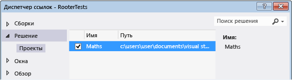
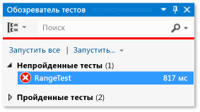

# <a name="unit-test-c-code"></a>Модульное тестирование кода C#

Эта статья описывает один из способов создания модульных тестов для класса C# в приложении UWP.

Класс **Rooter**, который является тестируемым, реализует функцию, вычисляющую оценку квадратного корня заданного числа.

В этой статье демонстрируется *разработка на основе тестов*. При таком подходе сначала необходимо написать тест, который проверяет определенное поведение тестируемой системы, а затем написать код, который проходит этот тест.

## <a name="create-the-solution-and-the-unit-test-project"></a>Создание решения и проекта модульного теста

1. В меню **Файл** последовательно выберите пункты **Создать** > **Проект**.

2. Найдите и выберите шаблон проекта **Пустое приложение (универсальное приложение для Windows)**.

3. Задайте для проекта имя **Maths**.

4. В **обозревателе решений** щелкните решение правой кнопкой мыши и выберите пункты **Добавить** > **Новый проект**.

5. Найдите и выберите шаблон проекта **Приложение модульного тестирования (универсальное приложение Windows)**.

6. Задайте для тестового проекта имя **RooterTests**.

## <a name="verify-that-the-tests-run-in-test-explorer"></a>Проверка с помощью обозревателя тестов, что тесты запускаются

1. Добавьте какой-нибудь тестовый код в **TestMethod1** в файле *UnitTest.cs*:

   ```csharp
   [TestMethod]
   public void TestMethod1()
   {
       Assert.AreEqual(0, 0);
   }
   ```

   Класс <xref:Microsoft.VisualStudio.TestTools.UnitTesting.Assert> содержит несколько статических методов, которые можно использовать для проверки результатов в тестовых методах.

::: moniker range="vs-2017"

2. В меню **Тест** выберите **Выполнить** > **Все тесты**.

::: moniker-end

::: moniker range=">=vs-2019"

2. В меню **Тест** выберите **Выполнить все тесты**.

::: moniker-end

   Будет построен и запущен проект теста. Подождите, так как это может занять некоторое время. Появится окно **обозревателя тестов**, а тест будет указан в разделе **Пройденные тесты**. Область **сводки** в нижней части окна содержит дополнительные сведения о выбранном тесте.

## <a name="add-the-rooter-class-to-the-maths-project"></a>Добавьте в проект Maths класс Rooter

1. В **обозревателе решений** щелкните правой кнопкой мыши проект **Maths**, а затем выберите **Добавить** > **Класс**.

2. Назовите файл класса *Rooter.cs*.

3. Добавьте следующий код в файл *Rooter.cs* класса **Rooter**:

   ```csharp
   public Rooter()
   {
   }

   // estimate the square root of a number
   public double SquareRoot(double x)
   {
       return 0.0;
   }
   ```

   Класс **Rooter** объявляет конструктор и метод оценки **SquareRoot**. Метод **SquareRoot** представляет собой минимальную реализацию, достаточную для проверки базовой структуры тестирования.

4. Добавьте ключевое слово `public` в объявление класса **Rooter**, чтобы код теста мог получить к нему доступ.

   ```csharp
   public class Rooter
   ```

## <a name="add-a-project-reference"></a>Добавление ссылки на проект

1. Добавьте ссылку на приложение Maths в проект RooterTests.

    1. В **обозревателе решений** щелкните правой кнопкой мыши проект **RooterTests** и выберите **Добавить** > **Ссылка**.

    2. В диалоговом окне **Добавить ссылку — RooterTests** разверните узел **Решение** и выберите **Проекты**. Выберите проект **Maths**.

        

2. Добавьте в файл *UnitTest.cs* инструкцию `using`:

    1. Откройте файл *UnitTest.cs*.

    2. Добавьте следующий код ниже строки `using Microsoft.VisualStudio.TestTools.UnitTesting;`:

       ```csharp
       using Maths;
       ```

3. Добавьте тест, использующий функцию **Rooter**. Добавьте в файл *UnitTest.cs* следующий код:

   ```csharp
   [TestMethod]
   public void BasicTest()
   {
       Maths.Rooter rooter = new Rooter();
       double expected = 0.0;
       double actual = rooter.SquareRoot(expected * expected);
       double tolerance = .001;
       Assert.AreEqual(expected, actual, tolerance);
   }
   ```

   Новый тест появится в **обозревателе тестов** в узле **Незапускавшиеся тесты**.

4. Чтобы избежать ошибки, когда полезная нагрузка содержит два или больше файлов с одним и тем же путем назначения, в **обозревателе решений** разверните узел **Свойства** в проекте **Maths**, а затем удалите файл *Default.rd.xml*.

::: moniker range="vs-2017"

6. В **обозревателе тестов** выберите **Запустить все**.

   Выполняется сборка решения, запускаются и успешно выполняются тесты.

   

::: moniker-end

::: moniker range=">=vs-2019"

6. В разделе **обозреватель тестов** выберите **Выполнить все тесты**.

   Выполняется сборка решения, запускаются и успешно выполняются тесты.

   

::: moniker-end

Вы настроили проекты тестов и приложений и убедились, что можно выполнять тесты, вызывающие функции в проекте приложения. Теперь можно начать писать реальные тесты и код.

## <a name="iteratively-augment-the-tests-and-make-them-pass"></a>Итеративное расширение тестов и обеспечение их успешного выполнения

1. Добавьте новый тест с именем **RangeTest**:

   ```csharp
   [TestMethod]
   public void RangeTest()
   {
       Rooter rooter = new Rooter();
       for (double v = 1e-6; v < 1e6; v = v * 3.2)
       {
           double expected = v;
           double actual = rooter.SquareRoot(v*v);
           double tolerance = expected/1000;
           Assert.AreEqual(expected, actual, tolerance);
       }
   }
   ```

   > [!TIP]
   > Рекомендуется не изменять пройденные тесты. Вместо этого добавьте новый тест.

2. Запустите тест **RangeTest** и убедитесь, что он завершается сбоем.

   

   > [!TIP]
   > Сразу после написания теста запустите его, чтобы убедиться в его сбое. Это поможет избежать распространенной ошибки, заключающейся в написании теста, который никогда не завершается сбоем.

3. Измените код теста, чтобы новый тест был пройден. Измените функцию **SquareRoot** в файле *Rooter.cs* следующим образом:

   ```csharp
   public double SquareRoot(double x)
   {
       double estimate = x;
       double diff = x;
       while (diff > estimate / 1000)
       {
           double previousEstimate = estimate;
           estimate = estimate - (estimate * estimate - x) / (2 * estimate);
           diff = Math.Abs(previousEstimate - estimate);
       }
       return estimate;
   }
   ```

::: moniker range="vs-2017"

4. В **обозревателе тестов** выберите **Запустить все**.

::: moniker-end

::: moniker range=">=vs-2019"

4. В разделе **обозреватель тестов** выберите **Выполнить все тесты**.

::: moniker-end

   Теперь все три теста проходятся.

> [!TIP]
> Разрабатывайте код, добавляя тесты по одному. После каждой итерации проверяйте, все ли тесты завершаются успешно.

## <a name="refactor-the-code"></a>Рефакторинг кода

В этом разделе вы выполните рефакторинг кода приложения и теста, а затем повторно запустите тесты, чтобы убедиться, что они выполняются успешно.

### <a name="simplify-the-square-root-estimation"></a>Упрощение оценки квадратного корня

1. Упростите централизованное вычисление в функции **SquareRoot**, изменив одну строку кода следующим образом:

    ```csharp
    // Old code
    //estimate = estimate - (estimate * estimate - x) / (2 * estimate);

    // New code
    estimate = (estimate + x/estimate) / 2.0;
    ```

2. Выполните все тесты, чтобы убедиться, что не введена регрессия. Все тесты должны успешно выполниться.

> [!TIP]
> Стабильный набор хороших модульных тестов придает уверенность в том, что изменение кода не привело к появлению ошибок.

### <a name="eliminate-duplicated-code"></a>Исключение повторяющегося кода

В методе **RangeTest** жестко задан знаменатель переменной *отклонения*, которая используется в методе <xref:Microsoft.VisualStudio.TestTools.UnitTesting.Assert>. Если планируется добавлять другие тесты, которые используют такой же расчет отклонения, использование жестко запрограммированных значений в нескольких местах может усложнить работу с кодом.

1. Добавьте к классу **UnitTest1** закрытый вспомогательный метод для вычисления значения отклонения, а затем вызывайте этот метод из **RangeTest**.

    ```csharp
    private double ToleranceHelper(double expected)
    {
        return expected / 1000;
    }

    ...

    [TestMethod]
    public void RangeTest()
    {
        ...
        // Old code
        // double tolerance = expected/1000;

        // New code
        double tolerance = ToleranceHelper(expected);
    }
    ...
    ```

2. Запустите тест **RangeTest**, чтобы убедиться, что он все еще успешно выполняется.

> [!TIP]
> При добавлении вспомогательного метода в тестовый класс, который не должен отображаться в **обозревателе тестов**, не добавляйте к этому методу атрибут <xref:Microsoft.VisualStudio.TestTools.UnitTesting.TestMethodAttribute>.

## <a name="see-also"></a>См. также раздел

- [Пошаговое руководство: разработка на основе тестирования с помощью обозревателя тестов](quick-start-test-driven-development-with-test-explorer.md)
