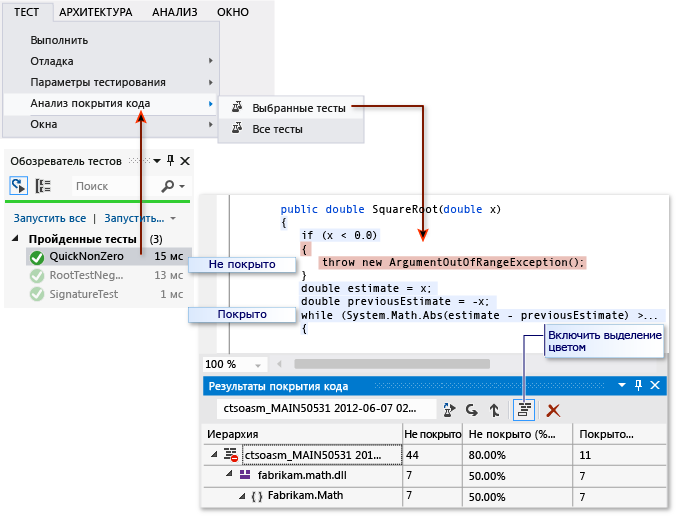

# <a name="use-code-coverage-to-determine-how-much-code-is-being-tested"></a>Использование покрытия кода для определения объема протестированного кода

Чтобы определить, какая часть кода проекта в действительности тестируется закодированными тестами, такими как модульные тесты, можно воспользоваться возможностью покрытия кода в Visual Studio. Для обеспечения эффективной защиты от ошибок тесты должны выполнять ("покрывать") большую часть кода.

Анализ покрытия кода может применяться и к управляемому (CLI), и к неуправляемому (машинному) коду.

Покрытие кода возможно при выполнении методов тестов с помощью обозревателя тестов. В таблице результатов отображается процент кода, который был выполнен в каждой сборке, классе и методе. Кроме того, редактор исходного кода показывает, какой код был протестирован.

::: moniker range="vs-2017"



::: moniker-end

## <a name="requirements"></a>Требования

Функция проверки объема протестированного кода доступна только в выпуске Visual Studio Enterprise.

## <a name="analyze-code-coverage"></a>Анализ покрытия кода

::: moniker range="vs-2017"

1. В меню **Тест** щелкните **Анализ покрытия кода**.

::: moniker-end

::: moniker range=">=vs-2019"

1. В меню **Тестирование** выберите **Анализ покрытия кода для всех тестов**.

   

   Анализ объема протестированного кода также можно запустить из окна средства обозревателя тестов.

::: moniker-end

2. Чтобы после выполнения тестов увидеть, какие строки были выполнены, щелкните  **Цвета отображения покрытия кода** в окне **Результаты покрытия кода**. По умолчанию код, охватываемый тестами, выделяется голубым цветом.

   > [!TIP]
   > Чтобы изменить цвета или использовать полужирный шрифт, последовательно выберите **Сервис** > **Параметры** > **Среда** > **Шрифты и цвета** > **Параметры для: текстовый редактор**. В разделе **Отображаемые элементы** настройте параметры для элементов покрытия, например **Области вне покрытия кода**.
   >
   > 

3. Если результаты показывают низкое покрытие, проверьте, какие части кода не обрабатываются, и напишите несколько дополнительных тестов для их покрытия. Команды разработчиков обычно стремятся покрыть около 80 % кода. В некоторых случаях допустимо более низкое покрытие. Например, более низкое покрытие допустимо, когда некоторый код создается из стандартного шаблона.

> [!TIP]
> - Отключение оптимизации компилятора
> - При работе с неуправляемым (машинным) кодом используйте отладочную сборку.
> - Создавайте PDB-файлы (файлы символов) для каждой сборки.

Если полученный результат отличается от ожидаемого, см. статью [Устранение неполадок в объеме протестированного кода](../test/troubleshooting-code-coverage.md).

Не забудьте снова выполнить покрытие кода после обновления кода. Результаты покрытия и цвета кода не обновляются автоматически после изменения кода или при выполнении тестов.

## <a name="report-in-blocks-or-lines"></a>Отчеты в блоках или строках

Покрытие кода измеряется в *блоках*. Блок — это часть кода с одной точкой входа и точкой выхода.  Если поток управления программы проходит через блок во время тестового запуска, то этот блок учитывается как покрытый. Количество раз, когда используется блок, не влияет на результат.

Результаты также можно отобразить в виде строк, щелкнув **Добавить или удалить столбцы** в заголовке таблицы. Некоторые пользователи предпочитают считать в строках, поскольку процентные соотношения более точно соответствуют размеру фрагментов, которые можно увидеть в исходном коде. Длинный блок вычислений учитывается как единый блок, даже если он занимает большое количество строк.

> [!TIP]
> Строка кода может содержать более одного блока кода. В этом случае, если во время тестового запуска все блоки кода были обработаны в любой строке, она учитывается как одна строка. Если обработаны только некоторые блоки в строке, она считается частичной строкой.

## <a name="manage-code-coverage-results"></a>Управление результатами по объемам протестированного кода

В окне **Результаты покрытия кода**, как правило, отображается результат последнего запуска. Результаты изменятся, если изменить данные тестов или если каждый раз выполнять только часть тестов.

Окно покрытия кода также можно использовать для просмотра предыдущих результатов или результатов, полученных на других компьютерах.

Можно объединить результаты нескольких запусков, например тех, что используют различные данные теста.

- **Чтобы просмотреть предыдущий набор результатов**, выберите его в раскрывающемся меню. В меню отображается временный список, который очищается при открытии нового решения.

- **Чтобы просмотреть результаты предыдущего сеанса**, щелкните **Импортировать результаты покрытия кода**, перейдите к папке **TestResults** в своем решении и импортируйте файл *COVERAGE*.

   Цвета отображения покрытия могут быть неверными, если исходный код был изменен с момента создания файла *COVERAGE*.

- **Чтобы представить результаты в виде текста**, щелкните **Экспортировать результаты покрытия кода**. Будет создан удобочитаемый файл с расширением *.coveragexml*, который можно обработать в других инструментах или отправить по почте.

- **Чтобы отправить результаты другому пользователю**, отправьте файл *COVERAGE* или экспортированный файл *COVERAGEXML*. Получатели могут затем импортировать файл. Если у них та же версия исходного кода, то они смогут увидеть цвета отображения покрытия.

## <a name="merge-results-from-different-runs"></a>Объединение результатов различных запусков

В некоторых ситуациях будут использоваться разные блоки в коде в зависимости от данных теста. Поэтому может потребоваться объединить результаты различных тестовых запусков.

Например, предположим, что при выполнении теста со входными данными "2" обнаружилось, что покрыто 50 % определенной функции. А при повторном выполнении теста со входными данными "-2" вы видите, что проверены остальные 50 % функции. Теперь можно объединить результаты двух тестовых запусков, чтобы в отчете и представлении расцветки покрытия было видно, что покрыто 100 % данной функции.

Для этого используйте  **значок объединения результатов покрытия кода**. Можно выбрать любые сочетания последних запусков или импортированных результатов. Если требуется объединить экспортированные результаты, в первую очередь необходимо их импортировать.

Щелкните **Экспортировать результаты покрытия кода**, чтобы сохранить результаты операции слияния.

### <a name="limitations-in-merging"></a>Ограничения объединения

- При объединении данных покрытия из различных версий кода результаты отображаются отдельно, но они не объединяются. Чтобы получить полностью объединенные результаты, используйте одну ту же сборку кода и изменяйте только данные теста.

- При слиянии файла результатов, который был экспортирован, а затем импортирован, результаты можно просматривать только по строкам, но не по блокам. Используйте команду **Добавить или удалить столбцы**, чтобы отобразить данные по строкам.

- При объединении результатов тестов проекта ASP.NET результаты отдельных тестов будут отображаться, но не объединяться. Это относится только к самим артефактам ASP.NET: результаты всех других сборок будут объединяться.

## <a name="exclude-elements-from-the-code-coverage-results"></a>Исключение элементов из результатов покрытия кода

Иногда требуется исключить конкретные элементы в коде из результатов покрытия, например, если код создан из текстового шаблона. Добавьте атрибут <xref:System.Diagnostics.CodeAnalysis.ExcludeFromCodeCoverageAttribute?displayProperty=fullName> в любой из таких элементов кода: класс, структура, метод, свойство, метод задания свойства или метод получения свойства, событие.

> [!TIP]
> Исключение класса не исключает его производные классы.

Пример:

```csharp
using System.Diagnostics.CodeAnalysis;
...
public class ExampleClass1
{
    [ExcludeFromCodeCoverage]
    void ExampleMethod() {...}

    [ExcludeFromCodeCoverage] // exclude property
    int ExampleProperty1
    { get {...} set{...}}

    int ExampleProperty2
    {
        get
        {
            ...
        }
        [ExcludeFromCodeCoverage] // exclude setter
        set
        {
            ...
        }
    }

}
[ExcludeFromCodeCoverage]
class ExampleClass2 { ... }
```

```vb
Imports System.Diagnostics.CodeAnalysis

Class ExampleClass1
    <ExcludeFromCodeCoverage()>
    Public Sub ExampleSub1()
        ...
    End Sub

    ' Exclude property
    < ExcludeFromCodeCoverage()>
    Property ExampleProperty1 As Integer
        ...
    End Property

    ' Exclude setter
    Property ExampleProperty2 As Integer
        Get
            ...
        End Get
        <ExcludeFromCodeCoverage()>
        Set(ByVal value As Integer)
            ...
        End Set
    End Property
End Class

<ExcludeFromCodeCoverage()>
Class ExampleClass2
...
End Class
```

```cpp
// A .cpp file compiled as managed (CLI) code.
using namespace System::Diagnostics::CodeAnalysis;
...
public ref class ExampleClass1
{
  public:
    [ExcludeFromCodeCoverage]
    void ExampleFunction1() { ... }

    [ExcludeFromCodeCoverage]
    property int ExampleProperty2 {...}

    property int ExampleProperty2 {
      int get() { ... }
     [ExcludeFromCodeCoverage]
      void set(int value) { ...  }
   }
}

[ExcludeFromCodeCoverage]
public ref class ExampleClass2
{ ... }
```

### <a name="exclude-elements-in-native-c-code"></a>Исключение элементов в машинном коде C++

Чтобы исключить неуправляемые (машинные) элементы в коде C++, используйте следующий код.

```cpp
#include <CodeCoverage\CodeCoverage.h>
...

// Exclusions must be compiled as unmanaged (native):
#pragma managed(push, off)

// Exclude a particular function:
ExcludeFromCodeCoverage(Exclusion1, L"MyNamespace::MyClass::MyFunction");

// Exclude all the functions in a particular class:
ExcludeFromCodeCoverage(Exclusion2, L"MyNamespace::MyClass2::*");

// Exclude all the functions generated from a particular template:
ExcludeFromCodeCoverage(Exclusion3, L"*::MyFunction<*>");

// Exclude all the code from a particular .cpp file:
ExcludeSourceFromCodeCoverage(Exclusion4, L"*\\unittest1.cpp");

// After setting exclusions, restore the previous managed/unmanaged state:
#pragma managed(pop)
```

Используйте следующие макросы:

`ExcludeFromCodeCoverage(` *ExclusionName* `, L"` *FunctionName* `");`

`ExcludeSourceFromCodeCoverage(` *ExclusionName* `, L"` *SourceFilePath* `");`

- *ExclusionName* — любое уникальное имя.

- *FunctionName* — полное имя функции. Оно может содержать знаки подстановки. Например, чтобы исключить все функции класса, напишите `MyNamespace::MyClass::*`

- *SourceFilePath* — локальный путь или путь UNC к CPP-файлу. Оно может содержать знаки подстановки. В следующем примере исключаются все файлы из определенного каталога: `\\MyComputer\Source\UnitTests\*.cpp`

- `#include <CodeCoverage\CodeCoverage.h>`

- Поместите вызовы макроса исключения в глобальное пространство имен, а не внутри любого пространства имен или класса.

- Исключения можно поместить в файл кода модульного теста или в файл кода приложения.

- Исключения должны компилироваться как неуправляемый (машинный) код с помощью настройки параметра компилятора или с помощью `#pragma managed(off)`.

> [!NOTE]
> Чтобы исключить функции в коде C++/CLI, примените атрибут `[System::Diagnostics::CodeAnalysis::ExcludeFromCodeCoverage]` к функции. Эта процедура не отличается от C#.

### <a name="include-or-exclude-additional-elements"></a>Включение или исключение дополнительных элементов

Анализ покрытия кода выполняется только для загруженных сборок, для которых *PDB*-файл доступен в том же каталоге, что и *DLL*-файл или *EXE*-файл. Поэтому в некоторых обстоятельствах можно расширить набор сборок, включенный путем получения копий соответствующих *PDB*-файлов.

Можно обеспечить более полное управление выбором сборок и элементов для включения в анализ покрытия кода путем записи файла *RUNSETTINGS*. Например, можно исключить сборки определенных типов, не добавляя атрибуты к их классам. См. дополнительные сведения по [настройке анализа объема протестированного кода](../test/customizing-code-coverage-analysis.md).

## <a name="analyze-code-coverage-in-azure-pipelines"></a>Анализ покрытия кода в Azure Pipelines

После возврата измененного кода ваши тесты будут выполняться на сервере сборки вместе с тестами других членов команды. Анализ объема протестированного кода в Azure Pipelines дает наиболее актуальное и исчерпывающее представление о тестировании в масштабе всего проекта. Такой анализ также подразумевает автоматические системные тесты и другие закодированные тесты, которые обычно не выполняются на компьютерах разработчиков. Дополнительные сведения см. в статье о [модульном тестировании сборок](/azure/devops/pipelines/test/getting-started-with-continuous-testing?view=vsts&preserve-view=true).

## <a name="analyze-code-coverage-from-the-command-line"></a>Анализ объема протестированного кода в командной строке

Для выполнения тестов из командной строки используйте *vstest.console.exe*. Объем протестированного кода является параметром служебной программы *vstest.console.exe*.

1. Запустите командную строку разработчика Visual Studio.

   ::: moniker range="vs-2017"

   В ОС Windows в меню **Пуск** выберите **Visual Studio 2017** > **Developer Command Prompt for VS 2017** (Командная строка разработчика для VS 2017).

   ::: moniker-end

   ::: moniker range=">=vs-2019"

   В ОС Windows в меню **Пуск** выберите **Visual Studio 2019** > **Developer Command Prompt for VS 2019** (Командная строка разработчика для VS 2019).

   ::: moniker-end

2. В командной строке выполните следующую команду:

   ```shell
   vstest.console.exe MyTestAssembly.dll /EnableCodeCoverage
   ```

Дополнительные сведения см. в статье [Параметры командной строки для VSTest.Console.exe](vstest-console-options.md).

## <a name="troubleshoot"></a>Диагностика

Если вы не видите результаты проверки объема протестированного кода, см. статью [Устранение неполадок в объеме протестированного кода](../test/troubleshooting-code-coverage.md).

## <a name="see-also"></a>См. также раздел

- [Настройка анализа объема протестированного кода](../test/customizing-code-coverage-analysis.md)
- [Устранение неполадок в объеме протестированного кода](../test/troubleshooting-code-coverage.md)
- [Модульное тестирование кода](../test/unit-test-your-code.md)
