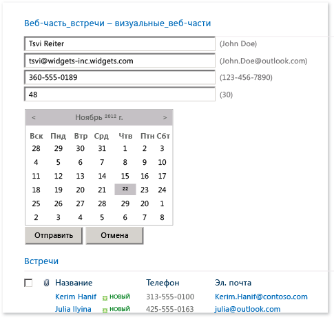
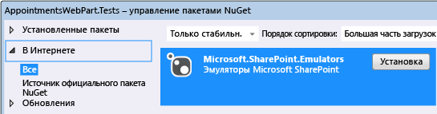
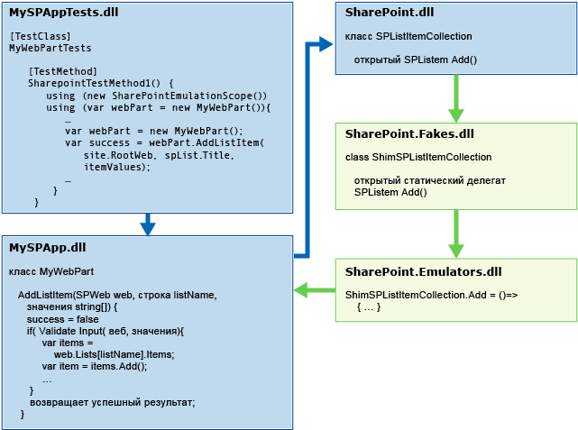
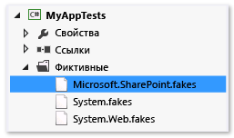
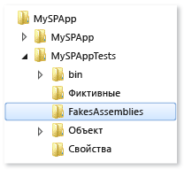

# <a name="using-emulators-to-isolate-unit-tests-for-sharepoint-2010-applications"></a>Использование эмуляторов для изоляции модульных тестов приложений SharePoint 2010

Пакет Microsoft.SharePoint.Emulators предоставляет набор библиотек, которые позволяют создавать изолированные модульные тесты для приложений Microsoft SharePoint 2010. Эмуляторы используют [оболочки совместимости](../test/using-shims-to-isolate-your-application-from-other-assemblies-for-unit-testing.md) платформы изоляции [Microsoft Fakes](../test/isolating-code-under-test-with-microsoft-fakes.md) для создания упрощенных объектов в памяти, которые имитируют наиболее распространенные объекты и методы API SharePoint. Оболочки совместимости Fakes используются, например, когда невозможно эмулировать метод SharePoint или требуется изменить стандартное поведение эмулятора.

Существующие классы и методы теста можно легко преобразовать для выполнения в контексте эмулятора. Эта возможность позволяет создавать тесты двойного назначения. Тест двойного назначения можно использовать как тест интеграции для реального API SharePoint и как изолированный модульный тест, использующий эмуляторы.

##  <a name="BKMK_Requirements"></a> Требования

-   Microsoft SharePoint 2010 (SharePoint 2010 Server или SharePoint 2010 Foundation)

-   Microsoft Visual Studio Enterprise

-   Пакет NuGet эмуляторов Microsoft SharePoint

Также следует ознакомиться с [основами модульного тестирования в Visual Studio](../test/unit-test-basics.md) и принципами работы [Microsoft Fakes](../test/isolating-code-under-test-with-microsoft-fakes.md).

##  <a name="BKMK_The_AppointmentsWebPart_example"></a> Пример AppointmentsWebPart

Веб-часть AppointmentsWebPart позволяет просматривать список встреч SharePoint и управлять им.



В этом примере мы протестируем два метода веб-части.

-   Метод `ScheduleAppointment` проверяет значения элементов списка, передаваемые в метод, и создает новую запись в списке на указанном веб-сайте SharePoint.

-   Метод `GetAppointmentsForToday` возвращает сведения о сегодняшних встречах.

##  <a name="convert-an-existing-test"></a>Преобразование существующего теста

Как правило, при тестировании метода в компоненте SharePoint метод теста создает временный сайт в SharePoint Foundation и добавляет в него компоненты SharePoint, которые требуются для тестируемого кода. Затем метод теста создает и проверяет экземпляр компонента. В конце теста сайт будет ликвидирован.

Метод `ScheduleAppointment` нашего тестируемого кода, вероятно, является одним из первых методов, написанных для компонента:

```csharp
// method under test
public bool ScheduleAppointment(SPWeb web, string listName, string name,
    string phone, string email, string age, DateTime date, out string errorMsg)
{
    errorMsg = string.Empty;
    var badFormat = this.checkInput(name, phone, email, age);
    if (badFormat)
    {
        errorMsg = "Bad Format";
        return false;
    }
    var exists = this.CheckDuplicate(listName, web, name, phone, email, age, date);
    if (exists)
    {
        errorMsg = "Item already exists";
        return false;
    }
    SPListItemCollection items = web.Lists[listName].Items;
    // create item and populate fields
    SPListItem item = items.Add();
    item["Name"] = name;
    item["Phone"] = phone;
    item["Email"] = email;
    item["Age"] = age;
    item["Date"] = date.ToString("D");
    item.Update();
    return true;
}
```

Первый тест функций в методе `ScheduleAppointment` может выглядеть следующим образом.

```csharp
[TestMethod]
public void ScheduleAppointmentReturnsTrueWhenNewAppointmentIsCreated()
{
    using( var site = new SPSite("http://localhost"))
    using (var webPart = new BookAnAppointmentWebPart())
    {
        // Arrange
        string errorMsg = string.Empty;
        DateTime date = DateTime.Now;
        SPList list = AddListToSiteHelper(site);

        // Act
        bool success = webPart.ScheduleAppointment(site.RootWeb, list.Title,
            "Raisa Pokrovskaya", "425-555-0163", "raisa@outlook.com", "55", date,
            out errorMsg);
        list.Delete();

        // Assert
        Assert.IsTrue(success);
    }
}
```

Хотя этот метод и выполняет проверку того, что метод `ScheduleAppointment` правильно добавляет новую запись в список, это скорее тест интеграции веб-части, чем проверка определенного поведения кода. Внешние зависимости для SharePoint и API SharePoint могут вызвать сбой теста, причиной которого не будет являться пользовательский код в методе `ScheduleAppointment`. Затраты на создание и удаление сайта SharePoint также могут сделать тест слишком медленным для того, чтобы его может было использовать как обычную составляющую процесса написания кода. Выполнение установки и удаления сайта для каждого метода теста только усложняет проблему создания эффективных модульных тестов для разработчиков.

Эмуляторы Microsoft SharePoint предоставляют набор объектов и метод удваивания, которые имитируют поведение наиболее распространенных API SharePoint. Эмулированные методы являются упрощенными реализациями API SharePoint, для запуска которых не требуется SharePoint. Используя Microsoft Fakes для перенаправления вызовов API SharePoint в метод удваивания эмуляторов SharePoint, можно изолировать тесты и гарантировать тестирование нужного кода. При вызове методов SharePoint, которые не эмулируются, можно использовать Fakes непосредственно для создания требуемого поведения.

###  <a name="BKMK_Adding_the_Emulators_package_to_a_test_project"></a> Добавление пакета эмуляторов в тестовый проект

Чтобы добавить эмуляторы SharePoint в тестовый проект, выполните следующие действия.

1.  Выберите тестовый проект в **обозревателе решений**.

2.  Выберите в контекстном меню команду **Управление пакетами NuGet**.

3.  Найдите категорию **В сети** для `Microsoft.SharePoint.Emulators`и выберите **Установить**.



###  <a name="BKMK__Running_a_test_method_in_the_emulation_context"></a> Запуск метода теста с эмуляцией

При установке пакета в проекты добавляются ссылки на необходимые библиотеки. Чтобы упростить использование эмуляторов в существующем тестовом классе, добавьте пространства имен `Microsoft.SharePoint.Emulators` и `Microsoft.QualityTools.Testing.Emulators`.

Для включения эмуляции в методах теста заключите тело метода в оператор `using`, который создает объект `SharePointEmulationScope`. Например:

```csharp
[TestMethod]
public void ScheduleAppointmentReturnsTrueWhenNewAppointmentIsCreated()
{
    // create the emulation scope with a using statement
    using (new SharePointEmulationScope())
    using( var site = new SPSite("http://localhost"))
    using (var webPart = new BookAnAppointmentWebPart())
    {
        // Arrange
        string errorMsg = string.Empty;
        DateTime date = DateTime.Now;
        SPList list = AddListToSiteHelper(site);

        // Act
        bool success = webPart.ScheduleAppointment(site.RootWeb, list.Title,
            "Raisa Pokrovskaya", "425-555-0163", "raisa@outlook.com", "55", date,
            out errorMsg);
        list.Delete();

        // Assert
        Assert.IsTrue(success);
    }
}
```

При выполнении метода теста среда выполнения эмулятора вызывает Microsoft Fakes для динамической вставки кода в методы SharePoint для отклонения вызовов этих методов и перенаправления их делегатам, которые объявлены в библиотеке *Microsoft.SharePoint.Fakes.dll*. *Microsoft.SharePoint.Emulators.dll* реализует делегаты для эмулированных методов, точно воспроизводя фактическое поведение SharePoint. Когда метод теста или тестируемый компонент вызывает метод SharePoint, реализуется поведение эмуляции.



##  <a name="create-dual-use-classes-and-methods"></a>Создание классов и методов двойного назначения

Чтобы создать методы, которые можно использовать для тестов интеграции реальных API SharePoint и изолированных модульных тестов, использующих эмуляторы, воспользуйтесь перегруженным конструктором `SharePointEmulationScope(EmulationMode)` для создания оболочки для кода метода теста. Два значения перечисления `EmulationMode` указывают, использует ли область эмуляторы (`EmulationMode.Enabled`) или API SharePoint (`EmulationMode.Passthrough`).

Ниже приведен пример преобразования предыдущего теста в тест двойного назначения.

```csharp
// class level field specifies emulation mode
private const EmulationMode emulatorMode = EmulationMode.Enabled;

[TestMethod]
public void ScheduleAppointmentReturnsTrueWhenNewAppointmentIsCreated()
{
    // emulation scope determined by emulatorMode
    using( SharePointEmulationScope(emulatorMode))
    using( var site = new SPSite("http://localhost"))
    using (var webPart = new BookAnAppointmentWebPart())
    {
        // Arrange
        string errorMsg = string.Empty;
        DateTime date = DateTime.Now;
        SPList list = AddListToSiteHelper(site);

        // Act
        bool success = webPart.ScheduleAppointment(site.RootWeb, list.Title,
            "Raisa Pokrovskaya", "425-555-0163", "raisa@outlook.com", "55", date,
            out errorMsg);
        list.Delete();

        // Assert
        Assert.IsTrue(success);
    }
}
```

## <a name="use-testinitialize-and-testcleanup-attributes-to-create-a-dual-use-test-class"></a>Использование атрибутов TestInitialize и TestCleanup для создания тестового класса двойного назначения

При запуске всех или большинства тестов в классе с помощью `SharePointEmulationScope` можно воспользоваться преимуществами методов уровня класса, чтобы задать режим эмуляции.

-   Методы тестовых классов с атрибутами <xref:Microsoft.VisualStudio.TestTools.UnitTesting.TestInitializeAttribute> и <xref:Microsoft.VisualStudio.TestTools.UnitTesting.TestCleanupAttribute> могут создавать и удалять области.

-   Задание `EmulationMode` на уровне класса позволяет автоматизировать смену режима между `EmulationMode.Enabled` и `EmulationMode.Passthrough`.

Метод класса с атрибутом `[TestInitialize]` выполняется в начале каждого метода теста, а метод с атрибутом `[TestCleanup]` выполняется в конце каждого метода теста. Можно объявить частное поле для объекта `SharePointEmulationScope` на уровне класса, инициализировать его в методе с атрибутом `TestInitialize`, а затем удалить объект в методе с атрибутом `TestCleanup`.

Можно использовать любой метод, который выбран для автоматизации выбора `EmulationMode`. Один из способов — проверка наличия определенного символа с помощью директив препроцессора. Например, для выполнения методов теста в классе с помощью эмуляторов можно определить символ, например `USE_EMULATION`, в файле тестового проекта или в командной строке сборки. Если этот символ определен, объявляется константа `EmulationMode` уровня класса и для нее задается значение `Enabled`. В противном случае значение константы — `Passthrough`.

Ниже приведен пример тестового класса, который демонстрирует использование директив препроцессора и методов с атрибутами `TestInitialize` и `TestCleanup` для задания режима эмуляции.

```csharp
//namespace declarations
...

namspace MySPAppTests
{
    [TestClass]
    public class BookAnAppointmentWebPartTests
    {

        // emulationScope is a class level field
        private SharePointEmulationScope emulationScope;

        // preprocessor directives determine the value of emulatorMode
        #if USE_EMULATIONprivate const EmulationMode emulatorMode = EmulationMode.Enabled;#elseprivate const EmulationMode emulatorMode = EmulationMode.Passthrough;#endif

        // InitializeTest sets the emulation scope at the beginning of each test method
        [TestInitialize]public void InitializeTest(){this.emulationScope = new SharePointEmulationScope(emulatorMode);}

        // CleanupTest disposes the emulation scope at the end of each test method
        [TestCleanup]public void CleanupTest(){this.emulationScope.Dispose();}

        [TestMethod]
        public void ScheduleAppointmentReturnsTrueWhenNewAppointmentIsCreated()
        {
            // remove the SharePointEmulationScope using statement from the method
            using( var site = new SPSite("http://localhost"))
            using (var webPart = new BookAnAppointmentWebPart())
            {
                // Arrange
                string errorMsg = string.Empty;
                DateTime date = DateTime.Now;
                SPList list = AddListToSiteHelper(site);

                // Act
                bool success = webPart.ScheduleAppointment(site.RootWeb, list.Title,
                    "Raisa Pokrovskaya", "425-555-0163", "raisa@outlook.com", "55", date,
                    out errorMsg);
                list.Delete()

                // Assert
                Assert.IsTrue(success);
            }
        }

        ...// More tests

    }
}
```

##  <a name="handle-non-emulated-sharepoint-methods"></a>Обработка неэмулированных методов SharePoint

Не все типы SharePoint можно эмулировать, как и не все методы в некоторых эмулированных типах. Если тестируемый код вызывает метод SharePoint, который не эмулируется, метод вызывает исключение `NotSupportedException`. При возникновении исключения для метода SharePoint необходимо добавить оболочку совместимости Fakes.

**Настройка Fakes в Sharepoint**

Явный вызов оболочек совместимости Microsoft Fakes

1.  Чтобы создать оболочку совместимости для класса SharePoint, который не эмулируется, измените файл *Microsoft.SharePoint.fakes* и добавьте класс в список классов с оболочками. См. раздел [Настройка создания кода заглушек](code-generation-compilation-and-naming-conventions-in-microsoft-fakes.md#configure-code-generation-of-stubs) в статье [Формирование и компиляция кода, а также соглашения об именовании в Microsoft Fakes](../test/code-generation-compilation-and-naming-conventions-in-microsoft-fakes.md).

     

2.  Выполните повторную сборку тестового проекта по крайней мере один раз после установки пакета эмуляторов Microsoft SharePoint и после редактирования файла *Microsoft.SharePoint.Fakes*. При сборке проекта создается и заполняется папка **FakesAssembly** в корневой папке проекта на диске.

     

3.  Добавьте ссылку на сборку **Microsoft.SharePoint.14.0.0.0.Fakes.dll**, которая располагается в папке **FakesAssembly**.

4.  (Необязательно.) Добавьте директиву пространства имен для тестового класса для `Microsoft.QualityTools.Testing.Fakes`, `Microsoft.SharePoint.Fakes` и всех вложенных пространств имен `Microsoft.SharePoint.Fakes`, которые вы собираетесь использовать.

**Реализация делегата оболочки совместимости для метода SharePoint**

В нашем примере проекта метод `GetAppointmentsForToday` вызывает метод [SPList.GetItems(SPQuery)](xref:Microsoft.SharePoint.SPList.GetItems%2A) API-интерфейса SharePoint.

```csharp
// method under test
public string GetAppointmentsForToday(string listName, SPWeb web)
{
    SPList list = web.Lists[listName];
    DateTime today = DateTime.Now;
    var listQuery = new SPQuery{Query = String.Format("<Where><Eq><FieldRef Name='Date'/>" +"<Value Type='Text'>{0}</Value>" +"</Eq></Where>", today.ToString("D"))};
    var result = new System.Text.StringBuilder();
    foreach (SPListItem item in list.GetItems(listQuery))
    {
        result.AppendFormat("Name: {0}, Phone: {1}, Email: {2}, Age: {3}, Date: {4}\n",
            item["Name"], item["Phone"], item["Email"], item["Age"], item["Date"]);
    }
    return result.ToString();
}
```

Версия `SPList.GetItems(SPQuery)` перегруженного метода `GetItems` не эмулируется. Таким образом, простое создание оболочки для существующего теста для `GetAppointmentsForToday` в `SharePoint.Emulation.Scope` завершится сбоем. Для создания работающего теста потребуется написать реализацию делегата Fakes `ShimSPList.GetItemsSPQuery`, который возвращает результаты для повторного тестирования.

Ниже показаны изменения существующего метода теста, `GetAppointmentsForTodayReturnsOnlyTodaysAppointments`, реализующего делегат Fakes. Необходимые изменения поясняются в следующих комментариях.

> [!IMPORTANT]
> Методы теста, которые явно создают оболочки совместимости Fakes, создают исключение `ShimNotSupported` при выполнении теста в контексте `EmulationMode.Passthrough`. Во избежание этой проблемы следует использовать переменную для задания значения `EmulationMode` и заключить код Fakes в оператор `if`, тестирующий значение.

```csharp
// class level field to set emulation mode
private const EmulationMode emulatorMode = EmulationMode.Enabled

[TestMethod]
public void GetAppointmentsForTodayReturnsOnlyTodaysAppointments()
{

    // create the emulation scope with a using statement
    using (var emulationScope = new SharePointEmulationScope(emulatorMode))
    using( var site = new SPSite("http://localhost"))
    using (var webPart = new BookAnAppointmentWebPart())
    {
        // Arrange
        DateTime date = DateTime.Now;
        SPList list = AddListToSiteHelper(site);
        // insert 2 items into list
        AddItemsToListHelper(list, new string[] {"Raisa Pokrovskaya", "425-555-0163",
            "raisa@outlook.com", "55", date.ToString("D") });
        AddItemsToListHelper(list, new string[] {"Francis Totten", "313-555-0100",
            "francis@contoso.com", "42", date.AddDays(1).ToString("D") });

        // use Fakes shims only if emulation is enabled
        if (emulatorMode == EmulationMode.Enabled){var sList = new ShimSPList(list);sList.GetItemsSPQuery = (query) =>{var shim = new ShimSPListItemCollection();shim.Bind(new[] { list.Items[0] });return shim.Instance;}}

        // Act
        string result = webPart.GetAppointmentsForToday(list.Title, site.RootWeb);
        list.Delete();

        // Assert
        Assert.IsTrue(result.Contains(String.Format(
            "Name: Raisa Pokrovskaya, Phone: 425-555-0163, Email: raisa@outlook.com," +
            "Age: 55, Date: {0}", date.ToString("D"))));
        Assert.IsFalse(result.Contains("Name: Francis Totten"));
    }
}
```

В этом методе сначала проверяется включение эмуляции. Если эмуляция включена, мы создаем объект оболочки совместимости Fakes для списка `SPList`, а затем создаем и назначаем метод его делегату `GetItemsSPQuery`. Делегат использует метод Fakes `Bind`, чтобы добавить правильный элемент списка в коллекцию `ShimSPListItemCollection`, возвращаемую вызывающим объектом.

##  <a name="write-emulation-tests-from-scratch-and-a-summary"></a>Создание тестов эмуляции с нуля и сводка

Хотя способы создания тестов эмуляции и двойного назначения, описанные в предыдущих разделах, предполагают преобразование существующих тестов, их также можно использовать для написания тестов с нуля. Эти способы представлены в следующем списке.

-   Для использования эмуляторов в тестовом проекте добавьте пакет NuGet Microsoft.SharePoint.Emulators в проект.

-   Для использования эмуляторов в методе теста создайте объект `SharePointEmulationScope` в начале метода. Все, что поддерживается API SharePoint, будет эмулироваться до удаления области.

-   Напишите код теста, как если бы вы создавали его для реального API SharePoint. Контекст эмуляции автоматически перенаправляет вызовы методов SharePoint в их эмуляторы.

-   Не все объекты SharePoint можно эмулировать, как и не все методы некоторых эмулированных объектов. При использовании неэмулированного объекта или метода создается исключение `NotSupportedException`. В этом случае для возврата необходимого поведения явно создайте делегат оболочки совместимости Fakes для метода.

-   Для создания тестов двойного назначения используйте конструктор `SharePointEmulationScope(EmulationMode)` для создания объекта области эмуляции. Значение `EmulationMode` указывает, эмулируются ли вызовы SharePoint или они выполняются на реальных сайтах SharePoint.

-   Если все или большинство методов теста в тестовом классе выполняются в контексте эмуляции, можно использовать метод уровня класса с атрибутом `TestInitialize` для создания объекта `SharePointEmulationScope` и поле уровня класса для задания режима эмуляции. Это позволит автоматизировать изменение режима эмуляции. Затем используйте метод с атрибутом `TestCleanup`, чтобы удалить объект области.

##  <a name="BKMK_Example"></a> Пример

Ниже приведен последний пример с использованием способов эмуляции SharePoint, описанных выше.

```csharp
using System;
//other namespace declarations
...
// code under test
using MySPApps;
using Microsoft.SharePoint;
// unit testing and emulators
using Microsoft.VisualStudio.TestTools.UnitTesting;
using Microsoft.QualityTools.Testing.Emulators;
using Microsoft.SharePoint.Emulators;
// explicit Fakes shims
using Microsoft.QualityTools.Testing.Fakes;
using Microsoft.SharePoint.Fakes

namspace MySPAppTests
{
    [TestClass]
    public class BookAnAppointmentWebPartTests
    {

        // emulationScope is a class level field
        private SharePointEmulationScope emulationScope;

        // preprocessor directives determine the value of emulatorMode
        #if USE_EMULATION
            private const EmulationMode emulatorMode = EmulationMode.Enabled;
        #else
            private const EmulationMode emulatorMode = EmulationMode.Passthrough;
        #endif

        // InitializeTest sets the emulation scope at the beginning of each test method
        [TestInitialize]
        public void InitializeTest()
        {
            this.emulationScope = new SharePointEmulationScope(emulatorMode);
        }

        // CleanupTest disposes the emulation scope at the end of each test method
        [TestCleanup]
        public void Cleanup()
        {
            this.emulationScope.Dispose();
        }

        [TestMethod]
        public void ScheduleAppointmentReturnsTrueWhenNewAppointmentIsCreated()
        {
            // remove the SharePointEmulationScope using statement from the method
            using( var site = new SPSite("http://localhost"))
            using (var webPart = new BookAnAppointmentWebPart())
            {
                // Arrange
                string errorMsg = string.Empty;
                DateTime date = DateTime.Now;
                SPList list = AddListToSiteHelper(site);

                // Act
                bool success = webPart.ScheduleAppointment(site.RootWeb, list.Title,
                    "Raisa Pokrovskaya", "425-555-0163", "raisa@outlook.com", "55", date,
                    out errorMsg);
                list.Delete()

                // Assert
                Assert.IsTrue(success);
            }
        }

        [TestMethod]
        public void GetAppointmentsForTodayReturnsOnlyTodaysAppointments()
        {

            // remove the SharePointEmulationScope using statement from the method
            using( var site = new SPSite("http://localhost"))
            using (var webPart = new BookAnAppointmentWebPart())
            {
                // Arrange
                DateTime date = DateTime.Now;
                SPList list = AddListToSiteHelper(site);
                // insert 2 items into list
                AddItemsToListHelper(list, new string[] {"Raisa Pokrovskaya", "425-555-0163",
                    "raisa@outlook.com", "55", date.ToString("D") });
                AddItemsToListHelper(list, new string[] {"Francis Totten", "313-555-0100",
                    "francis@contoso.com", "42", date.AddDays(1).ToString("D") });

                // use Fakes shims only if emulation is enabled
                if (emulatorMode == EmulationMode.Enabled)
                {
                    var sList = new ShimSPList(list);

                    sList.GetItemsSPQuery = (query) =>
                    {
                        var shim = new ShimSPListItemCollection();
                        shim.Bind(new[] { list.Items[0] });
                        return shim.Instance;
                    }
                }

                // Act
                string result = webPart.GetAppointmentsForToday(list.Title, site.RootWeb);
                list.Delete();

                // Assert
                Assert.IsTrue(result.Contains(String.Format(
                    "Name: Raisa Pokrovskaya, Phone: 425-555-0163, Email: raisa@outlook.com," +
                    "Age: 55, Date: {0}", date.ToString("D"))));
                Assert.IsFalse(result.Contains("Name: Francis Totten"));
            }
        }

        ...// More tests

    }
}
```

##  <a name="BKMK_Emulated_SharePoint_types"></a> Эмулированные типы SharePoint

 <xref:Microsoft.SharePoint.SPField?displayProperty=nameWithType>

 <xref:Microsoft.SharePoint.SPFieldIndex?displayProperty=nameWithType>

 <xref:Microsoft.SharePoint.SPFieldIndexCollection?displayProperty=nameWithType>

 <xref:Microsoft.SharePoint.SPFieldLink?displayProperty=nameWithType>

 <xref:Microsoft.SharePoint.SPFieldLinkCollection?displayProperty=nameWithType>

 <xref:Microsoft.SharePoint.SPFieldUrlValue?displayProperty=nameWithType>

 <xref:Microsoft.SharePoint.SPFile?displayProperty=nameWithType>

 <xref:Microsoft.SharePoint.SPFileCollection?displayProperty=nameWithType>

 <xref:Microsoft.SharePoint.SPFolder?displayProperty=nameWithType>

 <xref:Microsoft.SharePoint.SPFolderCollection?displayProperty=nameWithType>

 <xref:Microsoft.SharePoint.SPItem?displayProperty=nameWithType>

 <xref:Microsoft.SharePoint.SPItemEventDataCollection?displayProperty=nameWithType>

 <xref:Microsoft.SharePoint.SPItemEventProperties?displayProperty=nameWithType>

 <xref:Microsoft.SharePoint.SPList?displayProperty=nameWithType>

 <xref:Microsoft.SharePoint.SPListCollection?displayProperty=nameWithType>

 <xref:Microsoft.SharePoint.SPListEventProperties?displayProperty=nameWithType>

 <xref:Microsoft.SharePoint.SPListItem?displayProperty=nameWithType>

 <xref:Microsoft.SharePoint.SPListItemCollection?displayProperty=nameWithType>

 <xref:Microsoft.SharePoint.SPQuery?displayProperty=nameWithType>

 <xref:Microsoft.SharePoint.SPRoleAssignment?displayProperty=nameWithType>

 <xref:Microsoft.SharePoint.SPRoleAssignmentCollection?displayProperty=nameWithType>

 <xref:Microsoft.SharePoint.SPSecurableObject?displayProperty=nameWithType>

 <xref:Microsoft.SharePoint.SPSecurity?displayProperty=nameWithType>

 <xref:Microsoft.SharePoint.SPSite?displayProperty=nameWithType>

 <xref:Microsoft.SharePoint.SPUser?displayProperty=nameWithType>

 <xref:Microsoft.SharePoint.SPUserCollection?displayProperty=nameWithType>

 <xref:Microsoft.SharePoint.SPView?displayProperty=nameWithType>

 <xref:Microsoft.SharePoint.SPViewCollection?displayProperty=nameWithType>

 <xref:Microsoft.SharePoint.SPViewContext?displayProperty=nameWithType>

 <xref:Microsoft.SharePoint.SPWeb?displayProperty=nameWithType>

 <xref:Microsoft.SharePoint.SPWebCollection?displayProperty=nameWithType>

## <a name="see-also"></a>См. также

- [Модульное тестирование кода](../test/unit-test-your-code.md)
- [Тестирование приложений SharePoint 2010 с помощью закодированных тестов пользовательского интерфейса](../test/testing-sharepoint-2010-applications-with-coded-ui-tests.md)
- [Разработка решений SharePoint](../sharepoint/developing-sharepoint-solutions.md)
