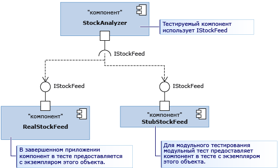

# <a name="use-stubs-to-isolate-parts-of-your-application-from-each-other-for-unit-testing"></a>Использование заглушек для изоляции частей приложений друг от друга при модульном тестировании

*Типы заглушек* — это одна из двух технологий, которые платформа Microsoft Fakes предоставляет для более простого изолирования тестируемого компонента от других вызываемых компонентов. Заглушка — это небольшая часть кода, которая заменяет собой другой компонент во время тестирования. Преимущество использования заглушки заключается в том, что она возвращает последовательные результаты, упрощая написание теста. Тесты можно выполнять, даже если другие компоненты пока не работают.

Обзор и рекомендации по быстрому началу работы с Fakes см. в статье [Изоляция тестируемого кода с помощью Microsoft Fakes](../test/isolating-code-under-test-with-microsoft-fakes.md).

Для использования заглушек необходимо написать компонент таким образом, чтобы он использовал только интерфейсы, а не классы для ссылки на другие части приложения. Это рекомендуемая практика разработки, поскольку при внесении изменений в одну часть, скорее всего, не потребуется вносить изменения в другую. При тестировании это позволяет заменить заглушку на реальный компонент.

На схеме представлен компонент StockAnalyzer, который требуется протестировать. Обычно он использует другой компонент — RealStockFeed. Но RealStockFeed возвращает различные результаты при каждом вызове его методов, что усложняет тестирование StockAnalyzer.  Во время тестирования мы заменяем этот компонент на другой класс — StubStockFeed.



Поскольку предполагается, что заглушки могут структурировать код таким образом, они обычно используются для изолирования одной части приложения от другой. Для изолирования ее от других сборок, которыми вы не можете управлять, например *System.dll*, обычно используются оболочки. См. статью [Использование оболочек совместимости для изоляции приложения от других сборок при модульном тестировании](../test/using-shims-to-isolate-your-application-from-other-assemblies-for-unit-testing.md).

## <a name="how-to-use-stubs"></a>Использование заглушек

### <a name="design-for-dependency-injection"></a>Разработка для внедрения зависимости

Для использования заглушек приложение должно быть разработано таким образом, чтобы различные компоненты не зависели друг от друга, а только от определений интерфейса. Вместо соединения во время компиляции компоненты соединяются во время выполнения. Этот шаблон позволяет создать надежное и легко обновляемое программное обеспечение, поскольку изменения, как правило, не выходят за границы компонентов. Им рекомендуется пользоваться, даже если вы не используете заглушки. При написании нового кода легко использовать шаблон [внедрения зависимости](https://en.wikipedia.org/wiki/Dependency_injection). При написании тестов для существующего программного обеспечения может потребоваться выполнить его рефакторинг. Если это непрактично, можно рассмотреть возможность использования оболочек.

Начнем с показательного примера, представленного на схеме. Класс StockAnalyzer считывает курсы акций и выдает некоторые интересные результаты. Он имеет несколько открытых методов, которые требуется протестировать. Для простоты рассмотрим только один из этих методов, который сообщает текущий курс определенной акции. Требуется написать модульный тест этого метода. Вот первый вариант теста.

```csharp
[TestMethod]
public void TestMethod1()
{
    // Arrange:
    var analyzer = new StockAnalyzer();
    // Act:
    var result = analyzer.GetContosoPrice();
    // Assert:
    Assert.AreEqual(123, result); // Why 123?
}
```

```vb
<TestMethod()> Public Sub TestMethod1()
    ' Arrange:
    Dim analyzer = New StockAnalyzer()
    ' Act:
    Dim result = analyzer.GetContosoPrice()
    ' Assert:
    Assert.AreEqual(123, result) ' Why 123?
End Sub
```

Одна проблема с данным тестом немедленно бросается в глаза: курсы акции различаются, поэтому утверждение обычно будет выдавать ошибку.

Другая проблема может заключаться в том, что компонент StockFeed, который используется классом StockAnalyzer, в данный момент находится в разработке. Вот первый вариант кода тестируемого метода.

```csharp
public int GetContosoPrice()
{
    var stockFeed = new StockFeed(); // NOT RECOMMENDED
    return stockFeed.GetSharePrice("COOO");
}
```

```vb
Public Function GetContosoPrice()
    Dim stockFeed = New StockFeed() ' NOT RECOMMENDED
    Return stockFeed.GetSharePrice("COOO")
End Function
```

В таком виде этот метод может не компилироваться или может вызвать исключение, поскольку работа над классом StockFeed еще не завершена. Внедрение интерфейса позволит решить обе эти проблемы. При внедрении интерфейса применяется следующее правило:

Код любого компонента приложения не должен явно ссылаться на класс в другом компоненте ни в объявлении, ни в операторе `new`. Вместо этого переменные и параметры необходимо объявлять с помощью интерфейсов. Экземпляры компонента должны создаваться только в контейнере компонента.

- "Компонент" означает класс или группу классов, которые разрабатываются и обновляются вместе. Обычно компонент — это код в одном проекте Visual Studio. Отделять классы в одном компоненте не так важно, поскольку они обновляются одновременно.

- Также не имеет особого значения отделять компоненты от классов относительно стабильной платформы, например *System.dll*. Если написать интерфейсы для всех этих классов, код будет перегружен.

Вы можете отделить код StockAnalyzer от StockFeed с помощью интерфейса следующим образом:

```csharp
public interface IStockFeed
{
    int GetSharePrice(string company);
}

public class StockAnalyzer
{
    private IStockFeed stockFeed;
    public StockAnalyzer(IStockFeed feed)
    {
        stockFeed = feed;
    }
    public int GetContosoPrice()
    {
        return stockFeed.GetSharePrice("COOO");
    }
}
```

```vb
Public Interface IStockFeed
    Function GetSharePrice(company As String) As Integer
End Interface

Public Class StockAnalyzer
    ' StockAnalyzer can be connected to any IStockFeed:
    Private stockFeed As IStockFeed
    Public Sub New(feed As IStockFeed)
        stockFeed = feed
    End Sub
    Public Function GetContosoPrice()
        Return stockFeed.GetSharePrice("COOO")
    End Function
End Class
```

В этом примере классу StockAnalyzer передается реализация IStockFeed при построении. В готовом приложении код инициализации выполнил бы следующее подключение.

```csharp
analyzer = new StockAnalyzer(new StockFeed());
```

Существуют более гибкие способы выполнения этого подключения. Например, StockAnalyzer может принять объект фабрики, который может создать экземпляры различных реализаций IStockFeed в различных условиях.

### <a name="generate-stubs"></a>Создание заглушек

Вы отделили класс, который необходимо протестировать, от других используемых им компонентов. Такое отделение позволяет не только сделать приложение более надежным и гибким, но и подключить тестируемый компонент к реализациям заглушки интерфейсов для тестирования.

Достаточно написать заглушки как классы обычным способом. Однако Microsoft Fakes предлагает более динамический способ создания наиболее подходящей заглушки для каждого теста.

Чтобы использовать заглушки, необходимо сначала создать типы заглушек из определений интерфейса.

#### <a name="add-a-fakes-assembly"></a>Добавление сборки Fakes

1. В **Обозревателе решений** выполните следующие действия: 
    - Для более старого проекта .NET Framework (не в стиле пакета SDK) разверните узел **Ссылки** проекта модульного теста.
    ::: moniker range=">=vs-2019"
    - Для проекта в стиле SDK, предназначенного для .NET Framework, .NET Core или .NET 5.0, разверните узел **Зависимости**, чтобы найти сборку, которую нужно имитировать в разделе **Сборки**, **Проекты** или **Пакеты**.
    ::: moniker-end
    - При работе в Visual Basic на панели инструментов **Обозревателя решений** необходимо выбрать команду **Показать все файлы**, чтобы просмотреть узел **Ссылки**.

2. Выделите сборку, содержащую определения классов, для которых необходимо создать оболочки. Например, если требуется создать оболочку для **DateTime**, выберите **System.dll**.

3. В контекстном меню щелкните **Добавить сборку имитаций**.

### <a name="write-your-test-with-stubs"></a>Создание теста с заглушками

```csharp
[TestClass]
class TestStockAnalyzer
{
    [TestMethod]
    public void TestContosoStockPrice()
    {
      // Arrange:

        // Create the fake stockFeed:
        IStockFeed stockFeed =
             new StockAnalysis.Fakes.StubIStockFeed() // Generated by Fakes.
                 {
                     // Define each method:
                     // Name is original name + parameter types:
                     GetSharePriceString = (company) => { return 1234; }
                 };

        // In the completed application, stockFeed would be a real one:
        var componentUnderTest = new StockAnalyzer(stockFeed);

        // Act:
        int actualValue = componentUnderTest.GetContosoPrice();

        // Assert:
        Assert.AreEqual(1234, actualValue);
    }
    ...
}
```

```vb
<TestClass()> _
Class TestStockAnalyzer

    <TestMethod()> _
    Public Sub TestContosoStockPrice()
        ' Arrange:
        ' Create the fake stockFeed:
        Dim stockFeed As New StockAnalysis.Fakes.StubIStockFeed
        With stockFeed
            .GetSharePriceString = Function(company)
                                       Return 1234
                                   End Function
        End With
        ' In the completed application, stockFeed would be a real one:
        Dim componentUnderTest As New StockAnalyzer(stockFeed)
        ' Act:
        Dim actualValue As Integer = componentUnderTest.GetContosoPrice
        ' Assert:
        Assert.AreEqual(1234, actualValue)
    End Sub
End Class
```

Особую роль здесь играет класс `StubIStockFeed`. Для каждого открытого типа в сборке, на которую указывает ссылка, механизм Microsoft Fakes создает класс заглушки. Имя класса заглушки является производным от имени интерфейса, где `Fakes.Stub` — это префикс, за которым следуют имена типов параметров.

Заглушки также создаются для методов получения и задания свойств, для событий и для универсальных методов.

### <a name="verify-parameter-values"></a>Проверка значений параметров

Можно проверить, что компонент передает правильные значения, когда вызывает другой компонент. Можно поместить утверждение в заглушку или сохранить значение и проверить его в основной части теста. Пример:

```csharp
[TestClass]
class TestMyComponent
{
    [TestMethod]
    public void TestVariableContosoPrice()
    {
        // Arrange:
        int priceToReturn = 345;
        string companyCodeUsed = "";
        var componentUnderTest = new StockAnalyzer(new StockAnalysis.Fakes.StubIStockFeed()
            {
               GetSharePriceString = (company) =>
                  {
                     // Store the parameter value:
                     companyCodeUsed = company;
                     // Return the value prescribed by this test:
                     return priceToReturn;
                  };
            };

        // Act:
        int actualResult = componentUnderTest.GetContosoPrice();

        // Assert:
        // Verify the correct result in the usual way:
        Assert.AreEqual(priceToReturn, actualResult);

        // Verify that the component made the correct call:
        Assert.AreEqual("COOO", companyCodeUsed);
    }
...
}
```

```vb
<TestClass()> _
Class TestMyComponent
    <TestMethod()> _
    Public Sub TestVariableContosoPrice()
        ' Arrange:
        Dim priceToReturn As Integer = 345
        Dim companyCodeUsed As String = ""
        Dim stockFeed As New StockAnalysis.Fakes.StubIStockFeed()
        With stockFeed
            ' Implement the interface's method:
            .GetSharePriceString = _
                Function(company)
                    ' Store the parameter value:
                    companyCodeUsed = company
                    ' Return a fixed result:
                    Return priceToReturn
                End Function
        End With
        ' Create an object to test:
        Dim componentUnderTest As New StockAnalyzer(stockFeed)

        ' Act:
        Dim actualResult As Integer = componentUnderTest.GetContosoPrice()

        ' Assert:
        ' Verify the correct result in the usual way:
        Assert.AreEqual(priceToReturn, actualResult)
        ' Verify that the component made the correct call:
        Assert.AreEqual("COOO", companyCodeUsed)
    End Sub
...
End Class
```

## <a name="stubs-for-different-kinds-of-type-members"></a>Заглушки для различных видов членов типа

### <a name="methods"></a>Методы

Как описано в примере, методы могут быть заменены заглушками путем добавления делегата в экземпляр класса заглушки. Имя типа заглушки является производным от имен метода и параметров. Например, даны следующие интерфейс `IMyInterface` и метод `MyMethod`.

```csharp
// application under test
interface IMyInterface
{
    int MyMethod(string value);
}
```

Мы присоединяем заглушку к методу `MyMethod`, который всегда возвращает значение 1.

```csharp
// unit test code
var stub = new StubIMyInterface ();
stub.MyMethodString = (value) => 1;
```

Если не предоставить заглушку для функции, Fakes создает функцию, возвращающую значение по умолчанию возвращаемого типа. Для чисел значением по умолчанию является 0, а для типов классов — `null` (C#) или `Nothing` (Visual Basic).

### <a name="properties"></a>Свойства

Методы получения и задания свойств представляются как отдельные делегаты и могут быть заменены заглушками отдельно. Например, рассмотрим свойство `Value` интерфейса `IMyInterface`.

```csharp
// code under test
interface IMyInterface
{
    int Value { get; set; }
}
```

Мы присоединяем делегаты к методам получения и задания свойства `Value`, чтобы сымитировать автосвойство.

```csharp
// unit test code
int i = 5;
var stub = new StubIMyInterface();
stub.ValueGet = () => i;
stub.ValueSet = (value) => i = value;
```

Если не предоставить методы-заглушки для метода получения или задания свойства, Fakes создает заглушку, хранящую значения, чтобы свойство заглушки выступало в роли простой переменной.

### <a name="events"></a>События

События представляются как поля делегата. В результате любые события, замененные заглушками, могут вызываться путем вызова резервного поля события. Рассмотрим следующий интерфейс, который требуется заменить заглушкой.

```csharp
// code under test
interface IWithEvents
{
    event EventHandler Changed;
}
```

Чтобы вызвать событие `Changed`, достаточно вызвать резервный делегат.

```csharp
// unit test code
  var withEvents = new StubIWithEvents();
  // raising Changed
  withEvents.ChangedEvent(withEvents, EventArgs.Empty);
```

### <a name="generic-methods"></a>Универсальные методы

Чтобы заменить универсальные методы заглушками, предоставьте делегат для каждого требуемого экземпляра метода. Например, рассмотрим следующий интерфейс, содержащий универсальный метод.

```csharp
// code under test
interface IGenericMethod
{
    T GetValue<T>();
}
```

Можно написать тест, в котором экземпляр `GetValue<int>` заменяется заглушкой:

```csharp
// unit test code
[TestMethod]
public void TestGetValue()
{
    var stub = new StubIGenericMethod();
    stub.GetValueOf1<int>(() => 5);

    IGenericMethod target = stub;
    Assert.AreEqual(5, target.GetValue<int>());
}
```

Если бы код вызвал `GetValue<T>` с любым другим экземпляром, то заглушка просто вызвала бы поведение.

### <a name="stubs-of-virtual-classes"></a>Заглушки виртуальных классов

В предыдущих примерах заглушки создавались из интерфейсов. Заглушки также можно создавать из класса с виртуальными или абстрактными членами. Пример:

```csharp
// Base class in application under test
    public abstract class MyClass
    {
        public abstract void DoAbstract(string x);
        public virtual int DoVirtual(int n)
        { return n + 42; }
        public int DoConcrete()
        { return 1; }
    }
```

В заглушке, созданной из этого класса, можно задать методы делегата для `DoAbstract()` и `DoVirtual()`, но не для `DoConcrete()`.

```csharp
// unit test
  var stub = new Fakes.MyClass();
  stub.DoAbstractString = (x) => { Assert.IsTrue(x>0); };
  stub.DoVirtualInt32 = (n) => 10 ;
```

Если не предоставить делегат для виртуального метода, Fakes может предоставить поведение по умолчанию или вызвать метод в базовом классе. Чтобы вызывался базовый метод, задайте свойство `CallBase`.

```csharp
// unit test code
var stub = new Fakes.MyClass();
stub.CallBase = false;
// No delegate set - default delegate:
Assert.AreEqual(0, stub.DoVirtual(1));

stub.CallBase = true;
// No delegate set - calls the base:
Assert.AreEqual(43,stub.DoVirtual(1));
```

## <a name="debug-stubs"></a>Заглушки отладки

Типы заглушек призваны обеспечить бесперебойную отладку. По умолчанию отладчик должен обходить любой создаваемый код, чтобы сразу переходить к пользовательским реализациям членов, которые присоединены к заглушке.

## <a name="stub-limitations"></a>Ограничения заглушки

- Сигнатуры методов с указателями не поддерживаются.

- Запечатанные классы или статические методы не могут быть заменены заглушками, поскольку типы заглушек зависят от диспетчеризации виртуальных методов. В таких случаях используйте типы оболочек, которые описываются в статье [Использование оболочек совместимости для изоляции приложения от других сборок при модульном тестировании](../test/using-shims-to-isolate-your-application-from-other-assemblies-for-unit-testing.md).

## <a name="change-the-default-behavior-of-stubs"></a>Изменение поведения заглушек по умолчанию

Каждый созданный тип заглушки содержит экземпляр интерфейса `IStubBehavior` (через свойство `IStub.InstanceBehavior`). Поведение вызывается каждый раз, когда клиент вызывает член без присоединенного пользовательского делегата. Если поведение не задано, используется экземпляр, возвращаемый свойством `StubsBehaviors.Current`. По умолчанию это свойство возвращает поведение, вызывающее исключение `NotImplementedException`.

Это поведение можно изменить в любое время, задав свойство `InstanceBehavior` в любом экземпляре заглушки. Например, в следующем фрагменте кода изменяется поведение, которое ничего не делает или возвращает значение по умолчанию для возвращаемого типа `default(T)`.

```csharp
// unit test code
var stub = new StubIFileSystem();
// return default(T) or do nothing
stub.InstanceBehavior = StubsBehaviors.DefaultValue;
```

Поведение также можно изменить глобально для всех объектов заглушки, для которых не было задано поведение, путем задания свойства `StubsBehaviors.Current`.

```csharp
// Change default behavior for all stub instances
// where the behavior has not been set.
StubBehaviors.Current = BehavedBehaviors.DefaultValue;
```

## <a name="see-also"></a>См. также раздел

- [Изоляция тестируемого кода с помощью Microsoft Fakes](../test/isolating-code-under-test-with-microsoft-fakes.md)
