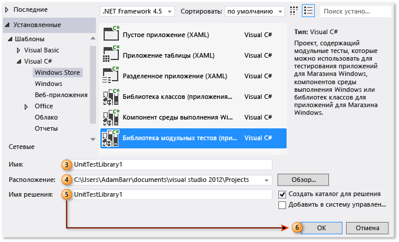
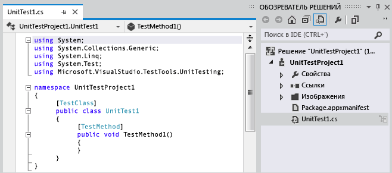
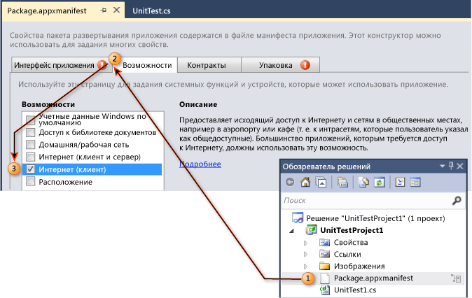
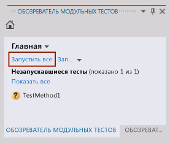
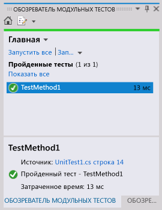

# Пошаговое руководство. Создание и выполнение модульных тестов для приложений UWP

Visual Studio поддерживает модульное тестирование приложений универсальной платформы Windows (UWP). Visual Studio предоставляет шаблоны проектов модульных тестов для C#, Visual Basic и C++.

> [!TIP]
> Дополнительные сведения о разработке приложений универсальной платформы Windows см. в разделе [Начало работы с приложениями универсальной платформы Windows](/windows/uwp/get-started/).

В следующих процедурах описаны этапы создания, выполнения и отладки модульных тестов для приложения универсальной платформы Windows.

## Создание проекта модульного теста для приложения универсальной платформы Windows

::: moniker range=">=vs-2019"

1. Запустите Visual Studio. На начальном экране выберите **Создать проект**.

2. В поле поиска на странице **Создание проекта** введите **модульный тест**.

   Список шаблонов фильтруется для модульного тестирования.

3. Выберите шаблон **Приложение модульного тестирования (универсальное приложение Windows)** для C# или Visual Basic, а затем выберите **Далее**.

   

4. При необходимости измените имя и расположение проекта или решения, а затем выберите **Создать**.

5. При необходимости измените целевую и минимальную версии платформы, а затем нажмите кнопку **OK**.

После выполнения этих действий проект модульного теста создается и отображается в обозревателе решений.

::: moniker-end

::: moniker range="vs-2017"

1. В меню **Файл** выберите пункт **Создать проект**.

   Откроется диалоговое окно **Новый проект**.

2. В разделе "Шаблоны" выберите язык программирования, на котором требуется создать модульный тест, а затем выберите связанную библиотеку модульных тестов универсальной платформы Windows. Например, выберите **Visual C#**, затем выберите **Универсальные приложения**, а затем — **Библиотека модульных тестов (универсальные приложения Windows)**.

3. В текстовом поле **Имя** введите имя, которое будет использоваться для проекта (необязательно).

4. Измените путь, по которому нужно создать проект, введя его в текстовом поле **Расположение** или с помощью кнопки **Обзор** (необязательно).

5. (Необязательно) В текстовом поле имени **Решение** введите имя, которое будет использоваться для решения.

6. Оставьте флажок **Создать каталог для решения** установленным и нажмите кнопку **ОК** .

   

   В **обозревателе решений** появляется ваш новый проект модульного теста для универсальной платформы Windows, а в редакторе кода отображается модульный тест по умолчанию с именем UnitTest1.

   

::: moniker-end

## Изменение файла манифеста приложения универсальной платформы Windows для проекта модульного теста

1. В **обозревателе решений** щелкните правой кнопкой мыши файл *Package.appxmanifest* и выберите пункт **Открыть**.

2. В **конструкторе манифеста** выберите вкладку **Возможности**.

3. В списке в разделе **Возможности** выберите возможности, необходимые для модульного теста и тестируемого кода. Например, установите флажок **Интернет** , если модульный тест и проверяемый им код требуют возможности получения доступа к Интернету.

   > [!NOTE]
   > Выбранные функции должны включать только возможности, необходимые для правильного функционирования модульного теста.

   

## Написание кода модульного теста для приложения универсальной платформы Windows

В редакторе кода добавьте модульный тест и включите необходимые утверждения и логику.

## Запуск модульных тестов

Чтобы выполнить сборку решения и модульный тест с помощью обозревателя тестов, сделайте следующее:

1. В меню **Тест** выберите **Windows**, а затем **Обозреватель тестов**.

2. В меню **Построение** выберите пункт **Построить решение**.

   Модульный тест теперь отображается в обозревателе тестов.

   > [!NOTE]
   > Необходимо собрать решение, чтобы обновить список модульных тестов в обозревателе тестов.

3. В **обозревателе тестов** выберите созданный модульный тест.

4. Выберите **Запустить все**.

   

   > [!TIP]
   > Вы можете выбрать один или несколько модульных тестов, перечисленных в обозревателе тестов, а затем щелкнуть правой кнопкой мыши и выбрать **Запуск выбранных тестов**.
   >
   > Кроме того, можно выбрать **Отладить выбранные тесты**, **Открыть тест** и использовать параметр **Свойства** .
   >
   > 

   Выполняется модульный тест. По завершении в обозревателе тестов отображаются состояние теста, затраченное время и ссылка на источник.

   

## См. также раздел

- [Тестирование приложений UWP в Visual Studio](../test/unit-test-your-code.md)
- [Построение и тестирование приложения универсальной платформы Windows](/azure/devops/pipelines/apps/windows/universal?tabs=vsts)
