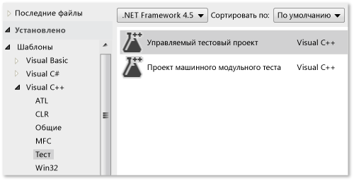
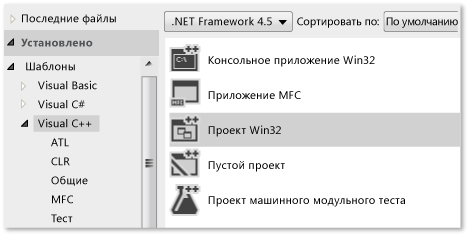
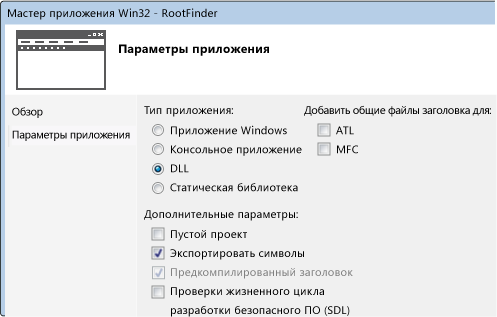
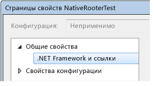
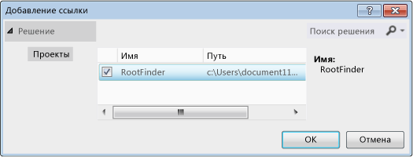
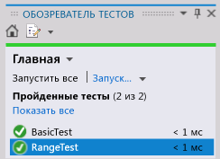

# <a name="writing-unit-tests-for-cc-with-the-microsoft-unit-testing-framework-for-c"></a>Написание модульных тестов для языка C/C++ с использованием платформы модульного тестирования Майкрософт для C++
В Visual Studio можно создавать модульные тесты для неуправляемого кода, написанного на языке C++. Неуправляемый код иногда называют машинным кодом.  
  
 Следующая процедура содержит необходимые сведения, которые помогут начать создание тестов. В последующих подразделах содержится пошаговое руководство, которое описывает шаги более подробно.  
  
### <a name="to-write-unit-tests-for-an-unmanaged-code-dll"></a>Написание модульных тестов для библиотеки DLL неуправляемого кода  
  
1.  Используйте шаблон **Тестовый проект для машинного кода**, чтобы создать отдельный проект Visual Studio для тестов.  
  
     Проект содержит пример кода теста.  
  
2.  Сделайте библиотеку DLL доступной тестовому проекту.  
  
    -   Добавьте оператор `#include` для файла `.h`, содержащего объявления внешне доступных функций DLL.  
  
         Файл `.h` должен содержать объявления функций, отмеченных `_declspec(dllimport)`. Кроме того, можно экспортировать методы, используя DEF-файл. Дополнительные сведения см. в статье [Импортирование и экспортирование](/cpp/build/importing-and-exporting).  
  
         Модульные тесты могут получать доступ только к функциям, экспортированным из тестируемой библиотеки DLL.  
  
    -   Добавьте проект DLL в ссылки тестового проекта.  
  
         В разделе **Свойства** тестового проекта разверните узлы **Общие свойства**и **.NET Framework и ссылки**и выберите команду **Добавить ссылку**.  
  
3.  В тестовом проекте создайте тестовые классы и методы теста с помощью макроса TEST и класса Assert следующим образом:  
  
    ```cpp  
    #include "stdafx.h"  
    #include <CppUnitTest.h>  
    #include "..\MyProjectUnderTest\MyCodeUnderTest.h"  
    using namespace Microsoft::VisualStudio::CppUnitTestFramework;  
    TEST_CLASS(TestClassName)  
    {  
    public:  
      TEST_METHOD(TestMethodName)  
      {  
        // Run a function under test here.  
        Assert::AreEqual(expectedValue, actualValue, L"message", LINE_INFO());  
      }  
    }  
    ```  
  
    -   `Assert` содержит несколько статических функций, которые можно использовать для проверки результата теста.  
  
    -   Параметр `LINE_INFO()` является необязательным. В тех случаях, когда нет PDB-файла, он позволяет средству Test Runner идентифицировать местоположение ошибки.  
  
    -   Можно также написать методы настройки и очистки теста. Для получения дополнительных сведений откройте определение макроса `TEST_METHOD` и прочитайте комментарии в CppUnitTest.h.  
  
    -   Нельзя вкладывать тестовые классы.  
  
4.  Используйте обозреватель тестов для выполнения тестов.  
  
    1.  В меню **Вид** выберите **Другие окна**, **Обозреватель тестов**.  
  
    2.  Выполните сборку решения в Visual Studio.  
  
    3.  В разделе "Обозреватель тестов" выберите **Запустить все**.  
  
    4.  Чтобы более подробно исследовать тест в обозревателе тестов, выполните указанные ниже действия.  
  
        1.  Выберите имя теста для просмотра дополнительных сведений, таких как сообщение об ошибке и трассировка стека.  
  
        2.  Откройте тест (например, дважды щелкнув), чтобы перейти к расположению ошибки или к коду теста.  
  
        3.  В контекстном меню теста выберите пункт **Отладка выбранного теста**, чтобы выполнить тест в отладчике.  
  
##  <a name="walkthrough"></a> Пошаговое руководство по разработке неуправляемой библиотеки DLL с помощью обозревателя тестов  
 Можно адаптировать это пошаговое руководство для разработки собственной библиотеки DLL. Для этого необходимо выполнить указанные ниже основные шаги.  
  
1.  [Создайте тестовый проект для машинного кода](#unitTestProject). Тесты создаются в отдельном проекте (не в проекте разрабатываемой библиотеки DLL).  
  
2.  [Создайте проект библиотеки DLL](#createDllProject). В этом пошаговом руководстве создается новая библиотека DLL, но процедура тестирования существующей библиотеки DLL аналогична.  
  
3.  [Сделайте функции DLL доступными для тестов](#coupleProjects).  
  
4.  [Итеративно расширяйте тесты](#iterate). Рекомендуется цикл "красный — зеленый — рефакторинг", при котором разработка кода проводится согласно результатам тестов.  
  
5.  [Выполните отладку непройденных тестов](#debug). Тесты можно выполнять в режиме отладки.  
  
6.  [Выполняйте рефакторинг, оставляя тесты без изменений](#refactor). Рефакторинг означает улучшение структуры кода без изменения его внешнего поведения. Это можно сделать для повышения производительности, расширяемости и удобочитаемости кода. Так как поведение кода должно сохраняться, не изменяйте тесты при проведении рефакторинга. Тесты помогают убедиться, что при выполнении рефакторинга не возникнут новые ошибки. Поэтому можно выполнять такие изменения с гораздо большей уверенностью, чем если бы тестов не было.  
  
7.  [Проверьте охват](https://msdn.microsoft.com/en-us/library/fc8hec9e.aspx). Модульные тесты более полезны, когда они охватывают больше кода. Вы можете узнать, какие части кода использовались тестами.  
  
8.  [Изолируйте модули от внешних ресурсов](https://msdn.microsoft.com/library/hh549174.aspx). Обычно библиотека DLL зависит от других компонентов разрабатываемой системы, таких как другие библиотеки DLL, базы данных или удаленные подсистемы. Полезно тестировать каждый модуль отдельно от его зависимостей. Внешние компоненты могут сделать выполнение тестов медленным. Во время разработки другие компоненты могут быть еще не готовы.  
  
###  <a name="unitTestProject"></a> Создание проекта машинного модульного теста  
  
1.  В меню **Файл** последовательно выберите пункты **Создать**и **Проект**.  
  
     В диалоговом окне последовательно разверните узлы **Установлено**, **Шаблоны**, **Visual C++**и **Тест**.  
  
     Выбор шаблон **Проект машинного модульного теста**.  
  
     В этом пошаговом руководстве тестовый проект называется `NativeRooterTest`.  
  
       
  
2.  В новом проекте изучите файл **unittest1.cpp**.  
  
       
  
     Обратите внимание на указанные ниже моменты.  
  
    -   Каждый тест определяется с использованием `TEST_METHOD(YourTestName){...}`.  
  
         Стандартную сигнатуру функции писать не требуется. Сигнатура создается макросом TEST_METHOD. Макрос создает функцию экземпляра, которая возвращает значение void. Она также создает статическую функцию, которая возвращает сведения о тестовом методе. Эти сведения позволят обозревателю тестов найти этот метод.  
  
    -   Тестовые методы группируются в классы с помощью `TEST_CLASS(YourClassName){...}`.  
  
         Во время выполнения тестов создается экземпляр каждого тестового класса. Тестовые методы вызываются в неопределенном порядке. Можно задать особые методы, которые вызываются до и после каждого модуля, класса или метода.  
  
3.  Убедитесь в том, что тесты выполняются в обозревателе тестов.  
  
    1.  Добавьте код теста:  
  
        ```cpp  
        TEST_METHOD(TestMethod1)  
        {  
        Assert::AreEqual(1,1);  
        }  
        ```  
  
         Обратите внимание, что класс `Assert` содержит несколько статических методов, которые можно использовать для проверки результатов в тестовых методах.  
  
    2.  В меню **Тест** выберите **Запуск**, **Все тесты**.  
  
         Произойдет сборка и запуск теста.  
  
         Появится обозреватель тестов.  
  
         Тест отображается в списке **Пройденные тесты**.  
  
           
  
###  <a name="createDllProject"></a> Создание проекта неуправляемой библиотеки DLL  
  
1.  Создайте проект **Visual C++** с помощью шаблона **Проект Win32**.  
  
     В этом пошаговом руководстве проект называется `RootFinder`.  
  
       
  
2.  В мастере приложения Win32 выберите параметры **DLL** и **Экспортировать символы**.  
  
     Параметр **Экспортировать символы** создает удобный макрос, который можно использовать для объявления экспортированных методов.  
  
       
  
3.  Объявите экспортированную функцию в основном H-файле.  
  
       
  
     Оператор объявления `__declspec(dllexport)` делает открытые и защищенные члены класса видимыми вне библиотеки DLL. Для получения дополнительной информации см. [Using dllimport and dllexport in C++ Classes](/cpp/cpp/using-dllimport-and-dllexport-in-cpp-classes).  
  
4.  В основной CPP-файл добавьте минимальное тело функции.  
  
    ```cpp  
    // Find the square root of a number.  
    double CRootFinder::SquareRoot(double v)  
    {  
      return 0.0;  
    }  
    ```  
  
###  <a name="coupleProjects"></a> Привязка тестового проекта к проекту библиотеки DLL  
  
1.  Добавьте проект DLL в ссылки тестового проекта.  
  
    1.  Откройте свойства тестового проекта и выберите **Общие свойства**, **.NET Framework и ссылки**.  
  
           
  
    2.  Выберите команду **Добавить новую ссылку**.  
  
         В диалоговом окне **Добавление ссылки** выберите проект библиотеки DLL и нажмите **Добавить**.  
  
           
  
2.  В основном CPP-файле модульного теста включите H-файл кода библиотеки DLL.  
  
    ```cpp  
    #include "..\RootFinder\RootFinder.h"  
    ```  
  
3.  Добавьте простой тест, который использует экспортированную функцию.  
  
    ```cpp  
    TEST_METHOD(BasicTest)  
    {  
    CRootFinder rooter;  
    Assert::AreEqual(  
    // Expected value:  
    0.0,   
    // Actual value:  
    rooter.SquareRoot(0.0),   
    // Tolerance:  
    0.01,  
    // Message:  
    L"Basic test failed",  
    // Line number - used if there is no PDB file:  
    LINE_INFO());  
    }  
    ```  
  
4.  Постройте решение.  
  
     Новый тест появится в обозревателе тестов.  
  
5.  В разделе "Обозреватель тестов" выберите **Запустить все**.  
  
       
  
 Вы настроили тест и проекты кода и подтвердили, что можно выполнять тесты, которые запускают функции из проекта кода. Теперь можно начать писать реальные тесты и код.  
  
###  <a name="iterate"></a> Итеративное расширение тестов и обеспечение их успешного выполнения  
  
1.  Добавьте новый тест.  
  
    ```cpp  
    TEST_METHOD(RangeTest)  
    {  
      CRootFinder rooter;  
      for (double v = 1e-6; v < 1e6; v = v * 3.2)  
      {  
        double actual = rooter.SquareRoot(v*v);  
        Assert::AreEqual(v, actual, v/1000);  
      }  
    }  
    ```  
  
    > [!TIP]
    >  Рекомендуется не изменять пройденные тесты. Вместо этого добавьте новый тест, обновите код так, чтобы тест проходил успешно, а затем добавьте еще один тест и т. д.  
    >   
    >  При изменении пользователями требований отключите тесты, которые больше не являются корректными. Создайте новые тесты и сделайте так, чтобы они работали по одному в инкрементном режиме.  
  
2.  Выполните сборку решения, а затем в обозревателе тестов щелкните **Запустить все**.  
  
     Новый тест завершится сбоем.  
  
       
  
    > [!TIP]
    >  Убедитесь в том, что каждый тест завершается сбоем, сразу после того, как вы написали его. Это поможет избежать распространенной ошибки, заключающейся в написании теста, который никогда не завершается сбоем.  
  
3.  Улучшите тестируемый код так, чтобы новый тест был успешно пройден.  
  
    ```cpp  
    #include <math.h>  
    ...  
    double CRootFinder::SquareRoot(double v)  
    {  
      double result = v;  
      double diff = v;  
      while (diff > result/1000)  
      {  
        double oldResult = result;  
        result = result - (result*result - v)/(2*result);  
        diff = abs (oldResult - result);  
      }  
      return result;  
    }  
    ```  
  
4.  Выполните сборку решения, а затем в обозревателе тестов щелкните **Запустить все**.  
  
     Оба теста будут пройдены успешно.  
  
       
  
    > [!TIP]
    >  Разрабатывайте код, добавляя тесты по одному. После каждой итерации проверяйте, все ли тесты завершаются успешно.  
  
###  <a name="debug"></a> Отладка непройденного теста  
  
1.  Добавьте еще один тест.  
  
    ```cpp  
  
    #include <stdexcept>  
    ...  
    // Verify that negative inputs throw an exception.  
    TEST_METHOD(NegativeRangeTest)  
    {  
      wchar_t message[200];  
      CRootFinder rooter;  
      for (double v = -0.1; v > -3.0; v = v - 0.5)  
      {  
        try   
        {  
          // Should raise an exception:  
          double result = rooter.SquareRoot(v);  
  
          _swprintf(message, L"No exception for input %g", v);  
          Assert::Fail(message, LINE_INFO());  
        }  
        catch (std::out_of_range ex)  
        {  
          continue; // Correct exception.  
        }  
        catch (...)  
        {  
          _swprintf(message, L"Incorrect exception for %g", v);  
          Assert::Fail(message, LINE_INFO());  
        }  
      }  
    }  
    ```  
  
2.  Выполните сборку решения и щелкните **Запустить все**.  
  
3.  Откройте (или дважды щелкните) непройденный тест.  
  
     Ошибочное проверочное утверждение будет выделено. Сообщение об ошибке отображается в области сведений обозревателя тестов.  
  
       
  
4.  Чтобы увидеть, почему тест не был пройден, выполните функцию пошагово.  
  
    1.  Установите точку останова в начале функции SquareRoot.  
  
    2.  В контекстном меню непройденного теста выберите **Отладить выбранные тесты**.  
  
         Когда выполнение прекратится на точке останова, выполните код по шагам.  
  
5.  Вставьте код в функцию, которую вы разрабатываете:  
  
    ```cpp  
  
    #include <stdexcept>  
    ...  
    double CRootFinder::SquareRoot(double v)  
    {  
        // Validate parameter:  
        if (v < 0.0)   
        {  
          throw std::out_of_range("Can't do square roots of negatives");  
        }  
  
    ```  
  
6.  Теперь все тесты проходят успешно.  
  
       
  
> [!TIP]
>  Если у отдельных тестов нет зависимостей, предотвращающих выполнение этих тестов в любом порядке, включите параллельное тестирование с помощью переключателя  на панели инструментов. Это может заметно сократить время, необходимое для выполнения всех тестов.  
  
###  <a name="refactor"></a> Рефакторинг кода без изменения тестов  
  
1.  Упростите основное вычисление в функции SquareRoot.  
  
    ```  
    // old code:  
    //   result = result - (result*result - v)/(2*result);  
    // new code:  
         result = (result + v/result)/2.0;  
  
    ```  
  
2.  Выполните сборку решения и щелкните **Запустить все**, чтобы убедиться в том, что не появилось новых ошибок.  
  
    > [!TIP]
    >  Хороший набор модульных тестов дает уверенность в том, что при изменении кода не появилось новых ошибок.  
    >   
    >  Рефакторинг должен осуществляться отдельно от других изменений.  
  
## <a name="next-steps"></a>Дальнейшие действия  
  
-   **Изоляция**. Большинство библиотек DLL зависит от других подсистем, например от баз данных и других библиотек DLL. Эти другие компоненты часто разрабатываются параллельно. Чтобы модульное тестирование могло выполняться, пока другие компоненты еще не доступны, нужно заменить макет или выполнить  
  
-   **Тесты проверки сборки**. Тесты можно выполнять на сервере сборки рабочей группы через заданные промежутки времени. Это гарантирует то, что во время объединения результатов работы, выполненной разными членами рабочей группы, не появятся новые ошибки.  
  
-   **Тесты влияния изменений**. Можно потребовать, чтобы некоторые тесты выполнялись перед тем, как каждый участник рабочей группы вернет код в систему управления версиями. Обычно это подмножество полного набора тестов проверки сборки.  
  
     Можно также требовать минимального уровня покрытия кода.  
  
## <a name="see-also"></a>См. также  
 [Модульное тестирование существующих приложений C++ с использованием обозревателя тестов](../test/unit-testing-existing-cpp-applications-with-test-explorer.md)   
 [Использование пространства имен Microsoft.VisualStudio.TestTools.CppUnitTestFramework](../test/using-microsoft-visualstudio-testtools-cppunittestframework.md)   
 [Общие сведения о взаимодействии управляемого и неуправляемого кода](http://msdn.microsoft.com/library/ms973872.aspx)   
 [Отладка машинного кода](../debugger/debugging-native-code.md)   
 [Пошаговое руководство. Создание и использование библиотеки DLL (C++)](/cpp/build/walkthrough-creating-and-using-a-dynamic-link-library-cpp)   
 [Импортирование и экспортирование](/cpp/build/importing-and-exporting)
