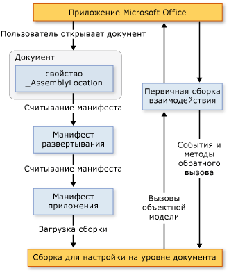

# Архитектура настроек уровня документа
  [!INCLUDE[vs_dev12](../vsto/includes/vs-dev12-md.md)] является частью настроек на уровне документа для Microsoft Office Word и Microsoft Office Excel. В этой статье описываются следующие аспекты надстроек уровня документа.

- [Общие сведения о настройках](#UnderstandingCustomizations)

- [Компоненты настроек](#Components)

- [Как настройки работают с приложениями Microsoft Office](#HowCustomizationsWork)

  [!INCLUDE[appliesto_alldoc](../vsto/includes/appliesto-alldoc-md.md)]

  Общие сведения о создании настроек уровня документа см. в статьях [Обзор разработки решений Office &#40;VSTO&#41;](../vsto/office-solutions-development-overview-vsto.md), Приступая [к программированию настроек на уровне документа для Word](../vsto/getting-started-programming-document-level-customizations-for-word.md)и Приступая [к программированию настроек на уровне документа для Excel](../vsto/getting-started-programming-document-level-customizations-for-excel.md).

##  Общие сведения о настройках
 При использовании инструментов разработчика Office в Visual Studio для построения настройки уровня документа вы создаете сборку управляемого кода, связанную с определенным документом. Документ или книга со связанной сборкой называются имеющими расширения управляемого кода. Дополнительные сведения см. в статье [Разработка и создание решений Office](../vsto/designing-and-creating-office-solutions.md).

 Когда пользователь открывает документ, сборка загружается приложением Microsoft Office. После загрузки сборки настройка может отвечать на события при открытом документе. Настройка также может обращаться к объектной модели для автоматизации и расширения приложения при открытом документе и использовать любой из классов в [!INCLUDE[dnprdnshort](../sharepoint/includes/dnprdnshort-md.md)].

 Сборка взаимодействует с COM-компонентами приложения посредством основной сборки взаимодействия приложения. Дополнительные сведения см. в статьях [основные сборки взаимодействия Office](../vsto/office-primary-interop-assemblies.md) и [Общие сведения о разработке решений office &#40;VSTO&#41;](../vsto/office-solutions-development-overview-vsto.md).

 Если пользователь открывает несколько настроек уровня документа в одно и то же время, то каждая сборка загружается в отдельном домене приложения. Это означает, что некорректное поведение одного решения не может привести к сбою других решений. Настройки уровня документа предназначены для работы с одним документом в одном домене приложений. Они не предназначены для взаимодействия между документами. Дополнительные сведения о доменах приложений см. в разделе [домены приложений](/dotnet/framework/app-domains/application-domains).

> [!NOTE]
> Настройки уровня документа, создаваемые с помощью средств разработчика Office в Visual Studio, предназначены для использования только в том случае, когда приложение запускается конечным пользователем. Если приложение запускается программными средствами (например, с помощью автоматизации), настройка может не работать должным образом.

### Взаимодействие во время разработки и во время выполнения
 Чтобы понимать архитектуру настроек уровня документа, полезно понимать процесс разработки решения и выполнения решения.

#### Время разработки
 Возможности во время разработки включает следующие шаги.

1. Разработчик создает проект уровня документа в [!INCLUDE[vsprvs](../sharepoint/includes/vsprvs-md.md)]. Проект включает документ и сборку, выполняющуюся за документом. Возможно, документ уже существует (создан в конструкторе) или в проекте можно создать новый документ.

2. Проектировщик — разработчик, создающий проект, или кто-то другой — создает окончательный вид и функции документа для конечного пользователя.

#### Параметры выполнения
 Возможности во время выполнения включают следующие шаги.

1. Конечный пользователь открывает документ или книгу, имеющую расширения управляемого кода.

2. Этот документ или книга загружают скомпилированную сборку.

3. Сборка реагирует на события по мере работы пользователя в документе или книге.

#### Сравнение перспективы разработки и конечных пользователей
 Поскольку разработчик работает в основном в [!INCLUDE[vsprvs](../sharepoint/includes/vsprvs-md.md)], а конечный пользователь работает в Word или Excel, существует два пути понимания настроек на уровне документа.

|С точки зрения разработчика|С точки зрения пользователя|
|-----------------------------|----------------------------|
|Используя [!INCLUDE[vsprvs](../sharepoint/includes/vsprvs-md.md)], разработчик пишет код, доступный для Word и Excel.   Хотя может показаться, что разработчик создает исполняемый файл, который выполняется в Word или Excel, в действительности процесс работает в обратном направлении. Документ связан со сборкой и содержит указатель на эту сборку. При открытии документа Word или Excel находит сборку и выполняет код в ответ на все обработанные события.|Тех, кто использует решение, просто открывают документ или книгу (или создают новый документ из шаблона) точно так же, как любой другой файл Microsoft Office.   Сборка предоставляет настройки в документе или книге, такие как автоматическое заполнение текущими данными или отображение диалогового окна для запроса информации.|

### Поддерживаемые форматы документов для настроек на уровне документа
 При создании проекта настройки можно выбрать формат документа, который вы хотите использовать в проекте. Дополнительные сведения см. в разделе [как создавать проекты Office в Visual Studio](../vsto/how-to-create-office-projects-in-visual-studio.md).

 В следующей таблице перечислены форматы документов, которые можно использовать в настройках уровня документа для Excel и Word.

|Excel|Word|
|-----------|----------|
|Книга Excel (*xlsx*)   Книга Excel с поддержкой макросов (*. xlsm*)   Двоичная книга Excel (*. xlsb*)   Книга Excel 97-2003 (*. xls*)   Шаблон Excel (*. xltx*)   Шаблон Excel с поддержкой макросов (*. xltm*)   Шаблон Excel 97-2003 (*. xlt*)|Документ Word (*. docx*)   Документ Word с поддержкой макросов (*. docm*)   Документ Word 97-2003 (*. doc*)   Шаблон Word (*. dotx*)   Шаблон Word с поддержкой макросов (*. dotm*)   Шаблон Word 97-2003 (*. dot*)|

 Следует разрабатывать расширения управляемого кода только для документов в поддерживаемых форматов. В противном случае некоторые события могут не возникать при открытии документа в приложении. Например, <xref:Microsoft.Office.Tools.Excel.Workbook.Open> событие не возникает при использовании расширений управляемого кода с книгами, сохраненными в формате электронной таблицы Excel XML или на веб-странице (*htm*; *. HTML*) формат.

### Поддержка документов Word с расширениями XML-файлов
 Шаблоны проектов уровня документа не позволяют создавать проекты на основе следующих форматов файлов.

- XML-документ Word (*\* XML*).

- XML-документ Word 2003 (*\* XML*).

  Если требуется, чтобы пользователи применяли настройки в этих форматах файлов, выполните сборку и развертывание настройки, которая использует один из поддерживаемых форматов файлов, указанных в таблице выше. После установки настройки конечные пользователи могут сохранить документ в формате XML-документа Word (*\* XML*) или в формате XML-документа Word 2003,*\** и настройка будет продолжать работать должным образом.

##  Компоненты настроек
 Основные компоненты настройки — это документ и сборка. Помимо этих компонентов существует несколько других частей, играющих важную роль в том, как приложения Microsoft Office обнаруживают и загружают настройки.

### Манифест развертывания и манифест приложения
 Настройки используют манифесты развертывания и манифесты приложений для обнаружения и загрузки самой последней версии сборки настройки. Манифест развертывания указывает на текущий манифест приложения. Манифест приложения указывает на сборку настройки и задает класс (или классы) точки входа для выполнения в сборке. Дополнительные сведения см. [в разделе Манифесты приложения и развертывания в решениях Office](../vsto/application-and-deployment-manifests-in-office-solutions.md).

### Набор средств Visual Studio для Office (среда выполнения)
 Для выполнения настроек на уровне документа, созданных с помощью средств разработчика Office в Visual Studio, на компьютерах конечных пользователей должна быть [!INCLUDE[vsto_runtime](../vsto/includes/vsto-runtime-md.md)] установлена. Среда выполнения [!INCLUDE[vsto_runtime](../vsto/includes/vsto-runtime-md.md)] содержит неуправляемые компоненты, которые загружают сборку настройки, а также набор управляемых сборок. Эти управляемые сборки предоставляют объектную модель, которую код надстройки использует для автоматизации и расширения ведущего приложения.

 Дополнительные сведения см. в статье [Обзор средств Visual Studio для среды выполнения Office](../vsto/visual-studio-tools-for-office-runtime-overview.md).

##  Как настройки работают с приложениями Microsoft Office
 Когда пользователь открывает документ, который является частью настройки Microsoft Office, приложение использует манифест развертывания, связанный с этим документом, для обнаружения и загрузки последней версии сборки настройки. Расположение манифеста развертывания хранится в пользовательском свойстве документа с именем **AssemblyLocation**. Строка, идентифицирующая данное расположение, вставляется в свойство при сборке решения.

 Манифест развертывания указывает на манифест приложения, который в свою очередь указывает на последнюю сборку. Дополнительные сведения см. [в разделе Манифесты приложения и развертывания в решениях Office](../vsto/application-and-deployment-manifests-in-office-solutions.md).

 На следующем рисунке показана основная архитектура настройки уровня документа.

 

> [!NOTE]
> В решениях Office, ориентированных на [!INCLUDE[net_v40_short](../sharepoint/includes/net-v40-short-md.md)], решения вызывают объектную модель ведущего приложения с помощью сведений о типах основной сборки взаимодействия, внедренных в сборку решения, а не вызывают непосредственно саму эту сборку. Дополнительные сведения см. в статье [Разработка и создание решений Office](../vsto/designing-and-creating-office-solutions.md).

### Загрузка процесса
 Следующие действия выполняются, когда пользователь открывает документ, который является частью решения Microsoft Office.

1. Приложение Microsoft Office проверяет настраиваемые свойства документа, чтобы увидеть, есть ли в этом документе расширения управляемого кода. Дополнительные сведения см. в разделе [Общие сведения о настраиваемых свойствах документа](../vsto/custom-document-properties-overview.md).

2. При наличии расширений управляемого кода приложение загружает *VSTOEE.dll*, которое загружает *VSTOLoader.dll*. Это неуправляемые библиотеки DLL, которые являются компонентами загрузчика для среды выполнения средств Visual Studio 2010 для Office. Дополнительные сведения см. в статье [инструменты Visual Studio для среды выполнения Office](../vsto/visual-studio-tools-for-office-runtime-overview.md).

3. *VSTOLoader.dll* загружает [!INCLUDE[dnprdnshort](../sharepoint/includes/dnprdnshort-md.md)] и запускает управляемую часть [!INCLUDE[vsto_runtime](../vsto/includes/vsto-runtime-md.md)] .

4. Если документ открывается из расположения, отличного от локального компьютера, среда выполнения [!INCLUDE[vsto_runtime](../vsto/includes/vsto-runtime-md.md)] проверяет, указано ли расположение этого документа в списке **надежных расположений** в **параметрах центра управления безопасностью** для данного конкретного приложения Office. Если расположение документа не указано в списке надежных расположений, настройка не является доверенной, и на этом процесс загрузки останавливается.

5. Среда выполнения [!INCLUDE[vsto_runtime](../vsto/includes/vsto-runtime-md.md)] устанавливает решение, если оно еще не установлено, загружает последние манифесты приложения и развертывания и выполняет серию проверок безопасности. Дополнительные сведения см. в статье [Защита решений Office](../vsto/securing-office-solutions.md).

6. Если настройка имеет необходимый уровень доверия для выполнения, среда выполнения [!INCLUDE[vsto_runtime](../vsto/includes/vsto-runtime-md.md)] использует манифест развертывания и манифест приложения для проверки наличия обновлений сборки. Если доступна новая версия сборки, среда выполнения загружает эту версию в кэш [!INCLUDE[ndptecclick](../vsto/includes/ndptecclick-md.md)] на клиентском компьютере. Дополнительные сведения см. в разделе [развертывание решения Office](../vsto/deploying-an-office-solution.md).

7. Среда выполнения [!INCLUDE[vsto_runtime](../vsto/includes/vsto-runtime-md.md)] создает новый домен приложения для загрузки сборки настройки.

8. Среда выполнения [!INCLUDE[vsto_runtime](../vsto/includes/vsto-runtime-md.md)] загружает сборку настройки в домен приложения.

9. Среда выполнения [!INCLUDE[vsto_runtime](../vsto/includes/vsto-runtime-md.md)] вызывает обработчик событий **Startup** в сборке настройки. Дополнительные сведения см. [в разделе события в проектах Office](../vsto/events-in-office-projects.md).

## См. также раздел
- [Архитектура решений Office в Visual Studio](../vsto/architecture-of-office-solutions-in-visual-studio.md)
- [Architecture of VSTO Add-ins](../vsto/architecture-of-vsto-add-ins.md)
- [Общие сведения о Инструменты Visual Studio для среды выполнения Office](../vsto/visual-studio-tools-for-office-runtime-overview.md)
- [Безопасные решения Office](../vsto/securing-office-solutions.md)
- [Разработка и создание решений Office](../vsto/designing-and-creating-office-solutions.md)
- [Общие сведения о настраиваемых свойствах документа](../vsto/custom-document-properties-overview.md)
- [Кэшированные данные в настройках уровня документа](../vsto/cached-data-in-document-level-customizations.md)
