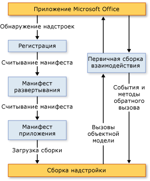

# Architecture of VSTO Add-ins
  Надстройки VSTO, созданные с помощью Office Developer Tools в Visual Studio, имеют архитектурные компоненты, предназначенные для обеспечения стабильности и безопасности и позволяющие им тесно взаимодействовать с Microsoft Office. В этой статье описываются следующие аспекты надстроек VSTO.

- [Общие сведения о надстройках VSTO](#UnderstandingAddIns)

- [Компоненты надстроек VSTO](#AddinComponents)

- [Как надстройки VSTO работают с приложениями Microsoft Office](#HowAddinsWork)

  [!INCLUDE[appliesto_allapp](../vsto/includes/appliesto-allapp-md.md)]

  Общие сведения о создании надстроек VSTO см. в статьях [Обзор разработки решений Office &#40;VSTO&#41;](../vsto/office-solutions-development-overview-vsto.md) и Приступая к [программированию надстроек VSTO](../vsto/getting-started-programming-vsto-add-ins.md).

##  Общие сведения о надстройках VSTO
 При использовании средств разработчика Office в Visual Studio для создания надстройки VSTO создается сборка управляемого кода, которая загружается приложением Microsoft Office. После загрузки сборки надстройка VSTO может отвечать на события, возникающие в приложении (например, если пользователь выбирает пункт меню). Надстройка VSTO также может вызывать объектную модель для автоматизации и расширения приложения. Кроме того, она может использовать любой из классов в [!INCLUDE[dnprdnshort](../sharepoint/includes/dnprdnshort-md.md)].

 Сборка взаимодействует с COM-компонентами приложения посредством основной сборки взаимодействия приложения. Дополнительные сведения см. в статьях [основные сборки взаимодействия Office](../vsto/office-primary-interop-assemblies.md) и [Общие сведения о разработке решений office &#40;VSTO&#41;](../vsto/office-solutions-development-overview-vsto.md).

 Если для приложения установлены несколько надстроек VSTO, каждая надстройка VSTO загружается в свой домен приложения. Это означает, что некорректное поведение одной надстройки VSTO не может привести к сбою других надстроек VSTO. Это также позволяет гарантировать, что при закрытии приложения все сборки надстроек VSTO будут выгружены из памяти. Дополнительные сведения о доменах приложений см. в разделе [домены приложений](/dotnet/framework/app-domains/application-domains).

> [!NOTE]
> Надстройки VSTO, создаваемые с помощью Office Developer Tools в Visual Studio, предназначены для использования только в том случае, когда ведущее приложение Microsoft Office запускается конечным пользователем. Если приложение запускается программным образом (например, с помощью автоматизации), надстройка VSTO может не работать должным образом.

##  Компоненты надстроек VSTO
 Несмотря на то что сборка надстройки VSTO является основным компонентом, существует несколько других компонентов, которые сильно влияют на то, как приложения Microsoft Office обнаруживают и загружают надстройки VSTO.

### Записи реестра
 Приложения Microsoft Office обнаруживают надстройки VSTO путем поиска набора записей реестра. Полный список записей реестра, используемых надстройками VSTO, см. в разделе [записи реестра для надстроек VSTO](../vsto/registry-entries-for-vsto-add-ins.md).

 При сборке вашего решения Visual Studio создает все необходимые записи реестра на компьютере разработчика, что позволяет выполнять отладку надстройки VSTO и запускать ее. Дополнительные сведения см. в разделе [Построение решений Office](../vsto/building-office-solutions.md).

 При использовании ClickOnce для развертывания решения программа установки, созданная процессом публикации, автоматически создает разделы реестра на компьютере конечного пользователя. Дополнительные сведения см. в статье [развертывание решения Office с помощью ClickOnce](../vsto/deploying-an-office-solution-by-using-clickonce.md).

### Манифест развертывания и манифест приложения
 Надстройки VSTO используют манифесты развертывания и манифесты приложения для обозначения и загрузки самой последней версии сборки надстройки VSTO. Манифест развертывания указывает на текущий манифест приложения. Манифест приложения указывает на сборку надстройки VSTO и задает класс точки входа для выполнения в сборке. Дополнительные сведения см. [в разделе Манифесты приложения и развертывания в решениях Office](../vsto/application-and-deployment-manifests-in-office-solutions.md).

### Набор средств Visual Studio для Office (среда выполнения)
 Для запуска надстроек VSTO, созданных с помощью средств разработчика Office в Visual Studio, на компьютерах конечных пользователей должна быть [!INCLUDE[vsto_runtime](../vsto/includes/vsto-runtime-md.md)] установлена. Среда выполнения содержит неуправляемые компоненты и набор управляемых сборок. Неуправляемые компоненты загружают сборку надстройки VSTO. Управляемые сборки предоставляют объектную модель, которую ваш код надстройки VSTO использует для автоматизации и расширения ведущего приложения.

 Дополнительные сведения см. в статье [инструменты Visual Studio для среды выполнения Office](../vsto/visual-studio-tools-for-office-runtime-overview.md).

##  Как надстройки VSTO работают с приложениями Microsoft Office
 Когда пользователь запускает приложение Microsoft Office, приложение использует манифест развертывания и манифест приложения для поиска и загрузки последней версии сборки надстройки VSTO. На рисунке ниже показана основная архитектура этих надстроек VSTO.

 

> [!NOTE]
> В решениях Office, ориентированных на [!INCLUDE[net_v40_short](../sharepoint/includes/net-v40-short-md.md)] или [!INCLUDE[net_v45](../vsto/includes/net-v45-md.md)], решения вызывают объектную модель ведущего приложения с помощью сведений о типах основной сборки взаимодействия, внедренных в сборку решения, а не вызывают непосредственно саму эту сборку. Дополнительные сведения см. в статье [Разработка и создание решений Office](../vsto/designing-and-creating-office-solutions.md).

### Загрузка процесса
 Когда пользователь запускает приложение, происходит следующее:

1. Приложение проверяет реестр на наличие записей, обозначающих надстройки VSTO, созданные с помощью Office Developer Tools в Visual Studio.

2. Если приложение находит эти записи реестра, оно загружает файл VSTOEE.dll, который загружает файл VSTOLoader.dll. Эти файлы представляют собой неуправляемые библиотеки DLL и являются компонентами загрузчика для среды выполнения набора средств Visual Studio 2010 для Office. Дополнительные сведения см. в статье [инструменты Visual Studio для среды выполнения Office](../vsto/visual-studio-tools-for-office-runtime-overview.md).

3. *VSTOLoader.dll* загружает [!INCLUDE[dnprdnshort](../sharepoint/includes/dnprdnshort-md.md)] и запускает управляемую часть [!INCLUDE[vsto_runtime](../vsto/includes/vsto-runtime-md.md)] .

4. [!INCLUDE[vsto_runtime](../vsto/includes/vsto-runtime-md.md)] проверяет наличие обновлений манифестов и загружает последние манифесты приложения и развертывания.

5. [!INCLUDE[vsto_runtime](../vsto/includes/vsto-runtime-md.md)] выполняет серию проверок безопасности. Дополнительные сведения см. в статье [Защита решений Office](../vsto/securing-office-solutions.md).

6. Если надстройка VSTO имеет необходимый уровень доверия для выполнения, [!INCLUDE[vsto_runtime](../vsto/includes/vsto-runtime-md.md)] использует манифест развертывания и манифест приложения для проверки наличия обновлений сборки. Если доступна новая версия сборки, среда выполнения загружает эту версию в кэш [!INCLUDE[ndptecclick](../vsto/includes/ndptecclick-md.md)] на клиентском компьютере. Дополнительные сведения см. в разделе [развертывание решения Office](../vsto/deploying-an-office-solution.md).

7. Среда выполнения [!INCLUDE[vsto_runtime](../vsto/includes/vsto-runtime-md.md)] создает новый домен приложения для загрузки сборки надстройки VSTO.

8. Среда выполнения [!INCLUDE[vsto_runtime](../vsto/includes/vsto-runtime-md.md)] загружает сборку надстройки VSTO в домен приложения.

9. Среда выполнения [!INCLUDE[vsto_runtime](../vsto/includes/vsto-runtime-md.md)] вызывает метод <xref:Microsoft.Office.Tools.AddInBase.RequestComAddInAutomationService%2A> в надстройке VSTO, если он был переопределен.

     При необходимости этот метод можно переопределить, чтобы предоставить объект в надстройке VSTO другим решениям Microsoft Office. Дополнительные сведения см. [в разделе вызов кода в надстройках VSTO из других решений Office](../vsto/calling-code-in-vsto-add-ins-from-other-office-solutions.md).

10. Среда выполнения [!INCLUDE[vsto_runtime](../vsto/includes/vsto-runtime-md.md)] вызывает метод <xref:Microsoft.Office.Tools.AddInBase.RequestService%2A> в надстройке VSTO, если он был переопределен.

     При необходимости этот метод можно переопределить для расширения возможностей Microsoft Office путем возврата объекта, который реализует интерфейс расширения. Дополнительные сведения см. в разделе [Настройка функций пользовательского интерфейса с помощью интерфейсов расширения](../vsto/customizing-ui-features-by-using-extensibility-interfaces.md).

    > [!NOTE]
    > [!INCLUDE[vsto_runtime](../vsto/includes/vsto-runtime-md.md)] отправляет отдельные вызовы в метод <xref:Microsoft.Office.Tools.AddInBase.RequestService%2A> для каждого интерфейса расширения, который поддерживается ведущим приложением. Несмотря на то что первый вызов в метод <xref:Microsoft.Office.Tools.AddInBase.RequestService%2A> обычно происходит перед вызовом в метод `ThisAddIn_Startup` , ваша надстройка VSTO не должна делать никаких предположений о том, когда будет вызван метод <xref:Microsoft.Office.Tools.AddInBase.RequestService%2A> или сколько раз он будет вызываться.

11. Среда выполнения [!INCLUDE[vsto_runtime](../vsto/includes/vsto-runtime-md.md)] вызывает метод `ThisAddIn_Startup` в надстройке VSTO. Этот метод является обработчиком событий по умолчанию для события <xref:Microsoft.Office.Tools.AddInBase.Startup> . Дополнительные сведения см. [в разделе события в проектах Office](../vsto/events-in-office-projects.md).

## См. также раздел
- [Архитектура решений Office в Visual Studio](../vsto/architecture-of-office-solutions-in-visual-studio.md)
- [Архитектура настроек уровня документа](../vsto/architecture-of-document-level-customizations.md)
- [Общие сведения о Инструменты Visual Studio для среды выполнения Office](../vsto/visual-studio-tools-for-office-runtime-overview.md)
- [Программирование надстроек VSTO](../vsto/programming-vsto-add-ins.md)
- [Разработка решений Office](../vsto/developing-office-solutions.md)
- [Безопасные решения Office](../vsto/securing-office-solutions.md)
- [Развертывание решения Office](../vsto/deploying-an-office-solution.md)
