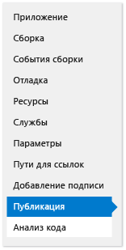
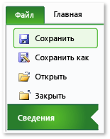
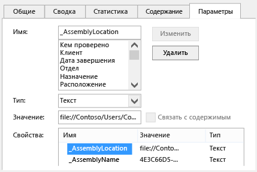

# Развертывание решения Office с помощью ClickOnce
  Решение Office можно развернуть быстрее, если использовать ClickOnce.  При публикации обновлений решение автоматически обнаруживает и устанавливает их.  Однако для использования ClickOnce необходимо устанавливать решение отдельно для каждого пользователя компьютера.  Поэтому следует рассмотреть возможность использования установщика Windows \(MSI\), если несколько пользователей будут запускать решение на одном и том же компьютере.  
  
## Содержание раздела  
  
-   [Публикация решения](#Publish)  
  
-   [Выбор способа предоставления доверия решению](#Trust)  
  
-   [Помощь пользователям при установке решения](#Helping)  
  
-   [Размещение документа решения на компьютере пользователя (настройки только уровня документа)](#Put)  
  
-   [Размещение документа решения на сервере с SharePoint (настройки только уровня документа)](#SharePoint)  
  
-   [Создание пользовательского установщика](#Custom)  
  
-   [Публикация обновления](#Update)  
  
-   [Изменение расположения установки решения](#Location)  
  
-   [Откат решения к более ранней версии](#Roll)  
  
 Дополнительные сведения о развертывании решения Office путем создания файла установщика Windows см. в разделе [Развертывание решения Office с помощью установщика Windows](../vsto/deploying-an-office-solution-by-using-windows-installer.md).  
  
##  <a name="Publish"></a> Публикация решения  
 Для публикации решения можно использовать **Мастер публикации** или **Конструктор проектов**.  В описываемой ниже процедуре мы будем использовать **Конструктор проектов**, поскольку он поддерживает полный набор параметров публикации.  См. раздел [Мастер публикации &#40;разработка для Office в Visual Studio&#41;](../vsto/publish-wizard-office-development-in-visual-studio.md).  
  
#### Публикация решения  
  
1.  В **Обозревателе решений** выберите узел с именем проекта.  
  
2.  В меню выберите **Проект**, *ProjectName*, **Свойства**.  
  
3.  В **Конструкторе проектов** перейдите на вкладку **Публикация**, показанную на следующем рисунке.  
  
       
  
4.  В поле **Расположение каталога публикации \(веб\-сайт, ftp\-сервер или путь к файлу\)** введите путь к папке, в которую **Конструктор проектов** скопирует файлы решения.  
  
     Можно ввести путь любого из следующих типов.  
  
    -   Локальный путь \(например, *C:\\FolderName\\FolderName*\).  
  
    -   Путь UNC к папке в сети \(например, *\\ServerName\\FolderName*\).  
  
    -   Относительный путь \(например, *PublishFolder\\* — это папка, в которую происходит публикация проекта по умолчанию\).  
  
5.  В поле **URL\-адрес папки установки** ведите полный путь к расположению, в котором пользователи смогут найти решение.  
  
     Если это расположение еще неизвестно, ничего не вводите в это поле.  По умолчанию ClickOnce ищет обновления в папке, из которой пользователи устанавливают решение.  
  
6.  Нажмите кнопку **Необходимые компоненты**.  
  
7.  Убедитесь, что в диалоговом окне **Необходимые компоненты** установлен флажок **Создать программу установки для необходимых компонентов**.  
  
8.  В списке **Выберите устанавливаемые необходимые компоненты** установите флажки **Установщик Windows 4.5** и соответствующий пакет .NET Framework.  
  
     Например, если решение предназначено для [!INCLUDE[net_v45](../vsto/includes/net-v45-md.md)], установите флажки **установщик Windows 4.5** и **Microsoft .NET Framework 4.5 Full**.  
  
9. Если решение предназначено для .NET Framework 4.5, также установите флажок **Среда выполнения средств Microsoft Visual Studio 2010 для Office**.  
  
    > [!NOTE]  
    >  По умолчанию этот флажок не отображается.  Чтобы отобразить этот флажок, необходимо создать пакет начального загрузчика.  В разделе [Создание пакета начального загрузчика для дополнения Office 2013 VSTO в Visual Studio 2012](http://blogs.msdn.com/b/vsto/archive/2012/12/21/creating-a-bootstrapper-package-for-an-office-2013-vsto-add-in-with-visual-studio-2012.aspx).  
  
10. В области **Укажите место установки для необходимых компонентов** выберите один из отображаемых параметров, а затем нажмите кнопку **ОК**.  
  
     В таблице ниже представлено описание каждого из этих параметров.  
  
    |Параметр|Описание|  
    |--------------|--------------|  
    |**Загрузить необходимые компоненты с веб\-сайта поставщика компонентов**|Пользователю будет предложено загрузить и установить эти необходимые компоненты у поставщика.|  
    |**Загрузить необходимые компоненты с местоположения моего приложения**|Необходимое программное обеспечение устанавливается вместе с решением.  Если выбран этот параметр, Visual Studio копирует все пакеты необходимых компонентов в расположение публикации автоматически.  Чтобы этот параметр действовал, пакеты необходимых компонентов должны находиться на компьютере разработки.|  
    |**Скачать необходимые компоненты из следующего места**|Visual Studio скопирует все пакеты необходимых компонентов в указанное расположение и установит их вместе с решением.|  
  
     См. раздел [Диалоговое окно «Необходимые компоненты»](../ide/reference/prerequisites-dialog-box.md).  
  
11. Нажмите кнопку **Обновления**, укажите, как часто необходимо проверять наличие обновлений для надстроек VSTO и настроек каждого пользователя, а затем нажмите кнопку **ОК**.  
  
    > [!NOTE]  
    >  При развертывании с использованием компакт\-диска или съемного носителя следует выбрать параметр **Никогда не проверять обновления**.  
  
     Сведения о том, как опубликовать обновление, см. в разделе [Публикация обновления](#Update).  
  
12. Нажмите кнопку **Параметры**, проверьте параметры в диалоговом окне **Параметры**, а затем нажмите кнопку **ОК**.  
  
13. Нажмите кнопку **Опубликовать сейчас**.  
  
     Visual Studio добавить следующие папки и файлы в папку публикации, указанную ранее в этой процедуре.  
  
    -   Папка **Application Files**.  
  
    -   Программа установки.  
  
    -   Манифест развертывания, указывающий на манифест развертывания для последней версии.  
  
     Папка **Application Files** содержит вложенную папку для каждой публикуемой версии.  Каждая вложенная папка для конкретной версии содержит следующие файлы.  
  
    -   Манифест приложения.  
  
    -   Манифест развертывания.  
  
    -   Сборки настройки.  
  
     На следующем рисунке показана структура папки публикации для надстройки VSTO Outlook.  
  
       
  
    > [!NOTE]  
    >  ClickOnce добавляет к сборкам расширение .deploy, чтобы защищенная установка служб IIS не блокировала файлы из\-за небезопасного расширения.  Когда пользователь установит решение, ClickOnce удалит расширение .deploy.  
  
14. Скопируйте файлы решения в папку установки, указанную ранее в этой процедуре.  
  
##  <a name="Trust"></a> Выбор способа предоставления доверия решению  
 Прежде чем решение можно будет запускать на компьютерах пользователей, необходимо предоставить доверие. В противном случае пользователи должны будут ответить на запрос о доверии при установке решения.  Чтобы предоставить доверие решению, подпишите манифест с помощью сертификата, который определяет известного и надежного издателя.  См. раздел [Доверяющ решение, подписав приложений и манифестов развертывания](../vsto/granting-trust-to-office-solutions.md#Signing).  
  
 При развертывании настроек уровня документа и размещении документа в папке на компьютере пользователя или предоставлении доступа к документу на сайте SharePoint, убедитесь, что Office доверяет расположению документа.  См. раздел [Присвоение уровня доверия документам](../vsto/granting-trust-to-documents.md).  
  
##  <a name="Helping"></a> Помощь пользователям при установке решения  
 Чтобы установить решение, пользователи могут запустить программу установки, открыть манифест развертывания или, в случае настройки уровня документа, открыть документ напрямую.  Рекомендуемым способом является установка решения пользователями с помощью программы установки.  Другие два способа не гарантируют установки необходимых программных компонентов.  Если пользователям необходимо открывать документ из расположения установки, они должны добавить это расположение в список надежных расположений в центре управления безопасностью приложения Office.  
  
### Открытие документа настройки уровня документа  
 Пользователи могут открывать документы настройки уровня документа непосредственно из папки установки или путем копирования документа на локальный компьютер и открытия этой копии.  
  
 Рекомендуется открывать копии документов на компьютерах пользователей, чтобы несколько пользователей не пытались открывать один и тот же экземпляр документа одновременно.  Чтобы обеспечить выполнение этого правила, можно настроить программу установки таким образом, чтобы она копировала документ на компьютеры пользователей.  См. раздел [Размещение документа решения на компьютере пользователя (настройки только уровня документа)](#Put).  
  
### Установка решения путем открытия манифеста развертывания с веб\-сайта IIS  
 Пользователи могут установить решение Office путем открытия манифеста развертывания из Интернета.  Однако защищенная установка IIS будет блокировать файлы с расширением .vsto.  Тип MIME должен быть определен в IIS перед развертыванием решения Office с использованием IIS.  
  
##### Добавление типа MIME .vsto в IIS 6.0  
  
1.  На сервере, на котором запущены службы IIS 6.0, нажмите кнопку **Пуск** и выберите пункты **Все программы**, **Администрирование** и **Диспетчер служб IIS**.  
  
2.  Выберите имя компьютера, папку **Веб\-сайты** или настраиваемый веб\-сайт.  
  
3.  В строке меню выберите **Действие**, **Свойства**.  
  
4.  На вкладке **Заголовки HTTP** нажмите кнопку **Типы MIME**.  
  
5.  В окне **Типы MIME** нажмите кнопку **Создать**.  
  
6.  В окне **Типы MIME** введите **.vsto** в качестве расширения и введите **application\/x\-ms\-vsto** в качестве типа MIME, после чего примените новые параметры.  
  
    > [!NOTE]  
    >  Чтобы изменения вступили в силу, необходимо перезапустить службу веб\-публикаций или подождать, пока рабочий процесс будет перезапущен.  После этого нужно очистить кэш диска браузера и снова попытаться открыть файл .vsto.  
  
##### Добавление типа MIME .vsto в IIS 7,0  
  
1.  На сервере с IIS 7.0 выберите **Пуск**, **Все программы**, **Стандартные**.  
  
2.  Откройте контекстное меню пункта **Командная строка** и выберите команду **Запуск от имени администратора**.  
  
3.  В поле **Открыть** введите следующий путь и нажмите кнопку **ОК**.  
  
    ```  
    %windir%\system32\inetsrv   
    ```  
  
4.  Введите следующую команду, а затем примените новые параметры.  
  
    ```  
    set config /section:staticContent /+[fileExtension='.vsto',mimeType='application/x-ms-vsto']  
    ```  
  
    > [!NOTE]  
    >  Чтобы изменения вступили в силу, необходимо перезапустить службу веб\-публикаций или подождать, пока рабочий процесс будет перезапущен.  После этого нужно очистить кэш диска браузера и снова попытаться открыть файл .vsto.  
  
##  <a name="Put"></a> Размещение документа решения на компьютере пользователя \(настройки только уровня документа\)  
 Документ решения можно скопировать на компьютер пользователя путем создания действия, выполняемого после развертывания.  В этом случае пользователю не потребуется вручную копировать документ из расположения установки на свой компьютер после установки решения.  При этом необходимо будет создать класс, определяющий действие, выполняемое после развертывания, собрать и опубликовать решение, изменить манифест приложения, и повторно подписать приложение и манифест развертывания.  
  
 При выполнение следующих процедур предполагается, что проект имеет имя **ExcelWorkbook** и что решение публикуется в папке **C: \\publish** на локальном компьютере.  
  
### Создание класса, определяющего действие, выполняемое после развертывания  
  
1.  В строке меню выберите **Файл**, **Добавить**, **Новый проект**.  
  
2.  В диалоговом окне **Добавление нового проекта** в области **Установленные шаблоны** выберите папку **Windows**.  
  
3.  В области **Шаблоны** выберите шаблон **Библиотека классов**.  
  
4.  В поле **Имя** введите **FileCopyPDA** и нажмите кнопку **ОК**.  
  
5.  В **Обозревателе решений** выберите проект **FileCopyPDA**.  
  
6.  В меню **Проект** выберите **Добавить ссылку**.  
  
7.  На вкладке **.NET** добавьте ссылки на Microsoft.VisualStudio.Tools.Applications.Runtime и Microsoft.VisualStudio.Tools.Applications.ServerDocument.  
  
8.  Переименуйте класс в `FileCopyPDA`, а затем замените содержимое файла следующим кодом.  Этот код выполняет следующие задачи:  
  
    -   Копирует документ на рабочий стол пользователя.  
  
    -   Меняет значение свойства \_AssemblyLocation с относительного на абсолютный путь к манифесту развертывания.  
  
    -   Удаляет файл, когда пользователь удаляет решение.  
  
     [!code-csharp[Trin_ExcelWorkbookPDA#7](../snippets/csharp/VS_Snippets_OfficeSP/trin_excelworkbookpda/cs/filecopypda/class1.cs#7)]
     [!code-vb[Trin_ExcelWorkbookPDA#7](../snippets/visualbasic/VS_Snippets_OfficeSP/trin_excelworkbookpda/vb/filecopypda/class1.vb#7)]  
  
### Сборка и публикация решения  
  
1.  В **Обозревателе решений** откройте контекстное меню проекта **FileCopyPDA** и выберите команду **Сборка**.  
  
2.  Откройте контекстное меню проекта **ExcelWorkbook** и выберите команду **Сборка**.  
  
3.  Откройте контекстное меню проекта **ExcelWorkbook** и выберите команду **Добавить ссылку**.  
  
4.  В диалоговом окне **Добавить ссылку** откройте вкладку **Проекты**, выберите **FileCopyPDA**, а затем нажмите кнопку **ОК**.  
  
5.  В **Обозревателе решений** выберите проект **ExcelWorkbook**.  
  
6.  В строке меню выберите **Проект**, **Создать папку**.  
  
7.  Введите имя Data и нажмите клавишу ВВОД.  
  
8.  В **Обозревателе решений** выберите папку **Data**.  
  
9. В меню **Проект** выберите **Добавить существующий элемент**.  
  
10. В диалоговом окне **Добавление существующего элемента** перейдите в выходной каталог проекта **ExcelWorkbook**, выберите файл **ExcelWorkbook.xlsx**, а затем нажмите кнопку **Добавить**.  
  
11. В **Обозревателе решений** выберите файл **ExcelWorkbook.xlsx**.  
  
12. В окне **Свойства** измените значение свойства **Действие сборки** на **Содержание**, а значение свойства **Копировать в выходной каталог** на **Копировать, если новее**.  
  
     По завершении этих шагов проект будет выглядеть примерно так, как показано на следующем рисунке.  
  
       
  
13. Опубликуйте проект **ExcelWorkbook**.  
  
### Изменение манифеста приложения  
  
1.  Откройте каталог **c:\\publish** в **проводнике**.  
  
2.  Откройте папку **Application Files**, а затем откройте папку, соответствующую последней опубликованной версии решения.  
  
3.  Откройте файл **ExcelWorkbook.dll.manifest** в текстовом редакторе, например в "Блокноте".  
  
4.  После элемента `</vstav3:update>` добавьте следующий код.  Для атрибута класса элемента `<vstav3:entryPoint>` используйте следующий синтаксис: *NamespaceName.ClassName*.  В следующем примере имя класса совпадает с именем пространства имен, поэтому имя точки входа будет иметь вид `FileCopyPDA.FileCopyPDA`.  
  
    ```  
    <vstav3:postActions>  
      <vstav3:postAction>  
        <vstav3:entryPoint  
          class="FileCopyPDA.FileCopyPDA">  
          <assemblyIdentity  
            name="FileCopyPDA"  
            version="1.0.0.0"  
            language="neutral"  
            processorArchitecture="msil" />  
        </vstav3:entryPoint>  
        <vstav3:postActionData>  
        </vstav3:postActionData>  
      </vstav3:postAction>  
    </vstav3:postActions>  
    ```  
  
### Повторное подписывание манифестов приложения и развертывания  
  
1.  В папке **%USERPROFILE%\\Documents\\Visual Studio 2013\\Projects\\ExcelWorkbook\\ExcelWorkbook** скопируйте файл сертификата **ExcelWorkbook\_TemporaryKey.pfx** и вставьте его в папку *PublishFolder* **\\Application Files\\ExcelWorkbook***MostRecentPublishedVersion*.  
  
2.  Откройте командную строку Visual Studio, а затем измените папки на **c:\\publish\\Application Files\\ExcelWorkbook** *MostRecentPublishedVersion*, \(например, **c:\\publish\\Файлы приложения\\ExcelWorkbook\_1\_0\_0\_4**\).  
  
3.  Подпишите обновленный манифест приложения с помощью следующей команды:  
  
    ```  
    mage -sign ExcelWorkbook.dll.manifest -certfile ExcelWorkbook_TemporaryKey.pfx  
    ```  
  
     Появится сообщение "ExcelWorkbook.dll.manifest успешно подписан".  
  
4.  Перейдите в папку **c:\\publish**, а затем обновите и подпишите манифест развертывания, выполнив следующую команду:  
  
    ```  
    mage -update ExcelWorkbook.vsto -appmanifest "Application Files\Ex  
    celWorkbookMostRecentVersionNumber>\ExcelWorkbook.dll.manifest" -certfile "Application Files\ExcelWorkbookMostRecentVersionNumber>\ExcelWorkbook_TemporaryKey.pfx"  
    ```  
  
    > [!NOTE]  
    >  В предыдущем примере замените MostRecentVersionNumber на номер последней опубликованной версии решения \(например, **1\_0\_0\_4**\).  
  
     Появится сообщение "ExcelWorkbook.vsto успешно подписан".  
  
5.  Скопируйте файл ExcelWorkbook.vsto в каталог **c:\\publish\\Application Files\\ExcelWorkbook***MostRecentVersionNumber*.  
  
##  <a name="SharePoint"></a> Размещение документа решения на сервере с SharePoint \(настройки только уровня документа\)  
 Настройки уровня документа можно публиковать для пользователей с помощью SharePoint.  Когда пользователь открывает документ с сайта SharePoint, среда выполнения автоматически устанавливает решение на локальном компьютере пользователя из общей сетевой папки.  После локальной установки решения настройка продолжит работать, даже если документ будет скопирован в другое место, например на рабочий стол.  
  
#### Размещение документа на сервере с SharePoint  
  
1.  Добавьте документ решения в библиотеку документов на сайте SharePoint.  
  
2.  Воспользуйтесь одним из следующих подходов, выполнив соответствующие инструкции.  
  
    -   С помощью средства настройки Office добавьте сервер с SharePoint в центр управления безопасностью в Word или Excel на всех компьютерах пользователей.  
  
         См. раздел [Политики безопасности и параметры в Office 2010](http://go.microsoft.com/fwlink/?LinkId=99227).  
  
    -   Убедитесь, что каждый пользователь выполнил следующие действия.  
  
        1.  На локальном компьютере откройте Word или Excel, перейдите на вкладку **Файл** и нажмите кнопку **Параметры**.  
  
        2.  В диалоговом окне **Центр управления безопасностью** нажмите кнопку **Надежные расположения**.  
  
        3.  Установите флажок **Разрешить надежные расположения в моей сети \(не рекомендуется\)**, а затем нажмите кнопку **Добавить новое расположение**.  
  
        4.  В поле **Путь** введите URL\-адрес библиотеки документов SharePoint, которая содержит загруженный документ \(например, *http:\/\/SharePointServerName\/TeamName\/ProjectName\/DocumentLibraryName*\).  
  
             Не следует добавлять имя веб\-страницы по умолчанию, например default.aspx или AllItems.aspx.  
  
        5.  Установите флажок **Также доверять всем вложенным папкам**, а затем нажмите кнопку **ОК**.  
  
             Когда пользователь откроет документ с сайта SharePoint, будут установлены настройки.  Пользователь может скопировать документ себе на рабочий стол.  Настройка все равно будет работать, поскольку свойства в документе указывают на сетевое расположение документа.  
  
##  <a name="Custom"></a> Создание пользовательского установщика  
 Для решения Office можно создать пользовательский установщик, вместо того чтобы использовать программу установки, которая создается автоматически при публикации решения.  Например, можно запустить установку с помощью скрипта входа или устанавливать решение с помощью пакетного файла без взаимодействия с пользователем.  Эти сценарии оптимальны, если все необходимые компоненты уже установлены на компьютерах пользователей.  
  
 В рамках пользовательского процесса установки вызовите средство установки решений Office \(VSTOInstaller.exe\), которое по умолчанию установлено в следующем расположении:  
  
 %commonprogramfiles%\\microsoft shared\\VSTO\\10.0\\VSTOInstaller.exe  
  
 Если это средство находится в другой папке, воспользуйтесь разделом реестра HKEY\_LOCAL\_MACHINE\\SOFTWARE\\Microsoft\\VSTO Runtime Setup\\v4\\InstallerPath или HKEY\_LOCAL\_MACHINE\\SOFTWARE\\Wow6432Node\\Microsoft\\VSTO Runtime Setup\\v4\\InstallerPath, чтобы найти путь к нему.  
  
 При запуске VSTOinstaller.exe можно использовать следующие параметры.  
  
|Параметр|Определение|  
|--------------|-----------------|  
|\/Install или \/I|Установка решения.  За данным параметром должен следовать путь к манифесту развертывания.  Можно указать путь на локальном компьютере, в общей папке с именем по универсальным правилам именования \(UNC\).  Можно указать локальный путь \(*C:\\FolderName\\PublishFolder*\), относительный путь \(*Publish\\* или полный путь \(*\\\\ServerName\\FolderName* или http:\/\/*ServerName\/FolderName*\).|  
|\/Uninstall или \/U|Удаление решения.  За данным параметром должен следовать путь к манифесту развертывания.  Можно указать путь на локальном компьютере к общей папке UNC.  Можно указать локальный путь \(*C:\\FolderName\\PublishFolder*\), относительный путь \(*Publish\\* или полный путь \(*\\\\ServerName\\FolderName* или http:\/\/*ServerName\/FolderName*\).|  
|\/Silent или \/S|Установка или удаление без запроса ввода данных пользователем и без отображения сообщений.  Если требуется запрос о доверии, настройка не устанавливается и не обновляется.|  
|\/Help или \/?|Отображение справочных сведений.|  
  
 При запуске VSTOinstaller.exe могут появляться следующие коды ошибок.  
  
|Код ошибки|Определение|  
|----------------|-----------------|  
|0|Решение было успешно установлено или удалено, или появилась справка VSTOInstaller.|  
|\-100|Один или несколько параметров командной строки недопустимы или заданы более одного раза.  Для получения дополнительных сведений, введите «vstoinstaller \/?» или обратитесь к разделу [Создание пользовательского установщика для решения Office, устанавливаемого с помощью ClickOnce](http://msdn.microsoft.com/ru-ru/3e5887ed-155f-485d-b8f6-3c02c074085e).|  
|\-101|Один или несколько параметров командной строки недопустимы.  Для получения дополнительных сведений введите команду "vstoinstaller \/?".|  
|\-200|URI\-адрес манифеста развертывания недействителен.  Для получения дополнительных сведений введите команду "vstoinstaller \/?".|  
|\-201|Не удалось установить решение, так как манифест развертывания недействителен.  См. раздел [Манифесты развертывания для решений Office](../vsto/deployment-manifests-for-office-solutions.md).|  
|\-202|Решение не может быть установлено, поскольку раздел Visual Studio Tools for Office манифеста приложения является недопустимым.  См. раздел [Манифесты приложений для решений Office](../vsto/application-manifests-for-office-solutions.md).|  
|\-203|Не удалось установить решение из\-за ошибки загрузки.  Проверьте URI\-адрес манифеста развертывания или расположение файла в сети и повторите попытку.|  
|\-300|Не удалось установить решение из\-за исключения безопасности.  См. раздел [Обеспечение безопасности решений Office](../vsto/securing-office-solutions.md).|  
|\-400|Не удалось установить решение.|  
|\-401|Не удалось удалить решение.|  
|\-500|Операция была отменена, поскольку решение не может быть установлено или удалено или не удалось загрузить манифест развертывания.|  
  
##  <a name="Update"></a> Публикация обновления  
 Чтобы обновить решение, опубликуйте его раз с использованием **Конструктора проектов** или **Мастера публикации**, а затем скопируйте обновленное решение в папку установки.  При копировании файлов в папку установки убедитесь, что предыдущие файлы перезаписываются.  
  
 Во время следующей проверки обновлений решения поиск и загрузка новой версии будут выполнены автоматически.  
  
##  <a name="Location"></a> Изменение расположения установки решения  
 Путь установки можно добавлять и изменять после публикации решения.  При необходимости можно изменить путь установки по одной из следующих причин:  
  
-   путь установки неизвестен на момент компиляции программы установки;  
  
-   файлы решения копируются в другое расположение;  
  
-   изменились имя или адрес сервера, на котором размещены файлы установки.  
  
 Чтобы изменить путь установки решения, необходимо обновить программу установки, после чего пользователи должны запустить ее.  Для настроек уровня документа пользователи должны также обновить свойство в своем документе, чтобы оно указывало на новое расположение.  
  
> [!NOTE]  
>  Если вы не хотите просить пользователей обновлять свойства в своих документах, можно предложить им получить обновленный документ из папки установки.  
  
#### Изменение пути установки в программе установки  
  
1.  Откройте окно **командной строки** и перейдите в папку установки.  
  
2.  Запустите программу установки с параметром `/url`, который принимает новый путь установки в строковом формате.  
  
     В следующем примере показано, как изменить путь к папке установки на расположение на веб\-сайте компании Fabrikam, но вместо URL\-адреса можно подставить любой путь:  
  
    ```  
    setup.exe /url="http://www.fabrikam.com/newlocation"  
    ```  
  
    > [!NOTE]  
    >  Если появляется сообщение о том, что подпись исполняемого файла станет недействительной, это означает, что сертификат, с помощью которого было подписано решение, стал недействительным, а издатель неизвестен.  В результате пользователям необходимо будет подтвердить, что они доверяют источнику решения, прежде чем они смогут установить его.  
  
    > [!NOTE]  
    >  Чтобы просмотреть текущее значение URL\-адреса, выполните команду `setup.exe /url`.  
  
 Для настроек уровня документа пользователь должен открыть документ и обновить значение свойства \_AssemblyLocation.  Ниже описано, как пользователи могут выполнить эту задачу.  
  
#### Обновление свойства \_AssemblyLocation в документе  
  
1.  На вкладке **Файл** выберите пункт **Сведения**, как показано на следующем рисунке.  
  
       
  
2.  В списке **Свойства** выберите **Дополнительные свойства**, как показано на следующем рисунке.  
  
       
  
3.  На вкладке **Настраиваемые** в списке **Свойства** выберите \_AssemblyLocation, как показано на следующем рисунке.  
  
       
  
     Окно **Значение** содержит идентификатор манифеста развертывания.  
  
4.  Перед идентификатором введите полный путь к документу и вертикальную черту в формате *Путь* |*Идентификатор* \(например, *File:\/\/ServerName\/FolderName\/FileName |74744e4b\-e4d6\-41eb\-84f7\-ad20346fe2d9*.  
  
     Дополнительные сведения о формате идентификатора см. в разделе [Общие сведения о настраиваемых свойствах документа](../vsto/custom-document-properties-overview.md).  
  
5.  Нажмите кнопку **ОК**, а затем сохраните и закройте документ.  
  
6.  Чтобы установить решение в указанном расположении, запустите программу установки без параметра "\/url".  
  
##  <a name="Roll"></a> Откат решения к более ранней версии  
 При откате решения пользователи возвращаются к более ранней версии этого решения.  
  
#### Откат решения  
  
1.  Откройте расположение установки решения.  
  
2.  В папке публикации верхнего уровня удалите манифест развертывания \(VSTO\-файл\).  
  
3.  Найдите вложенную папку версии, к которой требуется вернуться.  
  
4.  Скопируйте манифест развертывания из этой папки в папку публикации верхнего уровня.  
  
     Например чтобы вернуться от версии 1.0.0.1 решения **OutlookAddIn1** к версии 1.0.0.0, скопируйте файл **OutlookAddIn1.vsto** из папки **OutlookAddIn1\_1\_0\_0\_0**.  Вставьте файл в папку публикации верхнего уровня, перезаписав имеющийся манифест развертывания для версии **OutlookAddIn1\_1\_0\_0\_1**.  
  
     На следующем рисунке показана структура папок публикации для данного примера.  
  
       
  
     Когда пользователь в следующий раз откроет приложение или настроенный документ, будет обнаружено изменение манифеста развертывания.  Предыдущая версия решения Office будет запущена из кэша ClickOnce.  
  
> [!NOTE]  
>  Локальные данные сохраняются только для одной предыдущей версии решения.  При откате на две версии локальные данные не сохраняются.  Дополнительные сведения о локальных данных см. в разделе [Доступ к локальным и удаленным данным в приложениях ClickOnce](../deployment/accessing-local-and-remote-data-in-clickonce-applications.md).  
  
## См. также  
 [Развертывание решения Office](../vsto/deploying-an-office-solution.md)   
 [Публикация решений Office](../vsto/deploying-an-office-solution-by-using-clickonce.md)   
 [Практическое руководство. Публикация решения Office с помощью ClickOnce](http://msdn.microsoft.com/ru-ru/2b6c247e-bc04-4ce4-bb64-c4e79bb3d5b8)   
 [Практическое руководство. Установка решения Office ClickOnce](http://msdn.microsoft.com/ru-ru/14702f48-9161-4190-994c-78211fe18065)   
 [Практическое руководство. Публикация решения Office уровня документа на сервере SharePoint Server с помощью ClickOnce](http://msdn.microsoft.com/ru-ru/2408e809-fb78-42a1-9152-00afa1522e58)   
 [Создание пользовательского установщика для решения Office, устанавливаемого с помощью ClickOnce](http://msdn.microsoft.com/ru-ru/3e5887ed-155f-485d-b8f6-3c02c074085e)  
  
  