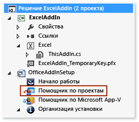
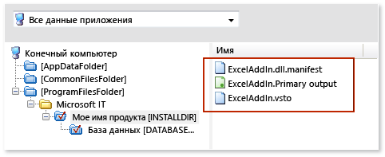
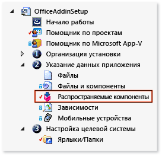

# Развертывание решения Office с помощью установщика Windows
Узнайте, как создать файл установщика Windows для решения Office при помощи [!INCLUDE[vs_dev12](../vsto/includes/vs-dev12-md.md)].  
  
Благодаря созданию установщика Windows при помощи Visual Studio можно развернуть решение Office, для которого требуется административный доступ на компьютере конечного пользователя. Например, файл установщика можно использовать для одновременной установки решения для всех пользователей компьютера. Решение Office можно также развернуть с помощью ClickOnce, но в таком случае решение придется установить отдельно для каждого пользователя компьютера.  
  
  
## Содержание раздела  
  
- [Download VSTO Add-in samples](#Download)  
  
- [Get InstallShield Limited Edition](#Obtain)  
  
- [Decide how to grant trust to the solution](#ApplySecurity)  
  
- [Create a setup project](#Create)  
  
- [Add the project output](#Add)  
  
- [Add the deployment and application manifests](#AddD)  
  
- [Configure the dependent components as prerequisites](#Configure)  
  
- [Specify where you want to deploy the solution on the user's computer](#Location)  
  
- [Configure an VSTO Add-in](#ConfigureRegisitry)  
  
- [Configure a document-level customization](#ConfigureDocument)  
  
- [Build the setup project](#Build)  
  
Дополнительные сведения о развертывании решения Office с использованием ClickOnce см. в разделе [Развертывание решения Office с помощью ClickOnce](../vsto/deploying-an-office-solution-by-using-clickonce.md).  
  
Сведения о создании файла установщика Windows с использованием [!INCLUDE[vs_dev10_long](../sharepoint/includes/vs-dev10-long-md.md)] см. в разделе [Развертывание решения средств Visual Studio 2010 для Office с помощью установщика Windows](http://go.microsoft.com/fwlink/?LinkId=201807).  
  
  
## <a name="Download"></a>Загружаемые примеры  
Этот раздел ссылается на следующие загружаемые примеры.  
  
  
  
|Пример<br /><br />|Описание<br /><br />|  
|----------|------------|  
|[ExcelAddIn](http://go.microsoft.com/fwlink/?LinkID=275492)<br /><br />|Надстройка VSTO Excel, которую можно установить на компьютере, на котором запущена 32-разрядная или 64-разрядная версия Office.<br /><br />|  
|[ExcelWorkbook](http://go.microsoft.com/fwlink/?LinkID=275493)<br /><br />|Настройка уровня документа Excel, которую можно установить на компьютере, на котором запущена 32-разрядная или 64-разрядная версия Office.<br /><br />|  
  
## <a name="ApplySecurity"></a>Выбор способа предоставления доверия решению  
Прежде чем решение можно будет запускать на компьютерах пользователей, необходимо предоставить доверие одним из следующих способов. В противном случае пользователи должны будут ответить на запрос о доверии при установке решения.  
  
  
- Подписывание манифеста с помощью сертификата, который определяет известного и надежного издателя. Для получения дополнительной информации см. [Trusting the Solution by Signing the Application and Deployment Manifests](../vsto/granting-trust-to-office-solutions.md#Signing).  
  
- Установка решения в каталог Program Files на компьютере пользователя.  
  
> [!NOTE]  
> Для настроек уровня документа расположение документа также должно быть доверенным. Для получения дополнительной информации см. [Присвоение уровня доверия документам](../vsto/granting-trust-to-documents.md).  
  
  
## <a name="Obtain"></a>Получение InstallShield Limited Edition  
Можно создать файл установщика Windows с помощью выпуска InstallShield Limited Edition (ISLE), который предоставляется бесплатно, если установлена система Visual Studio. ISLE заменяет функциональность шаблонов проектов для установки и развертывания, которые предлагались в предыдущих версиях Visual Studio.  
  
  
#### Получение InstallShield Limited Edition  
  
1. В строке меню выберите **Файл**, **Создать**, **Проект**.  
    Откроется диалоговое окно **Новый проект**.  
  
2. В области шаблонов разверните узел **Другие типы проектов** и выберите шаблон **Установка и развертывание**.  
  
3. В списке типов проекта для шаблона **Установка и развертывание** выберите **Включение InstallShield Limited Edition**, а затем нажмите кнопку **ОК**.  
    Откроется страница, которая содержит сведения о получении InstallShield Limited Edition.  
  
4. На этой странице щелкните ссылку **Перейдите на веб-сайт загрузки**.  
  
5. На странице загрузки выпуска InstallShield Limited Edition введите необходимые сведения в соответствующие поля, а затем щелкните ссылку **Загрузить сейчас**.  
    После загрузки, установки и активации продукта в Visual Studio появляется шаблон **Проект InstallShield Limited Edition**.  
  
  
## <a name="Create"></a>Создание проекта установки  
  
####   
1. В [!INCLUDE[vsprvs](../sharepoint/includes/vsprvs-md.md)] откройте развертываемый проект Office.  
    Примеры надстройки VSTO, связанные с этим разделом, содержат проект с именем **ExcelAddIn**. Примеры настройки уровня документа содержат проект с именем **ExcelWorkbook**. Этом раздел будет ссылаться на проект Office в решении с помощью одного из этих двух имен.  
  
2. В строке меню выберите **Файл**, **Добавить**, **Новый проект**.  
    Откроется диалоговое окно **Добавить новый проект**.  
  
3. В области шаблонов разверните узел **Другие типы проектов** и выберите шаблон **Установка и развертывание**.  
  
4. В списке типов проекта для шаблона **Установка и развертывание** выберите **Проект InstallShield Limited Edition**, присвойте имя проекту и нажмите кнопку **ОК**.  
    Только что созданный проект установки InstallShield появится в решении.  
    Примеры этого раздела содержат проект установки с именем **OfficeAddInSetup**. Этот раздел будет ссылаться на проект установки в решении с помощью того же имени.  
  
  
## <a name="Add"></a>Добавление выходного элемента проекта  
Настройте проект **OfficeAddInSetup** для включения вывода проекта Office. Для проектов надстроек VSTO выходными данными является только сборка решения. Для проектов настройки уровня документа выходной элемент проекта содержит не только сборку решения, но также сам документ.  
  
  
#### Добавление выходного элемента проекта  
  
1. В **обозревателе решений** разверните узел проекта **OfficeAddInSetup** и выберите файл **Project Assistant**, как показано на следующем рисунке.  
      
  
2. В строке меню выберите **Вид**, **Открыть**.  
  
3. В нижней части страницы **Project assistant**, нажмите кнопку **Файлы приложения**, как показано на следующем рисунке.  
      
  
4. На странице **Файлы приложения** нажмите кнопку **Добавление выходных элементов проекта**.  
  
5. В диалоговом окне **Селектор вывода Visual Studio** установите флажок **Основные выходные файлы**, а затем нажмите кнопку **ОК**.  
  
  
## <a name="AddD"></a>Добавление манифестов развертывания и приложения  
  
####   
1. На странице **Файлы приложения** нажмите кнопку **Добавить файлы**.  
  
2. В диалоговом окне **Открыть** откройте папку выходных файлов проекта **ExcelAddIn**.  
    Как правило, каталогом выходных файлов является подпапка **bin\release** корневого каталога проекта, в зависимости от выбранной конфигурации сборки.  
  
3. В каталоге выходных файлов выберите файлы **ExcelAddIn.vsto** и **ExcelAddIn.dll.manifest**, а затем нажмите кнопку **Открыть**.  
    Страница **Файлы приложения** теперь содержит выходной файл проекта, манифест развертывания и манифест приложения, как показано на следующем рисунке.  
      
  
  
## <a name="Configure"></a>Настройка зависимых компонентов в качестве необходимых компонентов  
В приложение установки необходимо включить не только следующие компоненты, но и все другие компоненты, необходимые для запуска решения.  
  
  
- Версия платформы .NET Framework, для которой предназначено решение Office.  
  
- Среда выполнения средств Microsoft Visual Studio 2010 для Office.  
  
  
### Добавление платформы .NET Framework 4 или .NET Framework 4.5 в качестве необходимого компонента  
  
#####   
1. В **обозревателе решений** последовательно разверните узел проекта **OfficeAddInSetup** и узел **Specify Application Data** и выберите файл **Redistributables**, как показано на следующем рисунке.  
      
  
2. В строке меню выберите **Вид**, **Открыть**.  
    Откроется страница **Redistributables**.  
  
3. В списке распространяемых компонентов установите соответствующий флажок для версии платформы .NET Framework, для которой предназначено решение.  
    Например, если решение предназначено для [!INCLUDE[net_v45](../vsto/includes/net-v45-md.md)], установите флажок **Microsoft .NET Framework 4.5 Full**. Может появиться диалоговое окно с запросом на подтверждение установки распространяемого компонента, которое требуется системе InstallShield, прежде чем можно будет добавить этот компонент в качестве необходимого компонента. Если это диалоговое окно не отображается, компонент уже существует на компьютере.  
  
4. Если это диалоговое окно отображается, нажмите кнопку **Нет**.  
  
  
### <a name="AddToolsForOffice"></a>Добавление среды выполнения средств Visual Studio 2010 для Office  
Страница **Redistributables** содержит элемент с именем **Microsoft VSTO 2010 Runtime**, но он ссылается на более старую версию среды выполнения. Поэтому можно вручную создать файл конфигурации, который ссылается на самую последнюю версию. Затем необходимо поместить этот файл в один каталог с файлами конфигурации для всех других элементов, отображаемых на странице **Redistributables**.  
  
  
##### Добавление среды выполнения средств Visual Studio 2010 для Office в качестве необходимого компонента  
  
1. Откройте Блокнот и вставьте следующий XML-код в текстовый файл.  
  
    ```xml  
    <?xml version="1.0" encoding="UTF-8"?> <SetupPrereq> <conditions> <condition Type="32" Comparison="2" Path="HKEY_LOCAL_MACHINE\SOFTWARE\Microsoft\VSTO Runtime Setup\v4R" FileName="Version" ReturnValue="10.0.50903" Bits="2"></condition> <condition Type="32" Comparison="2" Path="HKEY_LOCAL_MACHINE\SOFTWARE\Wow6432Node\Microsoft\VSTO Runtime Setup\v4R" FileName="Version" ReturnValue="10.0.50903" Bits="2"></condition> </conditions> <files> <file LocalFile="<ISProductFolder>\SetupPrerequisites\VSTOR\vstor_redist.exe" URL="http://download.microsoft.com/download/C/0/0/C001737F-822B-48C2-8F6A-CDE13B4B9E9C/vstor_redist.exe" CheckSum="88b8aa9e8c90818f98c80ac4dd998b88" FileSize=" 0,40117912"></file> </files> <execute file="vstor_redist.exe" returncodetoreboot="1641,3010" requiresmsiengine="1"> </execute> <properties Id="{15965040-56BB-49B8-A88F-3525C48D9BA8}" Description="This prerequisite installs the most recent version of the Microsoft Visual Studio 2010 Tools for Office Runtime." > </properties> </SetupPrereq>  
    ```  
  
2. Создайте идентификатор GUID в Visual Studio. В меню **Сервис** выберите пункт **Создать GUID**.  
  
3. В программе **Генератор GUID** выберите переключатель **Формат реестра**, нажмите кнопку **Копировать**, а затем кнопку **Выход**.  
  
4. В Блокноте замените текст **Your GUID goes here**, вставив на его место идентификатор GUID.  
    Элемент **&lt;properties&gt;** файла будет выглядеть следующим образом.  
  
    ```xml  
    <properties Id="{87989B73-21DC-4403-8FD1-0C68A41A6D8C}" Description="This prerequisite installs the most recent version of the Microsoft Visual Studio 2010 Tools for Office Runtime." > </properties>  
    ```  
  
5. В строке меню Блокнота выберите **Файл**, **Сохранить**.  
  
6. В диалоговом окне **Сохранить как** перейдите в папку **Рабочий стол**.  
  
7. В списке **Тип файла** выберите **Все файлы (&#42;.&#42;)**.  
  
8. В поле **Имя файла** введите **Visual Studio 2010 Tools for Office Runtime.prq**, а затем нажмите кнопку **Сохранить**.  
    > [!NOTE]  
    >     Убедитесь, что вы добавили расширение **.prq** в конце имени файла, чтобы определить этот файл как необходимый компонент.  
  
9. Закройте блокнот.  
  
10. В папке **Рабочий стол** скопируйте файл Visual Studio 2010 Tools for Office Runtime.prq в один из следующих каталогов на компьютере.  
    Для 32-разрядных операционных систем: %ProgramFiles%\InstallShield\2013LE\SetupPrerequisites\  
    Для 64-разрядных операционных систем: %ProgramFiles(x86)%\InstallShield\2013LE\SetupPrerequisites\  
  
11. На странице **Redistributables** проекта InstallShield, нажмите кнопку **Обновить**, чтобы обновить список распространяемых компонентов, как показано на следующем рисунке.  
      
  
12. В списке распространяемых компонентов установите флажок **Среда выполнения средств Visual Studio 2010 для Office**.  
    Может появиться диалоговое окно с запросом на подтверждение установки распространяемого компонента. Если это диалоговое окно не отображается, см. подраздел [Specify where you want to deploy the solution on the user's computer](#Location) этого раздела.  
  
13. Если это диалоговое окно отображается, нажмите кнопку **Нет**.  
  
  
## <a name="Location"></a>Указание места развертывания решения на компьютере пользователя  
  
####   
1. В **обозревателе решений** последовательно разверните узлы **OfficeAddInSetup** и **Организация настройки**, а затем выберите файл **Общие сведения**.  
  
2. В строке меню выберите **Вид**, **Открыть**.  
  
3. В списке свойств, нажмите кнопку **Обзор** рядом с свойством **INSTALLDIR**.  
  
4. В диалоговом окне **Задать INSTALLDIR** выберите папку на компьютере пользователя, в которую необходимо установить решение.  
    > [!NOTE]  
    >     В диалоговом окне **Задать INSTALLDIR** можно также создать подкаталоги, открыв контекстное меню для любой папки в списке.  
  
  
## <a name="ConfigureRegisitry"></a>Настройка надстройки VSTO  
Вы можете указать, следует ли установить надстройку VSTO для всех пользователей компьютера (для компьютера) или только для пользователя, выполняющего установку (для пользователя).  
  
Если необходимо обеспечить поддержку установки для компьютера, создайте два отдельных установщика. Разделение установщиков можно выполнить на основе версии Office (32-разрядная и 64-разрядная) или версии Windows (32-разрядная и 64-разрядная), в которой работает пользователь.  
  
Для установки для отдельных пользователей требуется только один установщик независимо от версии Office или Windows.  
  
> [!NOTE]  
> Этот раздел применим только при развертывании надстройки VSTO. При развертывании настройки на уровне документа можно сразу перейти к подразделу [Configure a Document-Level Customization](#ConfigureDocument).  
  
  
#### Указание поддерживаемого типа установки: для пользователя или для компьютера  
  
1. В **обозревателе решений** последовательно разверните узел проекта **OfficeAddInSetup** и узел **Organize Your Setup**, а затем выберите файл **Общие сведения**.  
  
2. В строке меню выберите **Вид**, **Открыть**.  
    Откроются свойства проекта установки.  
  
3. В списке для свойства **AllUSERS** укажите, следует ли установить это решение для всех пользователей компьютера или только для пользователя, устанавливающего решение.  
    Чтобы установить надстройку VSTO для текущего пользователя, выберите **ALLUSERS=”” (установка для одного пользователя)**. Чтобы установить надстройку VSTO для всех пользователей компьютера, выберите **ALLUSERS=1 (установка для компьютера)**.  
    В следующей процедуре создаются разделы реестра, которые позволят приложению Office обнаружить и загрузить надстройку. См. раздел [Записи реестра для надстроек VSTO](../vsto/registry-entries-for-vsto-add-ins.md).  
  
  
#### Создание разделов реестра  
  
1. В **обозревателе решений** выберите узел **Project Assistant**.  
    В строке меню выберите **Вид**, **Открыть**.  
  
2. В нижней части страницы **Project Assistant**, нажмите кнопку **Application Registry**, как показано на следующем рисунке.  
      
  
    Откроется страница **Application Registry**.  
  
3. В разделе **Do you want to configure the registry data that your application will install?** (Вы хотите настроить данные реестра, которые будут установлены приложением?) выберите переключатель **Да**.  
  
4. В списке **Destination computer's Registry view** (Представление реестра целевого компьютера) добавьте иерархию разделов, которая поддерживает тип создаваемого установщика.  
    Путь, который настраивается в этом разделе, зависит от того, какой установщик необходимо создать: для отдельного пользователя или для компьютера.  
    **Установщик для отдельного пользователя**  
    **HKEY_CURRENT_USER\Software\Microsoft\Office\Excel\Addins\SampleCompany.ExcelAddIn**  
    **Установщики для компьютера на основе версии Office**  
  
  
|Версия Office<br />|Путь конфигурации InstallShield<br />|  
|---------------|---------------------------------|  
|32-разрядная версия<br />|**HKEY_LOCAL_MACHINE\SOFTWARE(32-Bit)\Microsoft\Office\Excel\Addins\SampleCompany.ExcelAddIn**<br />|  
|64-разрядная версия<br />|**HKEY_LOCAL_MACHINE\SOFTWARE(64-Bit)\Microsoft\Office\Excel\Addins\SampleCompany.ExcelAddIn**<br />|  
    **Установщики для компьютера на основе версии Windows**  
  
  
|Версия Windows<br />|Путь конфигурации InstallShield<br />|  
|----------------|---------------------------------|  
|32-разрядная версия<br />|**HKEY_LOCAL_MACHINE\SOFTWARE(32-Bit)\Microsoft\Office\Excel\Addins\SampleCompany.ExcelAddIn**<br />|  
|64-разрядная версия<br />|**HKEY_LOCAL_MACHINE\SOFTWARE(32-Bit)\Microsoft\Office\Excel\Addins\SampleCompany.ExcelAddIn**<br />**HKEY_LOCAL_MACHINE\SOFTWARE(64-Bit)\Microsoft\Office\Excel\Addins\SampleCompany.ExcelAddIn**<br />|  
    > [!NOTE]  
    >     Для установщика для 64-разрядной версии Windows требуется два пути реестра, поскольку пользователи могут выполнять 32-разрядные и 64-разрядные версии Office на компьютере под управлением 64-разрядной версии Windows.  
  
    > [!NOTE]  
    >     Рекомендуется, чтобы имя вашей надстройки VSTO начиналось с имени вашей компании. Это соглашение увеличивает вероятность того, что раздел окажется уникальным, и снижает возможность конфликта с надстройкой VSTO другого поставщика. Надстройки, имеющие одинаковые имена, могут, например, перезаписывать разделы реестра друг друга. Такой подход не может гарантировать, что раздел будет уникальным, но может уменьшить потенциальные конфликты имен.  
  
5. После создания иерархии разделов откройте контекстное меню для раздела **SampleCompany.ExcelAddIn** и последовательно выберите **Создать**, **Строковый параметр**.  
    В списке **данных реестра целевого компьютера** появится новый строковый параметр. Имя строкового параметра выделяется, чтобы его можно было изменить.  
  
6. Задайте параметру имя **Description**.  
  
7. Повторите эту процедуру, чтобы создать следующие параметры.  
  
  
|Тип значения<br />|Имя<br />|  
|--------------|-----|  
|Строковое значение<br />|**FriendlyName**<br />|  
|Параметр DWORD<br />|**LoadBehavior**<br />|  
|Строковое значение<br />|**Manifest**<br />|  
  
8. Откройте контекстное меню для значения **Description** и выберите команду **Изменить**.  
    Откроется диалоговое окно **Изменить данные**.  
  
9. В текстовом поле **Значение** введите **Демонстрационная надстройка Excel** и нажмите кнопку **ОК**.  
    Это описание отображается, когда пользователь запускает приложение Office, открывает диалоговое окно **Параметры** и затем выбирает надстройку VSTO в области **Надстройки**.  
  
10. Откройте контекстное меню для параметра **FriendlyName** и выберите команду **Изменить**.  
    Откроется диалоговое окно **Изменить данные**.  
  
11. В текстовом поле **Значение** введите **Демонстрационная надстройка Excel** и нажмите кнопку **ОК**.  
    Эта строка отображается в диалоговом окне **Надстройки COM** в приложении Office. По умолчанию значение строки представляет собой идентификатор надстройки VSTO.  
  
12. Откройте контекстное меню для параметра **LoadBehavior** и выберите команду **Изменить**.  
    Откроется диалоговое окно **Изменить данные**.  
  
13. В текстовом поле **Значение** введите **3** и нажмите кнопку **ОК**.  
    Значение 3 загружает надстройку VSTO при запуске приложения. Дополнительные сведения о значениях LoadBehavior см. в разделе [Записи реестра для надстроек VSTO](../vsto/registry-entries-for-vsto-add-ins.md).  
  
14. Откройте контекстное меню для параметра **Manifest** и выберите команду **Изменить**.  
    Откроется диалоговое окно **Изменить данные**.  
  
15. В текстовом поле **Значение** введите **file:///[INSTALLDIR]ExcelAddIn.vsto|vstolocal** и нажмите кнопку **ОК**.  
    Среда выполнения средств Visual Studio 2010 для Office использует этот путь для поиска манифеста развертывания. Часть **[INSTALLDIR]** этого пути представляет собой макрос, который сопоставлен свойству **INSTALLDIR** на странице свойств **Общие сведения** проекта установки InstallShield. Это свойство определяет расположение на целевом компьютере для установки надстройки VSTO. Суффикс **|vstolocal** гарантирует загрузку решения из папки установки, а не кэша ClickOnce.  
  
> [!IMPORTANT]  
> При создании пользовательской области формы в надстройке VSTO для Outlook для регистрации этой области в Outlook необходимо создать дополнительные записи реестра. Дополнительные сведения см. в разделе [Registry Entries for Outlook Form Regions](../vsto/registry-entries-for-vsto-add-ins.md#OutlookEntries).  
  
  
## <a name="ConfigureDocument"></a>Изменение свойств настройки на уровне документа  
Этот раздел применим только при развертывании настройки на уровне документа. Если вы развертываете надстройку VSTO, можете перейти сразу к подразделу [Build the Setup Project](#Build).  
  
Настройки на уровне документа не используют разделы реестра. Вместо этого расположение манифеста развертывания хранится в настраиваемых свойствах документа.  
  
Чтобы изменить настраиваемые свойства, необходимо создать программу, которая удаляет настройку на уровне документа из документа, изменить соответствующие свойства, а затем снова вложить настройку в документ. Затем нужно создать настраиваемое действие, которое запускает программу, и добавить это действие в проект установки.  
  
  
#### Создание программы, изменяющей свойства документа  
  
1. В строке меню выберите **Файл**, **Добавить**, **Новый проект**.  
    Откроется диалоговое окно **Добавление нового проекта**.  
  
2. В области шаблонов в узле используемого языка выберите папку **Windows**.  
  
3. В списке типов проекта для шаблона **Windows** выберите шаблон **Консольное приложение**.  
  
4. Присвойте проекту имя **SetExcelDocumentProperties** и нажмите кнопку **ОК**.  
  
5. В **обозревателе решений** нажмите кнопку **Показать все файлы**, откройте контекстное меню для узла проекта **SetExcelDocumentProperties** и выберите пункт **Добавить ссылку**.  
  
6. В диалоговом окне **Диспетчер ссылок** перейдите на вкладку **Расширения**, а затем установите флажки рядом со следующими сборками и нажмите кнопку **ОК**.  
  
    - Microsoft.VisualStudio.Tools.Applications.Runtime  
  
    - Microsoft.VisualStudio.Tools.Applications.ServerDocument  
  
7. В **обозревателе решений** выберите файл **Program.cs** (для приложений C#) или файл **Module1.vb** (для приложений Visual Basic).  
  
8. В строке меню выберите **Вид**, **Открыть**.  
  
9. Замените все содержимое этого файла следующим кодом.  
[!code-csharp[Trin_CustomAction#1](../snippets/csharp/VS_Snippets_OfficeSP/trin_customaction/cs/setexceldocumentproperties/program.cs#1)]
[!code-vb[Trin_CustomAction#1](../snippets/visualbasic/VS_Snippets_OfficeSP/trin_customaction/vb/setexceldocumentproperties/module1.vb#1)]  
  
10. Скомпилируйте проект.  
  
  
#### Добавление настраиваемого действия, которое запускает программу  
  
1. В **обозревателе решений** разверните узел проекта **OfficeAddInSetup** и выберите файл **Project Assistant**, как показано на следующем рисунке.  
      
  
2. В строке меню выберите **Вид**, **Открыть**.  
  
3. В нижней части страницы **Project assistant**, нажмите кнопку **Файлы приложения**, как показано на следующем рисунке.  
      
  
4. На странице **Файлы приложения** нажмите кнопку **Добавление выходных элементов проекта**.  
    Откроется диалоговое окно **Селектор вывода Visual Studio**.  
  
5. В узле **SetExcelDocumentProperties** установите флажок **Основные выходные файлы** и нажмите кнопку **ОК**.  
  
6. В **обозревателе решений** в узле **OfficeAddInSetup** разверните узел **Define Setup Requirements and Actions** (Определите требования и действия установки), а затем выберите папку **Настраиваемые действия**.  
  
7. В строке меню выберите **Вид**, **Открыть**.  
    В боковой области экрана открывается список событий.  
    > [!NOTE]  
    >     В выпуске InstallShield Limited Edition доступно только несколько событий, отображаемых в этом списке. В этой процедуре вы запустите программу с помощью события **After Setup Complete Success dialog** (После установки используйте диалоговое окно успешного выполнения).  
  
8. В списке событий в разделе **Custom Actions During Installation** (Настраиваемые действия в процессе установки) откройте контекстное меню для события **After Setup Complete Success dialog** и выберите пункт **New EXE** (Новый EXE-файл).  
    Под событием **After Setup Complete Success dialog** появится настраиваемое действие с именем **NewCustomAction1**. Набор свойств для настраиваемого действия отображается в области рядом с событиями.  
    > [!IMPORTANT]  
    >     В списке событий отображаются два события **After Setup Complete Success dialog**. Убедитесь, что выбран экземпляр события **After Setup Complete Success dialog**, который отображается в узле **Custom Actions During Installation**.  
  
9. В списке для свойства **Source Location** (Исходное расположение) выберите пункт **Installed with the Product** (Установлено вместе с продуктом).  
  
10. Нажмите кнопку **Обзор** рядом с свойством **File Name**.  
  
11. В диалоговом окне **Browse for a Destination File** (Поиск целевого файла) перейдите к файлу **SetExcelDocumentProperties.Primary.output** и нажмите кнопку **Открыть**.  
    Расположение этого файла зависит от папки, указанной для свойства **INSTALLDIR** проекта установки. Например, если для этого свойства задана папка с именем **[PersonalFolder]DemoWorkbookApp**, файл **SetExcelDocumentProperties.Primary.output** можно найти, перейдя в папку **[ProgramFilesFolder]\DemoWorkbookApp**.  
    В следующих нескольких шагах, вы получите идентификатор решения документа, а затем передадите этот идентификатор как параметр консольному приложению. Вы также передадите расположение документа, манифест развертывания и сборку документа.  
  
12. Откройте контекстное меню для проекта **ExcelWorkbook** и выберите команду **Открыть папку в проводнике Windows** или **Открыть папку в проводнике** в зависимости от вашей операционной системы.  
    Откроется папка, содержащая решение.  
  
13. Откройте файл проекта решения в Блокноте. Для проектов Visual Basic имя файла — ExcelWorkbook.vbproj. Для проектов C# имя файла — ExcelWorkbook.csproj.  
  
14. В файле проекта найдите элемент **&lt;SolutionID&gt;**, скопируйте его значение в буфер обмена и закройте Блокнот.  
    Это значение передается в консольное приложение как параметр.  
  
15. На странице свойств **NewCustomAction1** задайте для свойства **Командная строка** значение следующей строки текста.  
  
    ```  
    /assemblyLocation="[INSTALLDIR]ExcelWorkbook.dll" /deploymentManifestLocation="[INSTALLDIR]ExcelWorkbook.vsto" /documentLocation="[INSTALLDIR]ExcelWorkbook.xlsx" /solutionID="Your Solution ID"  
    ```  
  
16. Замените **Your Solution ID** идентификатором решения, копированным в буфер обмена.  
    > [!IMPORTANT]  
    >     Проверьте установщик, чтобы убедиться, что консольное приложение, запускаемое этим пользовательским действием, имеет доступ к документам в каталоге [INSTALLDIR]. Некоторые каталоги на компьютере пользователя могут потребовать административного доступа (например, каталог Program Files). При развертывании решения в каталог, для которого требуется административный доступ, необходимо открыть диалоговое окно **Свойства** файла setup.exe, перейти на вкладку **Совместимость**, а затем установить флажок **Запустить программу от имени администратора** перед распространением установщика. Если вы не хотите, чтобы пользователи запускали программу установки с разрешениями администратора, необходимо задать для свойства [INSTALLDIR] каталог, к которому пользователь, вероятно, уже имеет доступ, например каталог **Документы**. Дополнительные сведения см. в подразделе [Specify Where You Want to Install the Solution on the user’s computer](#Location) данного раздела.  
  
  
## <a name="Build"></a>Сборка проекта установки  
  
####   
1. В **обозревателе решений** разверните узел **Подготовка для выпуска** и выберите файл **Выпуски**.  
  
2. В строке меню выберите **Вид**, **Открыть**.  
    В боковой области открывается обозреватель **Сборки** для выбора типа создаваемого выпуска.  
  
3. В обозревателе **Сборки** выберите папку **SingleImage**.  
  
4. В области рядом с обозревателем **Сборки** перейдите на вкладку **Setup.exe**.  
  
5. На странице свойств **Setup.exe** в списке **Местоположение необходимых компонентов InstallShield** выберите **Загрузить из Интернета**.  
  
6. В строке меню последовательно выберите пункты **Сборка** и **Диспетчер конфигураций**.  
  
7. В списке **Активная конфигурация решения** выберите **SingleImage**.  
  
8. В таблице **Конфигурации проектов** в столбце **Конфигурация** проекта **OfficeAddInSetup** и выберите **SingleImage**, а затем нажмите кнопку **Закрыть**.  
  
9. В строке меню выберите **Сборка**, **Сборка OfficeAddInSetup**.  
    После завершения сборки файл setup.exe проекта **OfficeAddInSetup** можно найти в следующем месте: *OfficeAddInSetupProjectRoot***\OfficeAddInSetup\Express\SingleImage\DiskImages\DISK1\**.  
  
  
## См. также  
[Необходимые компоненты для развертывания решения Office](http://msdn.microsoft.com/en-us/library/9f672809-43a3-40a1-9057-397ce3b5126e)  
[Развертывание решения Office](../vsto/deploying-an-office-solution.md)  
[Записи реестра для надстроек VSTO](../vsto/registry-entries-for-vsto-add-ins.md)  
[Общие сведения о настраиваемых свойствах документа](../vsto/custom-document-properties-overview.md)  
[Присвоение уровня доверия решениям Office](../vsto/granting-trust-to-office-solutions.md)  
[Присвоение уровня доверия документам](../vsto/granting-trust-to-documents.md)  
[Развертывание инструментов Visual Studio 2010 для решения Office с помощью установщика Windows](http://go.microsoft.com/fwlink/?LinkId=201807)  
  
